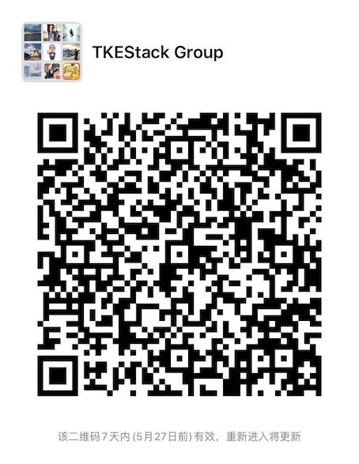

# TKEStack - Tencent Kubernetes Engine Stack


[](https://goreportcard.com/report/tkestack.io/tke)
[](https://github.com/tkestack/tke/releases)

> Chinese document：https://tkestack.github.io/docs/

***TKEStack*** is an open source project that provides a container management platform built for organizations that deploy containers in production. ***TKEStack*** makes it easy to run [Kubernetes](https://github.com/kubernetes/kubernetes) everywhere, meet IT requirements, and empower [DevOps](https://en.wikipedia.org/wiki/DevOps) teams.

## Features

* **Unified Cluster Management**
  * Web console and command-line client for centrally manages multiple Kubernetes clusters.
  * Integration with your existing authentication mechanisms, including [LDAP](https://en.wikipedia.org/wiki/Lightweight_Directory_Access_Protocol), [OIDC](https://en.wikipedia.org/wiki/OpenID_Connect), front proxy, and public OAuth providers such as GitHub.
  * Unified authorization management, not only at the cluster management level, but even at the Kubernetes resource level.
  * Multi-tenancy support, including team and user isolation of containers, builds, and network communication.
* **Application Workload Management**
  * Provides an intuitive UI interface to support visualization and YAML import and other resource creation and editing methods, enabling users to run containers without learning all Kubernetes concepts up-front.
  * An abstract project-level resource container that supports multiple namespace management and deployment applications across multiple clusters.
* **Operation And Maintenance Management**
  * Integrated system monitoring and application monitoring.
  * Persistent Kubernetes events and audit logs.
  * Limit, track, and manage the developers and teams on the platform.
* **Plugin Support And Management**  
  * Authentication identity provider plugin.
  * Authorization provider plugin.
  * Event persistence storage plugin.
  * System and application log persistence storage plugin.
  * [Galaxy](https://github.com/tkestack/galaxy)（Network）、[TApp](https://github.com/tkestack/tapp)（Workload）、[GPUManage](https://github.com/tkestack/gpu-manager)（GPU）、[CronHPA](https://github.com/tkestack/cron-hpa)（HPA）、[LBCF](https://github.com/tkestack/lb-controlling-framework)（LoadBalance）

## Architecture


## Installation

### Minimum Requirements

* **Hardware**
  * 8 vCPU
  * 16 GB of Memory
  * 100 GB of Disk Space
* **Operating Systems**
  * ≥ Ubuntu 16.04/18.04  LTS (64-bit)
  * ≥ CentOS Linux 7.6 (64-bit)
  * ≥ Tencent Linux 2.2 

### QuickStart

1. **Check Requirements:**  Please confirm the [installation requirements](docs/guide/zh-CN/installation/installation-requirement.md).

2. **Configure Installer:**  Please execute the following command in the terminal of your **installer** node.

   ```shell
   # Choose installation package according to your installation node CPU architecture [amd64, arm64]
   arch=amd64 version=v1.5.0 && wget https://tke-release-1251707795.cos.ap-guangzhou.myqcloud.com/tke-installer-linux-$arch-$version.run{,.sha256} && sha256sum --check --status tke-installer-linux-$arch-$version.run.sha256 && chmod +x tke-installer-linux-$arch-$version.run && ./tke-installer-linux-$arch-$version.run
   ```

3. **Configure Console & Global Cluster:**  Open your browser to `http://【INSTALLER-NODE-IP】:8080/index.html`, the Web GUI will guide you to initialize and install the TKEStack's **Global Cluster and Console**. You can refer to [installation-procedures](docs/guide/zh-CN/installation/installation-procedures.md) for more information.
4. **Enjoy TKEStack:**  Open your browser to http://console.tke.com.

> TKEStack use tke-installer tool to deploy. Please refer to [tke-installer](docs/user/tke-installer/introduction.md) for more information.
> 
> If you encounter problems during installation, you can refer to [FAQ installation](docs/guide/zh-CN/FAQ/Installation).


## Using

[TKEStack Documentation ](https://tkestack.github.io/docs/)

## Developing

If you are interested in contributing to the TKEStack, please check the [CONTRIBUTING.md](CONTRIBUTING.md) first. 

Make sure that you have [Git-LFS](https://github.com/git-lfs/git-lfs) installed before developing TKEStack.

If you have an eligible development environment, you can simply do it:

```shell
mkdir -p ~/tkestack
cd ~/tkestack
git clone https://github.com/tkestack/tke
cd tke
make
```

For the full story, head over to the [developer's documentation](docs/devel/development.md).

## Community

* You are encouraged to communicate most things via GitHub [issues](https://github.com/tkestack/tke/issues/new/choose) or [pull requests](https://github.com/tkestack/tke/pulls).

* Other active channels:

  * WeChat Group

  * Please scan the following WeChat QRcode and note "**TKEStack**", he will add you into the TKEStack WeChat Group.

    

## Licensing

TKEStack is licensed under the Apache License, Version 2.0. See [LICENSE](LICENSE) for the full license text.

