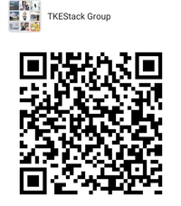

# TKE - Tencent Kubernetes Engine


[](https://goreportcard.com/report/tkestack.io/tke)
[](https://github.com/tkestack/tke/releases)

***TKE*** is an open source project that provides a container management platform built for organizations that deploy containers in production. ***TKE*** makes it easy to run Kubernetes everywhere, meet IT requirements, and empower DevOps teams.

## Features

* Unified Cluster Management
  * Web console and command-line client for centrally manages multiple Kubernetes clusters.
  * Integration with your existing authentication mechanisms, including LDAP, Active Directory, front proxy, and public OAuth providers such as GitHub.
  * Unified authorization management, not only at the cluster management level, but even at the Kubernetes resource level.
  * Multi-tenancy support, including team and user isolation of containers, builds, and network communication.
* Application Workload Management
  * Provides an intuitive UI interface to support visualization and YAML import and other resource creation and editing methods, enabling users to run containers without learning all Kubernetes concepts up-front.
  * An abstract project-level resource container that supports multiple namespace management and deployment applications across multiple clusters.
* Operation And Maintenance Management
  * Integrated system monitoring and application monitoring.
  * Persistent Kubernetes events and audit logs.
  * Limit, track, and manage the developers and teams on the platform.
* Plugin Support And Management  
  * Authentication identity provider plugin.
  * Authorization provider plugin.
  * Event persistence storage plugin.
  * System and application log persistence storage plugin.

## Installation

### Minimum Requirements

* Hardware
  * 8 vCPU
  * 16 GB of Memory
* Operating Systems
  * Ubuntu 16.04 (64-bit)
  * CentOS Linux 7.5 (64-bit)

### QuickStart

```
version=v1.2.3 && wget https://tke-release-1251707795.cos.ap-guangzhou.myqcloud.com/tke-installer-x86_64-$version.run{,.sha256} && sha256sum --check --status tke-installer-x86_64-$version.run.sha256 && chmod +x tke-installer-x86_64-$version.run && ./tke-installer-x86_64-$version.run
```

TKEStack use tke-installer tool to deploy. [refer](https://github.com/tkestack/tke/blob/master/docs/user/tke-installer/README.md)

## Architecture


## Using

[TKEStack Documentation ](https://github.com/tkestack/docs)

## Developing

Make sure that you have [Git-LFS](https://github.com/git-lfs/git-lfs) installed before developing TKE.

If you have an eligible development environment, you can simply do it:

```
mkdir -p ~/tkestack
cd ~/tkestack
git clone https://github.com/tkestack/tke
cd tke
make
```

For the full story, head over to the [developer's documentation](docs/devel/development.md).

## Community

You are encouraged to communicate most things via [GitHub issues](https://github.com/tkestack/tke/issues/new/choose) or pull requests.

Other active channels:

- WeChat Group



## Licensing

TKE is licensed under the Apache License, Version 2.0. See [LICENSE](LICENSE) for the full license text.

