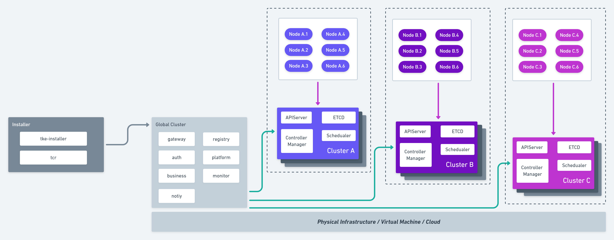

# TKE - Tencent Kubernetes Engine


---

***TKE*** is an open source project that provides a container management platform built for organizations that deploy containers in production. ***TKE*** makes it easy to run Kubernetes everywhere, meet IT requirements, and empower DevOps teams.

---

## Features

* Unified Cluster Management
  * Web console and command-line client for centrally manages multiple Kubernetes clusters.
  * Integration with your existing authentication mechanisms, including LDAP, Active Directory, front proxy, and public OAuth providers such as GitHub.
  * Unified authorization management, not only at the cluster management level, but even at the Kubernetes resource level.
  * Multi-tenancy support, including team and user isolation of containers, builds, and network communication.
* Application Workload Management
  * Provides an intuitive UI interface to support visualization and YAML import and other resource creation and editing methods, enabling users to run containers without learning all Kubernetes concepts up-front.
  * An abstract project-level resource container that supports multiple namespace management and deployment applications across multiple clusters.
* Operation And Maintenance Management
  * Integrated system monitoring and application monitoring.
  * Persistent Kubernetes events and audit logs.
  * Limit, track, and manage the developers and teams on the platform.
* Plugin Support And Management  
  * Authentication identity provider plugin.
  * Authorization provider plugin.
  * Event persistence storage plugin.
  * System and application log persistence storage plugin.

## Architecture



## To start using TKE

We are preparing how to use TKE-related documentation. At the same time, the release package is also generated by our configuration of the github codebase-based pipeline. Once these are ready, we will update the documentation here.

## To start developing TKE

Make sure that you have [Git-LFS](https://github.com/git-lfs/git-lfs) installed before developing TKE.

If you have an eligible development environment, you can simply do it:

```
mkdir -p ~/tkestack
cd ~/tkestack
git clone https://github.com/tkestack/tke
cd tke
make
```

For the full story, head over to the [developer's documentation](docs/devel/development.md).

## Licensing

TKE is licensed under the Apache License, Version 2.0. See [LICENSE](LICENSE) for the full license text.

