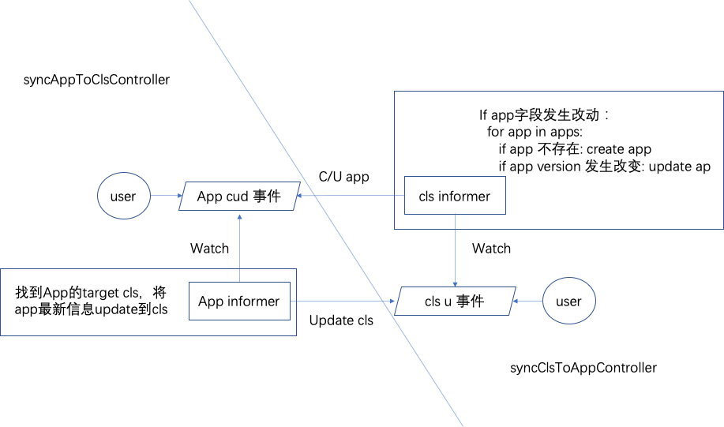

# Tkestack addon framework recap


**Author**: huxiaoliang([@huxiaoliang](https://github.com/huxiaoliang))

**Status** (20201220): Suspend

## Summary

In order to extend Tkestack functionality so that support more value-add but don't impact core part too much, Tkestack introduced `addon` framework to address this requirement. There are 2 types of`addon` implementations currently:

1. Manifests based: there are several sub directory under `manifests` to identity individual `addon` instance,  `tke-platform-api` will use `go-templete` render the yaml files with customized parameters, then apply them to business/target cluster to install:

```
root@dev:~/pkg/platform/provider/baremetal# tree manifests/  
manifests/
├── csi-operator
│   └── csi-operator.yaml
├── gpu
│   └── nvidia-device-plugin.yaml
├── gpu-manager
│   └── gpu-manager.yaml
├── keepalived
│   ├── keepalived.conf
│   └── keepalived.yaml
└── metrics-server
    └── metrics-server.yaml
```

2. Controller based: There are several individual `controller` inside `tke-platform-controller`in global cluster to watch specified `addon` CR operation,  then leverage `tke-platform-api` access to business/target cluster manage `addon` instance lief cycle.

```
root@dev:~/pkg# tree platform/controller/addon/ -L 1
platform/controller/addon/
├── cronhpa
├── helm
├── ipam
├── lbcf
├── logcollector
├── persistentevent
├── prometheus
├── storage
└── tappcontroller

root@VM-0-77-ubuntu:~# curl -sk -H "Authorization: Bearer $(cat /etc/kubernetes/known_tokens.csv |cut -d "," -f 1)" -H "Content-Type:application/json" https://127.0.0.1:6443/apis/platform.tkestack.io/v1/clusteraddontypes | jq -r .items[].metadata.name
lbcf
helm
persistentevent
logcollector
csioperator
prometheus
ipam
tappcontroller
volumedecorator
cronhpa
```

After `tke-application` enabled, Tkestack has the ability to use `helm chart` as k8s native approach manage application directly, so `addon` framework should recap according to this new `out-tree` approach, the benefits as bellows:

 - Loose coupled relations between `tke-platform` and individual `addon`: if new addon onboard or old addon update/upgrade, no need rebuild or update core part, individual `addon`chart build and release will out of Tkestack,  no hard dependency for each other
 
 - Unify `addon` instance life cycle management: `tke-application` will take the responsibility for managing all `addon` charts include:
   - Create addon xxx               -->  `helm install xxx`
   - Upgrade addon xxx           --> `helm upgrade xxx`
   - Delete addon xxx              -->  `helm delete xxx`
   - Healthy check addon xxx  -->  `helm get xxx`

 - Decouple the installation and upgrade process of Tkestack: k8s , Tkestack built-in components and Tkestack addons

 - The `helm hook` mechanism allow chart developers to intervene at certain points in a chart release's life cycle to support more scenario

 - Better development experience and easily integration for internal developer and community contributor to extend Tkestack

## Scope

 **In-Scope**: 
 1. (**P1**) Porting 2 types of addons to helm charts
 2. (**P1**) Enable CI to build all addon charts
 3. (**P1**) UI enhance to use new API manage addon
 4. (**P2**) Nice to have: Support hook mechanism to pick up `user-defined` charts and push them to chart repo during Tkestack installation for day 2 install
 3. (**P2**) Define apps in `cluster` object, and create apps during creating business cluster(s)

**Out-Of-Scope**: 

 1. Tkestack built-in component helm chart support

 2. Define apps in `global cluster` object (temporarily): `tke-application` is 
 installed after `global cluster` is created, but define apps is is 
 dependent on `tke-application`

 3. Transform `tke coms` to `built-in charts` and `built-in apps` (temporarily)

## Limitation

1. Enable `tke-application` when creating `global cluster`

## Main proposal

1. Enable `tke-application` installed as default during Tkestack installation (done)

2. `helm push` sdk will used to push all charts tgz package from `bootstrap` container to chart repo during tkestack (done):
- `https://github.com/tkestack/tke/pull/1182`

3. Label the chart so that distinguish system built-in addon chart and other charts,  `chart list` API will retrieval the chart instead of  `clusteraddontypes`:
- `https://github.com/tkestack/tke/issues/1357`

4. Tkestack `tke-application` controller will handle cross tenant request validation, below pr should get revert (done):
- `https://github.com/tkestack/tke/pull/978`
- `https://github.com/tkestack/tke/pull/1007`

5. `tke-installer` will push built-in/expansion charts to registry (done):
- `https://github.com/tkestack/tke/pull/1284`
- `https://github.com/tkestack/tke/pull/1375`

6. `tke-installer` will install built-in/expansion applications (done):
- `https://github.com/tkestack/tke/pull/1350`

7. Add label `built-in` for `built-in apps` if they are installed by `tke-installer` and their charts are `built-in charts` 
which are default charts in `tke-installer` release package:
- `https://github.com/tkestack/tke/issues/1359`

8. Support upgrade apps with `built-in` label during `tke-installer` upgrading Tkestack:
- `https://github.com/tkestack/tke/issues/1358`

9. Tkestack `platform` will create applications defined in `cluster` object during creating business cluster:
- `https://github.com/tkestack/tke/pull/1372`

10. Transform `addons` to `built-in charts` and install them through `tke-application`

11. Enhance `tke-installer` and `tkestack-gateway` UI


## Future work

1. Define apps in `global cluster` object, and install apps during creating `global cluster`
2. Transform `tke coms` to helm charts
3. Define `tke coms` as `built-in apps` in `global cluster` object

## User case

#### Case 1. Installer install built-in apps during creating global cluster (stage alpha)

Before UI support tke-installer to set apps in `global cluster` object, hardcode some `built-in apps` in `tke-installer` and use `tke.json` with empty `PlatformApps`:

```json
{
	"config": {
		"ServerName": "tke-installer",
		"ListenAddr": ":8080",
		"NoUI": false,
		"Config": "conf/tke.json",
		"Force": false,
		"SyncProjectsWithNamespaces": false,
		"Replicas": 2,
		"Upgrade": false,
		"PrepareCustomK8sImages": false,
		"PrepareCustomCharts": false,
		"Kubeconfig": "conf/kubeconfig",
		"RegistryUsername": "",
		"RegistryPassword": "",
		"RegistryDomain": "",
		"RegistryNamespace": "",
		"CustomUpgradeResourceDir": "data/custom_upgrade_resource",
		"CustomChartsName": "custom.charts.tar.gz",
		"EnableCustomExpansion": true,
		"CustomExpansionDir": "data/expansions/",
		// empty
		"PlatformApps": []
	},
........
}
```

`built-in apps` will fullfill `PlatformApps` during installing.

Tkestack will manage `built-in` apps life-cycle through `built-in` labels. It means that `built-in apps` will be upgraded if Tkestack platform is upgraded.

#### Case 2. Installer install expansion apps during creating global cluster (stage alpha)

Use `tke.json` with expansions apps:

```json
{
	"config": {
		"ServerName": "tke-installer",
		"ListenAddr": ":8080",
		"NoUI": false,
		"Config": "conf/tke.json",
		"Force": false,
		"SyncProjectsWithNamespaces": false,
		"Replicas": 2,
		"Upgrade": false,
		"PrepareCustomK8sImages": false,
		"PrepareCustomCharts": false,
		"Kubeconfig": "conf/kubeconfig",
		"RegistryUsername": "",
		"RegistryPassword": "",
		"RegistryDomain": "",
		"RegistryNamespace": "",
		"CustomUpgradeResourceDir": "data/custom_upgrade_resource",
		"CustomChartsName": "custom.charts.tar.gz",
		"EnableCustomExpansion": true,
		"CustomExpansionDir": "data/expansions/",
		// expansion apps
		"PlatformApps": [
			// use app type and chart
			{ 
				// app name
				"Name": "demo",
				// 添加优先级字段
				// if enabled, for UI
				"Enable": true,
				"Chart": {
					// chart name
					"Name": "demo",
					"TenantID": "default",
					// repo
					"ChartGroupName": "public",
					"Version": "1.0.0",
					"TargetCluster": "global",
					"TargetNamespace": "default",
					// helm chart values
					"Values": {
						"key2": "val2-override"
					}
				}
			}
		]
	},
......
}
```

#### Case 3. tke-installer upgrade built-in apps (stage alpha)

Download next minor version of current version `tke-installer` and upgrade through `tke-installerxxx --upgrade`. This work need enable first `built-in app` in tke-installer.

`https://github.com/tkestack/tke/issues/1358`

#### Case 4. Define apps in cluster object and install apps during createing cluster

Define apps in cluster object:

```yaml
---
apiVersion: platform.tkestack.io/v1
kind: Cluster
metadata:
  generateName: cls
spec:
  displayName: test
  tenantID: default
  clusterCIDR: 10.244.0.0/16
  networkDevice: eth0
  features:
    enableMetricsServer: true
    enableCilium: false
    platformApps:     # define apps in cluster
    - name: demo      # app name
      enable: true    # if enabled, for UI
      chart:
        name: demo    # chart name
        tenantID: default
        chartGroupName: public
        version: 1.0.0
        targetNamespace: default
        values: 'key2: val2-override' # helm chart values
  properties:
    maxClusterServiceNum: 256
    maxNodePodNum: 256
  type: Baremetal
  version: 1.20.4-tke.1
  machines:
  - ip: your_ip
    port: 22
    username: root
    privateKey:
    password:
    labels: {}
```
// framework aftercreate


## Sync app/cluster controller



### syncAppToCls controller

监听App对象的update事件，通过platformclient使用最新的App数据更新到Cls对象，如果发生冲突，重新尝试更新，直到更新为期望状态。

### syncClsToApp controller

监听Cls对象的update事件，通过applicationclient将cls对象中需要更新/创建的app信息进行更新/创建，如果发生冲突，重新尝试更新，直到更新为期望状态。

## Test cases

Preparation: add an chart to tke registry.

```sh
helm repo add public http://default.registry.tke.com/chart/public --username {username} --password {password}

wget https://tke-release-1251707795.cos.ap-guangzhou.myqcloud.com/res/demo-1.0.0.tgz

helm push demo-1.0.0.tgz public
```

### Create cls with 2 apps

```yaml
# cls.2.apps.yaml
---
apiVersion: platform.tkestack.io/v1
kind: Cluster
metadata:
  generateName: cls
spec:
  displayName: test
  tenantID: default
  clusterCIDR: 10.244.0.0/16
  networkDevice: eth0
  bootstrapApps:
  - app:
      metadata:
        namespace: kube-system
      spec:
        name: demo1
        type: HelmV3
        dryRun: false
        tenantID: default
        targetCluster: ""
        targetNamespace: ""
        values:
          rawValues: 'key2: val2-override'
        chart:
          chartName: demo
          chartGroupName: public
          chartVersion: 1.0.0
          tenantID: default
          repoURL: ""
          repoUsername: ""
          repoPassword: ""
          importedRepo: false
  - app:
      spec:
        name: demo2
        type: HelmV3
        dryRun: false
        tenantID: default
        targetCluster: ""
        targetNamespace: "kube-public"
        values:
          rawValues: 'key2: val2-override'
        chart:
          chartName: demo
          chartGroupName: public
          chartVersion: 1.0.0
          tenantID: default
          repoURL: ""
          repoUsername: ""
          repoPassword: ""
          importedRepo: false
  features:
    enableMetricsServer: true
    enableCilium: false
  properties:
    maxClusterServiceNum: 256
    maxNodePodNum: 256
  type: Baremetal
  version: 1.20.4-tke.1
  machines:
  - ip: {your_ip}
    port: 22
    username: root
    privateKey:
    password:
    labels: {}
```

```sh
kubectl create -f cls.2.apps.yaml
# wait for cls ready
kubectl get cls {your cls name} -o yaml | grep demo
# get demo1 and demo2
kubectl get apps -o custom-columns=APPNAME:.spec.name
# get demo2
kubectl get apps -n kube-system custom-columns=APPNAME:.spec.name
# get demo1
```

### Update bootstrap app is not allowed

```sh
kubectl edit cls {your_cls}
# edit bootstrapApps content will return validation err

```

## Reference

addons和tke组件helm化及集群声明app会议讨论记录及结论：
1、集群声明App暂时不考虑global cluster，原因是global cluster在创建前还没有platform-api和application-api，存在“鸡生蛋蛋生鸡问题”
2、关于app声明是在cluser下还是cluster之上新建超集的结论是，app声明在cluster对象下，但是要复用当前app type尽量保持一致
3、在声明app时需要可以对app设置安装优先级，安装顺序以优先级顺序执行
4、tke-installer upgrade需要支持upgrade installer安装的built-in app，但由于暂时没有built-in app，先创建issue记录
5、在所有type cluster的porvider的基础provider上新声明一个公共的方法并实现安装app功能，并在provider的AfterCreatefunc后调用，确保所有provider都可以正常调用安装app功能

公有云方面需求

1、tke-application需要健康检查功能，探测app/addon状态
2、设计一个在deadline时间点自动升级addon的功能，暂时可以先不实现
3、升级失败自动回滚，需要考虑，可以不实现
4、两套方案同时跑，迁移工具开发


1. app controller retry
2. move app to  cluster.spac
3. 展示app status 在cluster
4. matedata.ns  -> chart
5.  UT case
6. sort 并行没意义
7. 用informer替换client list获取app
8. needupdate为啥要判断uid的
9. 为啥设置applister的上下文（打印日志？）
10. 安装的优先级先去掉（异步无效）