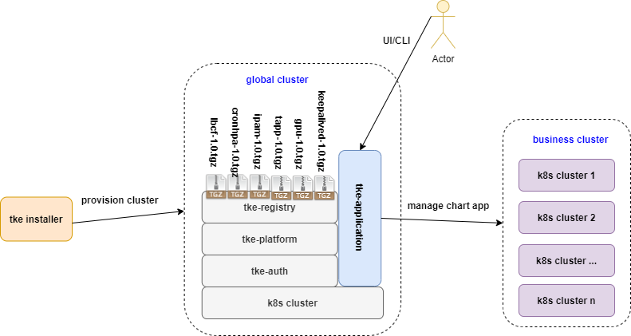

# Tkestack addon framework recap


**Author**: huxiaoliang([@huxiaoliang](https://github.com/huxiaoliang))

**Status** (20201220): Suspend

## Summary

In order to extend Tkestack functionality so that support more value-add but don't impact core part too much, Tkestack introduced `addon` framework to address this requirement. There are 2 types of`addon` implementations currently:

1. Manifests based: there are several sub directory under `manifests` to identity individual `addon` instance,  `tke-platform-api` will use `go-templete` render the yaml files with customized parameters, then apply them to business/target cluster to install:

```
root@dev:~/pkg/platform/provider/baremetal# tree manifests/  
manifests/
├── csi-operator
│   └── csi-operator.yaml
├── gpu
│   └── nvidia-device-plugin.yaml
├── gpu-manager
│   └── gpu-manager.yaml
├── keepalived
│   ├── keepalived.conf
│   └── keepalived.yaml
└── metrics-server
    └── metrics-server.yaml
```

2. Controller based: There are several individual `controller` inside `tke-platform-controller`in global cluster to watch specified `addon` CR operation,  then leverage `tke-platform-api` access to business/target cluster manage `addon` instance lief cycle.

```
root@dev:~/pkg# tree platform/controller/addon/ -L 1
platform/controller/addon/
├── cronhpa
├── helm
├── ipam
├── lbcf
├── logcollector
├── persistentevent
├── prometheus
├── storage
└── tappcontroller

root@VM-0-77-ubuntu:~# curl -sk -H "Authorization: Bearer $(cat /etc/kubernetes/known_tokens.csv |cut -d "," -f 1)" -H "Content-Type:application/json" https://127.0.0.1:6443/apis/platform.tkestack.io/v1/clusteraddontypes | jq -r .items[].metadata.name
lbcf
helm
persistentevent
logcollector
csioperator
prometheus
ipam
tappcontroller
volumedecorator
cronhpa
```

After `tke-application` enabled, Tkestack has the ability to use `helm chart` as k8s native approach manage application directly, so `addon` framework should recap according to this new `out-tree` approach, the benefits as bellows:

 - Loose coupled relations between `tke-platform` and individual `addon`: if new addon onboard or old addon update/upgrade, no need rebuild or update core part, individual `addon`chart build and release will out of Tkestack,  no hard dependency for each other
 
 - Unify `addon` instance life cycle management: `tke-application` will take the responsibility for managing all `addon` charts include:
   - Create addon xxx               -->  `helm install xxx`
   - Upgrade addon xxx           --> `helm upgrade xxx`
   - Delete addon xxx              -->  `helm delete xxx`
   - Healthy check addon xxx  -->  `helm get xxx`

 - Decouple the installation and upgrade process of Tkestack: k8s , Tkestack built-in components and Tkestack addons

 - The `helm hook` mechanism allow chart developers to intervene at certain points in a chart release's life cycle to support more scenario

 - Better development experience and easily integration for internal developer and community contributor to extend Tkestack

## Scope

 **In-Scope**: 
 1. (**P1**) Porting 2 types of addons to helm charts
 2. (**P1**) Enable CI to build all addon charts
 3. (**P1**) UI enhance to use new API manage addon
 4. (**P2**) Nice to have: Support hook mechanism to pick up `used-defined` charts and push them to chart repo during Tkestack installation for day 2 install: 

**Out-Of-Scope**: 

 1.  Tkestack built-in component helm chart support

## Limitation


## Main proposal

1. Enable `tke-application` installed as default during Tkestack installation
2. `helm push` sdk will used to push all charts tgz package from `bootstrap` container to chart repo during tkestack
3. Label the chart so that distinguish system built-in addon chart and other charts,  `chart list` API will retrieval the chart instead of  `clusteraddontypes`
4. Tkestack `tke-application` controller will handle cross tenant request validation, below pr should get revert:
 - `https://github.com/tkestack/tke/pull/978`
 - `https://github.com/tkestack/tke/pull/1007`
4. TODO
5. TODO



## Future work

## User case

#### Case 1. xx

## PR

## Reference