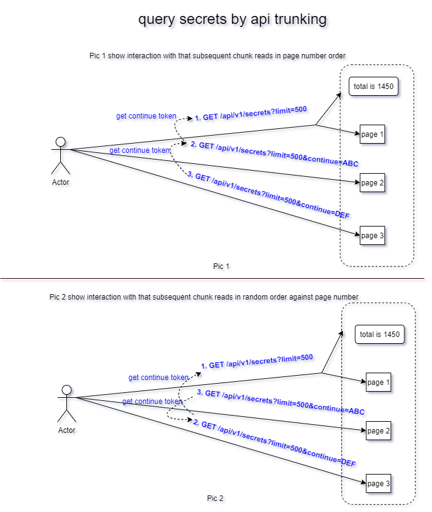

#  Pagination and combination query support 


**Author**: huxiaoliang([@huxiaoliang](https://github.com/huxiaoliang))

**Status** (20200817): Designing

## Summary

1. Tkestack LIST page has performance issue when data sets from LIST API is too large,  it will cause the page hung there for a little while and impact the server as well, worse the page enable auto-refresh

2. There is a gap that end user want to get a group of objects by combination query such as `displayName=xx` and `location=yy` from LIST page,  but only resource ID querying is supported for most of the case

## Motivation

1. To address #1，Tkestack will leverage k8s API chunking feature for pagination solution, API chunking  has the ability to break a single large collection request into many smaller chunks while preserving the consistency of the total request. Each chunk can be returned sequentially which reduces both the total size of the request and allows user-oriented clients to display results incrementally to improve responsiveness

2. To address #2，`labelSelector` and`fieldSelector` will be used for combination query,  client pass the key/value pair selector to api-server to get a group of k8s objects

## Main proposal

This document provides the guidance for back-end and front-end developer that use an unified approach to implement pagination and combination query,  also clarify the apply condition and limitation

### K8s api chunking

 Api chunking (`APIListChunking`) enabled by default from k8s 1.9 and so does Tkestack. Below example show how to retrieve secret resource in pages and visit partial result sets by `kubectl`. Assume that `limit` is `2` and total secrets is `7`, that means client have to issue 4 LIST requests to server get all secret resources, you can refer to [design doc](https://github.com/caesarxuchao/community/blob/adfa4fe78921887d2ad6822df4d4f0957996ad73/contributors/design-proposals/api-machinery/api-chunking.md)  for the design details
```
root@VM-0-127-ubuntu:~# kubectl get secret -n test --chunk-size=2 -v=6
I0817 17:46:49.463526    7765 loader.go:375] Config loaded from file:  /root/.kube/config
I0817 17:46:49.480901    7765 round_trippers.go:443] GET https://127.0.0.1:6443/api/v1/namespaces/test/secrets?limit=2 200 OK in 9 milliseconds
I0817 17:46:49.482153    7765 round_trippers.go:443] GET https://127.0.0.1:6443/api/v1/namespaces/test/secrets?continue=eyJ2IjoibWV0YS5rOHMuaW8vdjEiLCJydiI6MjAxNzY3NSwic3RhcnQiOiJteXNlY3JldFx1MDAwMCJ9&limit=2 200 OK in 0 milliseconds
I0817 17:46:49.483477    7765 round_trippers.go:443] GET https://127.0.0.1:6443/api/v1/namespaces/test/secrets?continue=eyJ2IjoibWV0YS5rOHMuaW8vdjEiLCJydiI6MjAxNzY3NSwic3RhcnQiOiJteXNlY3JldDNcdTAwMDAifQ&limit=2 200 OK in 1 milliseconds
I0817 17:46:49.484787    7765 round_trippers.go:443] GET https://127.0.0.1:6443/api/v1/namespaces/test/secrets?continue=eyJ2IjoibWV0YS5rOHMuaW8vdjEiLCJydiI6MjAxNzY3NSwic3RhcnQiOiJteXNlY3JldDVcdTAwMDAifQ&limit=2 200 OK in 1 milliseconds
NAME                  TYPE                                  DATA   AGE
default-token-27vr8   kubernetes.io/service-account-token   3      19h
mysecret              Opaque                                2      19h
mysecret2             Opaque                                2      19h
mysecret3             Opaque                                2      19h
mysecret4             Opaque                                2      19h
mysecret5             Opaque                                2      19h
mysecret6             Opaque                                2      19h
```

Refer to the [design doc](https://github.com/caesarxuchao/community/blob/adfa4fe78921887d2ad6822df4d4f0957996ad73/contributors/design-proposals/api-machinery/api-chunking.md) ,  you can break responses into individual chunks by utilizing  `limit` and `continue` parameters in REST API. For example, if you wanted to receive a group of only 500 secrets at a time from 1450 secrets, tie a limit into the API request as below:

```
GET /api/v1/secrets?limit=500
{
  "metadata": {"continue": "ABC...", "resourceVersion": "147",
  "remaingingItemCount": 950},
  "items": [
     // no more than 500 items
   ]
}
GET /api/v1/secrets?limit=500&continue=ABC...
{
  "metadata": {"continue": "DEF...", "resourceVersion": "147",
  "remainingItemCount": 450},
  "items": [
     // no more than 500 items
   ]
}
GET /api/v1/secrets?limit=500&continue=DEF...
{
  "metadata": {"resourceVersion": "147"},
  "items": [
     // no more than 500 items
   ]
}
```

`continue` and `remainingItemCount` as new parameter returned by LIST API, there are some highlights and limitations when use API chunking: 
 1. `continue` token is much like SQL cursor, that the client could pass to receive the next set of results, If the server does not return a `continue` token, the server must return all remaining results. The server may return no `continue` token on the last call
 2. If the required data to perform a LIST is no longer available in the storage back-end (old versions of objects snapshot in etcd3 are removed after 5 minutes by default)  by`continue` token, the server must return a 410 `Expired` status response , which means clients must start from the beginning
 3.  Client should range over the list with `continue` token from beginning on subsequent chunk reads to get the full list
 4. `remainingItemCount` is the number of subsequent items in the list which are not included in this list response,  that means the total size of sets is `limit + remainingItemCount` in first LIST request. If the LIST request contained `labelSelector` or`fieldSelector`, then `remainingItemCount` is unknown and this field will be unset and omitted during serialization
 5. **In order to improve performance and user experience,  it is recommend to use`limit` on  each LIST API request**

#### User case
 **User case 1**:  LIST request don't  have `labelSelector` or`fieldSelector` option

In this case, client is able to fully support traditional `pagination` ,  since both `continue` and `remainingItemCount`returned by LIST API:
1. `pageSize` = `limit`
2. `totalSize`= `limt` + `remainingItemCount`in first LIST request.  Client can calculate available page range by `totalSize/limt`as well,  this allow client show a list of page number for end user jump to directly
3. `pageNum` is the `continue`token, but it is little difference from traditional `pageNum`,  traditional records in `pageNum`is in range `[pageNum*pageSize, pageNum*pageSize+pageSize]` , but in API chunking, whatever client jump to which `pageNum`,  the request just pass `continue`token base on previous result to LIST API,  this ensure the subsequent LIST API call range over full ordered list



**User  case 2**:  LIST request have `labelSelector` or`fieldSelector` option

In this case, since no `remainingItemCount` in the result , that means client can't calculate the page range for end user jump to, it is same as Pic 1 but only have 2 pages named  `previous page` and  `next page`

###  Combination query

K8s native support  `labelSelector` or`fieldSelector` in LIST API to identify or group the resources in Kubernetes  that have same key/value pairs attribute. Client should make the decision how to use `labelSelector` or`fieldSelector` according to blow principles:

1.  `fieldSelector` is preferred to use at first, but it only works for general attribute such as  metadata.name,  if the resource is owned by Tkestack, such as `cluster.platform.tkestack.io `, update  `AddFieldLabelConversionFunc`  in `tke-xxx-api` to extend more fields support, such as `spec.displayName`
```
kubectl get secret -n test --field-selector "metadata.name=mysecret2,type=Opaque" --chunk-size=10 -v=6
I0818 13:01:57.009465   23477 loader.go:375] Config loaded from file:  /root/.kube/config
I0818 13:01:57.023282   23477 round_trippers.go:443] GET https://127.0.0.1:6443/api/v1/namespaces/test/secrets?fieldSelector=metadata.name%3Dmysecret2%2Ctype%3DOpaque&limit=10 200 OK in 5 milliseconds
NAME        TYPE     DATA   AGE
mysecret2   Opaque   2      38h

```

2.  If `fieldSelector` can't address the requirement, `labelSelector` is used to as second option, it applied to all the cases, since you can add any label to the object, later, you can use `labelSelector` to filter the objects what you want.  

```
kubectl get secret -n test -l name=cc1,location=xa --chunk-size=10  -v=6
I0818 12:49:37.146510   16057 loader.go:375] Config loaded from file:  /root/.kube/config
I0818 12:49:37.163353   16057 round_trippers.go:443] GET https://127.0.0.1:6443/api/v1/namespaces/test/secrets?labelSelector=name%3Dcc1%2Clocation%3Dxa&limit=10 200 OK in 6 milliseconds
NAME       TYPE     DATA   AGE
mysecret   Opaque   2      38h
```

## Limition
1.  API chunking doens't support sort the reture data sets by condition, refer to https://github.com/kubernetes/kubernetes/issues/80602 for the details
2.  API chunking doens't support fuzzy query

## Reference
[1] https://kubernetes.io/docs/reference/using-api/api-concepts/#retrieving-large-results-sets-in-chunks

[2] https://stupefied-goodall-e282f7.netlify.app/contributors/design-proposals/api-machinery/api-chunking

[3] https://github.com/caesarxuchao/community/blob/adfa4fe78921887d2ad6822df4d4f0957996ad73/contributors/design-proposals/api-machinery/api-chunking.md

[4] https://github.com/kubernetes/kubernetes/issues/66981
