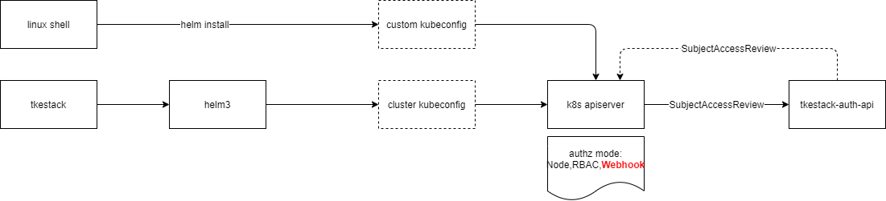

# Helm3 Application and Chart AppCenter

**Author**: jianzhuang (@[jianzhuang](https://github.com/jianzzz))

**Status** (20200901): In development

## Abstract

Helm是Kubernetes应用的包管理工具，Charts是Helm支持的包格式。基于Chart开发应用商店，并基于Helm进行应用编排，可以轻松地部署任何应用程序，包括且不仅限于：业务应用、TKEStack addon组件等。应用商店和应用编排是TKEStack目前欠缺的功能。

TKEStack内置集成了chartmuseum，并定义ChartGroup作为Chart的仓库。在v1.3.0版本的设计中，ChartGroup通过简单的public和private属性，判断用户对仓库/Chart是否具备操作权限。在本设计中，ChartGroup有更复杂的应用场景：个人仓库、业务仓库、系统默认提供的仓库等。在这些应用场景中，不能再简单地通过public/private属性来判断，而是统一转化为TKEStack auth鉴权模型。

基于Helm 3.2.4已被广泛使用并可以投入生产的事实，且社区已经提供方便的迁移插件，Helm2应用可以立即迁移到Helm3。因此，应用编排直接基于Helm3实现，并保持对其他编排引擎的支持性。

应用商店和应用编排的实现依旧采取API+Controller的模式，API组件使你可以查询和操纵Kubernetes中对象的状态，Controller组件根据对象状态，驱动关联数据的删除、应用实际部署等。同时，需要保证TKEStack Installer部署逻辑能够正常安装应用商店和应用编排组件。

## Motivation

- 应用商店支持以下基本功能（v1）：
  - 支持个人仓库、业务仓库、系统仓库
  - 仓库增删查改
  - 模板列表和删除
  - Chart文件内容查看
  - 权限检查统一转成Casbin鉴权模型
  - 支持导入第三方仓库并进行同步
- 应用编排支持以下基本功能（v1）:
  - 部署应用
  - 查看应用
  - 更新应用
  - 回滚应用
  - 删除应用
- Installer支持选择是否安装应用商店和应用编排相关组件

## Main proposal

### 应用商店

#### 组件

应用商店包括tke-registry-api和tke-registry-controller两个组件。

tke-registry-api包括且不仅限于以下功能：

- ChartGroup数据管理
- Chart数据管理
- Chart模板文件内容获取
- Chartmuseum API集成
- ......

其中，Chartmuseum提供的是非K8S Restful风格的API，单独采用TKEStack APIKey进行认证。在命令行终端调用Chartmuseum API执行如上传、删除等操作时，TKEStack需对应创建、删除相关CRD资源。

tke-registry-controller包括且不仅限于以下功能：

- 更新、删除Chart资源
- 更新、删除ChartGroup资源
- 删除ChartGroup时，级联删除Chart资源
- 删除Chart时，级联删除模板文件
- ......

#### ChartGroup仓库类型

- 自建仓库：对应到原来所有的新建的仓库
- 导入仓库：导入第三方仓库，本次新增的新建仓库的方法
- 平台仓库：对应到原来平台提供的仓库

#### ChartGroup权限范围

- 指定用户：所有指定的用户都有对该repo的CRUD。对应到原来的个人私有，只是以前的个人仅针对自己，现在可以选择用户。
- 指定业务：所有指定的业务有该repo的权限，业务成员对该repo的权限由业务的成员角色控制。对应到原来的业务私有。
- 公共：所有用户，包括平台后续用户都有该repo的拉取权限，只有创建者拥有该仓库的CRUD。对应到原来的个人公有（注意：如果是平台仓库，该仓库无法删除、无法修改其权限范围，只有admin用户拥有上传chart到该repo的能力）

#### 模板分类

- 所有模板：当前用户可以看到的所有模板。
- 用户模板：所有权限范围为“指定用户”且包含当前用户的模板。
- 业务模板：所有权限范围为“指定业务”且当前用户为业务成员的模板。
- 公共模板：所有权限范围为“公共”的模板。

#### 兼容旧逻辑

| 原先类型   | 自动转换为现有类型   | 说明                                                         |
| ---------- | -------------------- | ------------------------------------------------------------ |
| 个人、公有 | 自建、公共           | creator设置为仓库名，策略不变                                |
| 个人、私有 | 自建、指定用户为自己 | 权限策略不变                                                 |
| 业务、公有 | 自建、公共           | creator设置为空，没有人有crud的权限（除了超管）<br/>权限策略方面，domain会从业务id变为* |
| 业务、私有 | 自建、指定业务       | 权限策略不变                                                 |
| 系统、公有 | 平台、公共           | 权限策略不变                                                 |

#### 字段说明

| 仓库类型     | 类型值       | 说明                 |
| ------------ | ------------ | -------------------- |
| 自建仓库     | SelfBuilt    | 统一大写             |
| 导入仓库     | Imported     | 统一大写             |
| 平台仓库     | System       | 原先小写，统一为大写 |
| ~~业务仓库~~ | ~~project~~  | ~~废弃~~             |
| ~~个人仓库~~ | ~~personal~~ | ~~废弃~~             |

| 权限范围     | 类型值      | 说明     |
| ------------ | ----------- | -------- |
| 指定用户     | User        | 统一大写 |
| 指定业务     | Project     | 统一大写 |
| 公共         | Public      | 统一大写 |
| ~~私有仓库~~ | ~~Private~~ | ~~废弃~~ |


#### ~~废弃：ChartGroup仓库类型~~

- ~~个人模板~~

~~个人模板若权限设置为Private，则仅为个人使用。若权限设置为Public，则所有人可访问。~~

- ~~业务模板~~

~~业务管理员创建的ChartGroup下的模板，需要绑定业务。~~

- ~~系统模板~~

~~系统默认提供的ChartGroup下的模板。~~

- ~~公共模板~~

~~包括系统提供的ChartGroup以及所有权限设置为Public的ChartGroup下的模板。~~

- ~~所有模板~~

~~包括个人模板、业务模板、公共模板。~~

#### 认证鉴权

tke-auth-api底层采用基于Casbin域内RBAC模型进行鉴权。根据不同的仓库类型和仓库可见性属性，将统一转换为Casbin规则，进而统一认证和鉴权流程。

具体做法是：预设虚拟策略，并在创建仓库时，根据仓库类型和可见性属性生成与仓库相关的Casbin规则。创建仓库时，tke-registry-api将创建CustomPolicyBinding CRD资源，tke-auth-controller将监听CustomPolicyBinding CRD的事件变化，并生成对应的Casbin规则。最终达到的效果是：平台侧无需维护过多的策略，而具体的ChartGroup分别有具体的Casbin规则与之对应。


预设策略包括：

- pol-{tenantID}-chartgroup-full-fake

平台预设策略，允许创建、修改、删除仓库等。action为`*Chartgroup*`，resources为占位符`-`。

- pol-{tenantID}-chartgroup-pull-fake

平台预设策略，允许拉取仓库。action为`getChartgroup、getChartgroupStatus、listChartgroups`，resources为占位符`-`。

- pol-{tenantID}-chart-full-fake

平台预设策略，允许拉取、推送、删除chart等。action为`createChart、deleteChart、deleteChartVersion、getChart、getChartStatus、listCharts、listChartVersion、updateChart、updateChartStatus`，resources为占位符`-`。

- pol-{tenantID}-chart-pull-fake

平台预设策略，允许拉取chart。action为`getChart、getChartStatus、listCharts、listChartVersion`，resources为占位符`-`。


预设策略的resources均指定为占位符`-`，在创建仓库时，替换为具体的仓库标识。tke-registry-api不直接参与权限相关的规则创建，而是通过创建CustomPolicyBinding间接驱动规则创建。CustomPolicyBinding结构设计如下：

```
apiVersion: auth.tkestack.io/v1
kind: CustomPolicyBinding
metadata:
  name: xxx
  namespace: {ChartGroup.metedata.name}
spec:
  domain: {业务仓库则为业务id，否则为*}
  resource: 根据场景指定为 chartgroup:{ChartGroup.metedata.name} 或 registrynamespace:{ChartGroup.metedata.name}/*
  policyID: {预设策略id}
  tenantID: {tenantID}
  users:
  - name: admin
```

其中，domain将作为Casbin RBAC Domain，resource为具体请求资源的元数据信息。


ChartGroup权限：

| 仓库权限范围 | 仓库管理                                 | 实现方式                                                     |
| :----------- | :--------------------------------------- | :----------------------------------------------------------- |
| 指定用户     | 指定用户可拉取/修改/删除                 | 创建custompolictbinding，domain为`*`，resource为`chartgroup:仓库名`，policyID为`pol-{tenantID}-chartgroup-full`，users为`指定用户账号` |
| 指定业务     | 业务管理员可修改/删除<br/>业务成员可访问 | 沿用业务策略进行鉴权                                         |
| 公共         | 任意用户可拉取<br/>创建者可修改/删除     | 创建custompolictbinding，domain为`*`，resource为`chartgroup:仓库名`，policyID为`pol-{tenantID}-chartgroup-full`，users为`个人账号`<br/>创建custompolictbinding，domain为`*`，resource为`chartgroup:仓库名`，policyID为`pol-{tenantID}-chartgroup-pull`，users为`*` |

废弃：

| ~~仓库类型~~ | ~~可见性~~  | ~~仓库管理~~                                 | ~~实现方式~~                                                 |
| :----------- | :---------- | :------------------------------------------- | :----------------------------------------------------------- |
| ~~个人仓库~~ | ~~public~~  | ~~任意用户可拉取<br/>个人可修改/删除~~       | ~~创建custompolictbinding，domain为`*`，resource为`chartgroup:仓库名`，policyID为`pol-{tenantID}-chartgroup-pull`，users为`*`<br/>创建custompolictbinding，domain为`*`，resource为`chartgroup:仓库名`，policyID为`pol-{tenantID}-chartgroup-full`，users为个人账号~~ |
| ~~个人仓库~~ | ~~private~~ | ~~个人可拉取/修改/删除~~                     | ~~创建custompolictbinding，domain为`*`，resource为`chartgroup:仓库名`，policyID为`pol-{tenantID}-chartgroup-full`，users为个人账号~~ |
| ~~业务仓库~~ | ~~public~~  | ~~任意用户可拉取<br/>业务管理员可修改/删除~~ | ~~业务仓库沿用业务策略进行鉴权<br/>创建custompolictbinding，domain为`业务id`，resource为`chartgroup:仓库名`，policyID为`pol-{tenantID}-chartgroup-pull`，users为`*`~~ |
| ~~业务仓库~~ | ~~private~~ | ~~业务管理员可修改/删除~~                    | ~~业务仓库沿用业务策略进行鉴权~~                             |
| ~~系统仓库~~ | ~~public~~  | ~~任意用户可拉取<br/>不可修改/删除~~         | ~~创建custompolictbinding，domain为`业务id`，resource为`chartgroup:仓库名`，policyID为`pol-{tenantID}-chartgroup-pull`，users为`*~~` |


Chart权限：

从crd资源的角度讲，资源控制本是Chart这一层，但从chart文件的角度讲，权限控制是与仓库相关的，因此crd资源控制向上提一层，控制到仓库，即registrynamespace。

| 仓库类型 | chart管理                                | 实现方式                                                     |
| :------- | :--------------------------------------- | :----------------------------------------------------------- |
| 指定用户 | 指定用户可拉取/修改/删除                 | 创建custompolictbinding，domain为`*`，resource为`registrynamespace:仓库名/*`，policyID为`pol-{tenantID}-chart-full`，users为`指定用户账号` |
| 指定业务 | 业务管理员可修改/删除<br/>业务成员可访问 | 沿用业务策略进行鉴权                                         |
| 公共     | 任意用户可拉取<br/>创建者可修改/删除     | 创建custompolictbinding，domain为`*`，resource为`registrynamespace:仓库名/*`，policyID为`pol-{tenantID}-chart-full`，users为`个人账号`<br/>创建custompolictbinding，domain为`*`，resource为`registrynamespace:仓库名/*`，policyID为`pol-{tenantID}-chart-pull`，users为`*` |


| ~~仓库类型~~ | ~~可见性~~  | ~~chart管理~~                                                | ~~实现方式~~                                                 |
| :----------- | :---------- | :----------------------------------------------------------- | :----------------------------------------------------------- |
| ~~个人仓库~~ | ~~public~~  | ~~任意用户可拉取<br/>个人可推送/删除~~                       | ~~创建custompolictbinding，domain为`*`，resource为`registrynamespace:仓库名/*`，policyID为`pol-{tenantID}-chart-pull`，users为`*`<br/>创建custompolictbinding，domain为`*`，resource为`registrynamespace:仓库名/*`，policyID为`pol-{tenantID}-chart-full`，users为`个人账号`~~ |
| ~~个人仓库~~ | ~~private~~ | ~~个人可拉取/推送/删除~~                                     | ~~创建custompolictbinding，domain为`*`，resource为`registrynamespace:仓库名/*`，policyID为`pol-{tenantID}-chart-full`，users为`个人账号`~~ |
| ~~业务仓库~~ | ~~public~~  | ~~任意用户可拉取<br/>业务访客、业务成员、业务管理员可推送<br/>业务管理员可删除~~ | ~~业务仓库沿用业务策略进行鉴权<br/>创建custompolictbinding，domain为`业务id`，resource为`registrynamespace:仓库名/*`，policyID为`pol-{tenantID}-chart-pull`，users为`*`~~ |
| ~~业务仓库~~ | ~~private~~ | ~~业务访客、业务成员、业务管理员可拉取<br/>业务成员、业务管理员可推送<br/>业务管理员可删除~~ | ~~业务仓库沿用业务策略进行鉴权~~                             |
| ~~系统仓库~~ | ~~public~~  | ~~任意用户可拉取<br/>系统管理员可推送/删除~~                 | ~~创建custompolictbinding，domain为`*`，resource为`registrynamespace:仓库名/*`，policyID为`pol-{tenantID}-chart-pull`，users为`*`~~ |

### 应用编排

#### 组件

应用编排包括tke-application-api和tke-application-controller两个组件。

tke-application-api包括且不仅限于以下功能：

- Application数据管理
- Application历史版本获取
- Application所含资源获取
- Application回滚API
- ......

其中，创建/更新Application时，tke-application-api会优先检查对应Chart的操作权限。

tke-application-controller包括且不仅限于以下功能：

- 更新、删除Application资源
- 同步Application状态数据
- 部署Application
- ......

#### 认证鉴权

Application的认证鉴权分为两个场景。

- 场景1：TKEStack Webconsole

用户在web控制台操作Application时，直接根据cookie和用户对该Application CRD资源的权限进行认证鉴权，鉴权通过后，使用集群接入时的集群配置信息连接Helm。

- 场景2：Linux shell

用户在Linux shell终端执行Helm命令时，可在TKEStack平台生成并下载指定命名空间的Kubeconfig，Kubeconfig包含的用户认证信息将通过K8S Apiserver Webhook传递给tke-auth-api，并在tke-auth-api完成鉴权。Helm3的release数据，以及部署的所有K8S资源都是通过kubeconfig模型进行权限控制的；helm2由单独的serviceaccount进行权限管理，大部分权限检查走的是K8S RBAC认证模块，不适合该模型。



### Installer关于应用商店和应用编排组件的配置

参考commit：
[feat(installer): complete registry and application component](https://github.com/tkestack/tke/pull/693/commits/1daa30e46b6e2572957056c3fdbc1ad0605e488e)
[fix(installer): application api component add repo conf](https://github.com/tkestack/tke/pull/706/commits/703c2fa1d5a29b22dd1af97cbe2921e4647b8f35)