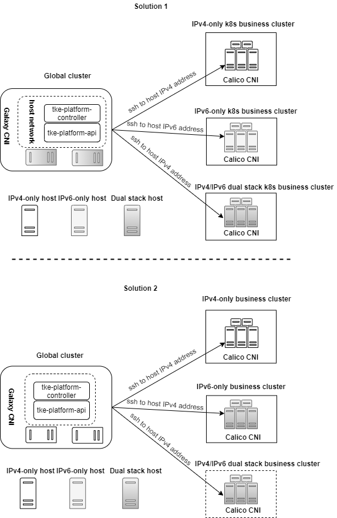

#  Enable IPv6 on business cluster  


**Author**: huxiaoliang([@huxiaoliang](https://github.com/huxiaoliang))

**Status** (20200817): Done

## Summary

Public IPv4 address is a finite number, it is already used up now,  the IPv6 address space was specified to solve this problem. In addition, many organizations have to committed to support IPv6,  the compliance policy required IPv6 for most of government,  finance and telecom system as well.

## Background

1. **K8S**: Support for IPv6-only clusters was added in Kubernetes 1.9 as an alpha feature, and with version 1.13, the Kubernetes default DNS server changed to CoreDNS which has full IPv6. IPv6 dual stack support in kubernetes was brought from v1.16
2. **CNI**: `Calico` support IPv6 dual stack from Calico v3.11. `Flannel` doesn't support IPv6, details from [\[25\]](https://github.com/coreos/flannel/issues/248),  TKEStack built-in CNI `galaxy` doesn't support IPv6 now
3.  **kubeadm**:  `IPv6DualStack` supported as alpha feature in v1.16
4.  The top private container platform such as Openshift and Rancher still not fully support IPv6
- [Openshift partially  support IPv6](https://docs.openshift.com/container-platform/3.6/release_notes/ocp_3_6_release_notes.html#ocp-36-support-ipv6-terminated-at-the-router-with-internal-ipv4)
-  [Rancher plan to support IPv6](https://github.com/rancher/rancher/issues/27808)
5.  This feature asked by Alauda Cloud

## Motivation

TKEstack leveraged `kubeadm` to build Kubernetes clusters from `tke-platform` component,  in order to support IPv6 on business cluster, `kubeadm`and `tke-platform` should extent ability to build IPv4/IPv6 dual stack, IPv6-only and IPv4-only`business`cluster

## Scope

 **In-Scope**: 
 1. (**P0**) Build IPv6-only enabled business cluster
 2. (**P1**) Build IPv4/IPv46 dual stack enabled business cluster

**Out-Of-Scope**: 
 1. Business cluster HA with IPv6 enabled
 2. `Logging` and `monitoring`  on business cluster with IPv6 enabled
 3. Global cluster IPv6-only support, include all TKEstack internal component porting, such as `tke-auth`, `tke-gateway`, `tke-business` etc
 4. UI enhancement for validating and pass IPv6 address/cidr to back-end
 5. Support `calico` as built-in CNI plug-in against `galaxy` 
 
## Main proposal

1.  This project just partially support IPv6 only for `business` cluster,  to reduce the impact of `global`cluster as much as possible, the  TKEstack internal components from `global` cluster such as `tke-auth`, `tke-gateway`, `tke-business` ,etc, still run in pod works with IPv4-only address provide by `galaxy` CNI plug-in, no IPv6 porting work need to do, `calico`CNI plug-in will provide IPv6 functionality for `business` cluster,  there are 2 solutions achieve this, solution 2 is preferred for Alauda Cloud case



- **solution 1**: This need `tke-platform` configured as host network and it's home host configured as dual stack host, so that `tke-platform` ssh to remote IPv4 or IPv6 address to build `business` cluster leverage dual stack networking functionality

- **solution 2**: This need IPv6-only and IPv4/IPv6 dual stack `business` cluster host configured as dual stack host so that `tke-platform` always use ssh to remote IPv4 address to build `business` cluster

2. By default, cluster host IP address will be set as K8S node name, it is ok for IPv4 node case, but for IPv6-only case,  because IPv6 address does not conform with K8S node name pattern, in this case, the `Cluser.spec.hostnameAsNodename=true`is a mandatory setting

3. To handle`Cluser.spec.hostnameAsNodename=true` case, details from [here](https://github.com/tkestack/tke/blob/master/docs/design-proposals/hostname-as-nodename-support.md),  the label named `platform.tkestack.io/machine-ip` on K8S node used to persist node ip for future retrieve, but it doesn't work for machine IP is IPv6 case, since valid label values must be 63 characters or less, IPv6 address will break the rule. To fix the gap, machine IP string will be split to 2 parts and persist to multiple-labels `platform.tkestack.io/machine-ipv6-head` and `platform.tkestack.io/machine-ipv6-till`,  then combination query used to retrieve the node later.

## Future work

To fully support IPv6 on both `global` and `business` cluster,  `ouf-of-scope` section **MUST** be addressed

## User case

##### Deploy topology
|   role       |   IPv4   |  IPv6  | hostname | 
| :--------:   | :-----:  | :----: | :----: |
| installer node | 172.22.0.77 |240d:c000:1000:3400:0:91a7:5835:80e3| VM-0-77-ubuntu | 
| global node | 172.22.0.3     |240d:c000:1000:3400:0:91a4:e140:ea1|VM-0-3-ubuntu | 
| business cluster master|172.22.0.67|240d:c000:1000:3400:0:91a2:3ff3:4b3e|VM-0-67-ubuntu | 
| business cluster worker|172.22.0.102|240d:c000:1000:3400:0:91a2:3ff4:3a46|VM-0-102-ubuntu | 


### Case 1: business cluster IPv6 dual stack test

1.  Go to global node,  issue below command to create business cluster 
```
root@VM-0-3-ubuntu:~/ipv6-test# kubectl create -f cluster-ipv6-ds.json 
cluster.platform.tkestack.io/cls-7q46p7mt created
root@VM-0-3-ubuntu:~/ipv6-test#
```
2. After cluster is ready, apply calico network plug-in 
```
root@VM-0-3-ubuntu:~/ipv6-test# kubectl get cluster 
NAME           TYPE        VERSION   STATUS    AGE
cls-7q46p7mt   Baremetal   1.18.3    Running   3m51s
global         Baremetal   1.18.3    Running   60m
root@VM-0-3-ubuntu:~/ipv6-test#
```
```
root@VM-0-67-ubuntu:~/ipv6-test# kubectl get po -A
NAMESPACE     NAME                                  READY   STATUS    RESTARTS   AGE
kube-system   coredns-bbc9b5888-5lhtp               0/1     Pending   0          3m19s
kube-system   coredns-bbc9b5888-hvb5v               0/1     Pending   0          3m19s
kube-system   etcd-172.22.0.67                      1/1     Running   0          2m29s
kube-system   kube-apiserver-172.22.0.67            1/1     Running   0          2m34s
kube-system   kube-controller-manager-172.22.0.67   1/1     Running   0          3m17s
kube-system   kube-proxy-q4v98                      1/1     Running   0          3m19s
kube-system   kube-scheduler-172.22.0.67            1/1     Running   0          3m17s
root@VM-0-67-ubuntu:~/ipv6-test# 
```
```
root@VM-0-67-ubuntu:~/ipv6-test# kubectl create -f ../calico-v3.16/calicov6.yaml 
configmap/calico-config created
customresourcedefinition.apiextensions.k8s.io/bgpconfigurations.crd.projectcalico.org created
customresourcedefinition.apiextensions.k8s.io/bgppeers.crd.projectcalico.org created
customresourcedefinition.apiextensions.k8s.io/blockaffinities.crd.projectcalico.org created
customresourcedefinition.apiextensions.k8s.io/clusterinformations.crd.projectcalico.org created
customresourcedefinition.apiextensions.k8s.io/felixconfigurations.crd.projectcalico.org created
customresourcedefinition.apiextensions.k8s.io/globalnetworkpolicies.crd.projectcalico.org created
customresourcedefinition.apiextensions.k8s.io/globalnetworksets.crd.projectcalico.org created
customresourcedefinition.apiextensions.k8s.io/hostendpoints.crd.projectcalico.org created
customresourcedefinition.apiextensions.k8s.io/ipamblocks.crd.projectcalico.org created
customresourcedefinition.apiextensions.k8s.io/ipamconfigs.crd.projectcalico.org created
customresourcedefinition.apiextensions.k8s.io/ipamhandles.crd.projectcalico.org created
customresourcedefinition.apiextensions.k8s.io/ippools.crd.projectcalico.org created
customresourcedefinition.apiextensions.k8s.io/kubecontrollersconfigurations.crd.projectcalico.org created
customresourcedefinition.apiextensions.k8s.io/networkpolicies.crd.projectcalico.org created
customresourcedefinition.apiextensions.k8s.io/networksets.crd.projectcalico.org created
clusterrole.rbac.authorization.k8s.io/calico-kube-controllers created
clusterrolebinding.rbac.authorization.k8s.io/calico-kube-controllers created
clusterrole.rbac.authorization.k8s.io/calico-node created
clusterrolebinding.rbac.authorization.k8s.io/calico-node created
daemonset.apps/calico-node created
serviceaccount/calico-node created
deployment.apps/calico-kube-controllers created
serviceaccount/calico-kube-controllers created
```
```
root@VM-0-67-ubuntu:~# kubectl get po -A
NAMESPACE     NAME                                       READY   STATUS    RESTARTS   AGE
kube-system   calico-kube-controllers-866f6f96b5-28zpw   1/1     Running   0          78s
kube-system   calico-node-tjgx9                          1/1     Running   0          78s
kube-system   coredns-bbc9b5888-5lhtp                    1/1     Running   0          19m
kube-system   coredns-bbc9b5888-hvb5v                    1/1     Running   0          19m
kube-system   etcd-172.22.0.67                           1/1     Running   0          18m
kube-system   kube-apiserver-172.22.0.67                 1/1     Running   0          18m
kube-system   kube-controller-manager-172.22.0.67        1/1     Running   0          19m
kube-system   kube-proxy-q4v98                           1/1     Running   0          19m
kube-system   kube-scheduler-172.22.0.67                 1/1     Running   0          19m
root@VM-0-67-ubuntu:~# 
```

3.  Create worker to business cluster,  please update `spec.clusterName` accordingly

```
root@VM-0-3-ubuntu:~/ipv6-test# kubectl create -f machine-ds.json 
machine.platform.tkestack.io/mc-9r2dkcqj created
root@VM-0-3-ubuntu:~/ipv6-test# 
``` 

4. Check business cluster status 
```
root@VM-0-3-ubuntu:~/ipv6-test# kubectl get machine 
NAME          TYPE        IP             STATUS    AGE
mc-9r2dkcqj   Baremetal   172.22.0.102   Running   117s
root@VM-0-3-ubuntu:~/ipv6-test# 

root@VM-0-67-ubuntu:~/ipv6-test# kubectl get node 
NAME           STATUS   ROLES    AGE   VERSION
172.22.0.102   Ready    <none>   59s   v1.18.3
172.22.0.67    Ready    master   53m   v1.18.3
root@VM-0-67-ubuntu:~/ipv6-test# kubectl get po -A
NAMESPACE     NAME                                       READY   STATUS    RESTARTS   AGE
kube-system   calico-kube-controllers-866f6f96b5-28zpw   1/1     Running   0          34m
kube-system   calico-node-5tq48                          1/1     Running   0          64s
kube-system   calico-node-tjgx9                          1/1     Running   0          34m
kube-system   coredns-bbc9b5888-5lhtp                    1/1     Running   0          52m
kube-system   coredns-bbc9b5888-hvb5v                    1/1     Running   0          52m
kube-system   etcd-172.22.0.67                           1/1     Running   0          52m
kube-system   kube-apiserver-172.22.0.67                 1/1     Running   0          52m
kube-system   kube-controller-manager-172.22.0.67        1/1     Running   0          52m
kube-system   kube-proxy-gqvsv                           1/1     Running   0          64s
kube-system   kube-proxy-q4v98                           1/1     Running   0          52m
kube-system   kube-scheduler-172.22.0.67                 1/1     Running   0          52m
root@VM-0-67-ubuntu:~/ipv6-test# 
```
5. Deploy workload to business cluster,  you can see the pod has IPv4 and IPv6 address
```
root@VM-0-67-ubuntu:~/ipv6-test# kubectl run -i --tty busybox1 --image=busybox -- sh
If you don't see a command prompt, try pressing enter.
/ # ifconfig 
eth0      Link encap:Ethernet  HWaddr 36:63:07:95:B7:BB  
          inet addr:172.18.207.65  Bcast:172.18.207.65  Mask:255.255.255.255
          inet6 addr: fda7:f48b:fa2c:336f:e06c:912e:2118:67c0/128 Scope:Global
          inet6 addr: fe80::3463:7ff:fe95:b7bb/64 Scope:Link
          UP BROADCAST RUNNING MULTICAST  MTU:1440  Metric:1
          RX packets:9 errors:0 dropped:0 overruns:0 frame:0
          TX packets:9 errors:0 dropped:1 overruns:0 carrier:0
          collisions:0 txqueuelen:0 
          RX bytes:906 (906.0 B)  TX bytes:770 (770.0 B)

lo        Link encap:Local Loopback  
          inet addr:127.0.0.1  Mask:255.0.0.0
          inet6 addr: ::1/128 Scope:Host
          UP LOOPBACK RUNNING  MTU:65536  Metric:1
          RX packets:0 errors:0 dropped:0 overruns:0 frame:0
          TX packets:0 errors:0 dropped:0 overruns:0 carrier:0
          collisions:0 txqueuelen:1000 
          RX bytes:0 (0.0 B)  TX bytes:0 (0.0 B)

/ # 

root@VM-0-102-ubuntu:~# ping 172.18.207.65
PING 172.18.207.65 (172.18.207.65) 56(84) bytes of data.
64 bytes from 172.18.207.65: icmp_seq=1 ttl=64 time=0.037 ms
64 bytes from 172.18.207.65: icmp_seq=2 ttl=64 time=0.030 ms
--- 172.18.207.65 ping statistics ---
2 packets transmitted, 2 received, 0% packet loss, time 1022ms
rtt min/avg/max/mdev = 0.030/0.033/0.037/0.006 ms
root@VM-0-102-ubuntu:~#  ping6 fda7:f48b:fa2c:336f:e06c:912e:2118:67c0
PING fda7:f48b:fa2c:336f:e06c:912e:2118:67c0(fda7:f48b:fa2c:336f:e06c:912e:2118:67c0) 56 data bytes
64 bytes from fda7:f48b:fa2c:336f:e06c:912e:2118:67c0: icmp_seq=1 ttl=64 time=0.039 ms
64 bytes from fda7:f48b:fa2c:336f:e06c:912e:2118:67c0: icmp_seq=2 ttl=64 time=0.034 ms
64 bytes from fda7:f48b:fa2c:336f:e06c:912e:2118:67c0: icmp_seq=3 ttl=64 time=0.033 ms
```
### Case 2: business cluster IPv6 single stack test

All the steps show solution 1 works as expected, if you want to try solution 2, just set `Cluster.spec.machines[*].ip` or `Machine.spec.ip` to host IPv4 address is enough, no need go through step 1 ~ step 3
 
0.  Free up business cluster to reuse for retest: delete business cluster and machine, then run `delete.sh` and `kubeadm reset` on business cluster node
```
root@VM-0-3-ubuntu:~# kubectl get machine
NAME          TYPE        IP             STATUS    AGE
mc-9r2dkcqj   Baremetal   172.22.0.102   Running   19m
root@VM-0-3-ubuntu:~# kubectl delete machine mc-9r2dkcqj 
machine.platform.tkestack.io "mc-9r2dkcqj" deleted
root@VM-0-3-ubuntu:~# kubectl get cluster
NAME           TYPE        VERSION   STATUS    AGE
cls-7q46p7mt   Baremetal   1.18.3    Running   73m
global         Baremetal   1.18.3    Running   129m
root@VM-0-3-ubuntu:~# kubectl delete cluster cls-7q46p7mt
cluster.platform.tkestack.io "cls-7q46p7mt" deleted
root@VM-0-3-ubuntu:~#
```

1.   Scale down `platform-api`and `platform-contoller` deployment to 
```
root@VM-0-3-ubuntu:~/ipv6-test#  kubectl scale deployment tke-platform-api --replicas=0 -n tke
deployment.apps/tke-platform-api scaled
root@VM-0-3-ubuntu:~/ipv6-test#  kubectl scale deployment tke-platform-controller --replicas=0 -n tke 
deployment.apps/tke-platform-controller scaled
root@VM-0-3-ubuntu:~/ipv6-test# kubectl get po -A |grep platform
root@VM-0-3-ubuntu:~/ipv6-test# 
```
2. Update `dnsPolicy=ClusterFirstWithHostNet` and `hostNetwork=true` for platform-api`and `platform-contoller` deployment
```
kubectl edit deployment tke-platform-api   -n tke
kubectl edit deployment tke-platform-controller  -n tke
``` 
3. Scale up `platform-api`and `platform-contoller` deployment 
```
root@VM-0-3-ubuntu:~/ipv6-test#  kubectl scale deployment tke-platform-api --replicas=1 -n tke 
deployment.apps/tke-platform-api scaled
root@VM-0-3-ubuntu:~/ipv6-test#  kubectl scale deployment tke-platform-controller --replicas=1 -n tke 
deployment.apps/tke-platform-controller scaled
root@VM-0-3-ubuntu:~/ipv6-test# kubectl get po -A |grep platform
tke           tke-platform-api-8fdbcfbd-794m8            1/1     Running   0          22s
tke           tke-platform-controller-6968c44644-cmgpv   1/1     Running   1          7m1s
root@VM-0-3-ubuntu:~/ipv6-test# 
```

4. Go to global node,  issue below command to create business cluster 
```
root@VM-0-3-ubuntu:~/ipv6-test# kubectl create -f cluster-ipv6-sig.json 
cluster.platform.tkestack.io/cls-5gh9wc5l created
root@VM-0-3-ubuntu:~/ipv6-test# 
```
5. After cluster is ready, apply calico network plug-in 
```
root@VM-0-3-ubuntu:~/ipv6-test# kubectl get cluster
NAME           TYPE        VERSION   STATUS    AGE
cls-5gh9wc5l   Baremetal   1.18.3    Running   4m35s
global         Baremetal   1.18.3    Running   152m
root@VM-0-3-ubuntu:~/ipv6-test# 
```
```
root@VM-0-67-ubuntu:~/ipv6-test# kubectl get po -A
NAMESPACE     NAME                                     READY   STATUS    RESTARTS   AGE
kube-system   coredns-bbc9b5888-5nc2t                  0/1     Pending   0          2m39s
kube-system   coredns-bbc9b5888-vm5qt                  0/1     Pending   0          2m39s
kube-system   etcd-vm-0-67-ubuntu                      1/1     Running   1          3m12s
kube-system   kube-apiserver-vm-0-67-ubuntu            1/1     Running   0          2m27s
kube-system   kube-controller-manager-vm-0-67-ubuntu   1/1     Running   0          3m9s
kube-system   kube-proxy-9sppp                         1/1     Running   0          2m38s
kube-system   kube-scheduler-vm-0-67-ubuntu            1/1     Running   0          3m10s
root@VM-0-67-ubuntu:~/ipv6-test# 
```
```
root@VM-0-67-ubuntu:~/ipv6-test# kubectl create -f calicov6-sig.yaml 
configmap/calico-config created
customresourcedefinition.apiextensions.k8s.io/bgpconfigurations.crd.projectcalico.org created
customresourcedefinition.apiextensions.k8s.io/bgppeers.crd.projectcalico.org created
customresourcedefinition.apiextensions.k8s.io/blockaffinities.crd.projectcalico.org created
customresourcedefinition.apiextensions.k8s.io/clusterinformations.crd.projectcalico.org created
customresourcedefinition.apiextensions.k8s.io/felixconfigurations.crd.projectcalico.org created
customresourcedefinition.apiextensions.k8s.io/globalnetworkpolicies.crd.projectcalico.org created
customresourcedefinition.apiextensions.k8s.io/globalnetworksets.crd.projectcalico.org created
customresourcedefinition.apiextensions.k8s.io/hostendpoints.crd.projectcalico.org created
customresourcedefinition.apiextensions.k8s.io/ipamblocks.crd.projectcalico.org created
customresourcedefinition.apiextensions.k8s.io/ipamconfigs.crd.projectcalico.org created
customresourcedefinition.apiextensions.k8s.io/ipamhandles.crd.projectcalico.org created
customresourcedefinition.apiextensions.k8s.io/ippools.crd.projectcalico.org created
customresourcedefinition.apiextensions.k8s.io/kubecontrollersconfigurations.crd.projectcalico.org created
customresourcedefinition.apiextensions.k8s.io/networkpolicies.crd.projectcalico.org created
customresourcedefinition.apiextensions.k8s.io/networksets.crd.projectcalico.org created
clusterrole.rbac.authorization.k8s.io/calico-kube-controllers created
clusterrolebinding.rbac.authorization.k8s.io/calico-kube-controllers created
clusterrole.rbac.authorization.k8s.io/calico-node created
clusterrolebinding.rbac.authorization.k8s.io/calico-node created
daemonset.apps/calico-node created
serviceaccount/calico-node created
deployment.apps/calico-kube-controllers created
serviceaccount/calico-kube-controllers created
root@VM-0-67-ubuntu:~/ipv6-test# 
```
```
root@VM-0-67-ubuntu:~/ipv6-test# kubectl get po -A
NAMESPACE     NAME                                       READY   STATUS    RESTARTS   AGE
kube-system   calico-kube-controllers-65f8bc95db-dqxtl   1/1     Running   1          2m9s
kube-system   calico-node-mt7cl                          1/1     Running   0          2m9s
kube-system   coredns-bbc9b5888-5nc2t                    1/1     Running   0          9m24s
kube-system   coredns-bbc9b5888-vm5qt                    1/1     Running   0          9m24s
kube-system   etcd-vm-0-67-ubuntu                        1/1     Running   1          9m57s
kube-system   kube-apiserver-vm-0-67-ubuntu              1/1     Running   0          9m12s
kube-system   kube-controller-manager-vm-0-67-ubuntu     1/1     Running   0          9m54s
kube-system   kube-proxy-9sppp                           1/1     Running   0          9m23s
kube-system   kube-scheduler-vm-0-67-ubuntu              1/1     Running   0          9m55s
root@VM-0-67-ubuntu:~/ipv6-test# 

```

6.  Create worker to business cluster,  please update `spec.clusterName` accordingly

```
root@VM-0-3-ubuntu:~/ipv6-test# kubectl create -f machine-sig.json 
machine.platform.tkestack.io/mc-9r2dkcqj created
root@VM-0-3-ubuntu:~/ipv6-test# 
``` 

7. Check business cluster status 
```
root@VM-0-3-ubuntu:~/ipv6-test# kubectl get machine
NAME          TYPE        IP                                     STATUS         AGE
mc-9r2dkcqj   Baremetal   240d:c000:1000:3400:0:91a2:3ff4:3a46   Initializing   40s
root@VM-0-3-ubuntu:~/ipv6-test#

root@VM-0-67-ubuntu:~/ipv6-test# kubectl get node 
NAME           STATUS   ROLES    AGE   VERSION
vm-0-67-ubuntu   Ready    master   147m   v1.18.3
vm-0-102-ubuntu   Ready    master   147m   v1.18.3
root@VM-0-67-ubuntu:~/ipv6-test# kubectl get po -A
NAMESPACE     NAME                                       READY   STATUS    RESTARTS   AGE
kube-system   calico-kube-controllers-65f8bc95db-dqxtl   1/1     Running   1          7m9s
kube-system   calico-node-mt7cl                          1/1     Running   0          7m9s
kube-system   calico-node-wxd7z                          1/1     Running   0          70s
kube-system   coredns-bbc9b5888-5nc2t                    1/1     Running   0          14m
kube-system   coredns-bbc9b5888-vm5qt                    1/1     Running   0          14m
kube-system   etcd-vm-0-67-ubuntu                        1/1     Running   1          14m
kube-system   kube-apiserver-vm-0-67-ubuntu              1/1     Running   0          14m
kube-system   kube-controller-manager-vm-0-67-ubuntu     1/1     Running   0          14m
kube-system   kube-proxy-9sppp                           1/1     Running   0          14m
kube-system   kube-proxy-g8vd6                           1/1     Running   0          70s
kube-system   kube-scheduler-vm-0-67-ubuntu              1/1     Running   0          14m
root@VM-0-67-ubuntu:~/ipv6-test# 
```
8. Deploy workload to business cluster,  you can see the pod only has IPv6 address
```
root@VM-0-67-ubuntu:~/calico-v3.16# kubectl run -i --tty busybox1 --image=busybox -- sh
If you don't see a command prompt, try pressing enter.
/ # ifconfig 
eth0      Link encap:Ethernet  HWaddr 02:DB:89:B1:11:0F  
          inet6 addr: fd5d:812f:7a1d:c6dd:f8f1:cf80:e703:ea83/128 Scope:Global
          inet6 addr: fe80::db:89ff:feb1:110f/64 Scope:Link
          UP BROADCAST RUNNING MULTICAST  MTU:1440  Metric:1
          RX packets:9 errors:0 dropped:0 overruns:0 frame:0
          TX packets:6 errors:0 dropped:1 overruns:0 carrier:0
          collisions:0 txqueuelen:0 
          RX bytes:906 (906.0 B)  TX bytes:560 (560.0 B)

lo        Link encap:Local Loopback  
          inet addr:127.0.0.1  Mask:255.0.0.0
          inet6 addr: ::1/128 Scope:Host
          UP LOOPBACK RUNNING  MTU:65536  Metric:1
          RX packets:0 errors:0 dropped:0 overruns:0 frame:0
          TX packets:0 errors:0 dropped:0 overruns:0 carrier:0
          collisions:0 txqueuelen:1000 
          RX bytes:0 (0.0 B)  TX bytes:0 (0.0 B)

/ # 
root@VM-0-102-ubuntu:~#  ping fd5d:812f:7a1d:c6dd:f8f1:cf80:e703:ea83       
PING fd5d:812f:7a1d:c6dd:f8f1:cf80:e703:ea83(fd5d:812f:7a1d:c6dd:f8f1:cf80:e703:ea83) 56 data bytes
64 bytes from fd5d:812f:7a1d:c6dd:f8f1:cf80:e703:ea83: icmp_seq=1 ttl=64 time=0.046 ms
64 bytes from fd5d:812f:7a1d:c6dd:f8f1:cf80:e703:ea83: icmp_seq=2 ttl=64 time=0.033 ms
```

## Reference
[1] https://medium.com/@elfakharany/how-to-enable-ipv6-on-kubernetes-aka-dual-stack-cluster-ac0fe294e4cf

[2]  https://www.projectcalico.org/dual-stack-operation-with-calico-on-kubernetes/

[3] https://medium.com/@elfakharany/how-to-enable-ipv6-on-kubernetes-aka-dual-stack-cluster-ac0fe294e4cf

[4] https://medium.com/@prashy.pk/dual-stack-ipv4-ipv6-on-kubernetes-4a68c7f985b3

[5] https://cloud.tencent.com/document/product/215/47557

[6] demo: https://github.com/Trackhe/Raspberry64bitKubernetesServerDualstack

[7] https://github.com/kubernetes/kubernetes/pull/64999/files

[8] https://bugzilla.redhat.com/show_bug.cgi?id=1831006

[9] https://github.com/projectcalico/calico/issues/2758

[10] https://github.com/kubernetes/kubeadm/issues/1569

[11] https://www.linux.com/topic/networking/7remote-sessions-over-ipv6-ssh-scp-and-rsync/

[12] https://www.7forz.com/2708/

[13] https://docs.projectcalico.org/manifests/calico.yaml

[14] https://github.com/projectcalico/calico/issues/2758

[15] https://bugs.launchpad.net/starlingx/+bug/1845707

[16] https://github.com/projectcalico/calico/issues/3215

[17] https://docs.projectcalico.org/networking/ipv6

[18] https://github.com/kubernetes/kubernetes/pull/85494/files

[19] e2e test: https://github.com/leblancd/kube-v6

[20] k8s design: https://github.com/kubernetes/enhancements/blob/master/keps/sig-network/20180612-ipv4-ipv6-dual-stack.md

[21] https://thenewstack.io/kubernetes-warms-up-to-ipv6/

[22] rancher ipv6: https://github.com/rancher/rancher/issues/27808 

[23] openshift ipv6: https://docs.openshift.com/container-platform/3.6/release_notes/ocp_3_6_release_notes.html#ocp-36-support-ipv6-terminated-at-the-router-with-internal-ipv4

[24] validation: https://github.com/kubernetes/kubernetes/blob/master/pkg/proxy/apis/config/validation/validation.go#L78-#L111

[25] https://github.com/coreos/flannel/issues/248

[26] https://docs.oracle.com/cd/E19683-01/817-0573/transition-10/index.html
