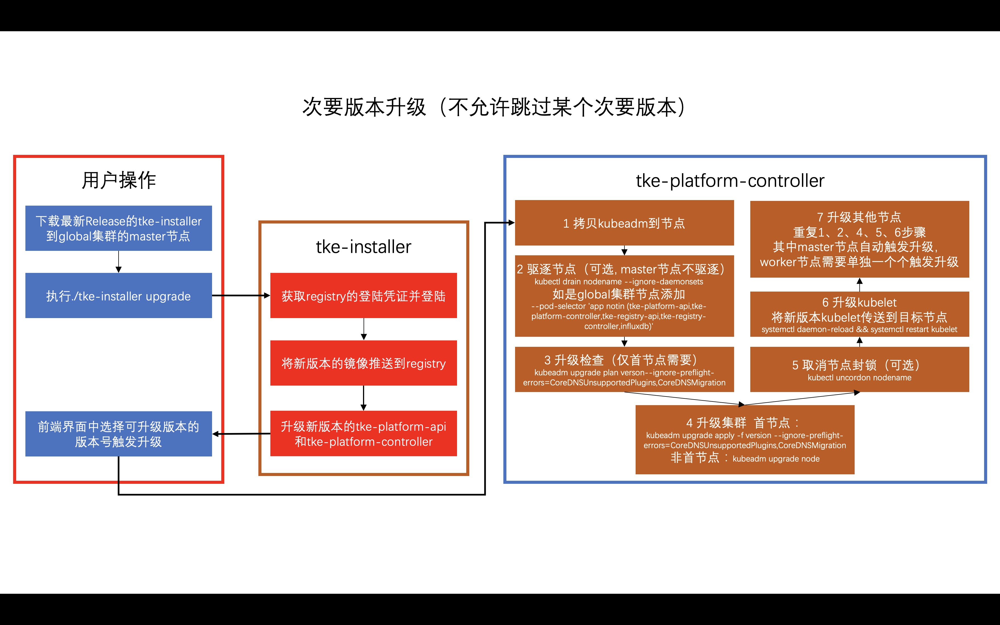
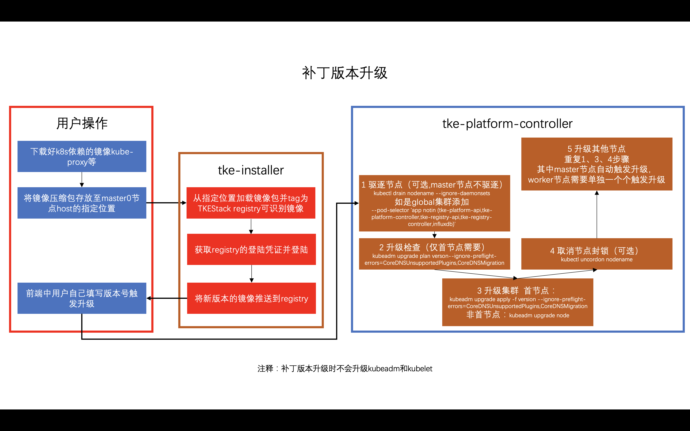

# Cluster upgrade

**Author**: Leo Ryu ([@leoryu](https://github.com/leoryu))

**Status** (20201029): Designing

## Background

用户在使用TKEStack创建的集群时，可能会希望将集群升级到较高版本，以使用新的特性或是修复社区已经修复的BUG和安全漏洞。

## Concept

主版本：k8s版本号的格式vx.y.z中的x为主版本，例如v1.18.3主版本是1
次要版本：k8s版本号的格式vx.y.z中的y为次要版本，例如v1.18.3的次要版本是18
补丁版本：k8s版本号的格式vx.y.z中的z为补丁版本

## Challenge

### 升级集群时所需要的组件如何导入
当前运行集群所需要的镜像二进制等都是在tke-installer安装是确定的，已经安装好的TKEStack没有一个导入新版本k8s集群依赖组件的优雅方案。

让用户手动离线下载对应镜像和二进制在传到各个节点过于繁琐，难以接受。

### kubeadm不允许跳过次版本升级
TKEStack目前都是通过kubeadm来进行集群的创建和管理，升级目前也准备使用kubeadm进行。

kubeadm只能从一个次版本升级到下一个次版本，或者在次版本相同时升级补丁版本。 也就是说，升级时不可以跳过次版本。 例如，你只能从 1.y 升级到 1.y+1，而不能从1.y 升级到 1.y+2。

但是目前TKEStack对k8s的支持策略是最近发布的两个双数次版本，例如笔者写文章时TKEStack支持v1.16.9和v1.18.3两个版本。因此，用户是无法直接从v1.16.9升到v1.18.3的。

### 各节点替换对应版本的kubeadm、kubelet和kubectl
升级所需要的镜像依赖在上传tke-registry后各个节点可以进行拉取镜像，但是kubeadm、kubelet和kubectl的更新则需要想办法获取到这些TKEStack原先不存在的二进制，并传送到各个节点。

kubeadm进行集群升级前首先需要将kubeadm升级到对应版本。其中跨次版本无法使用旧版本升级到新版本，例如v1.16版本的kubeadm无法将集群升级到v1.17，必须先将kubeadm升级到v1.17才能升级。补丁版本升级可以使用旧版本kubeadm升级，但是需要加-f或–force的flag。建议两种场景都安装官方建议的先将kubeadm升级到对应版本。

各节点使用kubeadm升级过后还需要将kubelet替换到对应版本以升级节点。替换完后执行systemctl daemon-reload && systemctl restart kubelet以完成节点升级。

kubectl的升级则比较简单也不是很重要，甚至不升级影响也不是很大。

## Main proposal

### 次版本升级

需要用户等到新的release版本发布以后，使用新版本的tke-installer进行升级。

例如用户当前使用的TKEStack版本是版本是v1.4，支持k8s版本是v1.16.9和v1.18.3。用户要想升级到v1.19版本可能要等到TKEStack的v1.5发布，当时v1.5的tke-installer中可能有v1.19版本（这个可能要求TKEStack改变当前支持的k8s版本策略，单数版本也要支持）。

### 补丁版本升级

补丁版本升级用户需要自己将资源上传和存放到指定位置，并修改支持的版本号配置（版本管理存放在cluster-info configmap中）后再使用tke-installer安装。

### 升级失败回滚

升级过程中有可能出现意想不到的问题而导致升级失败或升级过程被卡住。针对失败发生的时间点不同，管理员处理策略有所不同。

#### 失败发生在k8s集群版本号变化之前

此时k8集群版本号未发生变化，首节点尚未升级，可回滚。可以将Cluster.Spec.Version的版本号修改为与当前k8s版本一致，集群便可恢复正常运行状态。

#### 失败发生在k8s集群版本号变化之后

此时集群的首节点已经升级成功，原则上不允许回滚到低版本。需要管理员排查其他节点没有按照预期进行升级到原因，解决问题后升级流程会自动向前推进。

### 升级过程事件

升级过程事件存放在Cluster.Status.Conditions中。事件到Reason字段存储了事件发生在向哪个k8s版本升级的信息，以区别多次升级时发生多次的相同类型事件。

事件类型：

- EnsurePreClusterUpgradeHook    （执行管理员自定义的升级前检脚本）
- EnsureUpgradeControlPlaneNode  （集群升级核心流程）
- EnsureRenewCerts               （检查是否需要更新证书）
- EnsureAPIServerCert            （检查是否需要生产api-server证书）
- EnsureStoreCredential          （检查集群访问凭）
- EnsureKeepalivedWithLBOption   （检查内置HA是否需要安装）
- EnsureThirdPartyHA             （检查第三方HA是否需要安装）
- EnsurePostClusterUpgradeHook   （执行管理员自定义的升级后检脚本）

### 使用tke-installer准备升级物料

1. 将新版的tke-installer下载到global集群某个节点本地；
2. 复制节点上的kubeconfig到/opt/tke-installer/conf/kubeconfig；
3. 运行升级命令`./tke-installer-XXXX.run --upgrade。

升级脚本会将包内镜像push到平台registry，并自动替换tke-platform-api和tke-platform-controller版本。

用户在使用--upgrade的同时，也可以通过添加--username、--password、--domain和--namespace等flag使用用户指定的registry用户名、密码、域名地址和命名空间。

### 前端约束

#### 版本控制

TKEStack可用k8s版本信息从`/api/v1/namespaces/kube-public/configmaps/cluster-info`中的data.k8sValidVersions获取，形式为string array。

集群（`/apis/platform.tkestack.io/v1/clusters/{clusterName}`）只允许向比当前版本高的版本升级，比当前版本低的版本应当为灰不可选。

#### 集群升级参数

升级参数在集群对象（`/apis/platform.tkestack.io/v1/clusters/{clusterName}`）的spec.features.upgrade中。

mode分为Auto和Manual两种。Auto会自动升级worker节点，Manual只会标记worker节点需要升级，等待用户手动修改节点状态后才会升级。

strategy.maxUnready表示升级过程中允许不可用pod的最大比例，例如“50%”。前端应当提示：注意如果节点过少，而设置比例过低，没有足够多的节点承载pod的迁移会导致升级卡死。如果业务对pod可用比例较高，请考虑选择升级前不驱节点。

strategy.drainNodeBeforeUpgrade表示升级前是否需要驱逐节点。前端应当提示：若选择升级前驱逐节点，该节点所有pod将在升级前被驱逐，此时节点如有pod使用emptyDir类卷会导致驱逐失败而影响升级流程。

#### 升级触发

集群升级是由修改集群对象（`/apis/platform.tkestack.io/v1/clusters/{clusterName}`）的spec.version的值触发的。

Manual模式下worker节点的升级是修改machine对象(`/apis/platform.tkestack.io/v1/machines/{mchineName}`)的status.phase为"Upgrading"而触发的。用户可能在前端会一次勾选多个machine以声明升级多节点，前端需将用户选择的machine的`platform.tkestack.io/need-upgrade` label值修改为`willUpgrade`以标记用户选择，之后前端再修改首个machine的status.phase为"Upgrading"触发升级，后续后端会对`platform.tkestack.io/need-upgrade` label值为`willUpgrade`的machine自动升级。

注意某集群下列出的需要升级worker节点对应的machine需要用到labelSelector和fieldSelector，`/apis/platform.tkestack.io/v1/machines?labelSelector=platform.tkestack.io/need-upgrade&fieldSelector=spec.clusterName%3D{clusterName}`

#### 不可升级状态

集群只有在名下machine都不包含`platform.tkestack.io/need-upgrade` label时才可以升级，即`/apis/platform.tkestack.io/v1/machines?labelSelector=platform.tkestack.io/need-upgrade&fieldSelector=spec.clusterName%3D{clusterName}`返回的items列表为空，否则应当提示该集群有worker节点需要先完成升级。

worker节点需要machine有`platform.tkestack.io/need-upgrade` label时才允许手动触发升级，否则应当为灰提示无需升级。