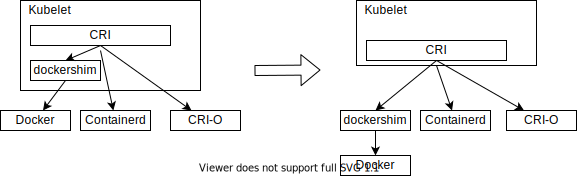

# Support standard CRI runtime Containerd


**Author**: Tai Hui Min

**Status** (20210914): Done

## Abstract
CRI（Container runtime interface）是Kubernetes容器运行时接口,是Kubernetes规定的容器运行时标准，由protocol buffer协议和gRPC API构成。Docker、Containerd、CRI-O为实现CRI的容器引擎。
以下Proposal主要介绍了TKEStack支持CRI标准容器引擎containerd的背景、动机和具体的实施步骤。


## Background
  随着Kubernetes社区的蓬勃发展，容器引擎也发展迅速，除了Docker引擎外，出现多种更加轻量级的容器引擎: 比如Containerd[1]、CRI-O[2]、iSulad[3]等；为了统一支持这些运行引擎，Kubernetes V1.5版本引入了CRI(Container runtime interface)。

  同时为了保持对Docker的支持,Kubelet内置了dockershim来支持CRI，但也因此引出了一系列问题，最终Kubernetes社区计划移除dockershim，确保Kubelet和容器引擎的界面是CRI接口[4]: 1.20-1.22标记depracated, 1.23正式移除。后续dockershim由Mirantis维护，需要在Kubelet和Docker之外额外安装[5]。

  

  此外，Containerd 、CRI-O等容器引擎相比Docker更加轻量级，表现在功能更简单、创建容器时的调用链更短，性能更加健壮并且可移植性强，因此更适合作为Kubernetes的容器运行时。Containerd于2019年已经正式从CNCF毕业，成为行业标准的容器引擎，在各大互联网公司也有较广泛的应用 [1]。本文内容集中在TKEStack支持Containerd容器引擎，Dockershim+Docker以后在TKEStack将不再提供支持。

  Containerd作为纯粹的容器运行时工具，缺少镜像制作等能力，需要引入额外的工具满足TKEStack的需求。下表为TKEStack不同功能阶段对容器引擎的功能需求。

|  功能阶段   | 容器引擎功能点  | Docker+Dockershim | CRI标准接口(Containerd/CRIO) | containerd  + ctr |
|  -----  |   -------      |-|-|-|
| 构建     | 制作镜像        |是|否|否|
| 构建     | push镜像 |是|否|是|
| 构建     | tag镜像        |是|否|是|
| install | load镜像       |是|否|是|
| install | push镜像 |是|否|是|
| install | manifest(multi-arch) |是|否|是|
| running(管理集群: 创建、导入、增加节点、运行负载) | 启动容器        |是|是|是|
| running(管理集群) | 下载镜像        |是|是|是|
| running(管理集群) | 运行容器        |是|是|是|
| running(管理集群) | 运行POD        |是|是|是|
| running(管理集群) | 配置网络        |是|是|是|
| running(管理集群) | 删除容器        |是|是|是|
| running(管理集群) | 删除镜像        |是|是|是|


## Motivation

TKEStack支持配置CRI标准兼容容器引擎docker和containerd，用户在安装业务集群时可以自由选择使用docker或者containerd：

**版本需求**
  * TKEStack版本：v1.8.0
  * 支持的Kubernetes版本:（v1.19.7, v1.20.4, v1.20.4-tke.1）
  * containerd版本：v1.5.4
  * crictl版本：1.20.0-24-g53ad8bb7
  * nerdctl版本：0.11.0
  * 支持的操作系统类型: ≥ Ubuntu 16.04/18.04 LTS (64-bit);≥ CentOS Linux 7.6 (64-bit);≥ Tencent Linux 2.2
  * 支持的操作系统架构：amd64

根据TKEStack在不同阶段使用功能的差异，我们把支持CRI接口容器引擎分为两个阶段：

**阶段1  完成running阶段的改造**
  * 支持配置Containerd为容器引擎

**阶段2 完成Install阶段的改造**

  *  使用Containerd作为容器引擎
  *  引入工具nerdctl创建tke-installer、registry-http、registry-https容器
  *  使用docker-in-docker的方式，在Containerd容器中运行docker，完成tkestack在安装阶段创建image manifests,push multiarch images到local registry过程

## Main proposal

### 阶段1 完成Running阶段的改造

该阶段容器引擎的调用者是Kubelet，只使用CRI标准定义的接口，所以只需要引入Containerd，不需要引入其他第三方组件，通过暴露参数`Cluster.Spec.Features.EnsureContainerRuntime`为判断容器引擎选择的开关，该阶段包含2个部分：

**1. 安装Cluster**

 *  Install过程中安装Global Cluster，使用containerd作为容器运行时
 *  安装User Cluster，可以选择使用Containerd或者docker作为容器运行时

 两个过程均调用`clusterProvider.OnCreate`函数创建集群。相关的流程以及修改如下

 　

修改文件：

*   `pkg/platform/provider/baremetal/cluster/provider.go`
*   `pkg/platform/provider/baremetal/cluster/create.go`

**2. user cluster扩容节点**

该过程通过调用`machineProvider.OnCreate`，和安装cluster过程类似，不再赘述。

修改文件：

*   `pkg/platform/provider/baremetal/machine/provider.go`
*   `pkg/platform/provider/baremetal/machine/create.go`

由于增加了Containerd，需要引入配置文件和server文件

* `pkg/platform/provider/baremetal/conf/containerd/config.toml`
* `pkg/platform/provider/baremetal/conf/containerd/containerd.service`

### 阶段2 install阶段的改造 完全支持containerd，需要配合nerdctl工具进行改造
  目前的install步骤：
  * Execute pre install hook
  * Load images（docker load）
  * Tag images (docker tag)
  * Setup local registry(docker run)
  * Push images(docker manifest, docker push)
  * Generate certificates for TKE components
  * Create global cluster

在install开始阶段，需要使用`nerdctl run`命令创建installer容器，registry-http容器和registry-https容器，
```
nerdctl run  -d --privileged --net=host --restart=always -v /etc/hosts:/app/hosts -v /run/containerd:/run/containerd -v /var/lib/containerd:/var/lib/containerd -v /var/lib/nerdctl:/var/lib/nerdctl -v /opt/cni/bin:/opt/cni/bin -v /run/containerd/containerd.sock:/run/containerd/containerd.sock -v /opt/tke-installer/data:/app/data -v /opt/tke-installer/conf:/app/conf -v registry-certs:/app/certs -v tke-installer-bin:/app/bin docker.io/library/test:20 tke-installer
```
```
nerdctl run -d  --name registry-http -p 80:5000 -v /opt/tke-installer/registry:/var/lib/registry  registry.tke.com/library/registry-amd64:2.7.1
```
```
nerdctl run -d --name registry-https --restart always -p 443:443 -v /opt/tke-installer/registry:/var/lib/registry -v registry-certs:/certs -e REGISTRY_HTTP_ADDR=0.0.0.0:443 -e REGISTRY_HTTP_TLS_CERTIFICATE=/certs/server.crt -e REGISTRY_HTTP_TLS_KEY=/certs/server.key registry.tke.com/library/registry-amd64:2.7.1
```
使用nerdctl 查看创建的容器：
```
nerdctl ps -a
```
查看容器日志：
```
nerdctl logs
```
install过程中需要创建registry镜像仓库，在安装过程中需要搭建临时镜像仓库，并将多种体系架构的镜像push到临时仓库中完成安装，由于安装和创建global集群时我们都切换为Containerd运行时，但同时还需要使用docker创建多架构的镜像push到registry中，
所以这里使用docker-in-docker的方式，将dockerd和docker client使用dind的镜像部署到containerd容器中，在containerd容器中使用docker来制作镜像的manifest并且push到registry中。

```
FROM docker:20.10.8-dind

RUN echo "hosts: files dns" >> /etc/nsswitch.conf

WORKDIR /app

ENV PATH="/app/bin:$PATH"
ENV DOCKER_CLI_EXPERIMENTAL=enabled
ARG ENV_ARCH

RUN apk add --no-cache \
    bash \
    busybox-extras \
    curl \
    tcpdump \
    docker \
    ansible

RUN apk --update-cache --repository http://dl-3.alpinelinux.org/alpine/edge/testing/ --allow-untrusted add lrzsz
RUN wget -O nerdctl-0.11.0-linux.tar.gz https://github.com/containerd/nerdctl/releases/download/v0.11.0/nerdctl-0.11.0-linux-"$ENV_ARCH".tar.gz \
   && tar -zvxf nerdctl-0.11.0-linux.tar.gz -C /usr/local/bin/ \
   && rm -rf nerdctl-0.11.0-linux.tar.gz

ADD . /app
```
通过nerdctl进入到tke-installer容器中，可以看到启动的dockerd和tke-installer进程：
```
# nerdctl ps
CONTAINER ID    IMAGE                                                                              COMMAND                   CREATED       STATUS    PORTS    NAMES
d25ffca45f2f    docker.io/tkestack/tke-installer-amd64:b1a40af7665eff000aa4e0078470824db042b419    "/bin/sh -c /app/run…"    6 days ago    Up                 tke-installer
```
```
# nerdctl exec -it d25ffca45f2f sh
/app # ps -ef
PID   USER     TIME  COMMAND
    1 root      0:00 {run.sh} /bin/bash /app/run.sh
    7 root      0:07 docker-init -- dockerd --host=unix:///var/run/docker.sock
    8 root      1:01 ./bin/tke-installer
   67 root      1:23 dockerd --host=unix:///var/run/docker.sock --host=tcp://0.
  203 root      0:00 sh
  209 root      0:00 ps -ef
/app #
```
### 阶段3 用户场景容器引擎的切换

用户已有集群从docker切换到containerd：
 * 现存节点用户根据指导文档手动迁移到containerd：https://tkestack.github.io/web/zh/blog/2021/09/01/container-runtime-migraion/


## Refereneces:
1.  https://containerd.io/
2.  https://github.com/cri-o/cri-o
3.  https://gitee.com/openeuler/iSulad
4. https://github.com/kubernetes/enhancements/blob/master/keps/sig-node/1985-remove-dockershim/README.md
5. https://www.mirantis.com/blog/mirantis-to-take-over-support-of-kubernetes-dockershim-2
6. https://tkestack.github.io/docs/installation/installation-steps.html
7. https://github.com/moby/buildkit
8. https://github.com/containers/buildah
9. https://github.com/GoogleContainerTools/kaniko
10. https://github.com/containerd/nerdctl
11. https://github.com/containerd/containerd/blob/master/docs/cri/installation.md
12. https://github.com/containerd/cri/blob/master/docs/crictl.md
13. https://blog.scottlowe.org/2020/01/25/manually-loading-container-images-with-containerd/
