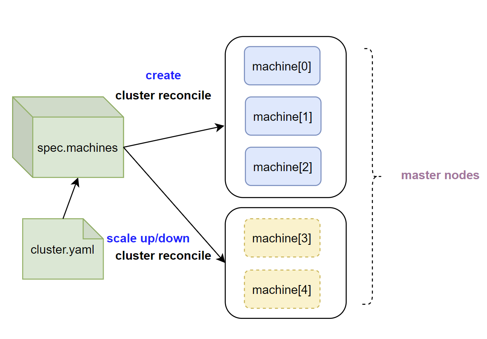

# control plane enable scale


**Author**: huxiaoliang([@huxiaoliang](https://github.com/huxiaoliang))

**Status** (20200817): Done

## Summary

In production environment, the control plane in the cluster is in maintenance mode for OS upgrade, software upgrade or hardware repair reason, the cluster control plane need scale up so that keep high availability.  Administrator also want to migrate master node if initial placement policy doesn't meet zone/region anti-affinity policy. In current Tkestack implementation,  the master nodes defined in cluster object when fresh installation, it can't be get update during cluster life cycle.

Tkestack None-HA mode is used for demo for experiment case, turning business/global cluster from None-HA mode to HA mode will lead to error-prone, so this case is out of scope of this project,  but Tkestack will not avoid administrator do it manually.

## Scope

 **In-Scope**: 
 1. (**P1**) Enabled global/business cluster control plane scale up with VIP
 2. (**P1**) Enabled global/business cluster control plane scale up with external LB
 3. (**P1**) Enabled global/business cluster control plane scale down

**Out-Of-Scope**: 
 1. Turning business/global cluster from None-HA mode to HA mode, refer to `Reference` section [3] for the details

## Limitation

1. `master[0]` from `global` cluster can't get scale down, since Tkestack doesn't have built-in `storage class` or external share storage solution, `spec.machines[0]` take cluster share storage role to persist built-in registry images and event log,  if scale down `spec.machines[0]`, the cluster will become unavailable

2.  Base on above,  the `global` cluster doesn't support scaling up with new node place to first item in `cluster.spec.machines`

## Main proposal

1. Actually, `kubeadm`already has the ability to support control plane scale up/down,   `tke-platform` component just leverage this functionality to implement this requirement. Currently, the control plane defined in `cluster` object `spec.machines` section when fresh install k8s cluster,  cluster controller `reconcile` will turning the set of node to k8s master nodes,  as well as add/remove new node to/from to cluster.  Machine controller will turning a set of node to k8s worker node join to cluster

2.  New handler as bellows add to bare-metal cluster
- ScaleUpHandlers： This is same as CreateHandlers, just handle new added nodes
- ScaleDownHandlers:  The workload on the scaling down nodes will not get removed
   EnsureRemoveETCDMember: Remove etcd member from etcd cluster
   EnsureRemoveNode: Delete k8s node from k8s cluster
 
3. Cluster state transition:
 - Success path:  Running --> Upscaling/DownScaling --> Running
 - Failed path: Running --> Upscaling/DownScaling --> Failed

4. Scale up/down validation, if operator break below validation rules, there is a error message will show the reason in log or console:
 - Only the cluster in HA mode support control plane scale up/down
 - The `global` cluster doesn't support scaling up with new node place to first item in `cluster.spec.machines`
 - Scale down `cluster.spec.machines[0]` from `global` cluster is not allowed
 
5. State transition event：
The scaling up/down event will persist to `cluster.status.conditions`section with `append` mode, operator is able to retrieve it to monitor status or debug



## Future work

To minimum the impact cluster，the cluster/machine data model is not get changed,  still depends on cluster controller `reconcile` ,  but it is better to use machine controller  `reconcile`, after that, scale up/down control plane and worker node both leverage machine controller, this is align with k8s native design:  node controller cover master node and worker node in one controller.

## User case

#### Case 1. Business cluster control plane scaling up

1.   Create business cluster `cls-hrq7mvt9` with vip enabled
```
root@VM-0-80-ubuntu:/opt/tke# kubectl get cluster
NAME           TYPE        VERSION   STATUS    AGE
cls-hrq7mvt9   Baremetal   1.18.3    Running   4h30m
global         Baremetal   1.18.3    Running   5h28m
root@VM-0-80-ubuntu:/opt/tke# 
```
2.  Check 3 masters in the cluster in `Ready` state
```
root@VM-0-197-ubuntu:~# kubectl get node
NAME         STATUS   ROLES    AGE     VERSION
10.0.0.127   Ready    master   4h21m   v1.18.3
10.0.0.197   Ready    master   4h21m   v1.18.3
10.0.0.9     Ready    master   4h22m   v1.18.3
root@VM-0-197-ubuntu:~# 
```
3. Add new master node `10.0.0.135` to control plane 
```
kubectl patch cluster cls-hrq7mvt9 --type='json' -p='[{"op":"add","path":"/spec/machines/3","value":{"ip":"10.0.0.135","password":"TGV0bWVpbjEyMywuMQ==","port":22,"username":"root"}}]'
cluster.platform.tkestack.io/cls-hrq7mvt9 patched
```
4. Check cluster status and node list
```
root@VM-0-80-ubuntu:/opt/tke# kubectl get cluster
NAME           TYPE        VERSION   STATUS      AGE
cls-hrq7mvt9   Baremetal   1.18.3    Upscaling   4h37m
global         Baremetal   1.18.3    Running     5h35m
root@VM-0-80-ubuntu:/opt/tke# 
root@VM-0-127-ubuntu:~# kubectl get node
NAME         STATUS   ROLES    AGE    VERSION
10.0.0.127   Ready    master   141m   v1.18.3
10.0.0.135   Ready    master   2m2s   v1.18.3
10.0.0.197   Ready    master   141m   v1.18.3
10.0.0.9     Ready    master   142m   v1.18.3
root@VM-0-80-ubuntu:/opt/tke# kubectl get cluster
NAME           TYPE        VERSION   STATUS      AGE
cls-hrq7mvt9   Baremetal   1.18.3    Running     4h39m
global         Baremetal   1.18.3    Running     5h37m
``` 

#### Case 2: Business cluster control plane scaling down

1. Remove master node `10.0.0.135` from control plane 
```
root@VM-0-80-ubuntu:/opt/tke# kubectl patch cluster cls-hrq7mvt9 --type='json' -p='[{"op":"remove","path":"/spec/machines/3"}]' 
cluster.platform.tkestack.io/cls-hrq7mvt9 patched
root@VM-0-80-ubuntu:/opt/tke# kubectl get cluster
NAME           TYPE        VERSION   STATUS    AGE
cls-hrq7mvt9   Baremetal   1.18.3    Running   4h40m
global         Baremetal   1.18.3    Running   5h38m
root@VM-0-80-ubuntu:/opt/tke# 
```
2.  Check cluster status and node list
```
root@VM-0-80-ubuntu:/opt/tke# kubectl get cluster
NAME           TYPE        VERSION   STATUS    AGE
cls-hrq7mvt9   Baremetal   1.18.3    Running   4h40m
global         Baremetal   1.18.3    Running   5h38m
root@VM-0-80-ubuntu:/opt/tke# 
root@VM-0-127-ubuntu:~# kubectl get node
NAME         STATUS   ROLES    AGE     VERSION
10.0.0.127   Ready    master   4h32m   v1.18.3
10.0.0.197   Ready    master   4h32m   v1.18.3
10.0.0.9     Ready    master   4h33m   v1.18.3
root@VM-0-127-ubuntu:~#
```
**Note**: If you want to repeat the case 1 to add new node to cluster control plane after scale down , you have to run `clean.sh` on this node at first so that clean environment 
##### 

## PR
[1] https://github.com/tkestack/tke/pull/908

[2] https://github.com/tkestack/tke/pull/919

[3] https://github.com/tkestack/tke/pull/937

[4] https://github.com/tkestack/tke/pull/943

## Reference

[1] https://kubernetes.io/docs/setup/production-environment/tools/kubeadm/high-availability/

[2] https://octetz.com/docs/2019/2019-03-26-ha-control-plane-kubeadm/

[3] https://blog.scottlowe.org/2019/08/12/converting-kubernetes-to-ha-control-plane/

[4] https://github.com/rancher/rancher/issues/16151

[5] https://blog.scottlowe.org/2019/04/16/using-kubeadm-add-new-control-plane-nodes-aws-integration/

[6] https://github.com/kubernetes/kubeadm/issues/1955

[7] https://cloud.tencent.com/developer/article/1495499

[8] https://my.oschina.net/u/2306127/blog/2990359

[9] https://www.youtube.com/watch?v=27v36t-3afQ&feature=youtu.be


