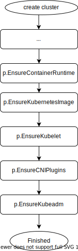

# Use standard CRI runtime containerd


**Author**: Tai Hui Min

**Status** (20210618): Designing

## Abstract
CRI（Container runtime interface）是Kubernetes容器运行时接口,是Kubernetes规定的容器运行时标准，由protocol buffer协议和gRPC API构成。Docker、Containerd、CRI-O为实现CRI的容器引擎。
以下Proposal主要介绍了TKEStack支持CRI标准容器引擎containerd的背景、动机和具体的实施步骤。


## Background
  随着Kubernetes社区的蓬勃发展，容器引擎也发展迅速，除了Docker引擎外，出现多种更加轻量级的容器引擎: 比如Containerd[1]、CRI-O[2]、iSulad[3]等；为了统一支持这些运行引擎，Kubernetes V1.5版本引入了CRI(Container runtime interface)。

  同时为了保持对Docker的支持,Kubelet内置了dockershim来支持CRI，但也因此引出了一系列问题，最终Kubernetes社区计划移除dockershim，确保Kubelet和容器引擎的界面是CRI接口[4]: 1.20-1.22标记depracated, 1.23正式移除。后续dockershim由Mirantis维护，需要在Kubelet和Docker之外额外安装[5]。

  

  此外，Containerd 、CRI-O等容器引擎相比Docker更加轻量级，表现在功能更简单、创建容器时的调用链更短，性能更加健壮并且可移植性强，因此更适合作为Kubernetes的容器运行时。Containerd于2019年已经正式从CNCF毕业，成为行业标准的容器运行引擎，在各大互联网公司也有较广泛的应用 [1]。本文内容集中在TKEStack支持Containerd，Dockershim+Docker以后TKEStack将不再支持。

  Containerd作为纯粹的容器运行时工具，缺少镜像制作等能力，需要引入额外的工具满足TKEStack的需求。下表为TKEStack不同功能阶段对容器引擎的功能需求。

|  功能阶段   | 容器引擎功能点  | Docker+Dockershim | CRI标准接口(Containerd/CRIO) | containerd  + ctr |
|  -----  |   -------      |-|-|-|
| 构建     | 制作镜像        |是|否|否|
| 构建     | push镜像 |是|否|是|
| 构建     | tag镜像        |是|否|是|
| install | load镜像       |是|否|是|
| install | push镜像 |是|否|是|
| install | manifest(multi-arch) |是|否|是|
| running(管理集群: 创建、导入、增加节点、运行负载) | 启动容器        |是|是|是|
| running(管理集群) | 下载镜像        |是|是|是|
| running(管理集群) | 运行容器        |是|是|是|
| running(管理集群) | 运行POD        |是|是|是|
| running(管理集群) | 配置网络        |是|是|是|
| running(管理集群) | 删除容器        |是|是|是|
| running(管理集群) | 删除镜像        |是|是|是|


## Motivation

TKEStack支持配置CRI标准兼容容器引擎docker和containerd，用户在安装global集群和用户的业务集群时可以自由选择使用docker或者containerd：

**版本需求**
  * TKEStack版本：v1.7.0
  * 支持的Kubernetes版本:（v1.19.7, v1.20.4, v1.20.4-tke.1）
  * containerd版本：v1.5.2
  * crictl版本：v0.1.0
  * ctr版本：v1.5.2
  * 支持的操作系统类型: ≥ Ubuntu 16.04/18.04 LTS (64-bit);≥ CentOS Linux 7.6 (64-bit);≥ Tencent Linux 2.2
  * 支持的操作系统架构：amd64

根据TKEStack在不同阶段使用功能的差异，我们把支持CRI接口容器引擎分为四个阶段：

**阶段1  完成running阶段的改造**
  * 支持配置Containerd为容器引擎

**阶段2 完成Install阶段的改造**

  * 支持配置Containerd作为容器引擎
  *  引入其他工具如nerdctl支持tag、push、build等操作

**阶段3  完成构建阶段的改造**
  *  支持配置Containerd作为容器引擎
  *  引入其他工具如nerdctl完成build、tag、push功能

需要明确该步改造的必要性，如无必要则不做改造。

## Main proposal

### 阶段1 完成Running阶段的改造

该阶段容器引擎的调用者是Kubelet，只使用CRI标准定义的接口，所以只需要引入Containerd，不需要引入其他第三方组件，通过暴露参数`Cluster.Spec.Features.EnableContainerRuntime`为判断容器引擎选择的开关，该阶段包含2个部分：
通过UI暴露选项：
```
容器引擎： docker   containerd
```
**1. 安装Cluster**

 *  Install过程中安装Global Cluster
 *  安装User Cluster

 两个过程均调用`clusterProvider.OnCreate`函数创建集群，其中的区别是安装Global集群过程中可以配置容器引擎的额外参数[6]。相关的流程以及修改如下

 　

修改文件：

*   `pkg/platform/provider/baremetal/cluster/provider.go`
*   `pkg/platform/provider/baremetal/cluster/create.go`

**2. user cluster扩容节点**

该过程通过调用`machineProvider.OnCreate`，和安装cluster过程类似，不再赘述。

修改文件：

*   `pkg/platform/provider/baremetal/machine/provider.go`
*   `pkg/platform/provider/baremetal/machine/create.go`

由于增加了Containerd，需要引入配置文件和server文件

* `pkg/platform/provider/baremetal/conf/containerd/config.toml`
* `pkg/platform/provider/baremetal/conf/containerd/containerd.service`

增加cri-tools，需要引入如下配置文件

* pkg/platform/provider/baremetal/conf/critools/crictl.yaml

### 阶段2 install阶段的改造 暂时无法完全支持containerd，需要配合docker进行改造
  目前的install步骤：
  * Execute pre install hook
  * Load images（docker load）
  * Tag images (docker tag)
  * Setup local registry(docker run)
  * Push images(docker manifest, docker push)
  * Generate certificates for TKE components
  * Create global cluster
  install过程中需要创建registry镜像仓库，在安装过程中需要搭建临时镜像仓库，并将多种体系架构的镜像push到临时仓库中完成安装。由于Docker 镜像格式原生不支持需要多体系架构，需要额外引入流程解决，过程如下：


存在步骤2和步骤3的根本原因是Docker的镜像格式不支持多体系架构，image.tar.gz 必须包含同名的不同架构的镜像，所以首先需要load不同架构的同名镜像，镜像加载到容器镜像后，还需要通过docker的manifest命令build multi-arch的镜像，最终push到本地创建的registry。
此步骤需要花费大量的时间。


目前OCI Image spec通过manifest list天生支持了多体系架构，所以该过程可以简化为上图。需要注意的问题是这步改动已经超过了CRI规范的范畴，要引入Containerd自带的命令进行补充。
目前通过ctr client可以export所有架构的image，通过import可以load所有架构的image。
```
ctr images pull tkestack/kube-apiserver:v1.20.4-tke.1 -k --all-platforms
```
```
ctr images export kube-apiserver.tar docker.io/tkestack/kube-apiserver:v1.20.4-tke.1 --all-platforms
```
```
ctr images import kube-apiserver.tar docker.io/tkestack/kube-apiserver:v1.20.4-tke.1 --all-platforms
```
在install阶段，需要使用`docker run`命令创建installer容器和registry-http容器和registry-https容器，目前`ctr run`和`nerdctl run`都无法完全取代`docker run`命令，因为ctr不支持暴露容器端口，ctr和nerdctl都不支持volume mount.
所以此阶段仍然需要安装docker.
### 阶段3 完成构建阶段的改造  暂时无法完全支持containerd，需要配合docker进行改造
  该阶段容器引擎的使用者不是Kubernetes，所以不受Kubelet移除dockershim的影响。改造优先级较低。
  随着社区的发展，容器基础工具集开始符合Unix的设计哲学：一个工具只做好一个事情。镜像制作领域也出现了一系列工具：

 * BuildKit[7]
BuildKit是Docker出品的一款镜像制作工具，目的是分担Docker Engine的功能。
 * nerdctl[10]
nerdctl是一款完全兼容docker的工具，是containerd的子项目之一，可以弥补ctr无法build image的缺陷，nerdctl结合buildKit实现image build。

此阶段仍然需要安装docker.
### 阶段4 用户场景容器引擎的切换

用户已有集群从docker切换到containerd：
 * 现存节点不支持自动迁移到containerd,通过升级到新支持containerd的集群或者提供手动的步骤的方式切换到containerd


## refereneces:
1.  https://containerd.io/
2.  https://github.com/cri-o/cri-o
3.  https://gitee.com/openeuler/iSulad
4. https://github.com/kubernetes/enhancements/blob/master/keps/sig-node/1985-remove-dockershim/README.md
5. https://www.mirantis.com/blog/mirantis-to-take-over-support-of-kubernetes-dockershim-2
6. https://tkestack.github.io/docs/installation/installation-steps.html
7. https://github.com/moby/buildkit
8. https://github.com/containers/buildah
9. https://github.com/GoogleContainerTools/kaniko
10. https://github.com/containerd/nerdctl
11. https://github.com/containerd/containerd/blob/master/docs/cri/installation.md
12. https://github.com/containerd/cri/blob/master/docs/crictl.md
13. https://blog.scottlowe.org/2020/01/25/manually-loading-container-images-with-containerd/
