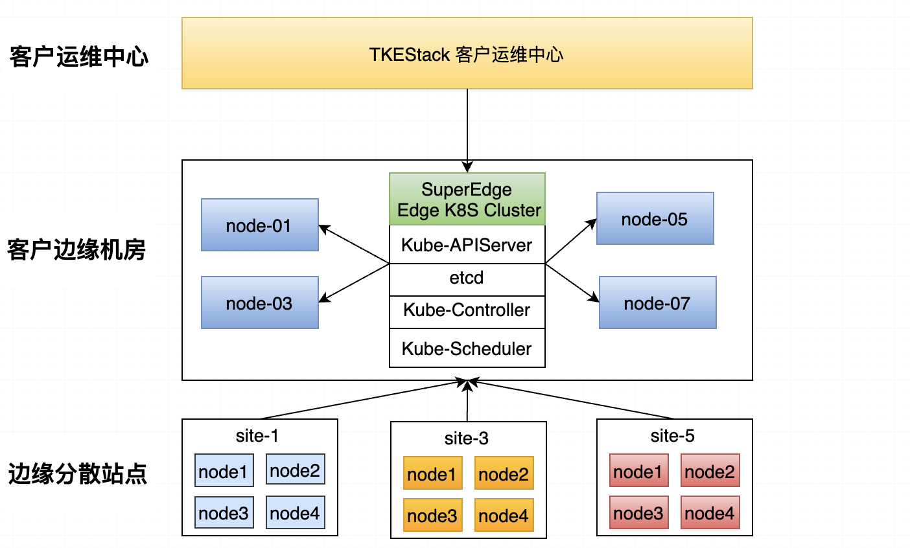
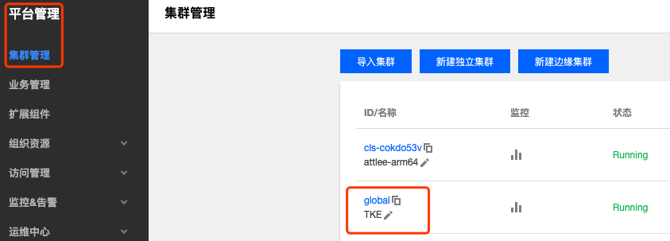
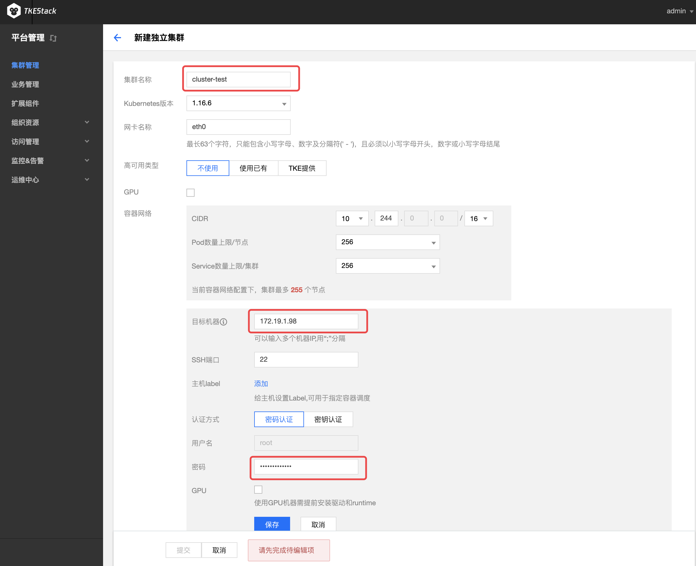

# 支持TKE创建SuperEdge边缘集群

**Author**: [attlee wang](https://github.com/attlee-wang)

**Status** (20220127): Done

[TOC]

## 1. Abstract

用户在中心有了TKE原生的K8s集群之后，还有很多网络和TKE中心不可达的节点，如果能把这些节点和设备在TKE中心的控制面上统一管控起来，将充分的提高资源的利用率，降低运维的难度。

特别是在一些AI和IOT的边缘场景中，通过边缘K8s集群，用户可以在TKE中心的控制面统一管控洒落在各地的边缘节点，统管众多的小站点和边缘应用，为边缘AI和IOT云边一体化统一赋能。为此我们将在TKE中默认支持[SuperEdge](https://github.com/superedge/superedge)边缘集群，为用户云边端一朵云而奋斗。

## 2. Motivation

 TKE在集成[SuperEdge](https://github.com/superedge/superedge)的边缘集群之后将会有哪些功能：

-   一键创建生产级的SuperEdge边缘K8s集群；
-   一键纳管任何位置的边缘节点，只要这个节点能访问到边缘集群的kube-apiserver，就能被纳管；
-   云边协同能力，可以从中心管理和运维边缘节点和边缘应用；
-   边缘节点具有边缘自治能力，云边断网不影响应用运行，断电重启应用可被自动拉起；
-   支持ServiceGroup能力，可接入边缘多个站点，进行一键化多站点应用；

## 3. Proposal

### 3.1 目标方案

目标方案如下图：



-   用户通过客户运维中心，登录到边缘机房部署

<1>.用户在部署完TKEStack的控制面之后，控制面会多一个**新建边缘集群**，就是创建SuperEdge的边缘集群的入口：



<2>. 点击创建集群界面和新建独立集群基本完全一致，需要填下的参数入下界面，填下相关信息后遍可创建出SuperEdge的边缘集群。



<3>. 集群创建完之后，可以用edgeadm CLI在界面上添加边缘节点，节点->添加节点 页面只会显示如下信息

```powershell
./edgeadm join <Master Public/Intranet IP Or Domain>:Port --token xxxx --discovery-token-ca-cert-hash sha256:xxxxxxxxxx --install-pkg-path <edgeadm kube-* install package address path> --enable-edge=true
```

用户复制其命令，在自己的边缘节点上执行便可把边缘边缘节点添加上来。

>   批量添加边缘节点二期在做集成。

### 3.2 背后的实现逻辑

总体思路为 TKEStack + SuperEdge，对TKEStack创建原生独立集群的逻辑不做任何修改，代码中采用引源码来进行，在之后的Steps添加创建边缘独立集群SuperEdge的逻辑。

具体代码位置在`tke/pkg/platform/provider/edge/:`

```http
    CreateHandlers: []clusterprovider.Handler{
            ## TKEStack 创建TKEStack的逻辑, step按需要引用, 期间可能对部分函数会改写
            p.EnsureCopyFiles,
			p.EnsurePreClusterInstallHook,
			p.EnsurePreInstallHook,
			...
            // 准备创建SuperEdge边缘节点的逻辑
            EnsurePrepareEgdeCluster
            // Add-on SuperEdge 组件的逻辑
            EnsureApplyEdgeApps
            ...
			p.EnsurePostInstallHook,
			p.EnsurePostClusterInstallHook,
	},
```

## 4. 使用Demo

### 4.1 创建边缘集群

创建SuperEdge的边缘集群的demo superedge_edge.yaml具体如下：

```yaml
apiVersion: platform.tkestack.io/v1
kind: Cluster
metadata:
  annotations:
    superedge.io/edgeImageResository: superedge.tencentcloudcr.com/superedge ## 边缘节点上镜像仓库的地址
    superedge.io/edge-version: v0.8.0 ## superedge 组件的版本
    superedge.io/edge-virtual-addr: 169.254.20.11 ##边缘节点虚拟网卡的地址
  name: attlee-superedge
spec:
  displayName: attlee-superedge-demo
  etcd:
    local:
      dataDir: ""
      serverCertSANs:
        - etcd
        - etcd.kube-system
  features:
    containerRuntime: docker
    skipConditions:
      - EnsureCilium
  machines:
    - ip: 10.0.200.98
      password: PasswordBase64
      port: 22
      username: root
  networkDevice: eth0
  clusterCIDR: 192.168.0.0/16
  properties:
    maxClusterServiceNum: 256
    maxNodePodNum: 256
  publicAlternativeNames:
    - 106.52.199.103
  tenantID: default
  type: Edge                           ## 集群类型，标识创建的是SuperEdge的边缘集群
  version: 1.20.6-tke.2
```

更多参数的详细解析请参考TKEStack的官方文档，用`kubectl apply -f superedge_edge.yaml ` 提交集群yaml，集群处于`Running`表示创建SuperEdge 边缘集群成功，

```powershell
[root@attlee]# kubectl apply -f superedge_edge.yaml      ## 创建superedge edge边缘集群
cluster.platform.tkestack.io/cls-tptvzrdk created

[root@attlee]# kubectl get cluster                       ## 查看边缘集群的状态
NAME           TYPE        VERSION        STATUS    AGE
cls-tptvzrdk   Edge        1.21.4-tke.1   Running   8m   ## 处于Running表示创建边缘集群成功
```

失败可`kubectl get cluster cls-tptvzrdk -o yaml   `查看边缘集群创建失败细节。

### 4.2 添加边缘节点

**<1>.下载静态安装包**

至[SuperEdge](https://github.com/superedge/superedge)社区在需要加入的节点上下载自己需要的K8s 静态安装包：

> 注意修改"arch=amd64"参数，目前支持[amd64, arm64], kubernetes版本可选[1.20.6, 1.18.2], 其他参数不变

```powershell
arch=amd64 version=v0.7.0 kubernetesVersion=1.20.6 && rm -rf edgeadm-linux-* && wget https://superedge-1253687700.cos.ap-guangzhou.myqcloud.com/$version/$arch/edgeadm-linux-$arch-$version-k8s-$kubernetesVersion.tgz && tar -xzvf edgeadm-linux-* && cd edgeadm-linux-$arch-$version-k8s-$kubernetesVersion && ./edgeadm
```

**<2>. Join边缘节点**

在自己新创建的SuperEdge边缘集群的Master执行如下命令获取加入边缘节点的Token：

```powershell
[root@attlee]# kubeadm token create --print-join-command
kubeadm join 127.0.0.1:6443 --token n6hdw6.jbr9778iqoebekyv --discovery-token-ca-cert-hash sha256:b1a00ff33fba4f9a6e63ebbee777120bfbe252a27eeb86d78eaa44799c7a9415
```

> - kubeadm命令master默认已安装；
    >

- 127.0.0.1:6443 为访问边缘集群kube-api的地址，加入边缘节点可换成`<Master节点外网IP/Master节点内网IP/域名>`，端口、token、discovery-token-ca-cert-hash
  sha256 不变；

执行如下命令加入边缘节点：

```powershell
[root@attlee]# ./edgeadm join <Master节点外网IP/Master节点内网IP/域名>:Port --token xxxx --discovery-token-ca-cert-hash sha256:xxxxxxxxxx --install-pkg-path <edgeadm kube-*静态安装包路径> --enable-edge=true
```

> 注意通过 `--install-pkg-path` 带edgeadm join的kube-*静态安装包径路

比如：

```powershell
[root@attlee]# ./edgeadm join 106.52.199.103:6443 --token n6hdw6.jbr9778iqoebekyv --discovery-token-ca-cert-hash sha256:b1a00ff33fba4f9a6e63ebbee777120bfbe252a27eeb86d78eaa44799c7a9415 --install-pkg-path ./kube-linux-amd64-v1.20.6.tar.gz
```

更好资料可产看[Addon SuperEdge 让原生Kuberntes集群具备边缘能力](https://github.com/superedge/superedge/blob/main/docs/installation/addon_superedge_CN.md)
。

## 5. Plan

|    时间    | 关键节点                                             |   相关人员   |  进度  |
| :--------: | ---------------------------------------------------- | :----------: | :----: |
| 2022-01-27 | 输出Proposals, review 方案                           | @attlee-wang | 已完成 |
| 2022-02-11 | 输出提交代码框架，分出steps，创建tasks               | @attlee-wang | 已完成 |
| 2022-02-18 | 边缘独立集群能够创建出来                             | @attlee-wang | 已完成 |
| 2022-02-25 | 边缘节点能够添加                                     | @attlee-wang | 已完成 |
|            | 能够把SuperEdge 打入TKEStack的Releases包             |              |        |
|            | 提供边缘集群的部署使用方式，补充入TKEStack的使用文档 |              |        |
|            | 添加必要的单元测试和e2e测试                          |              |        |
|            | 支持TKEStack 创建边缘集群页面                        |              |        |

