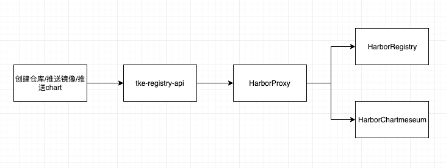
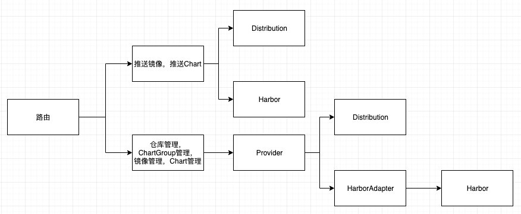
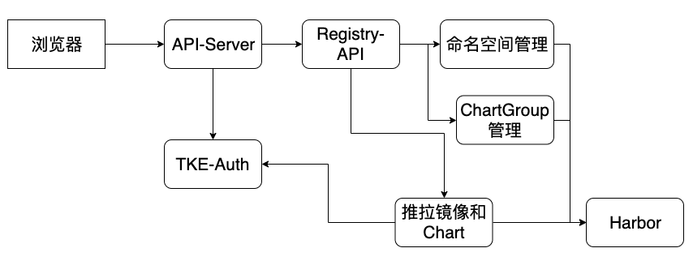
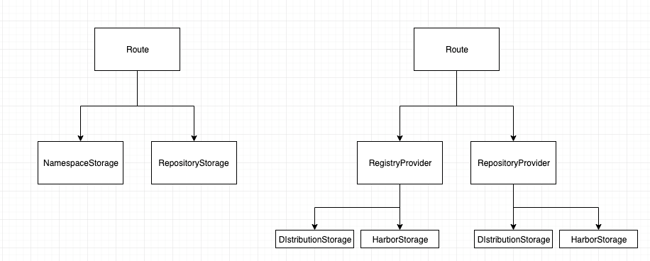
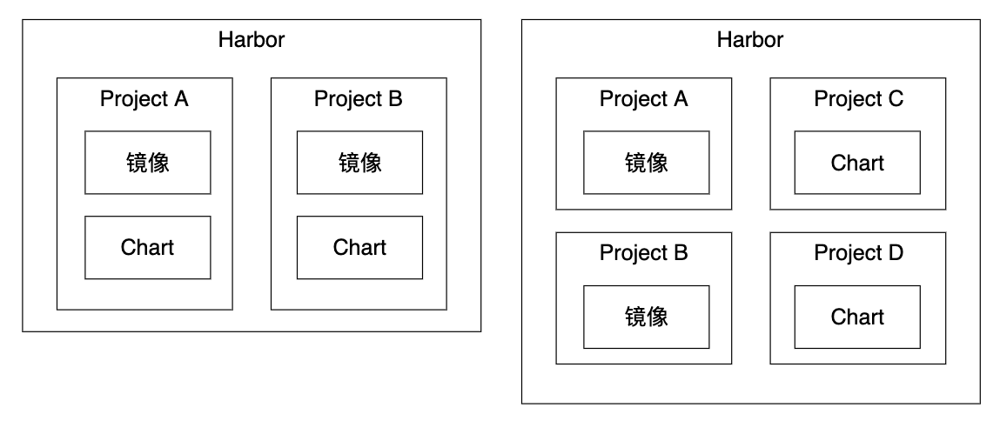

# Abstract


目前镜像仓库只有针对后端标准docker distribution的API，希望能同时支持Harbor的API


# Motivation


希望在兼容Registry Distribution的情况下，增加对Harbor的支持
尽量保持和distribution一样的字段和用法，屏蔽Harbor不一样的部分

主要功能实现分2期实现

第一期主要负责功能实现

- 对接已存在的Harbor，使用Harbor作为镜像仓库
- 使用Harbor作为Chart仓库
- 反向代理Habor上传下载镜像和Chart

第二期主要负责额外的功能

- 权限对接
- Harbor安装部署

关于升级：
目前不考虑升级的情况，如有升级的情况，将会额外提供人工步骤说明，大概流程如下
1，从Distribution版本升级到Harbor版本
2，提供脚本把镜像仓库，ChartGroup重新建立并把镜像和Chart重新推送到Harbor


# Main proposal


## Harbor介绍


Harbor是一个相对比较重的镜像仓库，主要包含 Proxy, Registry, CoreService, UI, JobServices, LogCollector, Database, AdminServer, Chartmeseum等组件

详细介绍可以查看官网

https://goharbor.io/docs/2.1.0/


和tke的distribution不一样，distribution 使用docker原生registry，相对简单，功能单一，可以集成到tke中，但harbor自身集成了大量功能，因此只建议API对接。

此次后端支持Harbor，计划支持Harbor最新稳定版 2.1

API 文档: https://raw.githubusercontent.com/goharbor/harbor/master/docs/prepare-swagger.sh https://raw.githubusercontent.com/goharbor/harbor/master/docs/swagger.yaml


## 第一期


#### 功能范围


包括

- 安装部署时候选择已有Harbor作为后端存储仓库

- 从API层面把原来路由镜像相关API到distribution改为Harbor

- 原来chartmeseum的部分改为Harbor存储chart的部分

  

不包括

- 安装部署时候自动安装Harbor在tke
- 权限认证暂时不对接tke-auth


也就是说，第一期仅涉及对接已存在的Harbor，并使用Harbor的存储能力，用于保存镜像和Charts。




#### 原来的镜像仓库和Chartmeseum


原来的镜像仓库和chartmeseum 逻辑保留，通过安装部署时候配置决定是否启用。

启用的时候会继续使用编译进tke的distribution并把所有需要的路由注册上。

未启用的时候不会注册路由


#### 接口路由修改


目前接口主要分为2类别

- 反向代理功能的，直接和Distribution和Chartmeseum连通的，例如推送镜像，拉取镜像，推送Chart，下载Chart等

- 命名空间，镜像管理，Chart管理，ChartGroup管理等，对镜像来说除去上条的如删除镜像，对Chart管理来说除去上条的如删除Chart。

  

对于第一条的接口，会新增一个Harbor的路由注册器，反向代理到Harbor中，新的上传下载镜像和Charts的接口和原来路由一致，不过后端存储会改为Harbor。

对于第二条的接口，会把原有的distribution逻辑抽出来，作为一个provider的子功能，然后加入Harbor的管理功能。主要功能包含

- 命名空间的增删改查
- 镜像删除，查询
- ChartGroup的增删改查
- Chart的删除和查询



#### 配置文件修改

对于tke-registry-api.toml 没变动
而对于tke-registry-config.yaml,需要增加3个字段，分别是url, username和password

```
tke-registry-api.toml: |
  registry_config = "/app/conf/tke-registry-config.yaml"
```


下面是暂定的tke-registry-config.yaml配置文件

```
tke-registry-config.yaml: |
  apiVersion: registry.config.tkestack.io/v1
  kind: RegistryConfiguration
  storage:
    fileSystem:
      rootDirectory: /storage
  security:
    tokenPrivateKeyFile: /etc/registry/private_key.pem
    tokenPublicKeyFile: /etc/registry/public_key.crt
    adminPassword: "{{ .AdminPassword }}"
    adminUsername: "{{ .AdminUsername }}"
    httpSecret: "{{ .AdminPassword }}"
  defaultTenant: default
  domainSuffix: "{{ .DomainSuffix }}"
  harborEnabled: true
  harborUrl: https://registry.tke.com

```


#### 权限对接



如上图所示，对于标准K8S API操作的管理接口(例如镜像仓库管理，ChartGroup管理)，自带对接tke-auth，但对于一些非标准K8S的接口，例如推拉镜像和Chart，则在第一期暂时不对接TKE-Auth，待第二期实现


#### 实现细节


在pkg/registry 下新增harbor代理，和distribution平级，用于反向代理harbor的上传镜像，拉取镜像，上传Chart，下载Chart 等逻辑

新增 pkg/registry/registry/harbornamespace，用于处理harbor下的逻辑

除了和已有distribution 类似的功能，还需要处理下面逻辑

- 新增资源同时在harbor新建project
- 删除资源同时在harbor删除project
- harbor增加repoType：person，project，system
- list registry时能够根据repoType 过滤
- Public 字段建议使用string类型：public、private
- ...




主要代码结构修改如上图，在路由和handler的Storage层中间，新增一层Provider用于选择哪个存储后端，后端的选择根据配置决定。


#### Helm Chart在Harbor中的存放


由于Harbor的Chart存放和镜像仓库存放在一起，例如：Harbor的标准使用方式是 Chart A 和 Project A 的镜像都放在同一个命名空间内，Chart B 和 Project B 的镜像放在同一个命名空间，这样删减比较统一。

但为了保持和TKE原来的使用方式一致，因此把Chart和镜像分别放在不同的project中，避免误操作，命名方式根据类型拆分


###### 命名方式

Harbor中Project名字通过组合方式生成， 租户Id + "类型" + 名字
例如: 
在界面创建一个叫test的镜像仓库，同时租户是default，则在Harbor中创建一个Project，名字为 default-image-test
在界面创建一个叫abc的Chart仓库，同时租户是default，则在Harbor中创建一个Project, 名字为 defaukt-chart-abc

在用户使用的时候，还是使用他创建的名字，例如为test或者abc，但经过tke-registry-api的时候会转换到正确名字

###### 镜像映射

对于镜像仓库的push和pull镜像操作，用户还是使用原来的名字，例如上面命名方式第一条 docker push default.registry.tke.com/test/nginx:latest 请求到达tke-registry-api的时候，会自动转换成
docker push default.registry.tke.com/default-image-test/nginx:latest


###### Chart仓库映射

对于Chart Cli使用的时候，Add repo和搜索Chart，也会进行自动转换映射
例如使用命令行 helm repo add hm-bus http://default.registry.tke.com/chart/hm-bus 则通过tke-registry-api后会转换地址为 helm repo add hm-bus http://default.registry.tke.com/chart/default-chart-hm-bus



#### 安装部署


安装部署界面选择Harbor，并输入已存在的Harbor的地址和初始化用户名密码，安装部署的时候，会渲染配置文件并应用到tke-registry-api中启用Harbor。


#### 使用方式


在使用上会保留原来使用的逻辑，用户除了安装部署的时候选择一个已存在的Harbor，安装完成后使用基本上无感知。

###### 创建仓库
和之前逻辑一致，创建命名空间的时候会对应在Harbor中创建一个Project，和原来逻辑一致。

###### 推送镜像
界面会有新的指引，第一期还不对接tke-auth，可以不登录推送，或者指定一个默认的Harbor用户名密码登录推送。和原来逻辑基本一致。


## 第二期


### 功能范围


包括

- harbor对接tke-auth进行权限认证
- 安装部署时候可以在界面选择通过tke安装一个全新harbor作为镜像仓库


其实1.0之前的tke也曾经部署过一个Harbor，如果通过tke安装一个全新Harbor作为后端存储，和之前基本上一样，通过模板在安装的时候把Harbor所有组件安装上。

Harbor组件独立给Harbor使用，不和其他组件混用，例如nginx。


#### 权限认证对接


Harbor 支持对接LDAP和OIDC，但目前tke-auth貌似没有这个功能(?)。

因此可以考虑在registry-api对接tke-auth，认证成功后放行到Harbor，Harbor方面采用无认证或者只用管理员账户的办法。

#### 安装步骤


安装部署界面选择安装Harbor，并输入初始化用户名密码，安装部署的时候，会在tke的命名空间下安装Harbor。

安装时候会新部署多个服务

- adminserver

- chartmuseum

- clair

- core

- jobservice

- portal

- registry

#### 存储方式

目前tke还暂时没有共享存储，因此先使用hostpath作为镜像存储，并把harbor节点固定在master0节点上


