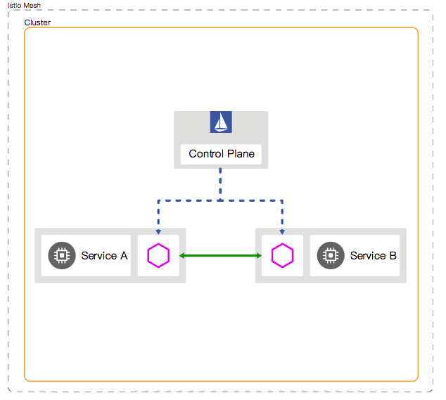
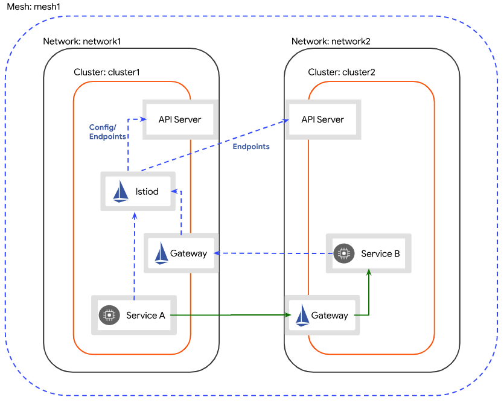
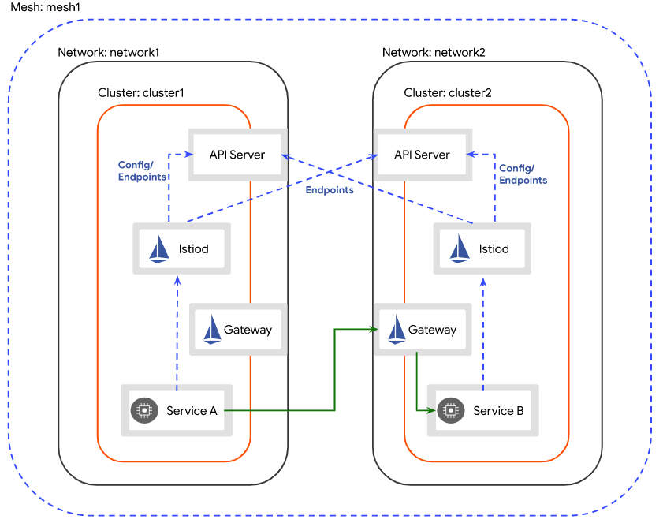
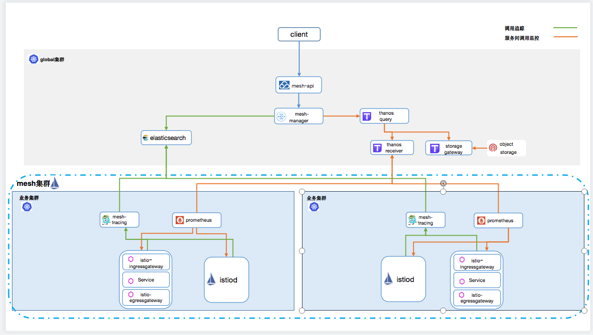
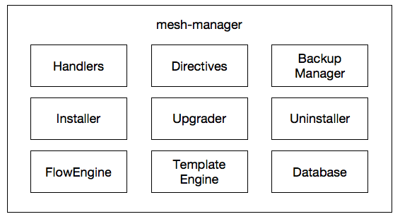
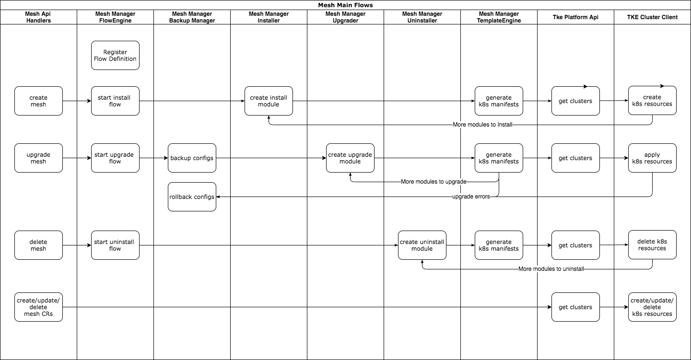

# Service mesh support

**Author**: chenhaihua ([@foshantiger](https://github.com/foshantiger))

**Status** (20201208): Designing

## Summary

应用从单体架构转换到微服务架构后，应用被拆分成多个服务，给服务管理带来更多的挑战，虽然K8S可以大大简化服务的注册发现、部署、编排和运维，但是对于微服务的其他治理能力：如流量切换、超时、故障注入、限流、熔断、服务认证、调用链跟踪等，k8s却无法满足，而服务网格（ServiceMesh）正是解决这一问题的良好实践，因此，本议案将在TKEStack中集成基于Istio框架的服务网格能力。

## Background

服务网格( Service Mesh )是指用于微服务应用的可配置基础架构层( configurable infrastructure layer )。它使每个服务实例之间的通信更加流畅、可靠和迅速。服务网格提供了诸如服务发现、负载均衡、加密、身份鉴定、授权、支持熔断器模式以及其他一系列功能。
服务网格的实现通常是提供一个代理实例，我们称之为"sidecar"。sidecar 包含在每一个service 之中。sidecar 主要处理服务间的通信、监控、以及一些安全相关的考量 —— 任何可以从服务本体中抽象出来的安全方面的部分。通过这种方式，开发者可以在服务中专注于开发、支持以及维护；运维人员可以维护服务网格并运行应用。Istio 是一个由Google，IBM和Lyft团队合作开发的开源服务网格平台，它可以控制微服务之间数据的共享方式。 其附带的API 可以将Istio 集成到任何日志记录平台、遥测或策略系统中。 在设计上，Istio 可以在多种环境中运行：企业本地、云托管、Kubernetes容器，或虚拟机上运行的服务等， Istio 的架构分为数据平面和控制平面两部分。

## Motivation

- mesh集群生命周期管理
  - mesh集群增、删、改、查
  - mesh集群升级、回滚
- mesh服务治理
  - 服务路由（VirtualService）管理
  - 服务版本（DestinationRule）管理
  - 网关（Gateway）管理
  - 外部服务（ServiceEntry）管理
- mesh组件管理
  - 组件监控
  - 组件扩缩容
- 服务监控
  - 服务调用监控：请求数、请求耗时、请求大小、接收大小、TCP请求大小、TCP接收大小
  - 服务拓扑
  - 服务调用链跟踪
  - 调用链采样率调整

## Main proposal

### mesh集群部署模式

Mesh集群：纳入在同一个mesh治理域的所有k8s集群的集合；

单控制平面：指的是同一个mesh集群中，只有一个istiod用于服务治理信息的管理；

多控制平面：指的是同一个mesh集群中，由多个istiod共同作用（一般是每个k8s集群一个），用于服务的治理信息的管理；多个istiod会互相连接各自k8s集群的apiserver去获取服务注册信息；

#### 单集群模式



#### 多集群多网络共享控制平面模式



#### 多集群多网络多控制平面模式



### mesh监控架构



### mesh部署组件

- global集群：
  - tke-mesh-api：提供mesh模块API接口，负责服务治理信息等下发；同时，还会代理mesh集群生命周期管理接口到mesh-manager；该组件随tkestack代码部署（可选）；

  - tke-mesh-controller:  mesh控制器，维护了MeshManager CRD，用于生成mesh-manager对象；该组件随tkestack代码部署（可选）；

  - mesh-manager：负责mesh集群生命周期管理、监控数据收集等功能；

 通过定义以下CR，可以在global集群部署mesh-manager组件:

```yaml
apiVersion: mesh.tkestack.io/v1
kind: MeshManager
metadata:
  name: mesh-manager
spec:
  clusterName: global
  tenantID: default
  version: v1.0.0
  dataBase:      # mesh-manager所依赖的数据库配置
    host: 127.0.0.1
    port: 3306
    userName: root
    password: ******
    dbName: tke_mesh
  tracingStorageBackend: # 调用跟踪存储配置
    storageType: es
    storageAddresses:
    - http://127.0.0.1:9200
    userName: username
    password: password
  metricStorageBackend: # 服务调用指标和istio组件指标存储配置
    storageType: thanos
    storageAddresses:
    - http://127.0.0.1:19291
    queryAddress: http://127.0.0.1:9090
```

- 用户集群：用户集群的组件由mesh-manager负责部署，会根据用户选择的mesh部署模式不同而有所差异，主要组件如下：：
  - istiod：mesh控制平面
  - istio-ingressgateway：mesh入口网关
  - istio-egressgateway：mesh出口网关
  - inner-multi-cluster-gateway: 东西向网关，用于多集群之间流量通讯
  - mesh-tracing-plugin：基于Jaeger调用链跟踪的指标收集插件

### mesh-manager架构



### mesh集群管理主流程：



### 第三方组件依赖

- mariadb：用于mesh元数据存储，可选用部署集成的mariadb或外部(建议)的mariadb/mysql
- elasticsearch：用于调用链跟踪数据的查询和存储
- prometheus：用于mesh监控数据的采集，目前基于tkestack平台的prometheus operator管理
- thanos: 用于监控数据的长期存储，tkestack目前虽然已支持thanos的监控存储方式，但是目前还没有整合部署，用户需要自行部署该组件。

### Mesh API请求示例：

mesh-api路由已整合进tke-gateway，前端可直接通过网关地址调用：

```shell
# 获取支持的istio版本
# curl -X GET \
  https://tke-gateway:9441/apis/v1/mesh/config/istioversions \
  -H 'Cookie: tke=TKE-TOKEN' \
# {"result": true,"data": ["1.5.6","1.6.6"]}
```

### 建表脚本

```
create database if not exists tke_mesh charset = utf8mb4;

use tke_mesh;

CREATE TABLE IF NOT EXISTS `flow`
(
    `id`  BIGINT(11)  NOT NULL AUTO_INCREMENT,
    `tenant_id` varchar(255) NOT NULL,
    `mesh_name` varchar(255) NOT NULL,
    `name` varchar(255) NOT NULL,
    `def_name` varchar(255) NOT NULL,
    `status` varchar(255) NOT NULL DEFAULT '',
    `input` text NOT NULL,
    `log` text NULL,
    `started_at` timestamp NULL DEFAULT NULL,
    `finished_at` timestamp NULL DEFAULT NULL,
    `processor` varchar(255) NOT NULL DEFAULT '',
    `heartbeat` timestamp NULL DEFAULT NULL,
    `created_at` timestamp DEFAULT now(),
    `updated_at` TIMESTAMP DEFAULT now() ON UPDATE now(),
    PRIMARY KEY (`id`)
) ENGINE = InnoDB
  AUTO_INCREMENT = 1
  DEFAULT CHARSET = utf8mb4;

CREATE TABLE IF NOT EXISTS `task`
(
    `id`  BIGINT(11)  NOT NULL AUTO_INCREMENT,
    `flow_id` bigint(20) NOT NULL,
    `name` varchar(255) NOT NULL,
    `status` varchar(255) NOT NULL DEFAULT '',
    `output` text NULL,
    `error` text NULL,
    `steps` varchar(2048) NOT NULL DEFAULT '',
    `log` text NULL,
    `started_at` timestamp NULL DEFAULT NULL,
    `finished_at` timestamp NULL DEFAULT NULL,
    `created_at` timestamp DEFAULT now(),
    `updated_at` TIMESTAMP DEFAULT now() ON UPDATE now(),
    PRIMARY KEY (`id`)
) ENGINE = InnoDB
  AUTO_INCREMENT = 1
  DEFAULT CHARSET = utf8mb4;

CREATE TABLE IF NOT EXISTS `mesh`
(
    `id` BIGINT(11)  NOT NULL AUTO_INCREMENT,
    `tenant_id` varchar(255) NOT NULL,
    `name` varchar(64) NOT NULL,
    `region` varchar(64) NOT NULL,
    `title` varchar(255) NOT NULL,
    `status` varchar(255) NOT NULL,
    `version` varchar(64) NOT NULL,
    `last_version` varchar(64) NOT NULL DEFAULT '',
    `config` varchar(10000) NOT NULL,
    `deleted_flag` bigint(20) NOT NULL DEFAULT 0,
    `deleted_at` timestamp NULL DEFAULT NULL,
    `created_at` timestamp DEFAULT now(),
    `updated_at` TIMESTAMP DEFAULT now() ON UPDATE now(),
    PRIMARY KEY (`id`),
    UNIQUE KEY `idx_name_deleted_flag` (`name`,`deleted_flag`)
) ENGINE = InnoDB
  AUTO_INCREMENT = 1
  DEFAULT CHARSET = utf8mb4;

CREATE TABLE IF NOT EXISTS `cluster`
(
    `id` BIGINT(11)  NOT NULL AUTO_INCREMENT,
    `name` varchar(64) NOT NULL,
    `region` varchar(64) NOT NULL,
    `mesh_name` varchar(64) NOT NULL,
    `role` varchar(64) NOT NULL DEFAULT 'master',
    `deleted_flag` bigint(20) NOT NULL DEFAULT 0,
    `deleted_at` timestamp NULL DEFAULT NULL,
    `created_at` timestamp DEFAULT now(),
    `updated_at` TIMESTAMP DEFAULT now() ON UPDATE now(),
    PRIMARY KEY (`id`),
    UNIQUE KEY `idx_name_deleted_flag` (`name`,`deleted_flag`)
) ENGINE = InnoDB
  AUTO_INCREMENT = 1
  DEFAULT CHARSET = utf8mb4;

CREATE TABLE IF NOT EXISTS `lb_resource`
(
    `id` BIGINT(11)  NOT NULL AUTO_INCREMENT,
    `name` varchar(64) NOT NULL,
    `mesh_name` varchar(32) NOT NULL,
    `status` varchar(32) NOT NULL DEFAULT '',
    PRIMARY KEY (`id`),
    UNIQUE KEY `uni_idx_key` (`name`)
) ENGINE = InnoDB
  AUTO_INCREMENT = 1
  DEFAULT CHARSET = utf8mb4;

ALTER TABLE mesh ADD COLUMN state text NULL;
ALTER TABLE mesh ADD COLUMN mode varchar(32) NOT NULL DEFAULT '';
ALTER TABLE cluster ADD COLUMN phase varchar(32) NOT NULL DEFAULT ''; /* todo 上线更新数据库*/
ALTER TABLE mesh ADD COLUMN tasks text NULL;
ALTER TABLE mesh MODIFY COLUMN config text;
/*ALTER TABLE mesh ADD COLUMN events text NULL;*/
ALTER TABLE cluster ADD COLUMN linked_at timestamp NULL DEFAULT NULL;
ALTER TABLE cluster ADD COLUMN error varchar(2048) NOT NULL DEFAULT '';

CREATE TABLE IF NOT EXISTS `mesh_events`
(
    `id` BIGINT(11)  NOT NULL AUTO_INCREMENT,
    `name` varchar(64) NOT NULL,
    `events` text NULL,
    PRIMARY KEY (`id`),
    UNIQUE KEY `idx_name` (`name`)
) ENGINE = InnoDB
  AUTO_INCREMENT = 1
  DEFAULT CHARSET = utf8mb4;
```

## Limition

1. 目前仅测试了多网络模式，单网络模式理论上也可支持，但需平台网络实现支持，实现集群之间网络在同一平面互通；
2. 服务如果要跨集群部署，需要在各集群都生成该服务的K8S Service以用于域名解释（但可以不部署该服务对应的负载）。istio1.8版本以后增加了智能dns代理，可免除该限制，不过该功能还在beta阶段[3]。

## Reference
[1] https://buoyant.io/2020/10/12/what-is-a-service-mesh/
[2] https://istio.io/latest/docs/ops/deployment/deployment-models/
[3] https://istio.io/latest/blog/2020/dns-proxy/
