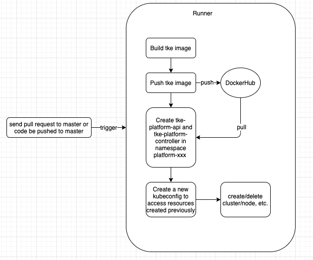
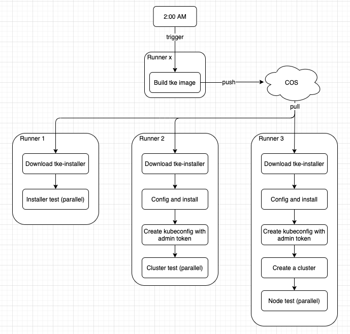

# Smoke Test and Release Test

**Author**: yongfeijia (@[yongfeijia](https://github.com/JiaYongfei))

**Status** (20201020): In development

## Abstract

项目平均3个月发布一次大版本，1个月发布一次bug fix版本，平均每天3-5次代码PR。需要提供完善的自动化测试机制，以保证发布的版本的质量。

## Motivation

提供基于云原生的，简单易用，统一高效的，社区用户可参与的，与开发流程紧密结合的自动化测试系统，并通过Smoke Test和Release Test来保证版本质量。

## Smoke Test

每次pr或commit时执行，检查关键功能是否正确，执行时间控制在30分钟内。

### 执行流程图



### 如何在本地执行自动化测试

1. 准备一台CVM
2. 在CVM上安装tkestack - [安装步骤](https://tkestack.github.io/docs/zh/%E4%BA%A7%E5%93%81%E9%83%A8%E7%BD%B2%E6%8C%87%E5%8D%97/%E5%AE%89%E8%A3%85%E6%AD%A5%E9%AA%A4.html)
3. 本地下载tkestack代码`git clone https://github.com/tkestack/tke.git`
4. 本地创建配置文件`vi $HOME/tke.env`，内容如下所示

    ```
    # tke.env配置文件 
    
    # tke-platform-api和tke-platform-controller的镜像版本
    VERSION: xxxxxx
    # 用例执行中创建节点的登录密码
    PASSWORD: xxxxxx
    # 对tkestack global集群的kubeconfig进行base64编码结果。注意：如果仅提供内网访问，则要保证本地机器与global集群节点属于同一内网
    KUBECONFIG: xxxxxx
    # provider-res的镜像版本
    PROVIDERRESVERSION: v1.xx.x-x
    # 用例执行结束后是否要删除CVM
    NEED_DELETE: true
    # 创建CVM的账号对应的secret_id
    SECRET_ID: xxxxxx
    # 创建CVM的账号对应的secret_key
    SECRET_KEY: xxxxxx
    # 创建的CVM所在区域
    REGION: ap-xxxxxx
    # 创建CVM所需的一些参数，注意：Zone需要和已有配置REGION一致；subnetId需要和global集群节点同一子网；Password需要和已有配置PASSWORD相同
    CREATE_INSTANCES_PARAM: {"Placement":{"Zone":"ap-xxxxxx-1"},"ImageId":"img-xxxxxx","InstanceChargeType":"POSTPAID_BY_HOUR","InstanceType":"xxxxxx","SystemDisk":{"DiskType":"CLOUD_PREMIUM"},"VirtualPrivateCloud":{"VpcId":"vpc-xxxxxx","SubnetId":"subnet-xxxxxx"},"InternetAccessible":{"InternetMaxBandwidthOut":1,"PublicIpAssigned":true},"InstanceName":"platformtest","LoginSettings":{"Password":"xxxxxx"}}
    ```
5. 跳转至测试文件目录，如：`<代码根目录>/tke/test/e2e/platform`
6. 执行`ginkgo` （[The Ginkgo CLI](http://onsi.github.io/ginkgo/#the-ginkgo-cli) ）

### Smoke Test Cases

用例路径：tke/test/e2e/platform/

#### 1. 创建Baremetal独立集群

目标：验证创建独立集群功能正常

步骤：

1. 申请创建cvm，准备2master，1worker节点，规格4C8G，操作系统：CentOS，Ubuntu，tLinux
2. 调用接口创建独立集群，等待集群创建成功

期望：

1. 检查集群状态正常，检查cluster接口返回正确的参数
2. 获取集群凭证，通过Kubectl 检查K8s集群工作正常

#### 2. 为群添加节点

目标：验证节点管理功能正常

步骤：

1. 申请创建cvm，准备1worker节点，规格1C2G
2. 调用接口为集群添加该节点，等等节点添加成功

期望：

1. 检查节点列表返回正常，检查节点被正确添加
2. 获取集群凭证，通过Kubectl 检查K8s下节点正常

#### 3. 节点驱逐，标签，封锁功能

目标：验证节点驱逐，标签，封锁功能正常

步骤：

1. 对worker节点添加标签，检查返回
2. 对worker节点封锁，检查返回
3. 对worker节点驱逐，检查返回

期望：

1. 检查节点返回信息正确
2. 通过Kubectl检查K8s下节点信息正确


#### 4. 为集群删除节点

目标：验证节点删除功能正常

步骤：

1. 调用接口为集群删除该节点

期望：

1. 检查节点列表返回正常，检查节点被正确删除
2. 通过Kubectl 检查K8s下节点被删除


#### 5. 删除Baremetal独立集群

目标：验证删除独立集群功能正常

步骤：

1. 保存集群访问凭证
2. 调用接口删除独立集群，等待集群删除成功

期望：

1. 查询cluster接口，检查集群被正确删除
2. 利用保存的访问凭证，通过Kubectl 检查K8s集群仍工作正常


#### 6. 导入Import集群

目标：验证导入集群功能正常

步骤：

1. 利用保存的访问凭证，调用接口导入集群，等待集群导入成功

期望：

1. 检查集群状态正常，检查cluster接口返回正确的参数
2. 获取集群凭证，通过Kubectl 检查K8s集群工作正常


#### 7. 为集群开启扩展组件

目标：验证扩展组件addon功能正常

步骤：

1. 调用addon接口，开启tapp，等待返回正确状态
2. 开启IPAM，等待返回正确状态
3. 开启CronHPA，等待返回正确状态
4. 开启Prometheus扩展组件，等待返回正确状态

期望：

1. 检查各个addon组件返回正确信息
2. 通过Kubectl 检查K8s集群下所有 pod 工作正常

## Release Test

每晚定时在release build后执行，验证通过tke-installer安装部署集群及更多组件功能，时间控制在4小时内。

### 执行流程图



### 如何在本地执行自动化测试

1. 本地下载tkestack代码`git clone https://github.com/tkestack/tke.git`
2. 本地创建配置文件`vi $HOME/tke.env`，内容如下所示

    ```
    # tke.env配置文件 
    
    # tke-installer的镜像版本
    VERSION: xxxxxx
    # 用例执行中创建节点的登录密码
    PASSWORD: xxxxxx
    # 用例执行结束后是否要删除CVM
    NEED_DELETE: true
    # 创建CVM的账号对应的secret_id
    SECRET_ID: xxxxxx
    # 创建CVM的账号对应的secret_key
    SECRET_KEY: xxxxxx
    # 创建的CVM所在区域
    REGION: ap-xxxxxx
    # 创建CVM所需的一些参数，注意：Zone需要和已有配置REGION一致；subnetId需要和global集群节点同一子网；Password需要和已有配置PASSWORD相同
    CREATE_INSTANCES_PARAM: {"Placement":{"Zone":"ap-xxxxxx-1"},"ImageId":"img-xxxxxx","InstanceChargeType":"POSTPAID_BY_HOUR","InstanceType":"xxxxxx","SystemDisk":{"DiskType":"CLOUD_PREMIUM"},"VirtualPrivateCloud":{"VpcId":"vpc-xxxxxx","SubnetId":"subnet-xxxxxx"},"InternetAccessible":{"InternetMaxBandwidthOut":1,"PublicIpAssigned":true},"InstanceName":"platformtest","LoginSettings":{"Password":"xxxxxx"}}
    ```
5. 跳转至测试文件目录，如：`<代码根目录>/tke/test/e2e-installer/cluster`
6. 执行`ginkgo` （[The Ginkgo CLI](http://onsi.github.io/ginkgo/#the-ginkgo-cli) ）

### Release Test Cases

用例路径：tke/test/e2e-installer/

#### 0. 包括所欲smoke test测试用例

#### 1. tke-installer 最小化安装

目标：验证最小化安装tkestack平台功能正常

步骤：

1. 准备CVM及VIP等相关资源，获取tke-installer安装包
2. 调用接口创建TKEStack集群，关闭所有组件，等待TKEStack创建成功

期望：

1. 检查TKEStack状态正常，检查TKEStack接口返回正确的参数


#### 2. tke-installer 默认安装

目标：验证完整安装tkestack平台功能正常

步骤：

1. 准备CVM及VIP等相关资源，获取tke-installer安装包
2. 调用接口创建TKEStack集群，等待TKEStack创建成功

期望：

1. 检查TKEStack状态正常，检查TKEStack接口返回正确的参数


#### 3. 登录并访问 TKEStack平台

目标：验证登录tkestack平台正常

步骤：

1. 登录TKEStack平台，获取相应token
2. 使用api 方式获取平台相应信息

期望：

1. 登录TKEStack正常，TKEStack接口返回正确的参数
2. 使用api 方式访问正常，能够获取正确的信息

#### 4. k8s集群升级

目标：验证k8s集群升级功能正常

步骤：

1. 调用接口升级k8s集群，等待k8s集群升级成功

期望：

1. 检查集群状态正常，检查cluster接口返回正确的参数
2. 获取集群凭证，通过Kubectl 检查K8s集群工作正常

#### 5. k8s集群扩缩容

目标：验证k8s集群扩缩master节点功能正常

步骤：

1. 调用接口为集群添加master节点，等待节点添加成功
2. 调用接口为集群移出master节点，等待节点移出成功

期望：

1. 检查集群状态正常，检查cluster接口返回正确的参数
2. 获取集群凭证，通过Kubectl 检查K8s集群工作正常
3. 查看master节点数量正确

## 如何进行失败用例分析

- Github Actions下提供详细的自动化用例执行日志
- 登录执行机通过`kubectl`进行分析（需要执行机登录信息及`KUBECONFIG`配置，仅部分人有权限操作）
- 本地调试（需要本地搭建环境，参考[本地执行自动化测试](#如何在本地执行自动化测试)）

## 常见问题

- 如何过滤用例：`ginkgo -skip=REGEXP -focus=REGEXP` （[The Ginkgo CLI](http://onsi.github.io/ginkgo/#the-ginkgo-cli) ）
- 用例执行完如何保留CVM：配置`NEED_DELETE`设置为空
- 用例执行超时CVM是否会删除：不会，需要手动删除
- 如何手动删除CVM：登录到腾讯云控制台，搜索`CREATE_INSTANCES_PARAM`中配置`InstanceName`的值(`platformtest`)进行过滤删除，也可以通过`所属项目`（`tkeci`）进行过滤删除
- 测试用例是否支持并行执行：支持