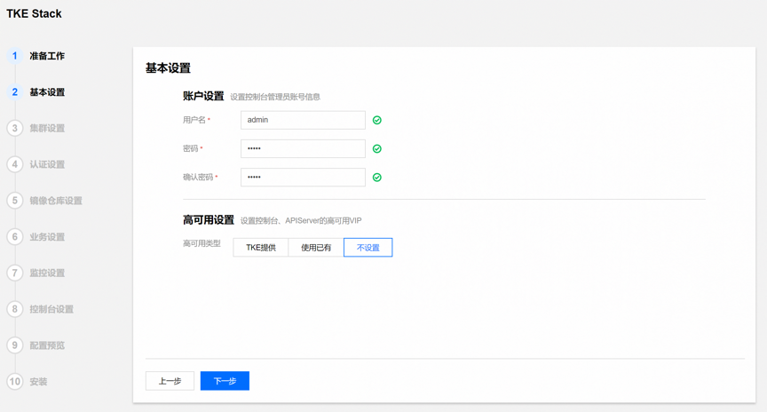
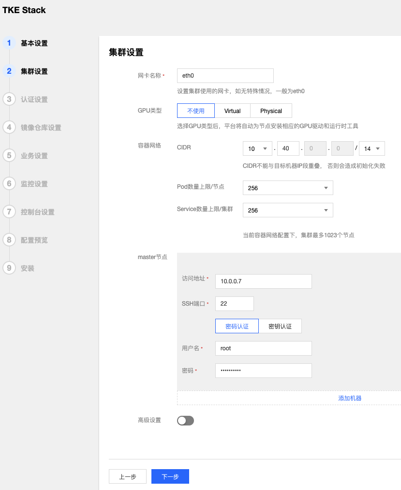
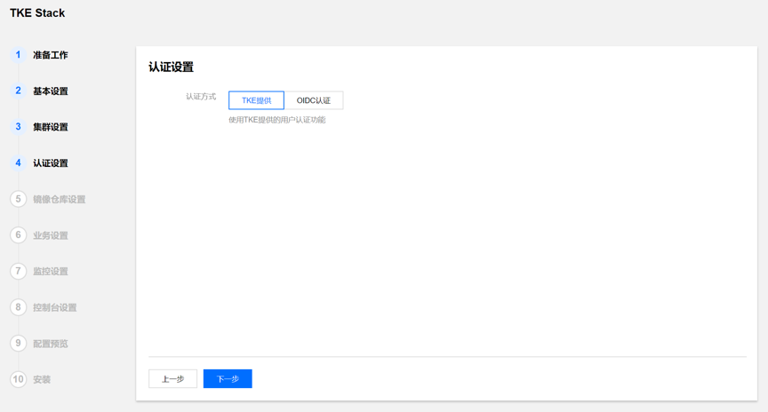
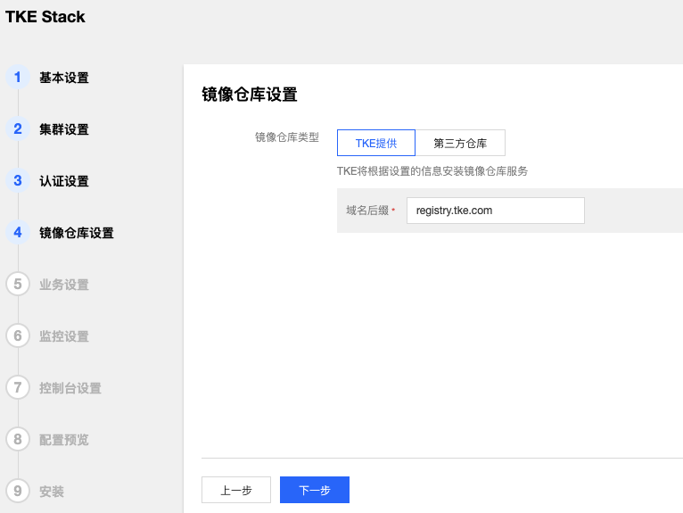
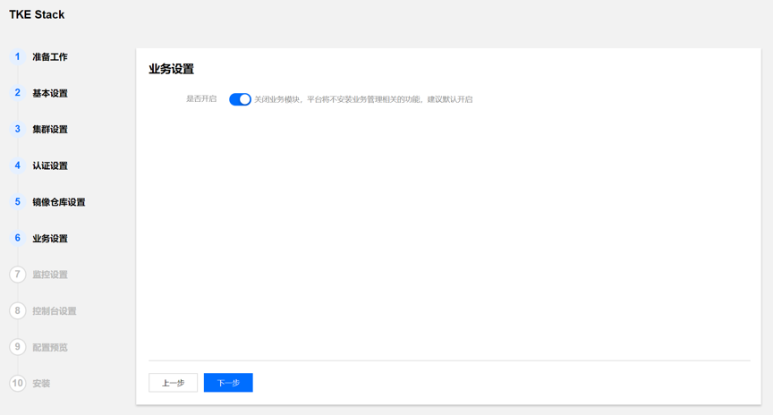
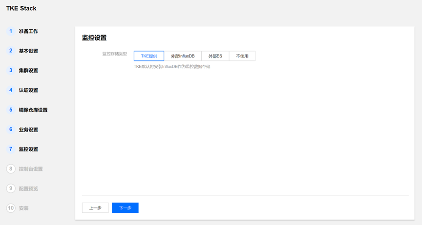
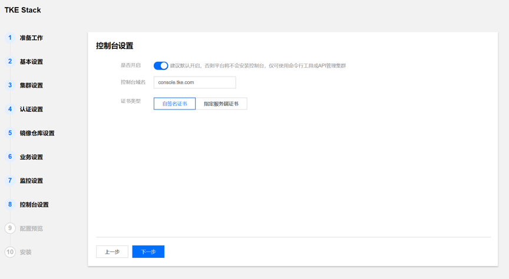
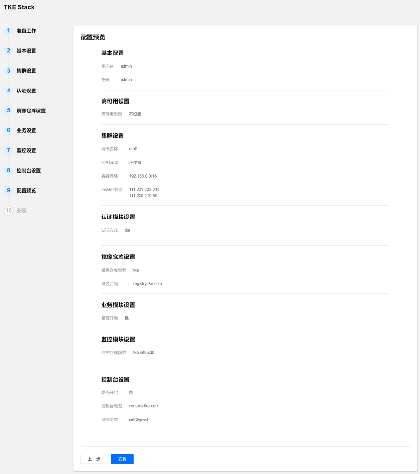
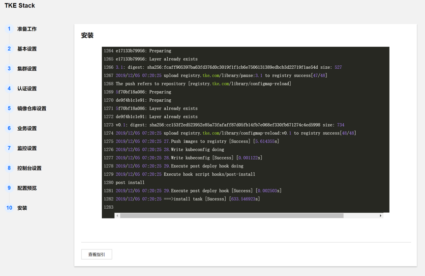

# Install TKEStack

The easiest way to get started with TKEStack is via tke-installer.

The tke-installer tool contains all resources required by the installation, provide a Web GUI to guide customer installing TKEStack.

## Architecture

* Installer -  the tke-installer tool is on this node, provide a Web GUI to guide customer installing global cluster
* Global -  a k8s cluster which is used to deploy TKEStack console and components
* Cluster -  customer cluster, it can be created or imported through TKEStack console

## Prerequisites

The hardware requirements for nodes mostly depend on your workloads, the minimum to run the global cluster node is:

* Hardware
  * 8 vCPU
  * 16 GB of Memory

> Note: Installer node need extra 20GB disk to store images and temporary files.

TKEStack is tested on the following operating system:

* Operating Systems
  * Ubuntu 16.04 (64-bit)
  * CentOS Linux 7.5 (64-bit)

## Installing tke-installer

First Log in to your Linux host and install tke-installer via this command:

    version=v1.0.0 && wget https://tke-release-1251707795.cos.ap-guangzhou.myqcloud.com/tke-installer-x86_64-$version.run{,.sha256} && sha256sum --check --status tke-installer-x86_64-$version.run.sha256 && chmod +x tke-installer-x86_64-$version.run && ./tke-installer-x86_64-$version.run

> Note: this command can be found at [TKEStack Release](https://github.com/tkestack/tke/releases)
>
> Note: tke-installer is about 3GB, contains all resources required by the installation, TKEStack will be installed offline, behind a firewall or behind a proxy.

## Starting the installation

Open your browser to http://`INSTALLER-NODE-IP`:8080/index.html, the Web GUI will guide you to initialize and install the TKEStack.
  
1. Set the account information and HA VIP
  
   
  
2. Configure the global cluster, set cluster's nic, GPU type and container network, specify the master node information，advance option enable you to set customized parameters

   
  
3. Set authentication information

   
  
4. Specify the image registry, TKEStack will deploy a local registry by default

   
  
5. Business setting，default is on

   
  
6. Monitor settings，TKE will install an influxDB as the monitor data's storage, or specify the influxDB address and ES address, or disable the monitor
  
   
  
7. Console settings, if enabled, specify the console page's address and certificate
  
   
  
8. Preview all the configuration, if no problem, click `install` to start, next page will show the install logs in real time
   
   
   

## Using TKEStack

After the installation is completed, you will receive a `===>install task [Success]` message, click the `Guidance` button to check the TKEStack console address, open a browser to access.
   
   

The login username and password are specified in previous installation step:

  * ***Username***: admin
  * ***Password***: secret
