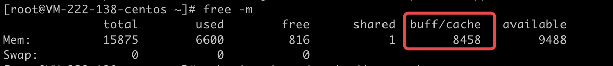

## Back-off restarting failed docker container

说明：正在重启异常的 Docker 容器。
解决方法：检查镜像中执行的 Docker 进程是否异常退出，若镜像内并无一持续运行的进程，可在创建服务的页面中添加执行脚本。

## fit failure on node: Insufficient cpu

说明：集群 CPU 不足。
解决方法：原因是节点无法提供足够的计算核心，请在服务页面修改 CPU 限制或者对集群进行扩容。

## no nodes available to schedule pods

说明：集群资源不足。
解决方法：原因是没有足够的节点用于承载实例，请在服务页面修改服务的实例数量，修改实例数量或者 CPU 限制。

## pod failed to fit in any node

说明：没有合适的节点可供实例使用。
解决方法：原因是服务配置了不合适的资源限制，导致没有合适的节点用于承载实例，请在服务页面修改服务的实例数量或者 CPU 限制。

## Liveness probe failed

说明：容器健康检查失败。
解决方法：检查镜像内容器进程是否正常，检查检测端口是否配置正确。

## Error syncing pod, skipping 

`Error syncing pod, skipping failed to "StartContainer" for with CrashLoopBackOff: "Back-off 5m0s restarting failed container`
说明：容器进程崩溃或退出。
解决方法：检查容器内是否有持续运行的前台进程，若有检查其是否有异常行为。详情请参考 [如何构建Docker 镜像](../../QuickStart/examples/如何构建Docker镜像.md)。


## The node was low on resource: memory

说明：当前集群内存不足
一般是因为集群配置过低或者是负载过多造成的，需要添加节点或者删除部分负载。

此外还有一种可能，节点的缓存过多：

此时推荐使用清除缓存的命令：

```shell
# 查看集群节点 CPU 和内存使用情况
[root@VM-222-138-centos ~]# kubectl top nodes
NAME           CPU(cores)   CPU%   MEMORY(bytes)   MEMORY%
10.0.222.138   401m         5%     15774Mi         106%
10.0.222.139   896m         11%    11312Mi         76%
10.0.222.81    564m         7%     15393Mi         104%

# 在其中一台节点10.0.222.138里查看内存使用情况，发现有8个G的缓存
[root@VM-222-138-centos ~]# free -m
              total        used        free      shared  buff/cache   available
Mem:          15875        6601        5018           1        4255        9486

# 使用缓存清除命令
[root@VM-222-138-centos ~]# echo 1 > /proc/sys/vm/drop_caches
[root@VM-222-138-centos ~]# echo 2 > /proc/sys/vm/drop_caches
[root@VM-222-138-centos ~]# echo 3 > /proc/sys/vm/drop_caches

# 清除缓存后发现其内存使用量从106%下降到了13%
[root@VM-222-138-centos ~]#  kubectl top nodes
NAME           CPU(cores)   CPU%   MEMORY(bytes)   MEMORY%
10.0.222.138   319m         4%     2015Mi          13%
10.0.222.139   840m         10%    11322Mi         76%
10.0.222.81    636m         8%     15410Mi         104%

# 重复以上步骤，可以清除其它节点的缓存
[root@VM-222-139-centos kubernetes]# kubectl top nodes
NAME           CPU(cores)   CPU%   MEMORY(bytes)   MEMORY%
10.0.222.138   425m         5%     2131Mi          14%
10.0.222.139   852m         10%    3330Mi          22%
10.0.222.81    351m         4%     2486Mi          16%
```
