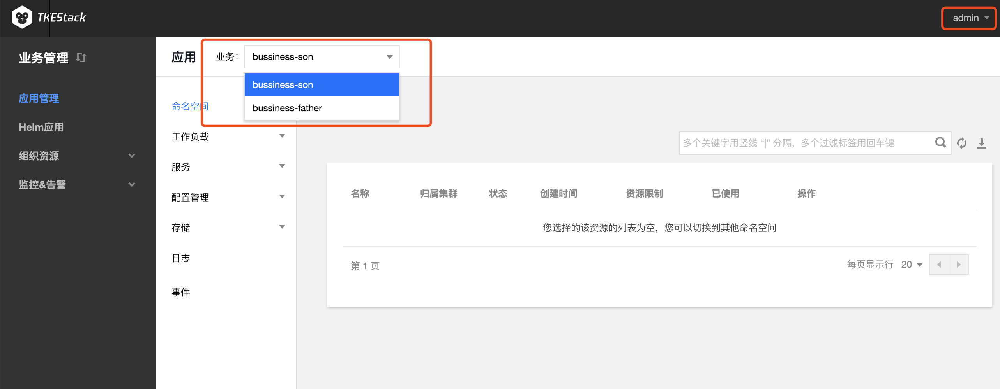

# 平台使用常见问题

**此处为平台使用常见问题，在使用 TKEStack 过程中，欢迎在 [issue](https://github.com/tkestack/tke/issues/new/choose) 上提出自己的问题，最好配上相关的信息和截图，以便我们更好定位问题所在，每个 [issue](https://github.com/tkestack/tke/issues) 我们都会认真对待。**

## APIServer 的 Real 和 Advertise


**Real**：表示 Master 节点 APIServer

**Advertise**：表示高可用 VIP 的 APIServer、或者是各大云厂商托管集群的 APIServer 地址

## global 集群没出现


参考：清除浏览器缓存

## field is immuable


参考：表示已有同名对象，例如已有同名 Service，需要手动删除 Service，或者换个名字

## 控制台无法编辑节点 Taint

在部署负载时，有时会出现下图中的事件，表示节点被 Taint


原因：Master 默认带污点，但我如果只想用一个节点时，调度 Pod 需要去除 Master 污点，但在控制台上没办法删掉，只能在命令行删除

目的：这个 API 支持，前端页面暂时没开放。主要考虑到后续的风险，最好是让用户自己来命令行配置

```shell
kubectl get node
kubetctl edit node <nodename>
```


## 镜像仓库镜像上传问题

```shell
WARNING! Using --password via the CLI is insecure. Use --password-stdin.
Error response from daemon: Get https://defult.registry.tke.com/v2/: dial tcp: lookup defult.registry.tke.com on 183.60.83.19:53: no such host
```

很可能是因为 Registry container 没有启动


docker ps


## 事件持久化插件无法点击完成来添加


原因：在页面下方要添加用于持久化的 ES 地址和索引

> 注意：当前只支持未开启 用户登录认证 的 ES 集群


## 业务管理界面没有想要的业务

因为在平台管理界面，该业务并没有被分配到当前用户。

例如当前用户 admin，在业务管理界面就无法显示 business-limitson 该业务




## 业务的 NS 只能选择一个集群

业务下的每个命名空间只能选取一个集群，因为是在这个集群下面新建的这个命名空间


## 数据卷 以主机路径为例

主机路径为节点上的一个地址

> 注意：主机路径指的是 Pod 所在主机的路径


下图2和3中的 testv 相当于一个标签，用于指定不同的挂载类型，本例为主机路径

4中的目录为容器中的目录，会在容器的根目录中创建一个 `hahaha` 的文件夹

最后一个框为路径`/hahaha`下面的路径,可不填


使用数据卷的效果：主机上的主机路径和容器上的`hahaha`文件夹中的内容完全一致

## kube-state-metrics 和 metric-server 的区别

### metric-server

TKEStack 的 Global 集群和新建的独立集群会默认安装名为 [metric-server](https://github.com/kubernetes-sigs/metrics-server) 的负载，是一个容器资源监控和性能分析工具。只是显示数据，并不提供数据存储服务，类似 [cAdvisor](https://github.com/google/cadvisor)（默认集成在 kubelet 中）、heapster（已被 metric-server 替代），可以利用 metric-server 提供的数据实现 [HPA](../../products/business-control-pannel/application/autoscale/HPA.md)


### kube-state-metrics

使用 TKEStack 为集群安装 [Prometheus](../../../../../hack/addon/readme/Prometheus.md) 监控组件时会安装名为 [kube-state-metrics](https://github.com/kubernetes/kube-state-metrics) 的负载，用于为 Prometheus 提供监控数据。kube-state-metrics 基于 client-go 开发的服务，监听 Kubernetes APIServer，并将 Kubernetes 的结构化信息转换为 metrics，它不关注单个 Kubernetes 组件的运行状况，而是关注内部各种对象（例如 Deployment、Node、Pod）的运行状况。

 kube-state-metrics 和 metric-server 一样，只是简单提供一个 metrics 数据，并不会存储这些指标数据，所以我们可以使用 Prometheus 来抓取这些数据然后存储

kube-state-metrics-service.yaml 中有 prometheus.io/scrape: 'true' 标识，因此会将 metrics 暴露给Prometheus，而 Prometheus 会在 kubernetes-service-endpoints 这个 job 下自动发现 kube-state-metrics，并开始拉取 metrics，无需其他配置。

使用 kube-state-metrics 后的常用场景有：

* 存在执行失败的 Job: kube_job_status_failed{job="kubernetes-service-endpoints",k8s_app="kube-state-metrics"}==1
* 集群节点状态错误: kube_node_status_condition{condition="Ready",status!="true"}==1
* 集群中存在启动失败的 Pod：kube_pod_status_phase{phase=~"Failed|Unknown"}==1
* 最近30分钟内有 Pod 容器重启: changes(kube_pod_container_status_restarts[30m])>0
* 配合报警可以更好地监控集群的运行

### 区别

- kube-state-metrics 主要关注的是业务相关的一些元数据，针对是是 k8s 集群内资源对象数据，比如 Deployment、Pod、副本状态等
- metrics-server 主要关注的是[资源度量 API](https://github.com/kubernetes/community/blob/master/contributors/design-proposals/instrumentation/resource-metrics-api.md) 的实现，比如 CPU、文件描述符、内存、请求延时等指标
- metric-server（或 heapster）是从 api-server 中获取 CPU、内存使用率这种监控指标，并把他们发送给存储后端，如 InfluxDB 或云厂商，他当前的核心作用是：为 HPA 等组件提供决策指标支持
- kube-state-metrics关注于获取 k8s 各种资源的最新状态，如 Deployment 或者 DaemonSet，之所以没有把 kube-state-metrics 纳入到 metric-server 的能力中，是因为他们的关注点本质上是不一样的。 metric-server 仅仅是获取、格式化现有数据，写入特定的存储，实质上是一个监控系统。而 kube-state-metrics 是将 k8s 的运行状况在内存中做了个快照，并且获取新的指标，但他没有能力导出这些指标
- 换个角度讲，kube-state-metrics 本身是 metric-server 的一种数据来源，虽然现在没有这么做
- 另外，像 Prometheus 这种监控系统，并不会去用 metric-server 中的数据，他都是自己做指标收集、集成的（Prometheus 包含了 metric-server的能力），但 Prometheus 可以监控 metric-server本 身组件的监控状态并适时报警，这里的监控就可以通过 kube-state-metrics 来实现，如 metric-server 的 Pod 的运行状态