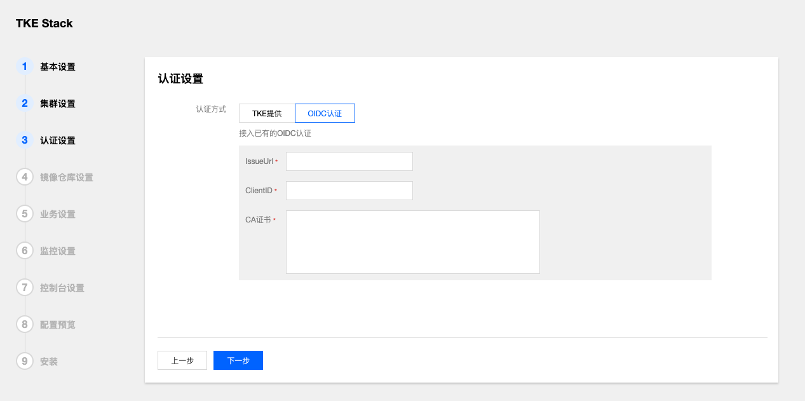

# 常见问题列表：

[如何接入LDAP、OIDC](#如何接入LDAP、OIDC)  

[如何实现自定义监控  ](#如何实现自定义监控)  

[如何做日志分析](#如何做日志分析)  

### 如何接入LDAP、OIDC

接入LDAP、OIDC有两种方式；

1. 在集群安装时，配置OIDC认证信息，关于OIDC配置信息，请参考[Configuring the API Server](https://kubernetes.io/docs/reference/access-authn-authz/authentication/#configuring-the-api-server)。



2. 集群安装完成后，可以通过调用API的形式切换认证模式为OIDC或LDAP

   a. 修改auth配置文件，configmap: tke-auth-api，指定默认idp类型为ldap：

   ~~~json
   "auth": {
     "init_tenant_type": "ldap", // 指定ldap类型的idp
     "init_tenant_id": "ldap-test", // tenant id
     "init_idp_administrators": ["jane"], //idp的管理员列表，需要存在客户ldap系统中，具有平台的超级管理员权限
     "ldap_config_file":"_debug/auth-ldap.json",
   }
   ~~~

   b. 准备ldap配置文件，配置说明参见：[dex-ldap](https://github.com/dexidp/dex/blob/master/Documentation/connectors/ldap.md)

   ```json
   {
       //ldap地址，host:port
       "host": "localhost:389", 
       "insecureNoSSL": true, // 是否开始SSL，如果host没有指定端口，ture，端口为389和false， 端口为636
       "bindDN": "cn=admin,dc=example,dc=org", //服务账户的DN和密码，用来查询ldap用户组和用户
       "bindPW": "admin", //密码
       "usernamePrompt": "User Name", //
       "userSearch": {
           "baseDN": "ou=People,dc=example,dc=org", //用户baseDN
           "filter": "(objectClass=person)", //查询过滤条件
           "username": "cn", // username的属性key，cn=jane,ou=People,dc=example,dc=org
           "idAttr": "DN", // user id的属性key
           "emailAttr": "mail", // 邮件属性key
           "nameAttr": "cn" //displayname 的属性key
       },
       "groupSearch": {
           "baseDN": "ou=Groups,dc=example,dc=org",//用户组baseDN
           "filter": "(objectClass=groupOfNames)", //查询过滤条件
           "userAttr": "DN", //用户组成员id属性key
           "groupAttr": "member", //用户组成员key
           "nameAttr": "cn" //用户组名称key
       }
   }
   ```

   c. 调用API，新增ldap idp，

   ```shell
   curl -XPOST https://{auth_address}/apis/auth.tkestack.io/v1/identityproviders   -H 'Authorization: Bearer {admin_token}'    -H 'Content-Type: application/json' 
   ```

   ​    Body:

   ```json
   {
       "metadata": {
           "name": "ldap-test" //tennatID
       },
       "spec": {
           "name": "ldap-test", 
           "type": "ldap",
           "administrators": [  //超级管理员
               "jane"
           ],
           "config": "  {\"host\":\"localhost:389\",\"insecureNoSSL\":true,\"bindDN\":\"cn=admin,dc=example,dc=org\",\"bindPW\":\"admin\",\"usernamePrompt\":\"Email Address\",\"userSearch\":{\"baseDN\":\"ou=People,dc=example,dc=org\",\"filter\":\"(objectClass=person)\",\"username\":\"cn\",\"idAttr\":\"DN\",\"emailAttr\":\"mail\",\"nameAttr\":\"cn\"},\"groupSearch\":{\"baseDN\":\"ou=Groups,dc=example,dc=org\",\"filter\":\"(objectClass=groupOfNames)\",\"userAttr\":\"DN\",\"groupAttr\":\"member\",\"nameAttr\":\"cn\"}}" //ldap配置
       }
   }
   ```

   

   d. 删除IDP

   ```
   curl -XDELETE https://{auth_address}/apis/auth.tkestack.io/v1/identityproviders/ldap-test -H 'Authorization: Bearer {admin_token}'
   ```


### 如何实现自定义监控  

TKEStack 提供了的默认监控内容为工作负载的资源监控，监控功能将会持续拓展，您也可以通过部署[prometheus-operator](https://github.com/coreos/prometheus-operator)来实现自定义指标的监控。


### 如何做日志分析

可在扩展组件中部署Logcollector组件收集日志，在运维中心中配置日志采集，讲日志输出到用户自己的日志存储服务，也可以通过Helm部署[elasticsearch](https://hub.helm.sh/charts/elastic/elasticsearch)或[kafka](https://hub.helm.sh/charts/incubator/kafka)，以及[kibana](https://hub.helm.sh/charts/elastic/kibana)，自行搭建容器化的日志分析工具平台。

