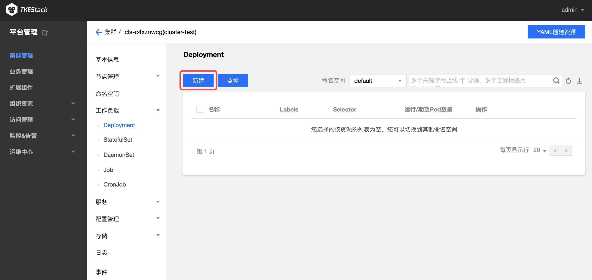
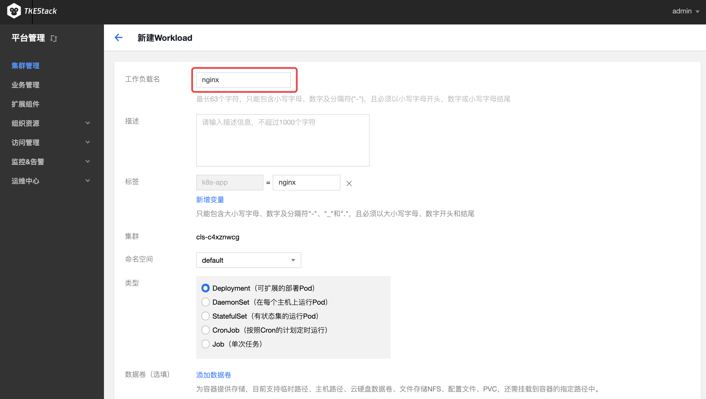
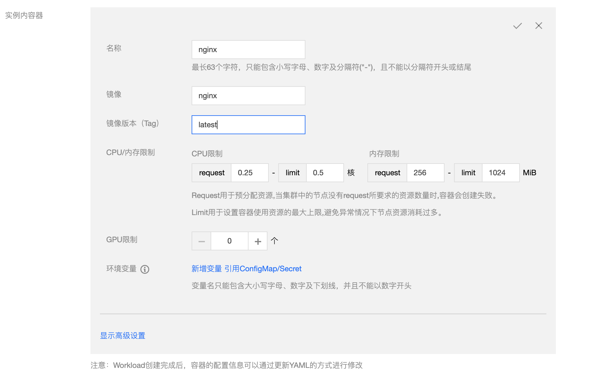
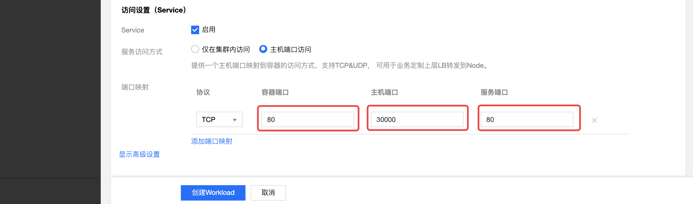
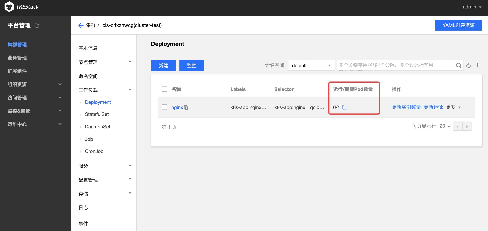
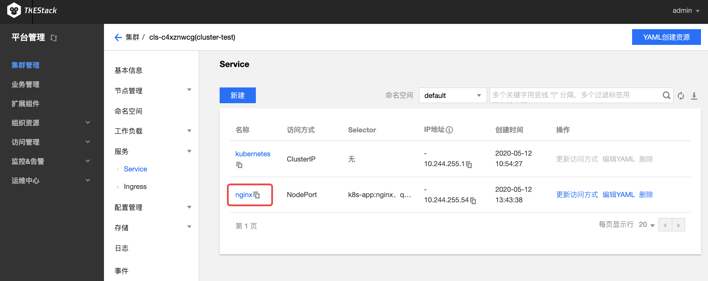

# 创建简单的Nginx服务

## 操作场景

本文档旨在帮助大家了解如何快速创建一个容器集群内的 Nginx 服务。

## 前提条件
>- 已部署 [TKEStack 控制台](../../installation/installation-procedures.md)
>-  已创建集群。如没有另外创建集群，可以先使用 global 集群。如要尝试创建新集群，请参见 [创建集群](../../products/platform/cluster.md)

## 创建 Nginx 服务

1. 登录 TKEStack 控制台 

2. 单击左侧导航栏中【集群管理】，进入“集群管理”页面，单击需要创建服务的集群 ID：

   

3. 进入【工作负载】的【 Deployment 】中，选择【新建】，如下图所示：
    

4. 在“新建Workload”页面，只需输入下图中红框的参数即可：

   

   >  注意：服务访问方式选择：“主机端口访问”，所在集群的安全组需要放通节点网络及容器网络，同时需要放通30000 - 32768端口，否则可能会出现容器服务无法使用问题。

5. 单击上图中的【创建Workload】，完成创建。如下图所示：

   > 注意：当运行/期望Pod数量一致时，负载完成创建。

   

6. 可以在【服务】下的【Service】看到与刚刚创建的Deployment同名的Service

   

## 访问 Nginx 服务

可通过以下两种方式访问 nginx 服务。

### 通过主机节点端口访问 nginx 服务

在本地主机的浏览器地址栏输入`集群任意节点IP:30000 端口`，例如`10.0.0.1:30000`即可访问服务。如果服务创建成功，访问服务时直接进入 nginx 服务器的默认欢迎页。如下图所示：

> 注意：如果本地主机在集群内网中，输入节点的内网IP地址即可；如果本地主机不在集群内网中，需要输入节点的外网IP地址。

### 通过服务名称访问 nginx 服务

集群内的其他服务或容器可以直接通过服务名称访问