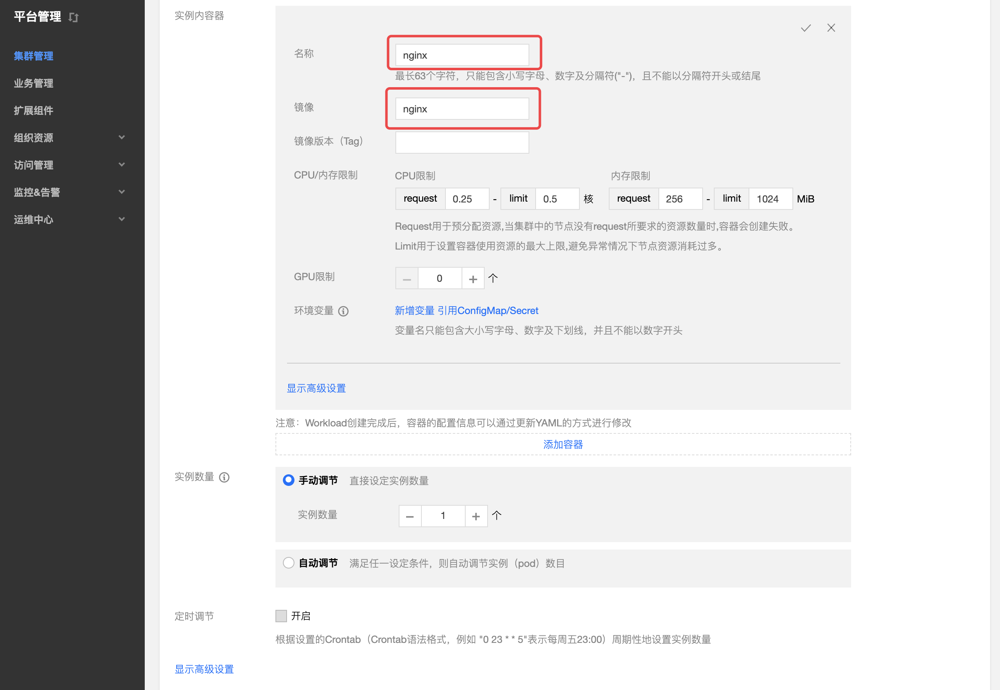

## 操作场景
本文档旨在帮助大家了解如何快速创建一个容器集群内的 nginx 服务。

## 前提条件
>- 已部署 TKEStack 控制台。
>-  已创建集群。关于创建集群，详情请参见 [创建集群](https://github.com/tkestack/docs/blob/master/products/platform/cluster.md)。

## 操作步骤

### 创建 Nginx 服务

1. 登录TKEStack 控制台 。
2. 单击左侧导航栏中【集群管理】，进入“集群管理”页面。
3. 单击需要创建服务的集群 ID，进入工作负载 Deployment 详情页，选择【新建】。如下图所示：

4. 在“新建Workload”页面，根据以下提示，设置工作负载基本信息。如下图所示：
 - **工作负载名**：输入要创建的工作负载的名称，本文以 nginx 为例。
 - **描述**：填写工作负载的相关信息。
 - **标签**：key = value 键值对，本例中标签默认值为 k8s-app = **nginx** 。
 - **命名空间**：根据实际需求进行选择。
 - **类型**：根据实际需求进行选择。
 - **数据卷**：根据实需求设置工作负载的挂载卷。

5. 设置**实例内容器**，输入实例内容器名称，本文以 nginx 为例。
    
6. 根据以下提示，设置服务的实例数量。如下图所示：
 - **手动调节**：设定实例数量，本文实例数量设置为1。可单击“+”或“-”控制实例数量。
 - **自动调节**：满足任一设定条件，则自动调节实例（pod）数目。
 
7.   根据以下提示，进行工作负载的访问设置。如下图所示：   
 - **Service**：勾选“启用”。
 - **服务访问方式**：选择“主机端口访问”。
 - **端口映射**：选择 TCP 协议，将容器端口和服务端口都设置为80 ，主机端口设置为30000。
 
 >!服务所在集群的安全组需要放通节点网络及容器网络，同时需要放通30000 - 32768端口，否则可能会出现容器服务无法使用问题。
8. 单击【创建Workload】，完成 nginx 服务的创建。

### 访问 Nginx 服务

可通过以下两种方式访问 nginx 服务。

#### 通过 主机节点端口 访问 nginx 服务

1. 单击左侧导航栏中【集群管理】，进入 “集群管理” 页面。
2. 单击 Nginx 服务所在的集群 ID，选择【服务】>【Service】。
3. 在服务管理页面，看到 Nginx Service已经运行，如下图所示：

4. 在浏览器地址栏访问集群任意节点IP的 30000 端口即可访问服务。

#### 通过服务名称访问 nginx 服务

集群内的其他服务或容器可以直接通过服务名称访问。

### 验证 nginx 服务
服务创建成功，访问服务时直接进入 nginx 服务器的默认欢迎页。如下图所示：
