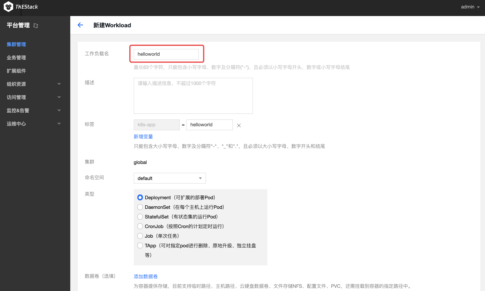

# 编写 Hello World 程序

## 操作场景

本文档旨在帮助大家了解如何快速创建一个容器集群内的 Hello World 的 Node.js 版的服务。更多关于如何构建 Docker 镜像的教程可参阅 [如何构建 Docker镜像](https://github.com/tkestack/docs/blob/master/QuickStart/%E5%85%A5%E9%97%A8%E7%A4%BA%E4%BE%8B/%E5%A6%82%E4%BD%95%E6%9E%84%E5%BB%BAdocker%E9%95%9C%E5%83%8F.md) 。

## 前提条件

- 已创建集群，详情请参见 [创建集群](https://github.com/tkestack/docs/blob/master/products/platform/cluster.md)。
- 已登录节点，且该节点已安装 Node.js。

## 操作步骤
### 编写代码制作镜像
#### 编写应用程序
1. 依次执行以下命令，创建并进入 hellonode 的文件夹。
```shell
mkdir hellonode
cd hellonode/
```
2. 执行以下命令，新建并打开 server.js 文件。
```
vim server.js
```
3. 按 “**i**” 或 “**insert**” 切换至编辑模式，将以下内容输入 server.js。
```js
var http = require('http');
var handleRequest = function(request, response) {
  console.log('Received request for URL: ' + request.url);
  response.writeHead(200);
  response.end('Hello World!');
};
var www = http.createServer(handleRequest);
www.listen(80);
```
按 “**Esc**”，输入 “**:wq**”，保存文件并返回。
4. 执行以下命令，执行 server.js 文件。
```shell
node server.js
```
以下提供两种方式，测试 Hello World 程序。
 - 再次登录节点，执行以下命令。或在浏览器以 IP 地址：端口的形式访问，端口为80 。
```shell
curl 127.0.0.1:80
```
显示如下，则说明 Hello World 程序运行成功。


 - 打开浏览器，以 IP 地址：端口的形式访问，端口为80。
 显示如下，则说明 Hello World 程序运行成功。


#### 创建 Docker 镜像
>?更多 Docker 镜像请参见 [如何构建 Docker 镜像](https://github.com/tkestack/docs/blob/master/QuickStart/%E5%85%A5%E9%97%A8%E7%A4%BA%E4%BE%8B/%E5%A6%82%E4%BD%95%E6%9E%84%E5%BB%BAdocker%E9%95%9C%E5%83%8F.md) 。
>
1. 依次执行以下命令，在 hellonode 文件夹下，创建 Dockerfile 文件。
```
cd /hellonode
vim Dockerfile
```
2. 按 “**i**” 或 “**insert**” 切换至编辑模式，将以下内容输入 Dockerfile 文件。
```shell
FROM node:4.4
EXPOSE 80
COPY server.js .
CMD node server.js
```
按 “**Esc**”，输入 “**:wq**”，保存文件并返回。
3. 执行以下命令，构建镜像。
```shell
docker build -t hello-node:v1 .
```
4. <span id="search">执行以下命令，查看构建好的 hello-node 镜像。</span>
```
docker images 
```
显示结果如下，则说明 hello-node 镜像已成功构建，记录其 IMAGE ID。如下图所示：


#### 上传该镜像到镜像仓库
>!
>- 已在【仓库管理】创建命名空间。
>- 已在【访问凭证】创建访问凭证。

依次执行以下命令，上传镜像到 qcloud 仓库。
```shell
sudo sudo docker login -u tkestack -p 访问凭证 default.registry.tke.com
sudo docker tag IMAGEID default.registry.tke.com/命名空间/helloworld:v1
sudo sudo docker push default.registry.tke.com/命名空间/helloworld:v1
```
>?
>- 请将命令中的 访问凭证 替换为 已创建的访问凭证。
>- 请将命令中的 命名空间 替换为 已创建的命名空间。
>
显示以下结果，则说明镜像上传成功。


#### 在镜像仓库命名空间中进行确认


### 通过该镜像创建 Hello World 服务

>!在创建使用 Hello World 服务之前，您必须拥有：
>- 已创建集群，详情请参见 [创建集群](https://github.com/tkestack/docs/blob/master/products/platform/cluster.md) 。
>
1. 登录 TKEStack 控制台。
2. 单击左侧导航栏中【集群管理】，进入“集群管理”页面。
2. 单击需要创建服务的集群 ID，进入工作负载 Deployment 详情页，选择【新建】。如下图所示：

4. 在“新建Workload”页面，根据以下提示，设置工作负载基本信息。如下图所示：
 - **工作负载名**：输入要创建的工作负载的名称，本文以 helloworld 为例。
 - **描述**：填写工作负载的相关信息。
 - **标签**：key = value 键值对，本例中标签默认值为 k8s-app = **helloworld** 。
 - **命名空间**：根据实际需求进行选择。
 - **类型**：根据实际需求进行选择。
 - **数据卷**：根据实需求设置工作负载的挂载卷。

5. 设置**实例内容器**，输入实例内容器名称为 helloworld。镜像为hello-node:v1。
   
7. 设置实例数量，如下图所示：
 - **手动调节**：设定实例数量，本文实例数量设置为1。可单击“+”或“-”控制实例数量。
 - **自动调节**：满足任一设定条件，则自动调节实例（pod）数目。
8.   根据以下提示，进行工作负载的访问设置。如下图所示：   
 - **Service**：勾选“启用”。
 - **服务访问方式**：选择“主机端口访问”。
 - **端口映射**：选择 TCP 协议，将容器端口和服务端口都设置为80 ,主机端口设为30001。
 
 >!服务所在集群的安全组需要放通节点网络及容器网络，同时需要放通30000 - 32768端口，否则可能会出现容器服务无法使用问题。
9. 单击【创建Workload】，完成 Hello World 服务的创建。

### 访问 Hello World 服务
可通过以下两种方式访问 Hello World 服务。
#### 通过负载均衡 IP 访问 Hello World 服务
1. 单击左侧导航栏中【集群管理】，进入 “集群管理” 页面。
2. 单击 Nginx 服务所在的集群 ID，选择【服务】>【Service】。
3. 在服务管理页面，看到 Hello world已经运行，如下图所示：
#### 通过服务名称访问 Hello World 服务
集群内的其他服务或容器可以直接通过服务名称访问。

### 验证 Hello World 服务
访问服务时显示如下，则 Hello World 服务创建成功。


