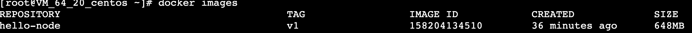
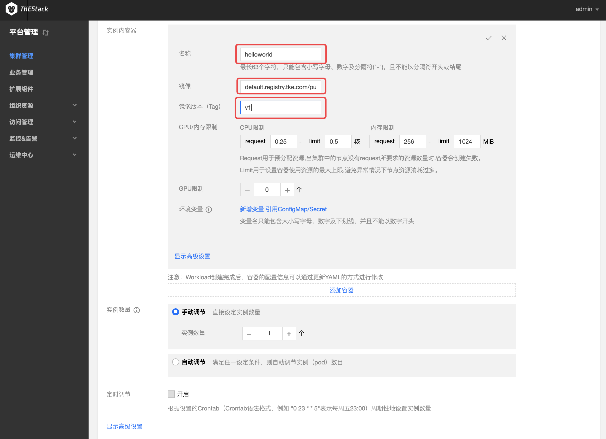
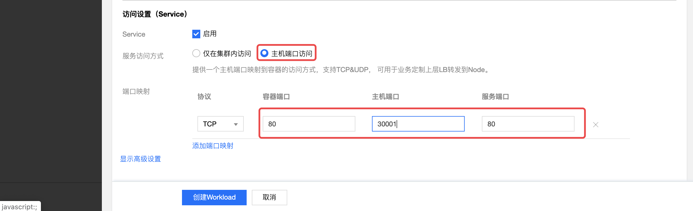
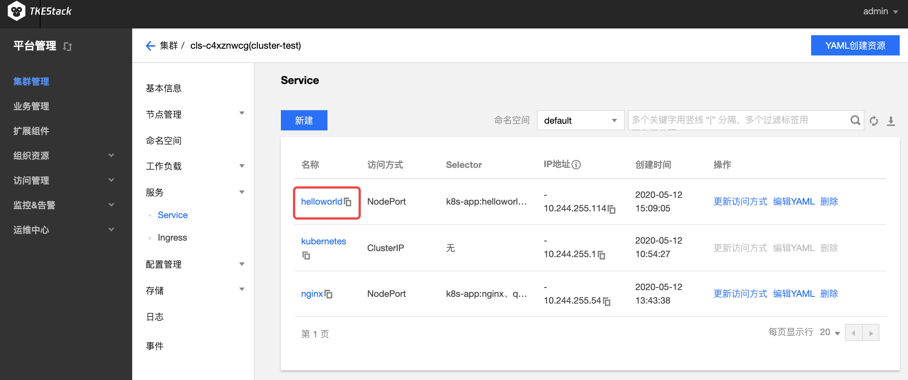

# 编写 Hello World 程序

## 操作场景

本文档旨在帮助大家了解如何快速创建一个容器集群内的 Hello World 的 Node.js 版的服务。

## 前提条件

- 已部署 [TKEStack 控制台](../../installation/installation-procedures.md)
- 已创建集群。如没有另外创建集群，可以先使用 global 集群；如要尝试创建新集群，请参见 [创建集群](../../products/platform/cluster.md)

## 制作镜像
### 编写应用程序

以 CentOS 7.6为例

1. 安装 Node.js，然后创建并进入 hellonode 的文件夹：
   
   ```shell
   yum install -y nodejs
   mkdir hellonode && cd hellonode/
   ```

2. 执行以下命令，新建 server.js 文件并输入内容：
   
   ```shell
   cat << EOF >  server.js
   var http = require('http');
   var handleRequest = function(request, response) {
   console.log('Received request for URL: ' + request.url);
   response.writeHead(200);
   response.end('Hello World!');
   };
   var www = http.createServer(handleRequest);
   www.listen(80);
   EOF
   ```

3. 执行以下命令，执行 server.js 文件：
   
   ```shell
   node server.js
   ```
   > 如果报错，例如：`Error: listen EADDRINUSE: address already in use :::80`，说明 80 端口被占用，可以通过 `vi server.js` 修改上述文件中的最后一行 `www.listen(80);`，把 80 换成其它端口，例如 88，保存退出后重新执行 `node server.js`

4. 测试 Hello World 程序，有以下两种办法：

   1. 另起一个终端，再次登录节点，执行以下命令：

      ```shell
      curl 127.0.0.1:80
      
      # 终端会输出一下信息
      Hello World!
      ```

   2. 打开本地主机的浏览器，以 `IP地址:端口`的形式访问，端口为80。网页出现`Hello world!`说明 Hello World 程序运行成功。

      > 注意：如果本地主机不在该节点所在的内网，IP地址应该是该节点的外网地址


### 创建 Docker 镜像
1. 在 hellonode 文件夹下，创建 Dockerfile 文件并输入内容：
   ```shell
   cat << EOF > Dockerfile
   FROM node:4.4
   EXPOSE 80
   COPY server.js .
   CMD node server.js
   EOF
   ```

2. 执行以下命令，构建镜像：
   ```shell
   docker build -t hello-node:v1 .
   ```
3. 执行以下命令，查看构建好的 hello-node 镜像：
   ```
   docker images 
   ```
   显示结果如下，则说明 hello-node 镜像已成功构建，记录其 IMAGE ID。如下图所示：
   


### 上传该镜像到镜像仓库
>- 已在[【组织资源】](../../../zh-CN/products/platform/resource/registry.md)中的【镜像仓库管理】创建命名空间。
>- 已在[【组织资源】](../../../zh-CN/products/platform/resource/credentials.md)中的【访问凭证】创建访问凭证。

依次执行以下命令，上传镜像到自己在 TKEStack 上创建的命令空间镜像仓库。
```shell
sudo docker login -u tkestack -p 【访问凭证】 default.registry.tke.com
sudo docker tag 【IMAGEID】 default.registry.tke.com/【命名空间】/helloworld:v1
sudo docker push default.registry.tke.com/【命名空间】/helloworld:v1
```
>- 请将命令中的 【访问凭证】 替换为 已创建的访问凭证
>- 请将命令中的 【IMAGEID】 替换为 你自己创建镜像的 ID，示例中的 ID 如上图158204134510
>- 请将命令中的 【命名空间】 替换为 已创建的命名空间
>
显示以下结果，则说明镜像上传成功。


### 在镜像仓库命名空间中进行确认


## 通过该镜像创建 Hello World 服务

1. 登录 TKEStack 控制台
2. 单击左侧导航栏中【集群管理】，进入“集群管理”页面
2. 单击需要创建服务的集群 ID，进入工作负载 “Deployment” 详情页，选择【新建】。如下图所示：

4. 在“新建Workload”页面，仅输入以下红框内容即可：
   
   
 >注意：
 >
 >1. 镜像，地址要填全：default.registry.tke.com/【命名空间】/【镜像名】，例如：default.registry.tke.com/test/helloworld
 >
 >2. 服务所在集群的安全组需要放通节点网络及容器网络，同时需要放通30000 - 32768端口，否则可能会出现容器服务无法使用问题。
5. 单击【创建Workload】，完成 Hello World 服务的创建

## 访问 Hello World 服务 
可通过以下两种方式访问 Hello World 服务。
### 通过主机节点端口访问 Hello World 服务
1. 选择【服务】>【Service】，在“Service”管理页面，看到与名为 helloworld 的 Service已经运行，如下图所示：

2. 在本地主机的浏览器地址栏输入`集群任意节点 IP:30000 端口`，例如`10.0.0.1:30000`即可访问服务。如果服务创建成功，访问服务时页面会返回` Hello World！ `

   > 注意：如果本地主机在集群内网中，输入节点的内网 IP 地址即可；如果本地主机不在集群内网中，需要输入节点的外网 IP 地址

### 通过服务名称访问 Hello World 服务

集群内的其他服务或容器可以直接通过服务名称访问。

更多关于Docker 镜像请参见 [如何构建 Docker 镜像](https://github.com/tkestack/docs/blob/master/QuickStart/%E5%85%A5%E9%97%A8%E7%A4%BA%E4%BE%8B/%E5%A6%82%E4%BD%95%E6%9E%84%E5%BB%BAdocker%E9%95%9C%E5%83%8F.md) 。