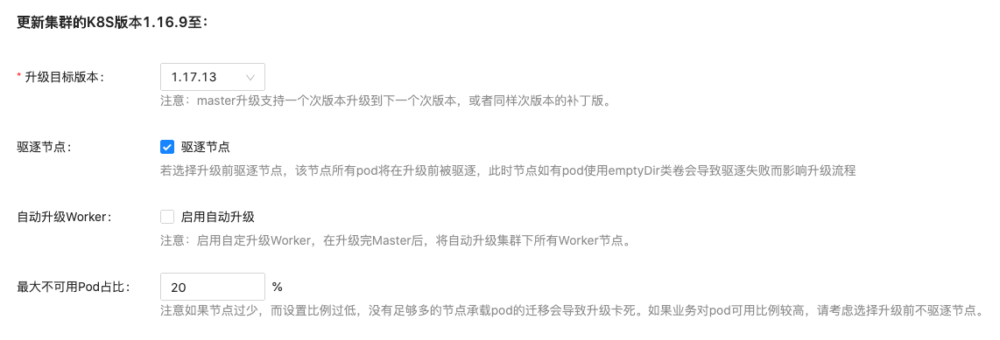
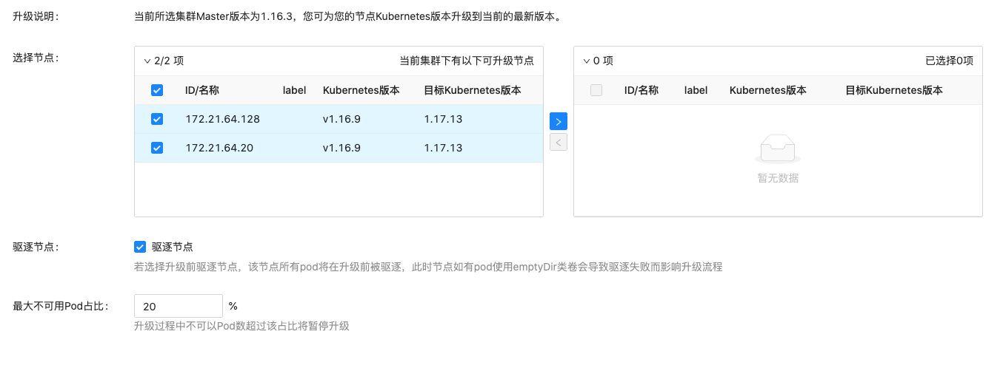

# K8S 版本升级说明

TKEStack提供升级 Kubernetes 版本的功能，您可通过此功能对运行中的 Kubernetes 集群进行升级。在升级 kubernetes 版本之前，建议您查阅 [CHANGELOG](https://github.com/kubernetes/kubernetes/tree/master/CHANGELOG) 确认Kubernetes 版本差异。

## Concept

主版本：k8s版本号的格式vx.y.z中的x为主版本，例如v1.18.3主版本是1

次要版本：k8s版本号的格式vx.y.z中的y为次要版本，例如v1.18.3的次要版本是18

补丁版本：k8s版本号的格式vx.y.z中的z为补丁版本

## 升级须知

1.升级属于不可逆操作、请谨慎进行。

2.请在升级集群前，查看集群下业务状态是否均为健康状态。

3.升级期间不建议对集群进行任何操作。

4.仅支持次要版本和补丁版本升级，不支持降级，不支持跨多个版本升级（例如1.16跳过1.17直接升级至1.18），且仅当集群内 Master 版本和 Node 版本一致时才可继续升级下一个版本。

## 升级技术原理

升级的过程为：升级包准备、升级 Master 和升级 Node。

1.升级包准备

当前运行集群所需要的镜像二进制等都保存在tke-installer中，已经安装好的TKEStack已包含至少三个连续的 K8S 版本，如TKEStack v1.5.0 中包含K8S v1.16.9, v1.17.13 和 v1.18.3，同时也包含了对应的kubeadm，kubelet和kubectl版本。

2.升级Master

Master升级采用滚动升级的方式，同一时间只会对一个节点进行升级，只有当前节点升级成功才会进行下个节点的升级。

Master升级调用kubeadm 处理集群的升级操作，Kubeadm 工作原理参考：[how it works](https://kubernetes.io/docs/tasks/administer-cluster/kubeadm/kubeadm-upgrade/#how-it-works)

3.升级Node

节点原地升级，采用滚动升级的方式，即同一时间只会对一个节点进行升级，只有当前节点升级成功后才会进行下个节点的升级。每个节点升级时执行以下操作：

- 替换和重启节点上的 kubelet组件。

- 从集群取回 kubeadm ClusterConfiguration。

- 为本节点升级 kubelet 配置

## 操作步骤

 1.登录 平台管理 控制台，选择左侧导航栏中的【集群管理】。
 
 2.在“集群管理”页面，选择需要升级的集群，点击右侧的【升级Master】按钮，进入集群升级页面。
 
 3.在集群升级页面配置升级所需参数，如下图所示：

4.在点击提交按钮，等待升级完成。同时可以点击【状态】按钮查看升级状态。

5.如果上述配置没有选择【自动升级worker】，在Master节点升级完成后，点击【升级worker】，进入node升级页面。

6.在node升级页面配置node节点升级所需参数，如下图所示：

7.在点击提交按钮，等待升级完成。同时可以点击【状态】按钮查看当前升级状态。

###其他技术细节

1.升级中任何步骤出现错误，系统都将自动进行重试，用户可在升级进度界面中得到错误信息。

## 风险点与规避措施

Master节点升级存在一定风险，用户在升级前，应检查集群状态是否足够健康，从而判断是否开始master节点升级，本节列举一些较为典型的风险及规避方法供用户参考。

### 重启kubelet的风险点

1.Not Ready Pod 数目超过设置值导致升级卡死

选择了【驱逐节点】选项，同时节点过少，而设置【最大不可用pod数】比例过低，没有足够多的节点承载pod的迁移会导致升级卡死。

规避措施：

  - 尽如果业务对pod可用比例较高，请考虑选择升级前不驱逐节点。

2.kubelet进程无法启动

  当该master节点资源十分紧张的时候，启动kubelet有可能失败，从而导致节点升级无法正常完成。

规避措施：

  - 尽量不要将业务Pod运行于master节点

  - 确保节点资源不能处于高度紧张状态

3.容器重启

  某些版本kubelet与旧版本对于container的管理有一定差异，有可能导致节点上所有container重启

规避措施：

  - 加强container的重启容忍度，例如确保deployment的副本数不为1

## FQA
1.何时使用K8S升级功能：

答：当集群版本不满足业务需求，K8S漏洞修复，或当前集群版本低于TKEStack所能支持的最小版本。

2.升级的目标版本能否选择：

答：目前只支持升级到下一个次要版本，例如1.16.x的集群只能升到1.17.x；或者升级到补丁版本，例如1.16.x升级到 1.16.z

3.为什么我看不到升级worker按钮：

答：只有当前集群所有worker节点版本与master节点版本相同时，才允许进行master版本升级。

4.是否支持回滚：

答：不支持回滚操作。

5.自行修改的参数怎么办

答：master升级将会把用户自行修改的参数重置成与新建集群时的一致，若用户有特殊参数修改，建议升级完成后手动添加。

6.升级时出现异常情况如何处理？

答：升级过程中有可能出现意想不到的问题而导致升级失败或升级过程被卡住。针对失败发生的时间点不同，管理员处理策略有所不同。

- 失败发生在k8s集群版本号变化之前：

此时k8集群版本号未发生变化，首节点尚未升级，可回滚。可以将Cluster.Spec.Version的版本号修改为与当前k8s版本一致，集群便可恢复正常运行状态。

- 失败发生在k8s集群版本号变化之后：

此时集群的首节点已经升级成功，原则上不允许回滚到低版本。需要管理员排查其他节点没有按照预期进行升级到原因，解决问题后升级流程会自动向前推进。

7.Not Ready Pod数目超过设置值导致升级卡死

答：升级时遇到Not Ready Pod数目超过设置值导致升级卡死的情况，检查是否是由于驱逐导致的Not Ready状态，可尝试修改cluster.spec.features.upgrade.strategy. drainNodeBeforeUpgrade，设置false不驱逐节点， 或调大 maxUnready 值，以允许容忍更多的Not Ready Pod。

## 案例分析

升级时间点选择不当

- 案例详情：集群 A 的运维人员在工作日业务高峰期进行节点升级操作，由于没有配置合理的扩缩容机制，业务 Pod 一直处于高负载状态，某个节点升级失败导致该节点 Pod 重启，剩余 Pod 无法满足高峰期时段的业务负载导致出现大量访问异常，业务受到较为严重的影响。

- 最佳实践：选择业务低峰期进行节点升级将大大降低业务受影响的概率。

成功案例

- 案例详情：集群 D 计划进行节点升级。运维人员决定先升级测试集群，成功后再升级生产集群，并将升级时间选在业务负载较低的周五凌晨2点。升级前，他通过监控面板观察到各目标节点的负载情况都较低，再通过节点详情页观察每个节点上 Pod 分布较为合理。第一个节点开始升级后，运维人员点击了暂停升级任务，随后第一个节点升级完成后任务到达暂停点自动转为暂停状态。运维人员再次检查被升级节点，确认无异常后点击继续任务，升级动作继续进行。在随后升级过程中，运维人员时刻观察集群和业务情况，直到升级全部完成。成功升级测试集群后，运维人员继续以同样的步骤成功升级生产集群。

- 最佳实践：1.先升级测试集群或者开发集群，成功后再升级生产集群；2. 时间选择合理；3. 升级前检查集群状态；4.先升级少量节点观察并解决问题；5.升级过程中继续保持观察。
