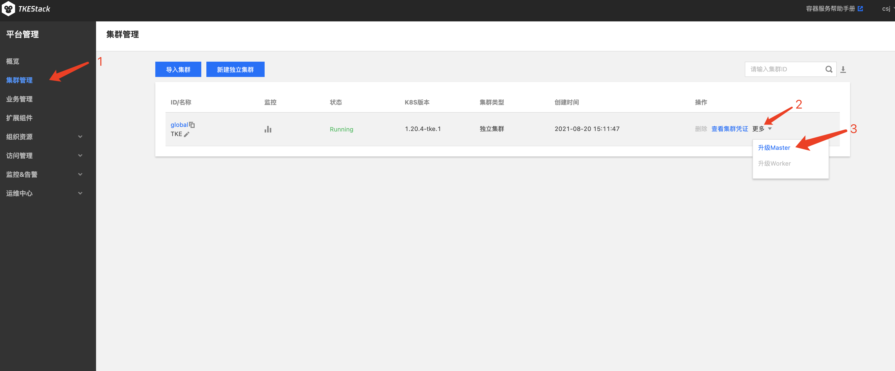
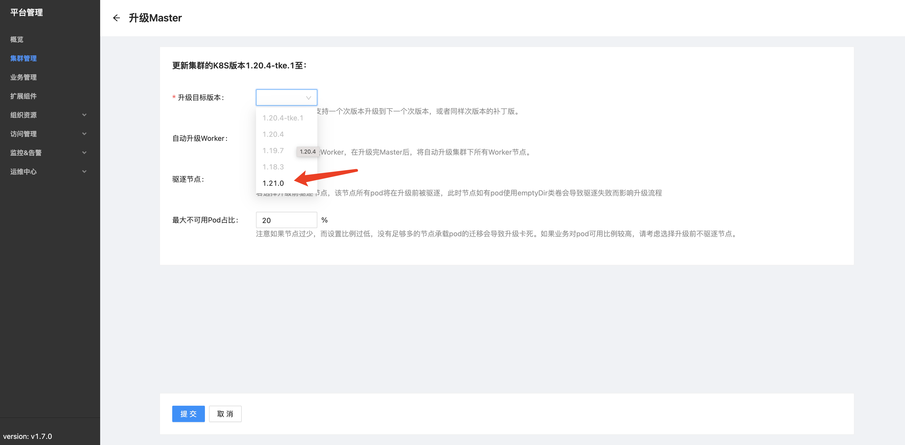

# 使用installer进行自定义k8s版本升级

注意：

- 以下所有操作均在 `global` 集群 `master` 节点上操作
- 操作的节点当前可用磁盘最少 `30G`，建议`50G`以上，可以手动检查：
  
    ```sh
    # df -h -BG /opt
    文件系统       1G-块  已用  可用 已用% 挂载点
    /dev/vda1       253G   78G  166G   32% /
    ```

## 物料准备

核心物料简介：

1. 二进制文件
2. 升级所需镜像
3. 集群的 `kubeconfig` 文件

大致步骤：

- 升级所需物料需要存放到`/opt/tke-installer/data/`下，
- 默认物料文件夹名称为`custom_upgrade_resource`，
  - 由于installer以容器形式执行命令会挂在`/opt/tke-installer/data/`到执行目录的`data/`目录下，installer会默认从`data/custom_upgrade_resource`中获取物料，
  - 如用户想指定其他目录请通过installer的`--upgrade-resource-dir [your_resource_dir]`在准备物料阶段指定位置，
  - `--upgrade-resource-dir`未指定时默认值为`data/custom_upgrade_resource`。

- `custom_upgrade_resource`下需要有且仅有一个以版本号命名的文件夹，

    ```sh
    mkdir -p /opt/tke-installer/data/custom_upgrade_resource/1.16.5
    cd /opt/tke-installer/data/custom_upgrade_resource/1.16.5
    mkdir images
    mkdir bins
    ```

  - 此文件夹下需要有`images`和`bins`文件夹，文件目录结构

    ```sh
    # tree /opt/tke-installer/data/
    /opt/tke-installer/data/
    └── custom_upgrade_resource
        └── 1.16.5
            ├── bins
            └── images
    ```

下面将介绍详细准备步骤

### images

`images`文件夹下用于存放自定义 K8s 版本的镜像的 tar 包，如 kube-proxy 等。

在镜像存为 tar 包之前需要注意：

1. 镜像名的 `repo` 需要统一改为 `tkestack`，否则将不会被 `installer` 识别为需要维护的镜像；
2. 镜像名需要携带 `cpu` 架构，由于 `TKEStack` 支持多种 `CPU架构(multi-arch)`，installer会将镜像统以`multi-CPU architecture`维护，需要导入镜像携带 cpu 架构。

    - 以官方amd64架构的kube-proxy为例子，执行如下命令，就能得到一个可以被installer识别的镜像tar包。

    ```sh
    docker tag k8s.gcr.io/kube-proxy-amd64:v1.16.5 tkestack/kube-proxy-amd64:v1.16.5
    docker save -o  kube-proxy-amd64 tkestack/kube-proxy-amd64:v1.16.5
    ```

### bins

- `bins`目录下可以有两个目录`linux-amd64`和`linux-arm64`，分别用于存放amd64架构和arm64架构的二进制压缩包，用户可以根据自身需求同时创建两个或其中一个。

- 这两个文件夹下需要有一个压缩包，命名规范需要符合`kubernetes-node-linux-$arch-v$version.tar.gz`。
  - 此压缩包可以从官方下载下来，以1.16.5版本amd64架构的K8s为例，可以通过命令

  ```sh
  curl -o kubernetes-node-linux-amd64-v1.16.5.tar.gz -L https://dl.k8s.io/v1.16.5/kubernetes-node-linux-amd64.tar.gz
  ```

  下载并重命名为可以被installer识别的压缩包。

最终文件目录结构可以参考：

```sh
/opt/tke-installer/data/custom_upgrade_resource/
└── 1.16.5
    ├── bins
    │   └── linux-amd64
    │       └── kubernetes-node-linux-amd64-v1.16.5.tar.gz
    └── images
        ├── kube-apiserver-amd64.tar
        ├── kube-controller-manager-amd64.tar
        ├── kube-proxy-amd64.tar
        └── kube-scheduler-amd64.tar
```

### kubeconfig 文件

提前将 `kubeconfig` 文件复制到指定位置：`/opt/tke-installer/conf/kubeconfig`

```sh
mkdir -p /opt/tke-installer/conf
cp ~/.kube/config /opt/tke-installer/conf/kubeconfig
```

### 使用installer完成升级

1. 升级物料准备完成之后，导入准备的资源：`tke-installer-linux-amd64-xxx.run --prepare-custom-images`
    - 注意：`tke-installer` 版本需要和之前部署该集群使用的 `tke-installer` 版本保持一致
      比如我们当前的集群使用 `tke-installer-1.7` 部署的，升级用的 installer 也需要使用 `tke-installer-1.7`
    - 查看导入日志，最终停在这里，该步骤成功：

    ```log
    # tail -f /opt/tke-installer/data/tke.log
    ...
    
    2021-08-26 07:27:12.734	info	tke-installer	===>prepare custom images task [Sucesss] [392.225361s]
    ```

    执行成功之后：会在集群升级页面上多一个选项

    

    

2. 执行成功后再使用`tke-installer-linux-amd64-xxx.run --upgrade`执行升级。
   - 该步骤执行时间较长，需耐心等待
   - 查看导入日志，确保升级成功：

3. 触发集群升级需要在 `global` 集群上修改指定 `cluster` 资源对象内容：

    ```sh
    kubectl edit cluster [cls-yourcluster]
    ```

    修改`spec.version`中的内容为`1.16.5`

    这步操作也可以在 tkestack界面上执行，详情见[集群升级指引](./cluster-upgrade-guide.md)

### 已知问题

> 目前Web UI不允许补丁版本升级，会导致可以在UI升级选项中可以看到`1.16.15`版本，但是提示无法升级到该版本，后续版本中将会[修复](https://github.com/tkestack/tke/issues/1020)。当前请使用kubectl修改cluster资源对象内容升级自定义版本。

> K8s 1.16.x版本使用kubeadm升级存在[已知bug](https://github.com/kubernetes/kubernetes/issues/88725)，会导致coreDNS的pod启动失败。遇到此场景请首先使用`kubectl get -n kube-system cm coredns -o yaml`观察`Corefile`和`Corefile-backup`内容是否一致，如不一致请确保`Corefile`内容为期望内容。之后请使用`kubectl edit -n kube-system deployments.apps coredns`将使用`Corefile-backup`的地方统一修改为`Corefile`。

## FAQ

1. 页面上升级集群失败，http 响应`422 Unprocessable Entity`：
   - 漏执行步骤 `tke-installer-linux-amd64-xxx.run --upgrade`

2. 执行 `tke-installer-linux-amd64-xxx.run --prepare-custom-images` 不生效、失败：
   1. 检查当前磁盘可用容量是否够用
   2. 检查 `kubeconfig` 是否按步骤配置
   3. 检查 使用 `installer` 版本是否和部署当前的集群版本一致

# 用户手动进行自定义k8s版本升级

用户可以通过向TKEStack平台提供自定义版本的k8s，以允许集群升级到非内置的版本。本文将以v1.16.15版本的k8s作为例子演示用户如何将集群升级到自定义版本。本文中只以amd64环境作为示例，如果用户希望自己的物料镜像可以支持`multi-CPU architecture`，请在制作镜像和推送镜像阶段参考[Leverage multi-CPU architecture support](https://docs.docker.com/docker-for-mac/multi-arch/)和[构建多CPU架构支持的Docker镜像](https://blog.csdn.net/dev_csdn/article/details/79138424)。

## 制作provider-res镜像

provider镜像用于存储kubeadm、kubelet和kubectl的二进制文件。

执行下面命令为环境设置好版本号，并从官方下载好二进制文件并压缩，若遇到网络问题请通过其他途径下载对应二进制文件：

```sh
export RELEASE=v1.16.15 && \
curl -L --remote-name-all https://storage.googleapis.com/kubernetes-release/release/$RELEASE/bin/linux/amd64/{kubeadm,kubelet,kubectl} && \
chmod +x kubeadm kubectl kubelet && \
mkdir -p kubernetes/node/bin/ && \
cp kubelet kubectl kubernetes/node/bin/ && \
tar -czvf kubeadm-linux-amd64-$RELEASE.tar.gz kubeadm && \
tar -czvf kubernetes-node-linux-amd64-$RELEASE.tar.gz kubernete
```

执行下面命令生成dockerfiel:

```sh
cat << EOF >Dockerfile
FROM tkestack/provider-res:v1.18.3-2

WORKDIR /data

COPY kubernetes-*.tar.gz   res/linux-amd64/
COPY kubeadm-*.tar.gz      res/linux-amd64/

ENTRYPOINT ["sh"]
EOF
```

制作provider-res镜像：

```sh
docker build -t registry.tke.com/library/provider-res:myversion .
```

此处使用了默认的registry.tke.com作为registry的domian，如未使用默认的domain请修改为自定义的domain，下文中如遇到registry.tke.com也做相同处理。

## 为平台准备必要镜像

从官方下载k8s组件镜像，如遇到网络问题请通过其他途径下载：

```sh
docker pull k8s.gcr.io/kube-scheduler:$RELEASE && \
docker pull k8s.gcr.io/kube-controller-manager:$RELEASE && \
docker pull k8s.gcr.io/kube-apiserver:$RELEASE && \
docker pull k8s.gcr.io/kube-proxy:$RELEAS
```

重新为镜像为镜像打标签：

```sh
docker tag k8s.gcr.io/kube-proxy:$RELEASE registry.tke.com/library/kube-proxy:$RELEASE && \
docker tag k8s.gcr.io/kube-apiserver:$RELEASE registry.tke.com/library/kube-apiserver:$RELEASE && \
docker tag k8s.gcr.io/kube-controller-manager:$RELEASE registry.tke.com/library/kube-controller-manager:$RELEASE && \
docker tag k8s.gcr.io/kube-scheduler:$RELEASE registry.tke.com/library/kube-scheduler:$RELEASE
```

导出镜像：

```sh
docker save -o kube-proxy.tar registry.tke.com/library/kube-proxy:$RELEASE && \
docker save -o kube-apiserver.tar registry.tke.com/library/kube-apiserver:$RELEASE && \
docker save -o kube-controller-manager.tar registry.tke.com/library/kube-controller-manager:$RELEASE && \
docker save -o kube-scheduler.tar registry.tke.com/library/kube-scheduler:$RELEASE && \
docker save -o provider-res.tar registry.tke.com/library/provider-res:myversion
```

发送到global集群节点上：

```sh
scp kube*.tar provider-res.tar root@your_global_node:/root/
```

## 在global集群上导入物料

注意在此之后执行到命令都是发生在global集群节点上，为了方便首先在环境中设置版本号：

```sh
export RELEASE=v1.16.15
```

加载镜像：

```sh
docker load -i kube-apiserver.tar && \
docker load -i kube-controller-manager.tar && \
docker load -i kube-proxy.tar && \
docker load -i kube-scheduler.tar && \
docker load -i provider-res.tar
```

登陆registry：

```sh
docker login registry.tke.co
```

此处会提示输入用户名密码，如果默认使用了内置registry，用户名密码为admin的用户名密码，如果配置了第三方镜像仓库，请使用第三方镜像仓库的用户名密码。

登陆成功后推送镜像到registry：

```sh
docker push registry.tke.com/library/kube-apiserver:$RELEASE && \
docker push registry.tke.com/library/kube-controller-manager:$RELEASE && \
docker push registry.tke.com/library/kube-proxy:$RELEASE && \
docker push registry.tke.com/library/kube-scheduler:$RELEASE && \
docker push registry.tke.com/library/provider-res:myversion
```

为使得导入物料可以被平台使用，首先需要修改tke-platform-controller的deployment：

```sh
kubectl edit -n tke deployments tke-platform-controller
```

修改`spec.template.spec.initContainers[0].image`中的内容为刚刚制作的provider-res镜像`registry.tke.com/library/provider-res:myversion`。

其次需要修改cluster-info：

```sh
kubectl edit -n kube-public configmaps cluster-info
```

在data.k8sValidVersions内容中添加`"1.16.15"`。

## 升级集群到自定义版本

触发集群升级需要在global集群上修改cluster资源对象内容：

```sh
kubectl edit cluster cls-yourcluster
```

修改`spec.version`中的内容为`1.16.15`。

更详细的升级相关文档请参考：[K8S 版本升级说明](https://github.com/tkestack/tke/blob/master/docs/guide/zh-CN/best-practices/cluster-upgrade-guide.md)。

> 目前Web UI不允许补丁版本升级，会导致可以在UI升级选项中可以看到`1.16.15`版本，但是提示无法升级到该版本，后续版本中将会[修复](https://github.com/tkestack/tke/issues/1020)。当前请使用kubectl修改cluster资源对象内容升级自定义版本。
