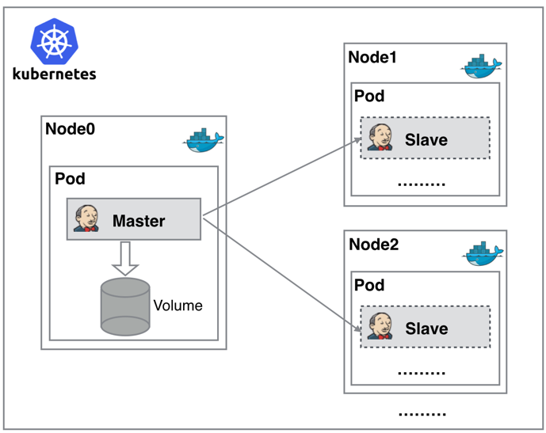
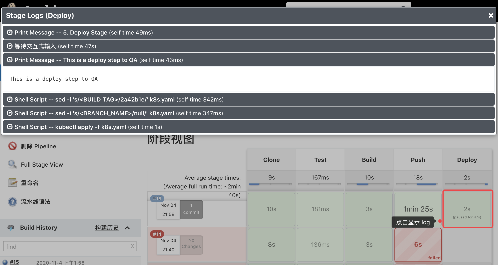

# 基于 Jenkins 的 CI/CD

持续构建与发布是日常工作中必不可少的一个步骤，目前大多公司都采用 [Jenkins](https://www.jenkins.io/zh/) 集群来搭建符合需求的 CI/CD 流程，然而传统的 Jenkins Slave 一主多从方式会存在一些痛点，比如：

- 主 Master 发生单点故障时，整个流程都不可用了
- 每个 Slave 的配置环境不一样，来完成不同语言的编译打包等操作，但是这些差异化的配置导致管理起来非常不方便，维护起来也是比较费劲
- 资源分配不均衡，有的 Slave 要运行的 job 出现排队等待，而有的 Slave 处于空闲状态
- 资源有浪费，每台 Slave 可能是物理机或者虚拟机，当 Slave 处于空闲状态时，也不会完全释放掉资源。

正因为上面的这些种种痛点，渴望一种更高效更可靠的方式来完成这个 CI/CD 流程，而 Docker 虚拟化容器技术能很好的解决这个痛点，又特别是在 Kubernetes 集群环境下面能够更好来解决上面的问题，下图是基于 Kubernetes 搭建 Jenkins 集群的简单示意图： 



从图上可以看到 Jenkins Master 和 Jenkins Slave 以 Pod 形式运行在 Kubernetes 集群的 Node 上，Master 运行在其中一个节点，并且将其配置数据存储到一个 Volume 上去，Slave 运行在各个节点上，并且它不是一直处于运行状态，它会按照需求动态的创建并自动删除。

这种方式的工作流程大致为：当 Jenkins Master 接受到 Build 请求时，会根据配置的 Label 动态创建一个运行在 Pod 中的 Jenkins Slave 并注册到 Master 上，当运行完 Job 后，这个 Slave 会被注销并且这个 Pod 也会自动删除，恢复到最初状态。

使用这种方式带来的好处：

- **服务高可用**：当 Jenkins Master 出现故障时，Kubernetes 会自动创建一个新的 Jenkins Master 容器，并且将 Volume 分配给新创建的容器，保证数据不丢失，从而达到集群服务高可用。
- **动态伸缩**：合理使用资源，每次运行 Job 时，会自动创建一个 Jenkins Slave，Job 完成后，Slave 自动注销并删除容器，资源自动释放，而且 Kubernetes 会根据每个资源的使用情况，动态分配 Slave 到空闲的节点上创建，降低出现因某节点资源利用率高，还排队等待在该节点的情况。
- **扩展性好**：当 Kubernetes 集群的资源严重不足而导致 Job 排队等待时，可以很容易的添加一个 Kubernetes Node 到集群中，从而实现扩展。

## 安装 Jenkins Master

既然要基于`Kubernetes`来做`CI/CD`，这里需要将 [Jenkins](https://www.jenkins.io/zh/) 安装到 Kubernetes 集群当中，新建一个 Deployment：(jenkins2.yaml)

> 前提：集群中可以使用 PVC

```yaml
---
apiVersion: apps/v1
kind: Deployment
metadata:
  name: jenkins2
  namespace: kube-ops
spec: 
  selector:
    matchLabels:
      app: jenkins2
  template:
    metadata:
      labels:
        app: jenkins2
    spec:
      terminationGracePeriodSeconds: 10
      serviceAccount: jenkins2
      containers:
      - name: jenkins
        image: jenkins/jenkins:lts
        imagePullPolicy: IfNotPresent
        ports:
        - containerPort: 8080
          name: web
          protocol: TCP
        - containerPort: 50000
          name: agent
          protocol: TCP
        resources:
          limits:
            cpu: 1000m
            memory: 1Gi
          requests:
            cpu: 500m
            memory: 512Mi
        livenessProbe:
          httpGet:
            path: /login
            port: 8080
          initialDelaySeconds: 60
          timeoutSeconds: 5
          failureThreshold: 12
        readinessProbe:
          httpGet:
            path: /login
            port: 8080
          initialDelaySeconds: 60
          timeoutSeconds: 5
          failureThreshold: 12
        volumeMounts:
        - name: jenkinshome
          subPath: jenkins2
          mountPath: /var/jenkins_home
      securityContext:
        fsGroup: 1000
      volumes:
      - name: jenkinshome
        persistentVolumeClaim:
          claimName: opspvc

---
apiVersion: v1
kind: Service
metadata:
  name: jenkins2
  namespace: kube-ops
  labels:
    app: jenkins2
spec:
  selector:
    app: jenkins2
  type: NodePort
  ports:
  - name: web
    port: 8080
    targetPort: web
    nodePort: 30002
  - name: agent
    port: 50000
    targetPort: agent
```

这里将所有的对象资源都放置在一个名为 kube-ops 的 namespace 下面：

```shell
$ kubectl create namespace kube-ops
```

这里使用一个名为 jenkins/jenkins:lts 的镜像，这是 jenkins 官方的 Docker 镜像，然后也有一些环境变量，当然也可以根据自己的需求来定制一个镜像，比如可以将一些插件打包在自定义的镜像当中，可以参考文档：https://github.com/jenkinsci/docker，我们这里使用默认的官方镜像就行，另外一个还需要注意的是将容器的 `/var/jenkins_home` 目录挂载到了一个名为 `opspvc` 的 PVC 对象上面，所以同样还得提前**创建一个对应的 PVC 对象**，当然也可以使用 **StorageClass** 对象来自动创建：(pvc.yaml)

```yaml
apiVersion: v1
kind: PersistentVolume
metadata:
  name: opspv
spec:
  capacity:
    storage: 20Gi
  accessModes:
  - ReadWriteMany
  persistentVolumeReclaimPolicy: Delete
  nfs:
    server: 42.194.158.74
    path: /data/k8s

---
kind: PersistentVolumeClaim
apiVersion: v1
metadata:
  name: opspvc
  namespace: kube-ops
spec:
  accessModes:
    - ReadWriteMany
  resources:
    requests:
      storage: 20Gi
```

创建需要用到的 PVC 对象：

```shell
$ kubectl create -f pvc.yaml
```

另外这里还需要使用到一个拥有相关权限的 serviceAccount：jenkins2，我们这里只是给 jenkins 赋予了一些必要的权限，当然如果你对 serviceAccount 的权限不是很熟悉的话，给这个 SA 绑定一个 cluster-admin 的集群角色权限也是可以的，当然这样具有一定的安全风险：（rbac.yaml）

```yaml
apiVersion: v1
kind: ServiceAccount
metadata:
  name: jenkins2
  namespace: kube-ops

---

kind: ClusterRole
apiVersion: rbac.authorization.k8s.io/v1beta1
metadata:
  name: jenkins2
rules:
  - apiGroups: ["extensions", "apps"]
    resources: ["deployments"]
    verbs: ["create", "delete", "get", "list", "watch", "patch", "update"]
  - apiGroups: [""]
    resources: ["services"]
    verbs: ["create", "delete", "get", "list", "watch", "patch", "update"]
  - apiGroups: [""]
    resources: ["pods"]
    verbs: ["create","delete","get","list","patch","update","watch"]
  - apiGroups: [""]
    resources: ["pods/exec"]
    verbs: ["create","delete","get","list","patch","update","watch"]
  - apiGroups: [""]
    resources: ["pods/log"]
    verbs: ["get","list","watch"]
  - apiGroups: [""]
    resources: ["secrets"]
    verbs: ["get"]

---
apiVersion: rbac.authorization.k8s.io/v1beta1
kind: ClusterRoleBinding
metadata:
  name: jenkins2
  namespace: kube-ops
roleRef:
  apiGroup: rbac.authorization.k8s.io
  kind: ClusterRole
  name: jenkins2
subjects:
  - kind: ServiceAccount
    name: jenkins2
    namespace: kube-ops
```

创建 RBAC 相关的资源对象：

```shell
$ kubectl create -f rbac.yaml
serviceaccount "jenkins2" created
role.rbac.authorization.k8s.io "jenkins2" created
rolebinding.rbac.authorization.k8s.io "jenkins2" created
```

最后为了方便测试，这里通过 NodePort 的形式来暴露 Jenkins 的 **web** 服务，固定为 30002 端口，另外还需要暴露一个 **agent** 的端口，这个端口主要是用于 Jenkins 的 master 和 slave 之间通信使用的。

一切准备的资源准备好过后，直接创建 Jenkins 服务：

```yaml
$ kubectl create -f jenkins2.yaml
deployment.extensions "jenkins2" created
service "jenkins2" created
```

创建完成后，要去拉取镜像可能需要等待一会儿，然后我们查看下 Pod 的状态：

```shell
$ kubectl get pods -n kube-ops
NAME                        READY     STATUS    RESTARTS   AGE
jenkins2-7f5494cd44-pqpzs   0/1       Running   0          2m
```

可以看到该 Pod 处于 Running 状态，但是 READY 值确为 0，然后用 describe 命令去查看下该 Pod 的详细信息：

```shell
$ kubectl describe pod jenkins2-7f5494cd44-pqpzs -n kube-ops
...
Normal   Created                3m                kubelet, node01    Created container
  Normal   Started                3m                kubelet, node01    Started container
  Warning  Unhealthy              1m (x10 over 2m)  kubelet, node01    Liveness probe failed: Get http://10.244.1.165:8080/login: dial tcp 10.244.1.165:8080: getsockopt: connection refused
  Warning  Unhealthy              1m (x10 over 2m)  kubelet, node01    Readiness probe failed: Get http://10.244.1.165:8080/login: dial tcp 10.244.1.165:8080: getsockopt: connection refused
```

可以看到上面的 Warning 信息，健康检查没有通过，可以通过查看日志进一步了解：

```shell
$ kubectl logs -f jenkins2-7f5494cd44-pqpzs -n kube-ops
touch: cannot touch '/var/jenkins_home/copy_reference_file.log': Permission denied
Can not write to /var/jenkins_home/copy_reference_file.log. Wrong volume permissions?
```

很明显可以看到上面的错误信息，意思就是：当前用户没有权限在 jenkins 的 home 目录下面创建文件，这是因为默认的镜像使用的是 jenkins 这个用户，而通过 PVC 挂载到 NFS 服务器的共享数据目录下面却是 root 用户的，所以没有权限访问该目录，要解决该问题，也很简单，只需要在 NFS 共享数据目录下面把目录权限重新分配下即可：

```shell
$ chown -R 1000 /data/k8s/jenkins2
```

> 当然还有另外一种方法是：自定义一个镜像，在镜像中指定使用 root 用户也可以

然后再重新创建：

```shell
$ kubectl delete -f jenkins.yaml
deployment.extensions "jenkins2" deleted
service "jenkins2" deleted
$ kubectl create -f jenkins.yaml
deployment.extensions "jenkins2" created
service "jenkins2" created
```

现在我们再去查看新生成的 Pod 已经没有错误信息了：

```shell
$ kubectl get pods -n kube-ops
NAME                        READY     STATUS        RESTARTS   AGE
jenkins2-7f5494cd44-smn2r   1/1       Running       0          25s
```

等到服务启动成功后，我们就可以根据任意节点的 IP:30002 端口就可以访问 jenkins 服务了，可以根据提示信息进行安装配置即可： 初始化的密码可以在 jenkins 的容器的日志中进行查看，也可以直接在 NFS 的共享数据目录中查看：

```shell
$ cat /data/k8s/jenkins2/secrets/initialAdminPassword
```

然后选择安装推荐的插件即可：

安装完成后添加管理员帐号即可进入到 jenkins 主界面： 


## 配置 Jenkins Slave

接下来就需要来配置 Jenkins，让他能够动态的生成 Slave 的 Pod。

第1步：需要安装 **kubernetes plugin**， 点击 Manage Jenkins -> Manage Plugins -> Available -> Kubernetes plugin 勾选安装即可。 


第2步： 安装完毕后，点击 Manage Jenkins —> Configure System —> (拖到最下方的 Cloud，点击 a separate configuration page) —> Add a new cloud —> 选择 Kubernetes，然后填写 Kubernetes 和 Jenkins 配置信息。


* Kubernetes 名称：kubernetes

* Kubernetes 地址：https://kubernetes.default.svc.cluster.local

* Kubernetes 命名空间： kube-ops

  > 然后点击 **连接测试**，如果出现 `Connected to Kubernetes 1.18` 的提示信息证明 Jenkins 已经可以和 Kubernetes 系统正常通信了。如果失败的话，很有可能是权限问题，这里就需要把创建的 jenkins 的 serviceAccount 对应的 secret 添加到这里的 Credentials 里面。

* Jenkins URL 地址：http://jenkins2.kube-ops.svc.cluster.local:8080

  > 这里的格式为：服务名.namespace.svc.cluster.local:8080

第3步：配置 Pod Template，其实就是配置 Jenkins Slave 运行的 Pod 模板

* 名称：jnlp
* 命名空间：kube-ops
* Labels ：haimaxy-jnlp，这里也非常重要，对于后面执行 Job 的时候需要用到该值
* 容器：使用 cnych/jenkins:jnlp 镜像，这个镜像是在官方的 jnlp 镜像基础上定制的，加入了 kubectl 等一些实用的工具 

> 注意：由于新版本的 Kubernetes 插件变化较多，如果你使用的 Jenkins 版本在 2.176.x 版本以上，注意将上面的镜像替换成`cnych/jenkins:jnlp6`，否则使用会报错，配置如下图所示：


另外需要注意挂载两个主机目录，一个是`/var/run/docker.sock`，该文件是用于 Pod 中的容器能够共享宿主机的 Docker，这就是大家说的 docker in docker 的方式，Docker 二进制文件我们已经打包到上面的镜像中了，另外一个目录下`/root/.kube`目录，将这个目录挂载到容器的`/root/.kube`目录下面这是为了能够在 Pod 的容器中能够使用 kubectl 工具来访问的 Kubernetes 集群，方便后面在 Slave Pod 部署 Kubernetes 应用。 

另外还有几个参数需要注意，如下图中的**Time in minutes to retain slave when idle**，这个参数表示的意思是当处于空闲状态的时候保留 Slave Pod 多长时间，这个参数最好保存默认就行了，如果你设置过大的话，Job 任务执行完成后，对应的 Slave Pod 就不会立即被销毁删除。 

另外一些用户在配置了后运行 Slave Pod 的时候出现了权限问题，因为 Jenkins Slave Pod 中没有配置权限，所以需要配置上 ServiceAccount，在 Slave Pod 配置的地方点击下面的高级，添加上对应的 ServiceAccount 即可： 

还有一些用户在配置完成后发现启动 Jenkins Slave Pod 的时候，出现 Slave Pod 连接不上，然后尝试100次连接之后销毁 Pod，然后会再创建一个 Slave Pod 继续尝试连接，无限循环，类似于下面的信息： 

如果出现这种情况的话就需要将 Slave Pod 中的运行命令和参数两个值给清空掉 

到这里我们的 Kubernetes Plugin 插件就算配置完成了。

## 测试

Kubernetes 插件的配置工作完成了，接下来添加一个 Job 任务，看是否能够在 Slave Pod 中执行，任务执行完成后看 Pod 是否会被销毁。

在 Jenkins 首页点击 **新建item**，创建一个测试的任务，输入任务名称，然后选择 Freestyle project 类型的任务：

 

注意在下面的 Label Expression 这里要填入**haimaxy-jnlp**，就是前面配置的 Slave Pod 中的 Label，这两个地方必须保持一致 


然后往下拉，在 Build 区域选择**Execute shell** 


然后输入测试命令

```shell
echo "测试 Kubernetes 动态生成 jenkins slave"
echo "==============docker in docker==========="
docker info

echo "=============kubectl============="
kubectl get pods
```

最后点击保存：


现在直接在页面点击做成的 Build now 触发构建即可，然后观察 Kubernetes 集群中 Pod 的变化：

```shell
$ kubectl get pods -n kube-ops
NAME                       READY     STATUS              RESTARTS   AGE
jenkins2-7c85b6f4bd-rfqgv   1/1       Running             3          1d
jnlp-9gjhr                 0/1       ContainerCreating   0          7s
```

可以看到在点击“立刻构建”的时候可以看到一个新的 Pod：jnlp-9gjhr 被创建了，这就是 Jenkins Slave。任务执行完成后可以看到任务信息，如下图所示：比如这里是花费了 2.3s 时间在 jnlp-hfmvd 这个 Slave上面：

> 如果没有看见新的 Pod：jnlp-9gjhr，可能原因是已经构建完成，Pod 被自动删除了。


同样也可以查看到对应的控制台信息： 


到这里证明任务已经构建完成，然后这个时候再去集群查看我们的 Pod 列表，发现 kube-ops 这个 namespace 下面已经没有之前的 Slave 这个 Pod 了。

```shell
$ kubectl get pods -n kube-ops
NAME                       READY     STATUS    RESTARTS   AGE
jenkins2-7c85b6f4bd-rfqgv   1/1       Running   3          1d
```

## Jenkins Pipeline

要实现在 Jenkins 中的构建工作，可以有多种方式，比如 Pipeline。简单来说，就是一套运行在 Jenkins 上的工作流框架，将原来独立运行于单个或者多个节点的任务连接起来，实现单个任务难以完成的复杂流程**编排**和**可视化**的工作。

Jenkins Pipeline 核心概念：

- Node：节点，一个 Node 就是一个 Jenkins 节点，Master 或者 Agent，是执行 Step 的具体运行环境，比如[上面](#配置 Jenkins Slave)动态运行的 Jenkins Slave 就是一个 Node 节点
- Stage：阶段，一个 Pipeline 可以划分为若干个 Stage，每个 Stage 代表一组操作，比如：Build、Test、Deploy，Stage 是一个逻辑分组的概念，可以跨多个 Node
- Step：步骤，Step 是最基本的操作单元，可以是打印一句话，也可以是构建一个 Docker 镜像，由各类 Jenkins 插件提供，比如命令：sh 'make'，就相当于平时 shell 终端中执行 make 命令一样。

创建 Jenkins Pipline：

- Pipeline 脚本是由 [Groovy](http://www.groovy-lang.org) 语言实现的
- Pipeline 支持两种语法：Declarative(声明式)和 Scripted Pipeline(脚本式)语法
- Pipeline 也有两种创建方法：可以直接在 Jenkins 的 Web UI 界面中输入脚本；也可以通过创建一个 Jenkinsfile 脚本文件放入项目源码库中
- 一般推荐在 Jenkins 中直接从源代码控制(SCMD)中直接载入 Jenkinsfile Pipeline 这种方法

### 创建一个简单的 Pipeline

这里快速创建一个简单的 Pipeline，直接在 Jenkins 的 Web UI 界面中输入脚本运行。

- 新建 Job：在 Web UI 中点击 “新建任务” -> 输入名称：pipeline-demo -> 选择下面的 “流水线” -> 点击 OK

- 配置：在最下方的 Pipeline 区域输入如下 Script 脚本，然后点击保存。

  ```shell
  node {
    stage('Clone') {
      echo "1.Clone Stage"
    }
    stage('Test') {
      echo "2.Test Stage"
    }
    stage('Build') {
      echo "3.Build Stage"
    }
    stage('Deploy') {
      echo "4. Deploy Stage"
    }
  }
  ```

- 构建：点击左侧区域的 “立即构建”，可以看到 Job 开始构建了

隔一会儿，构建完成，可以点击左侧区域的 Console Output，就可以看到如下输出信息：


可以看到上面 Pipeline 脚本中的4条输出语句都打印出来了，证明是符合预期的。

> 如果对 Pipeline 语法不是特别熟悉的，可以点击脚本的下面的“流水线语法”进行查看，这里有很多关于 Pipeline 语法的介绍，也可以自动帮我们生成一些脚本。
>
> 

### 在 Slave 中构建任务

上面创建了一个简单的 Pipeline 任务，但是可以看到这个任务并没有在 Jenkins 的 Slave 中运行，那么如何让我们的任务跑在 Slave 中呢？之前在添加 Slave Pod 的时候，有为其添加的 label，因此在创建任务的时候，可以通过 label 的形式将任务运行在指定 Slave 中。重新编辑上面创建的 Pipeline 脚本，给 node 添加一个 label 属性，如下：

```shell
node('haimaxy-jnlp') {
    stage('Clone') {
      echo "1.Clone Stage"
    }
    stage('Test') {
      echo "2.Test Stage"
    }
    stage('Build') {
      echo "3.Build Stage"
    }
    stage('Deploy') {
      echo "4. Deploy Stage"
    }
}
```

这里只是给 node 添加了一个 haimaxy-jnlp 这样的一个 label，然后保存，构建之前查看下 kubernetes 集群中的 Pod：

```shell
$ kubectl get pods -n kube-ops
NAME                       READY     STATUS              RESTARTS   AGE
jenkins-7c85b6f4bd-rfqgv   1/1       Running             4          6d
```

然后重新触发“立刻构建”：

```shell
$ kubectl get pods -n kube-ops
NAME                       READY     STATUS    RESTARTS   AGE
jenkins-7c85b6f4bd-rfqgv   1/1       Running   4          6d
jnlp-ntn1s                 1/1       Running   0          23s
```

发现多了一个名叫**jnlp-ntn1s**的 Pod 正在运行，隔一会儿这个 Pod 就不再了：

```
$ kubectl get pods -n kube-ops
NAME                       READY     STATUS    RESTARTS   AGE
jenkins-7c85b6f4bd-rfqgv   1/1       Running   4          6d
```

这也证明 Job 构建完成了，同样回到 Jenkins 的 Web UI 界面中查看 Console Output，可以看到如下的信息：


由此证明当前的任务在跑在上面动态生成的这个 Pod 中。回到任务的主界面，也可以看到“阶段视图”界面：


### 部署 Kubernetes 应用

要部署 Kubernetes 应用，熟悉一下 Kubernetes 应用的部署流程：

- 编写代码
- 测试
- 编写 Dockerfile
- 构建打包 Docker 镜像
- 推送 Docker 镜像到仓库
- 编写 Kubernetes YAML 文件
- 更改 YAML 文件中 Docker 镜像 TAG
- 利用 kubectl 工具部署应用

需要把上面这些流程放入 Jenkins 中来自动完成(编码除外)，从测试到更新 YAML 文件属于 CI 流程，后面部署属于 CD 的流程。如果按照上面的示例，现在要来编写一个 Pipeline 的脚本：

```shell
node('haimaxy-jnlp') {
    stage('Clone') {
      echo "1.Clone Stage"
    }
    stage('Test') {
      echo "2.Test Stage"
    }
    stage('Build') {
      echo "3.Build Docker Image Stage"
    }
    stage('Push') {
      echo "4.Push Docker Image Stage"
    }
    stage('YAML') {
      echo "5. Change YAML File Stage"
    }
    stage('Deploy') {
      echo "6. Deploy Stage"
    }
}
```

这里将一个简单 golang 程序，部署到 kubernetes 环境中，代码链接：https://github.com/willemswang/jenkins-demo。如果按照之前的示例，Pipeline 脚本编写顺序如下：

- 第一步，clone 代码
- 第二步，进行测试，如果测试通过了才继续下面的任务
- 第三步，由于 Dockerfile 基本上都是放入源码中进行管理的，所以这里就是直接构建 Docker 镜像了
- 第四步，镜像打包完成，推送到镜像仓库
- 第五步，镜像推送完成，更改 YAML 文件中的镜像 TAG 为这次镜像的 TAG
- 第六步，使用 kubectl 命令行工具进行部署了

到这里整个 CI/CD 的流程就完成了。

接下来对每一步具体要做的事情进行详细描述：

#### 第一步：Clone 代码

```shell
stage('Clone') {
    echo "1.Clone Stage"
    git url: "https://github.com/willemswang/jenkins-demo.git"
}
```

#### 第二步：测试

由于示例代码比较简单，可以忽略该步骤

#### 第三步：构建镜像

```shell
stage('Build') {
    echo "3.Build Docker Image Stage"
    sh "docker build -t default.registry.tke.com/library/jenkins-demo:${build_tag} ."
}
```

平时构建的时候一般是直接使用`docker build`命令进行构建就行了，但是 Slave Pod 的镜像里面采用的是 Docker In Docker 的方式，也就是说可以直接在 Slave 中使用 docker build 命令，所以这里可以直接使用 sh 直接执行 docker build 命令即可。但是镜像的 tag 呢？如果使用镜像 tag，则每次都是 latest 的 tag，这对于以后的排查或者回滚之类的工作会带来很大麻烦，这里可以采用和 **git commit**的记录为镜像的 tag，这里的好处就是镜像的 tag 可以和 git 提交记录对应起来，也方便日后对应查看。但是由于这个 tag 不只是这一个 stage 需要使用，下一个推送镜像是不是也需要，所以这里把 tag 编写成一个公共的参数，把它放在 Clone 这个 stage 中，这样一来前两个 stage 就变成了下面这个样子：

```shell
stage('Clone') {
    echo "1.Clone Stage"
    git url: "https://github.com/willemswang/jenkins-demo.git"
    script {
        build_tag = sh(returnStdout: true, script: 'git rev-parse --short HEAD').trim()
    }
}
stage('Build') {
    echo "3.Build Docker Image Stage"
    sh "docker build -t default.registry.tke.com/library/jenkins-demo:${build_tag} ."
}
```

#### 第四步：推送镜像

镜像构建完成了，现在就需要将此处构建的镜像推送到镜像仓库中去，可以是私有镜像仓库，也可以直接使用 docker hub 即可。

docker hub 是公共的镜像仓库，任何人都可以获取上面的镜像，但是要往上推送镜像就需要用到一个帐号了，所以需要提前注册一个 docker hub 的帐号，记住用户名和密码，这里需要使用。正常来说在本地推送 docker 镜像的时候，需要使用**docker login**命令，然后输入用户名和密码，认证通过后，就可以使用**docker push**命令来推送本地的镜像到 docker hub 上面去了。此外，由于 TKEStack 本身提供了镜像仓库的能力，因此，这里以使用 TKEStack的镜像仓库：

```shell
stage('Push') {
    echo "4.Push Docker Image Stage"
    sh "docker login -u tkestack -p 【访问凭证】 default.registry.tke.com"
    sh "docker push default.registry.tke.com/library/jenkins-demo:${build_tag}"
}
```

如果只是在 Jenkins 的 Web UI 界面中来完成这个任务的话，这里的 Pipeline 是可以这样写的。但一般推荐使用 Jenkinsfile 的形式放入源码中进行版本管理，这样同时会引发另一个问题：直接把镜像仓库的用户名和密码暴露给别人了，很显然是非常不安全的，更何况这里使用的是 github 的公共代码仓库，所有人都可以直接看到源码，所以应该用一种方式来隐藏用户名和密码这种私密信息，幸运的是 Jenkins 提供了解决方法。

在首页点击 “系统管理” -> Manage Credentials -> 全局凭据 Global credentials (unrestricted) -> 左侧的添加凭据：添加一个 Username with password 类型的认证信息，如下：


输入 docker hub 的用户名和密码，ID 部分输入**TKEStack**，注意，这个值非常重要，在后面 Pipeline 的脚本中我们需要使用到这个 ID 值。

有了上面的镜像仓库的用户名和密码的认证信息，现在可以在 Pipeline 中使用这里的用户名和密码了：

```shell
stage('Push') {
    echo "4.Push Docker Image Stage"
    withCredentials([usernamePassword(credentialsId: 'TKEStack', passwordVariable: 'TKEStackPassword', usernameVariable: 'TKEStackUser')]) {
        sh "docker login -u ${TKEStackUser} -p ${TKEStackPassword} default.registry.tke.com"
        sh "docker push default.registry.tke.com/library/jenkins-demo:${build_tag}"
    }
}
```

注意这里在 stage 中使用了一个新的函数 **withCredentials**，其中有一个 credentialsId 值就是刚刚创建的 ID 值，而对应的用户名变量就是 ID 值加上 User，密码变量就是 ID 值加上 Password，然后就可以在脚本中直接使用这里两个变量值来直接替换掉之前的登录镜像仓库的用户名和密码，现在就很安全了，只是传递进去了两个变量而已，别人并不知道真正用户名和密码，只有自己的 Jenkins 平台上添加的才知道。

#### 第五步：更改 YAML

上面已经完成了镜像的打包、推送的工作，接下来应该更新 Kubernetes 系统中应用的镜像版本了，当然为了方便维护，都是用 YAML 文件的形式来编写应用部署规则，比如这里的 YAML 文件：(k8s.yaml)

```yaml
apiVersion: app/v1
kind: Deployment
metadata:
  name: jenkins-demo
  namespace: kube-ops
spec:
  selector:
    matchLabels:
      app: jenkins-demo
  template:
    metadata:
      labels:
        app: jenkins-demo
    spec:
      containers:
      - image: default.registry.tke.com/library/jenkins-demo:<BUILD_TAG>
        imagePullPolicy: IfNotPresent
        name: jenkins-demo
        env:
        - name: branch
          value: <BRANCH_NAME>
```

这个 YAML 文件使用一个 Deployment 资源对象来管理 Pod，该 Pod 使用的就是上面推送的镜像，唯一不同的地方是 Docker 镜像的 tag 不是平常见的具体的 tag，而是一个标识，实际上如果将这个标识替换成上面的 Docker 镜像的 tag，就是最终本次构建需要使用到的镜像，可以使用一个**sed**命令就可以实现tag的替换：

```shell
stage('YAML') {
    echo "5. Change YAML File Stage"
    sh "sed -i 's/<BUILD_TAG>/${build_tag}/' k8s.yaml"
    sh "sed -i 's/<BRANCH_NAME>/${env.BRANCH_NAME}/' k8s.yaml"
}
```

上面的 sed 命令就是将 k8s.yaml 文件中的 标识给替换成变量 build_tag 的值。

#### 第六步：部署

Kubernetes 应用的 YAML 文件已经更改完成了，之前手动的环境下，直接使用 kubectl apply 命令就可以直接更新应用，当然这里只是写入到了 Pipeline 里面，思路都是一样的：

```shell
stage('Deploy') {
    echo "6. Deploy Stage"
    sh "kubectl apply -f k8s.yaml"
}
```

这样到这里整个流程就算完成了。

### 人工确认

理论上来说上面的6个步骤其实已经完成了，但是一般在实际项目实践过程中，可能还需要一些人工干预的步骤。这是因为比如提交了一次代码，测试也通过了，镜像也打包上传了，但是这个版本并不一定就是要立刻上线到生产环境的，可能需要将该版本先发布到测试环境、QA 环境、或者预览环境之类的，总之直接就发布到线上环境去还是挺少见的，所以需要增加人工确认的环节，一般都是在 CD 的环节才需要人工干预，比如这里的最后两步，就可以在前面加上确认，比如：

```shell
stage('YAML') {
    echo "5. Change YAML File Stage"
    def userInput = input(
        id: 'userInput',
        message: 'Choose a deploy environment',
        parameters: [
            [
                $class: 'ChoiceParameterDefinition',
                choices: "Dev\nQA\nProd",
                name: 'Env'
            ]
        ]
    )
    echo "This is a deploy step to ${userInput.Env}"
    sh "sed -i 's/<BUILD_TAG>/${build_tag}/' k8s.yaml"
    sh "sed -i 's/<BRANCH_NAME>/${env.BRANCH_NAME}/' k8s.yaml"
}
```

这里使用了 input 关键字，里面使用一个 Choice 的列表来让用户进行选择，然后选择了部署环境后，当然也可以针对不同的环境再做一些操作，比如可以给不同环境的 YAML 文件部署到不同的 namespace 下面去，增加不同的标签等等操作：

```shell
stage('Deploy') {
    echo "6. Deploy Stage"
    if (userInput.Env == "Dev") {
      // deploy dev stuff
    } else if (userInput.Env == "QA"){
      // deploy qa stuff
    } else {
      // deploy prod stuff
    }
    sh "kubectl apply -f k8s.yaml"
}
```

由于这一步也属于部署的范畴，所以可以将最后两步都合并成一步，我们最终的 Pipeline 脚本如下：

```shell
node('haimaxy-jnlp') {
    stage('Clone') {
        echo "1.Clone Stage"
        git url: "https://github.com/willemswang/jenkins-demo.git"
        script {
            build_tag = sh(returnStdout: true, script: 'git rev-parse --short HEAD').trim()
        }
    }
    stage('Test') {
      echo "2.Test Stage"
    }
    stage('Build') {
        echo "3.Build Docker Image Stage"
        sh "docker build -t default.registry.tke.com/library/jenkins-demo:${build_tag} ."
    }
    stage('Push') {
        echo "4.Push Docker Image Stage"
        withCredentials([usernamePassword(credentialsId: 'TKEStack', passwordVariable: 'TKEStackPassword', usernameVariable: 'TKEStackUser')]) {
            sh "docker login -u ${TKEStackUser} -p ${TKEStackPassword} default.registry.tke.com"
            sh "docker push default.registry.tke.com/library/jenkins-demo:${build_tag}"
        }
    }
    stage('Deploy') {
        echo "5. Deploy Stage"
        def userInput = input(
            id: 'userInput',
            message: 'Choose a deploy environment',
            parameters: [
                [
                    $class: 'ChoiceParameterDefinition',
                    choices: "Dev\nQA\nProd",
                    name: 'Env'
                ]
            ]
        )
        echo "This is a deploy step to ${userInput}"
        sh "sed -i 's/<BUILD_TAG>/${build_tag}/' k8s.yaml"
        sh "sed -i 's/<BRANCH_NAME>/${env.BRANCH_NAME}/' k8s.yaml"
        if (userInput == "Dev") {
            // deploy dev stuff
        } else if (userInput == "QA"){
            // deploy qa stuff
        } else {
            // deploy prod stuff
        }
        sh "kubectl apply -f k8s.yaml"
    }
}
```

现在可以在 Jenkins Web UI 中重新配置 pipeline-demo 这个任务，将上面的脚本粘贴到 Script 区域，重新保存，然后点击左侧的 Build Now，触发构建，然后过一会儿就可以看到 Stage View 界面出现了暂停的情况：


这就是上面 Deploy 阶段加入了人工确认的步骤，所以这个时候构建暂停了，需要人为的确认下，比如这里选择 “QA”，然后点击“继续”，就可以继续往下走了，然后构建就成功了，在 Stage View 的 Deploy 这个阶段可以看到如下的一些日志信息：



由上面白色一行可以看出当前打印出来了 QA，和选择是一致的，现在去 Kubernetes 集群中观察下部署的应用：

```shell
[root@VM-222-139-centos ~]# kubectl get deploy
NAME           READY   UP-TO-DATE   AVAILABLE   AGE
jenkins-demo   0/1     1            0           61s
jenkins2       1/1     1            1           26h
[root@VM-222-139-centos ~]# kubectl get pods
NAME                           READY   STATUS             RESTARTS   AGE
jenkins-demo-b47c7684c-mvpkm   0/1     CrashLoopBackOff   3          62s
jenkins2-7f6cb7d69c-2hnzg      1/1     Running            0          10h
[root@VM-222-139-centos ~]# kubectl logs jenkins-demo-b47c7684c-mvpkm
Hello, Kubernetes！I'm from Jenkins CI！
BRANCH_NAME:
```

可以看到应用已经正确的部署到了 Kubernetes 的集群环境中了。

## Jenkinsfile

这里完成了一次手动的添加任务的构建过程，在实际的工作实践中，更多的是将 Pipeline 脚本写入到 Jenkinsfile 文件中，然后和代码一起提交到代码仓库中进行版本管理。现在将上面的 Pipeline 脚本拷贝到一个 Jenkinsfile 中，将该文件放入上面的 git 仓库中，但是要注意的是，现在既然已经在 git 仓库中了，是不是就不需要 git clone 这一步骤了，所以需要将第一步 Clone 操作中的 git clone 这一步去掉，可以参考：https://github.com/willemswang/jenkins-demo/Jenkinsfile

更改上面的 jenkins-demo 这个任务，点击 Configure -> 最下方的 Pipeline 区域 -> 将之前的 Pipeline Script 更改成 Pipeline Script from SCM，然后根据实际情况填写上对应的仓库配置，要注意 Jenkinsfile 脚本路径：

