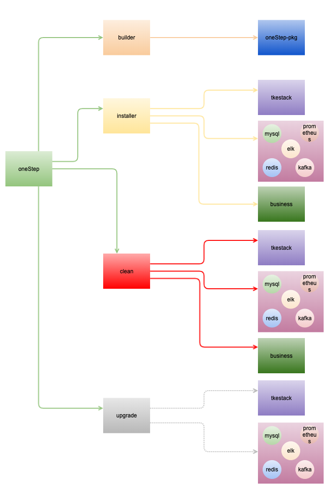

[TOC]

# oneStep README    

oneStep 意在针对小规模业务私有化一键部署, 当前oneStep 结合了skestack 实现了一键部署kubernete，运维基础组件，业务依赖基础组件，业务。当然为了针对已有kubernetes 环境也和tkestack 做了解耦；实现了组合式按需打包，按需部署。    

## oneStep 功能    

    

## oneStep 设计原则    

    

- 模板化：通过ansible template 组件+配置文件渲染最终要执行脚本或者yaml文件    
- 组合：组合方式打包和部署    
- 标准化：业务统一采用helmfile模式管理部署，oneStep不做业务配置渲染，只负责执行helmfile文件实现业务部署；ansible task 必须设置tag以便按tag执行对应操作；配置组件开关    
- 幂等：可重复操作；使用ansible set facts获取配置执行开关+ ansible register 获取执行结果 + ansible when 进行条件判断 + 执行的shell脚本增加执行判断实现幂等    
- 解耦：tkestack，基础组件，业务 解耦；也就是可以按需打包，按需部署    
- 扩展: 按照规范对基础组件的增加或移除(ansible tag + 开关 + ansible when)    

## oneStep 架构    

    

后续将支持tkestack 无缝升级，基础组件升级。    

## 更多    

对于进行扩展开发请参考《oneStep-dev-specifications.md》开发规范 和 《oneStep-dev-manual.md》开发手册; 对于构建打包请参考《onestep-builder-guide.md》 构建手册;  对于部署请参考《offline-pot-deploy-guide.md》部署手册。    

