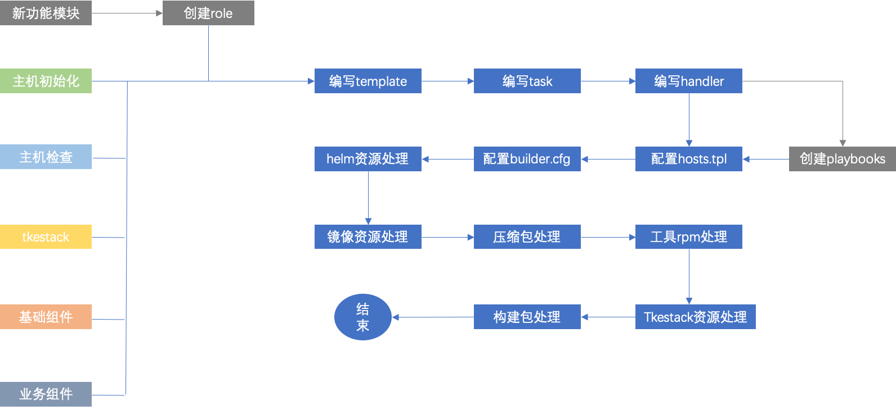

[TOC]

# oneStep 开发手册    

开发手册意在指导如何集成新组件。以及针对builder 按需构建，按需部署的开发指南。在阅读oneStep 开发手册前，请先阅读《oneStep-dev-specifications》(oneStep 开发规范)。当前将会按照ansible playbooks(roles) 定义的功能模块进行讲述。    

## oneStep 功能    

    

## oneStep 总体开发流程图    

     


## 增加新功能模块    

当前onestep ansible rolse 和 ansible playbooks 目录树如下：    

```
playbooks/
|-- base-component
|-- business
|-- hosts-check
|-- hosts-init
|-- operation-undo
`-- tke-mgr

roles/
|-- base-component
|-- business
|-- hosts-check
|-- hosts-init
|-- init_role.sh
|-- operation-undo
`-- tke-mgr

```    

当前支持的功能模块有：主机初始化，主机检查，tkestack 管理，基础组件，业务。  涉及部署前需要主机初始化操作的请在 hosts-init roles 下扩展，涉及部署前主机是否符合部署需求检查请在hosts-check rolese 下扩展，涉及tkestack 管理请在tke-mgr  roles下扩展，涉及业务依赖组件或者运维组件请在base-component roles下扩展，涉及业务请在business roles下扩展。若以上这些模块尚未包含可以通过 *init_role.sh* 脚本生成一个新的roles 进行扩展，需要注意ansible playbooks 目录名称和ansible roles 目录一一对应。无论扩展新模块还是扩展新的组件请务必保持模块化，组合化，幂等，耦合等开发规范。 如下是通常情况下新增模块操作流程图：    

        

接下来按流程图进行拆解开发步骤：    

- 创建roles    

    ```
    1. cd roles 
    2. sh init_role.sh ${role_name}    
    
    ```
    
- 编写template    
   
   若是当前新增模块的组件涉及脚本/配置文件等需要根据不同环境配置不同的值，推荐将脚本/配置文件抽象成模板文件，将需要渲染变量及值配置到ansible hosts.tpl 文件上，从而根据不同环境变化，利用ansible template 模块来渲染脚本/配置文件。    
        
- 编写task    
    
    roles的task 作为实际执行操作，对于组件类型的话通常分为部署，移除，健康检查；每个task项需要添加对应的tag，执行条件；具体的规范请参考《oneStep-dev-specifications》(开发规范)。对于其他的一些操作建议task包含正向操作+反向操作，正向操作统一一个tag，反向操作统一一个tag， 具体demo操作在下文新增组件处展现。    

- 编写handler      

   对于一些主机方式启动的服务，若修改了配置文件后通常需要重启，部署后执行启动，改配置前进行停止这些相关操作，建议使用ansible rolse 的 handler 来处理；handler会在ansible task 执行完操作后触发。    

- 创建playbooks        

   ansible playbooks 作为ansible 执行入口，创建一个和roles目录名一致的目录，并且在该目录下编写一个和playbooks 目录名一致的playbooks yml文件。    

- 配置host.tpl    

   其他都开发确认完毕后，将开关项等相关配置配置到hosts.tpl。    

- 配置builder.cfg        

   涉及组件需要将组件添加到builder.cfg 的 **all\_servers** 数组，而builder.cfg 的 **server\_set**   在打包，部署时候考虑是否需要部署此组件。    

- builder 相关集成    

   builder相关集成涉及模块/组件的相关离线资源获取，离线资源处理，离线资源打包。比如组件的helm文件获取，处理；组件镜像获取，处理，最后打包。

- 扩展内容操作同步到使用指南文档    

   完成新模块集成后，需要将此模块的配置解析，操作脚本编写到使用指南文档。    


## 主机初始化    

此处的主机初始化用来处理通用性初始化操作，组件相关的初始化请在组件处集成；主机初始化操作开发步骤如下：    

- 是否涉及yum install 方式安装，若是涉及yum install 安装需要将rpm 包下载并放到offline-yum-repo 镜像，步骤如下：    

   - 在一台尚未安装该工具机器(和操作系统版本耦合性强) 下载工具的rpm 包及其依赖，操作如下：    
      
      ```
      yum install -y --downloadonly --downloaddir=<directory> <package> 
      
      ```
      
   - 将下载下来的rpm 拷贝至构建机器与offline-pot 同级目录的offline-yum 目录的rpms 目录下，并执行docker build 命令构建出offline-yum-repo 镜像：    

      ```
      cd offline-yum/
      docker build -t registry.tke.com/library/yum-repo:v${number} .
      docker save registry.tke.com/library/yum-repo:v${number} > yum-repo.v${number}.tar
      rm -f ../offline-pot-images-base/yum-repo.*.tar
      cp yum-repo.v${number}.tar ../offline-pot-images-base/    
      
      ```    
      
      **注: yum 方式安装的工具和操作系统版本依赖比较强，所以后续若是由于依赖导致安装失败，需要针对该版本的操作系统重新下载工具的rpm及其依赖，然后重新构建offline-yum-repo 镜像，重新部署offline-yum-repo !!!**     

- 编写主机初始化template    
    
   若新增的主机初始化项涉及配置，或脚本的渲染请抽象成template文件。例子如下：    
    
   ```    
   cd  roles/hosts-init/templates/
   cat ntp.conf.client.j2 
   # For more information about this file, see the man pages
   # ntp.conf(5), ntp_acc(5), ntp_auth(5), ntp_clock(5), ntp_misc(5), ntp_mon(5).

   driftfile /var/lib/ntp/drift
    
   ...

   # config  ntp server for upstream ntp server
   server {{ groups['installer'][0] }}

   # allow ntp server modify time
   restrict {{ groups['installer'][0] }} nomodify notrap noquery
   disable monitor
   
   ```    

- 编写task    

   编写初始化执行操作task。例子如下:        
   
   ```
   cd roles/hosts-init/tasks/ 
   
   cat check-time-syn-service.yml 
   # check hosts whether config time syn service(ntpd or chronyd).if not will be intall time syn service.

   # check whether config time syn  # 增加注释说明此操作作用
   - name: check whether config time syn # 操作步骤名称见名知义，简述当前操作作用
     shell: if ([ `cat /etc/ntp.conf | grep ^server | wc -l` -ne 0  ] || \
            [ `cat /etc/chrony.conf | grep ^server | wc -l` -ne 0  ]); then \
            echo "True"; else echo "False";fi # shell 语句条件执行，实现幂等
     register: time_syn_state # 通过shell 获取执行结果注册到ansible变量作为判断条件
     ignore_errors: yes
     tags: check_time_syn # 增加tags，作为后续调用执行条件

   # install ntpd service
   - name: install ntpd service
     shell: yum clean all && yum --disablerepo=\* --enablerepo=offline-yum install -y ntp
     ignore_errors: yes
     when: time_syn_state.stdout == "False" and ansible_distribution == 'CentOS' # 通过when 实现条件判断是否执行此操作
     tags: check_time_syn

   # start ntpd server just installer host
   - name: start ntpd service on installer host
     systemd:
       state: started
       name: ntpd
     when: time_syn_state.stdout == "False" and inventory_hostname in groups['installer']
     tags: check_time_syn

   # enable ntpd server on installer host
   - name: enable ntpd server on installer host
     systemd:
       enabled: yes
       name: ntpd
       masked: no
     when: time_syn_state.stdout == "False" and inventory_hostname in groups['installer']
     tags: check_time_syn
 
   # set ntpd server config
   - name: set ntpd server config
     template: # 利用ansible template 模块渲染配置
       src: templates/ntp.conf.server.j2
       dest: /etc/ntp.conf
       mode: '0644'
     notify: restart ntpd # 执行完毕后调用handler 定义的task 执行重启操作。    
     when: time_syn_state.stdout == "False" and inventory_hostname in groups['installer']
     tags: check_time_syn

   # set ntpd client config
   - name: set ntpd client config
     template:
       src: templates/ntp.conf.client.j2
       dest: /etc/ntp.conf
       mode: '0644'
     when: time_syn_state.stdout == "False" and inventory_hostname not in groups['installer']
     tags: check_time_syn

   # ntp client sync ntp server time
   - name: ntp client sync ntp server time
     shell: ntpdate  "{{ groups['installer'][0] }}"
     when: time_syn_state.stdout == "False" and inventory_hostname not in groups['installer']
     tags: check_time_syn
   
   
   ```
    
- 编写handler    

   对于主机方式部署的进程，配置修改后需要重启建议采用handler方式处理。例子如下：    

   ```
   
   cd roles/hosts-init/handlers/
   
   vim main.yml 
   ---
   # handlers file for hosts-init
   
   ...
   
   # restart ntpd
   - name: restart ntpd
     systemd:
       name: ntpd
       state: restarted
     become: yes
   
   ```

- 集成到调用脚本    

  将该初始化项集成到初始化调用脚本。例子如下:    

   ```
   cd mgr-scripts/   
   
   vim host-init.sh
   
   1. 编写调用函数： 

   # check time sync service
   time_sync(){
     echo "###### check time sync service start ######"
     ansible-playbook -f 10 -i ../hosts --tags check_time_syn ../playbooks/hosts-init/hosts-init.yml \
     --extra-vars "hosts=${hosts}"
     echo "###### check time sync service end ######"
   }
   2. 将函数放到all_func 函数内作统一执行

   all_func(){
   
   ...
   time_sync
   ...
   
   }
   
   3. 将函数放到help函数，作为使用帮助提示。   

      help(){
      
         ...
         
         echo "time_sync: check time sync service whether deploy"
         ...
      
      }
   
   ```

- 是否需要在init-and-check.sh 做特殊处理。    

   init-and-check.sh 脚本通常作为一键部署初始化和检查的统一执行入口脚本，当前默认情况只有部署tkestack时会执行所有初始化函数。其他情况做了条件执行处理。另外需要注意的地方是： 若该初始化比较特殊建议通过在ansible hosts.tpl 上增加开关项，然后在task执行上增加执行条件。        

## 主机检查    

主机检查若是涉及压测等一些工具的安装当前均放到主机初始化上执行。开发步骤如下:    

- 编写主机初始化template    

   这是可选操作, 只有涉及脚本或配置渲染等才需要。操作目录为：    
   
   ```
   roles/hosts-check/templates/  -- 当前没有此需求，所以没有templates/ 目录。    
   
   ```        

- 编写主机检查task    

   编写主机检查执行task，操作目录：    
   
   ```
   roles/hosts-check/tasks/
   
   ```

-   编写handler      

     根据实际情况编写，检查一般不涉及。    
     
     ```
     roles/hosts-check/handlers
     
     ```

-   集成到调用脚本    

  将该检查项集成到主机检查调用脚本。例子如下:    
  
  ```
  cd mgr-scripts/    
  vim hosts-check.sh 
  
  1. 编写调用函数： 

   # check system and kernal version
   check_version(){
     echo "###### check system and kernal version start ######"
     ansible-playbook -f 10 -i ../hosts --tags check_system_kernal_version ../playbooks/hosts-check/hosts-check.yml \
     --extra-vars "hosts=${hosts}"
     echo "###### check system and kernal version end ######"
   }
   2. 将函数放到all_func 函数内作统一执行

   all_func(){
   
   ...
   check_version
   ...
   
   }
   
   3. 将函数放到help函数，作为使用帮助提示。   

      help(){
      
         ...
         
         echo "check_version: check system and kernal version"
         ...
      
      }
  
  ```       
  
- 是否需要在init-and-check.sh 做特殊处理。    

   init-and-check.sh 脚本通常作为一键部署初始化和检查的统一执行入口脚本， 当前只有部署tkestack情况下会执行主机检查；对于比较特殊主机检查项建议通过在ansible hosts.tpl 上增加开关项，然后在task执行上增加执行条件。       

## tkestack        

涉及tkestack 扩展均在tke-mgr roles上进行开发。步骤如下:    

- 编写tkestack 相关template    

   这是可选操作, 只有涉及脚本或配置渲染等才需要。操作目录为：    
   
   ```
   roles/tke-mgr/templates/
   
   ```        

- 编写编写tkestack相关task    

   编写tkestack相关task，操作目录：    
   
   ```
   roles/tke-mgr/tasks/
   
   ```

-   编写handler      

     根据实际情况编写，tkestack一般不涉及。    
     
     ```
     roles/tke-mgr/handlers
     
     ```

-   集成到调用脚本    

  将该新增tkestack相关操作项集成到tkestack调用脚本。例子如下:    
  
  ```
  cd mgr-scripts/    
  vim tke-mgr.sh    
  
  1. 编写调用函数： 

   # add tke nodes
   add_tke_nodes(){
     echo "###### add tke nodes start ######"
     ansible-playbook -f 10 -i ../hosts --tags add_tke_node ../playbooks/tke-mgr/tke-mgr.yml \
     --extra-vars "hosts=${hosts}"
     echo "###### add tke nodes end ######"
   }
   
   2. 将函数放到help函数，作为使用帮助提示。   

      help(){
      
         ...
         
         echo "add_tke_nodes: add tke nodes, -f default value is add_tke_nodes."
         ...
      
      }
  
  ```       
  
  tke-mgr 不适合编写all_func 因为包含了正向和反向两个操作。    
  
- 集成到一键部署相关脚本    

   tkestack 部署前的操作请集成到 install-offline-pot.sh 脚本，若是通过hooks 方式触发的比如添加worker节点，调整tke-gateway副本数，请集成到post-install脚本，涉及清理相关的请集成至clean-cluster.sh 脚本，其余和部署以及清理不相干的手动执行即可。**集成时需要注意解耦，也就增加判断当前部署tkestack才会执行！！！**      
   
- 若涉及配置相关渲染，还需要将配置添加到hosts.tpl 文件        

## 基础组件    

涉及业务依赖组件或运维组件扩展均在base-component roles上进行开发。步骤如下:      

- 组件helms 或其他安装获取及处理    

   若是组件是helms的话，需要将组件涉及到的helms 下载到构建机器和offline-pot 目录同级的 base-component-helms/\${组件名}，需要针对helms的value.yaml 做模板化处理，另外若涉及到使用pvc的话建议增加pvc matchLabel,避免绑定到别的组件pv上。可以参考elk组件，同时还需要根据value.yaml 文件将组件相关镜像pull 下来并保存到构建机的和offline-pot 目录同级的 offline-pot-images-base/\${组件名}, 附件必须是.tar(也可以考虑优化当前流程从builder.sh 入手若是offline-pot-images-base/\${组件名}目录没有组件镜像就从镜像列表去pull 并保存到和offline-pot 目录同级的 offline-pot-images 目录)。若是二进制附件安装请将附件放到构建机器和offline-pot 目录同级的 offline-pot-tgz-base/\${组件名} 。    

- 编写基础组件 相关template    

   这是可选操作, 只有涉及脚本或配置渲染等才需要。操作目录为：    
   
   ```
   roles/base-component/templates/ 
   
   注意templates 下的目录需要按组件划分，如：    
   templates
   |-- common # 通用模板文件存放, 比如base-component-tools.sh.j2 脚本
   |-- elk
   |-- helmtiller
   |-- kafka
   |-- minio
   |-- mysql
   |-- nfs
   |-- nginx_ingress
   |-- postgres
   |-- prometheus
   |-- redis
   `-- sgikes    
   
   组件的template 编写直接参考现有的，这里不做举例说明，当前需要说明的是目前所有部署和卸载组件均集成至
    roles/base-component/templates/common/base-component-tools.sh.j2 脚本，所以新增组件可以考虑在
    base-component-tools.sh.j2脚本上扩展，也可考虑参考base-component-tools.sh.j2 在自身组件目录下编写
    部署和卸载模板脚本。建议在自身组件目录下编写，这情况task执行部署卸载脚本须放到自身组件部署目录上。
    在自身组件目录下编写部署卸载脚本命名规范：${组件名}-mgr.sh.j2
       
   ```        

- 编写编写基础组件相关task    

   编写基础组件相关task，操作目录：    
   
   ```
   roles/base-component/tasks/
   
   yml文件命名规范: ${组件名}-mgr.yml 具体更多的规范请参考开发规范，具体的yml文件请参考当前现有的。比如：nginx-ingress-mgr.yml 
   cat nginx-ingress-mgr.yml 
   # deploy nginx ingress controller and remove nginx ingress controller

   # set facts 
   - name: set deploy_nginx_ingress facts for deploy
     set_fact: # 利用ansible set fact 配置部署nginx ingress 开关
       deploy_nginx_ingress: "{{ deploy_nginx_ingress }}"
     when: inventory_hostname == groups['masters'][0]
     tags: deploy_nginx_ingress   
     
   ...
   
   # create save nginx ingress helms dir
   - name: create save nginx ingress helms dir
     shell: (ls /data/helms || mkdir -p /data/helms) # 幂等
     when: inventory_hostname == groups['masters'][0] and deploy_nginx_ingress == true # 执行条件
     tags: deploy_nginx_ingress # 执行tags
     
   ...
   
   # create save deploy nginx-ingress script dir
   - name: create save deploy nginx-ingress script dir
     shell: mkdir -p /data/offline-pot-scripts/ # 若是部署，卸载脚本在自身组件目录编写，请在当前目录增加/${组件}这一层目录,也就是/data/offline-pot-scripts/${组件}
     when: inventory_hostname == groups['masters'][0] and deploy_nginx_ingress == true
     tags: deploy_nginx_ingress
     
   # generate deploy nginx-ingress script
   - name: generate deploy nginx-ingress script
     template:
       src: templates/common/base-component-tools.sh.j2 # 若是部署，卸载脚本在自身组件目录编写，请将路径改为templates/${组件名}/${组件名}-mgr.sh.j2
       dest: /data/offline-pot-scripts/base-component-tools.sh  # 若是部署，卸载脚本在自身组件目录编写，请将路径改为/data/offline-pot-scripts/${组件}/${组件名}-mgr.sh
       mode: '0755'
     when: inventory_hostname == groups['masters'][0] and deploy_nginx_ingress == true
     tags: deploy_nginx_ingress   
     
   ```    
   

-   编写handler      

     根据实际情况编写，base-component一般不涉及。    
     
     ```
     roles/base-component/handlers
     
     ```

-   集成到调用脚本    

  将新增组件集成到base-component调用脚本。例子如下:    
  
  ```
  cd mgr-scripts/    
  vim deploy-base-component.sh # 部署相关操作   
  
  1. 编写调用函数： 

   # deploy nginx ingress
   dpl_nginx_ingress(){
     echo "###### deploy nginx ingress start ######"
     ansible-playbook -f 10 -i ../hosts --tags deploy_nginx_ingress ../playbooks/base-component/base-component.yml \
     --extra-vars "hosts=${hosts}"
     echo "###### deploy nginx ingress end ######"
   }
   
   2. 将函数放到all_func 函数内作统一执行

   all_func(){
   
   ...
   dpl_nginx_ingress
   ...
   
   }
   
   3. 将函数放到help函数，作为使用帮助提示。   

      help(){
      
         ...
         
         echo "dpl_nginx_ingress: deploy nginx ingress"
         ...
      
      }    
      
      
   vim remove-base-component.sh # 卸载相关操作集成，和部署类似，不再举例。    
  
  ```       
    
  
- 集成到一键部署相关脚本    

   将基础组件集成到一键部署入口hooks脚本: post-install ,   **集成时需要注意解耦，也就增加tkestack 时与非tkestack时的执行逻辑, 通常情况下无需改变。因为当前已经做了解耦处理！！！**     

- 将组件的开关项及配置添加到hosts.tpl   
- 将组件添加到builder.cfg 的 all_servers 数组。    

   ```
   cat builder.cfg 
   #!/bin/bash
   # Author: yhchen
   set -e

   BASE_DIR=$(cd `dirname $0` && pwd)
   cd $BASE_DIR
   
   ...
   
   # all servers for set deploy switch
   all_servers=("tkestack" "business" "redis" "redis_cluster" "mysql" "prometheus" "kafka" "elk" "nginx_ingress" "minio" "helmtiller" "nfs" "salt_minion" "postgres" "sgikes")

   ...
   
   ```    
   
   **注：基础组件的helms 相关的文件将在打包时候从和offline-pot 目录同级的 base-component-helms/ 目录按需拷贝到roles/base-component/helms/**

## 业务        

- 当前已经将业务解耦，抽像成通用性部署方式，业务的处理主要还是在helmfile的或者helm的编写，由git或者helm仓库负责版本管理。当前业务的部署只支持从git上获取helms，然后根据app_env_flag 进行筛选过滤，只包含当前客户需要部署的业务组件，最后通过helmfile方式部署。主要处理在于业务的部署模板脚本上可以扩展更多的部署类型，比如支持helm或者yaml方式部署等。修改部署模板脚本进行扩展：    

```
roles/business/templates/business-tools.sh.j2    

roles/business # 业务开发role。    

```    

- 当前对于业务的打包仅仅针对helmfile方式的处理，更多处理的支持请在builder.sh 进行扩展。注意需要条件方式处理，可以添加新增函数，也可以直接在builder.sh 的 get_business_helms 函数进行扩展。    

**注：helmfile的使用规范请参考 和offline-pot 同级目录的 offline-pot-helmfiles。**        

## 打包    

打包用于处理oneStep 构建安装包时离线资源的获取，处理，设置组件部署开关，按需打成压缩包。具体流程如下图所示:    

     

接下来按流程图进行拆解打包脚本所涉及到的处理流程：    

- 判断当前是否新增组件，这些在基础组件已经做了描述，如果是则需要将组件添加到builder.cfg 的 all_servers上，否 则根据实际情况处理安装包/工具到 对应的目录比如二进制附件安装包需要下载放到构建机器和offline-pot 同级目录的offline-pot-tgz-base, rpm 方式安装的则需要下载rpm并构建出新的offline yum repo 镜像，具体步骤请参考"主机初始化" 章节 ；
- 判断是否业务组件，如果是则需要在builder.sh 增加业务的helms处理逻辑，当前仅支持helmfile 方式处理业务的helms，更多的请自行扩展；    
- 是否使用远程镜像仓库来部署业务镜像，是还需要按规范将远程镜像仓库的证书文件打成压缩包放到和offline-pot 同级目录的offline-pot-tgz-base，以及image pull secret 。若是不使用远程镜像仓库则需要根据当前业务的helm或者yaml处理如何将业务镜像下载到offline-pot 同级目录的offline-pot-images , 当前仅支持helmfile 模式镜像下载；更多的支持请自行在builder.sh 的get_business_images函数或单独新增处理函数；但需要注意必须是条件执行保证脚本不受限制；        
- 处理基础组件helms，此处在"基础组件" 章节已有提及; 此处不在叙述；    
- 处理基础组件镜像，当前是手动根据基础组件的helm value.yaml 文件下载镜像，然后放到和offline-pot 同级目录的offline-pot-images-base， 也可以自行扩展根据offline-pot-images-base 目录不存在镜像时自行docker pull 并保存到offline-pot-images-base ；    
- 配置部署开关，只要按照规范命名开关项，当前通常不需要改动，除非有特殊情况，比如当前redis 分主从和集群两种部署方式进行了特殊化处理；    
- tkestack 处理其实就是tketack安装包下载，通常不需要改动；    
- 打包处理，主要就是根据builder.cfg 的 server_set 数组条件打包离线资源；按规范方式离线资源的话，此处通常也不需要改动。    


