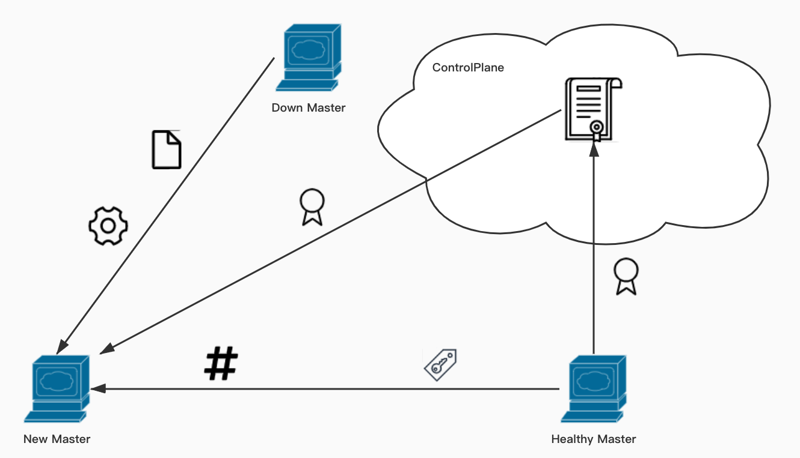

oneStep-master-mgr-guide
=========
[TOC]

master-mgr旨在以脚本的方式对master节点进行有效的一键操作的管理，目前已有了切换master和重生master两种功能的支持。

#### 1、切换Master(chang-master)

###### 1.1 简介

基于TKE的高可用Kubernetes集群，默认是3个Master节点和若干Node节点。我们希望可以将高可用更进一步，也就是当3个Master中的1个因未知原因不再健康时，我们能够通过oneStep的方式，从backup备用机器中再启一个Master节点加入控制平面，用于保证集群始终处于最稳定最可靠的状态。设计初衷可以类比ReplicationController，此处我们保证的是Master的副本数量。 

###### 1.2 两种场景
基于TKE Stack的Kubernetes集群：在hosts中配置好新机器的信息，再通过在控制台添加节点的方式完成新机器环境的初始化，继而直接进入change-master主逻辑。

普通Kubernetes集群：在hosts中配置好新机器的信息，并在新机器上安装好对应版本的Docker、Kubectl、Kubeadm和Kubelet以及一些相关的配置文件，继而直接进入change-master主逻辑。

不过不用担心，change-master会自动检测环境情况，如果新机器不是现有集群的节点，会按照TKE Stack的方案进行环境初始化工作。

  

###### 1.3 流程简述
| 主机名           | 简介                       | 作用                         | 对应脚本参数    |
| ---------------- | -------------------------- | ---------------------------- | --------------- |
| New Master       | 新的Master节点             | 成为新的Master，保证集群稳定 | -n（NEW_MASTER_IP）        |
| Down Master | 即将被替换的Master节点     | 提供相应数据备份恢复文件     | -d（DOWN_MASTER_IP）   |
| Healthy Master    | 目前集群中健康的Master节点 | 提供Hash、Token以及证书      | -h（HEALTHY_MASTER_IP） |

New Master携带密钥访问控制平面，获取证书认可，并通过其它所传输过来的参数用以加入控制平面，从而成为Master中的一员，即参数IP。

Down Master将其机器上相应的数据文件传输给New Master，其中包括Master节点的备份文件，即参数DOWN_IP。

Healthy Master用于查询出Token和生成Hash传送给New Master，同时也需要将其证书上传到控制平面，并获取对应密钥，最终传送给New Master，即参数STABLE_IP。

  

###### 1.4 使用指南
- oneStep环境：将要添加成为master的机器IP写入hosts中的[workers]
- 执行脚本：项目目录下的change-master.sh 
- 参数说明：-d(被废弃的目标master主机IP) -n(即将新起的目标master主机IP) -h(目前健康的master主机IP之一)
- 执行例子：./change-master.sh -d 192.168.43.1 -n 192.168.43.2 -h 192.168.43.3

#### 2、重生Master(rebirth-master)

###### 2.1 简介

change-master会让失去了动力的master走下舞台，让跃跃欲试的新master登上舞台，但是新旧的更迭是需要成本的。诸如IP变动造成的一系列问题可能会提高成本。所以在没有完全对旧master失去信心的情况下，可以选择用rebirth-master来让旧master重生。

###### 2.2 流程简述
| 主机名        | 简介                       | 作用                       | 对应脚本参数    |
| ------------- | -------------------------- | -------------------------- | --------------- |
| Rebirth Master        | 重生的Master节点           | 重生的Master，保证集群稳定 | -r（REBIRTH_MASTER_IP）        |
| Healthy Master | 目前集群中健康的Master节点 | 提供Hash、Token以及证书    | -h（HEALTHY_MASTER_IP） |

Rebirth Master携带密钥访问控制平面，获取证书认可，并通过其它所传输过来的参数用以加入控制平面，从而成为Master中的一员，即参数IP。

Healthy Master用于查询出Token和生成Hash传送给New Master，同时也需要将其证书上传到控制平面，并获取对应密钥，最终传送给New Master，即参数STABLE_IP。

###### 2.3 使用指南
- 执行脚本：项目目录下的rebirth-master.sh 
- 参数说明：-i(即将重生的目标master主机IP) -s(目前健康的master主机IP之一)
- 执行例子：./rebirth-master.sh -r 192.168.43.1 -h 192.168.43.2

