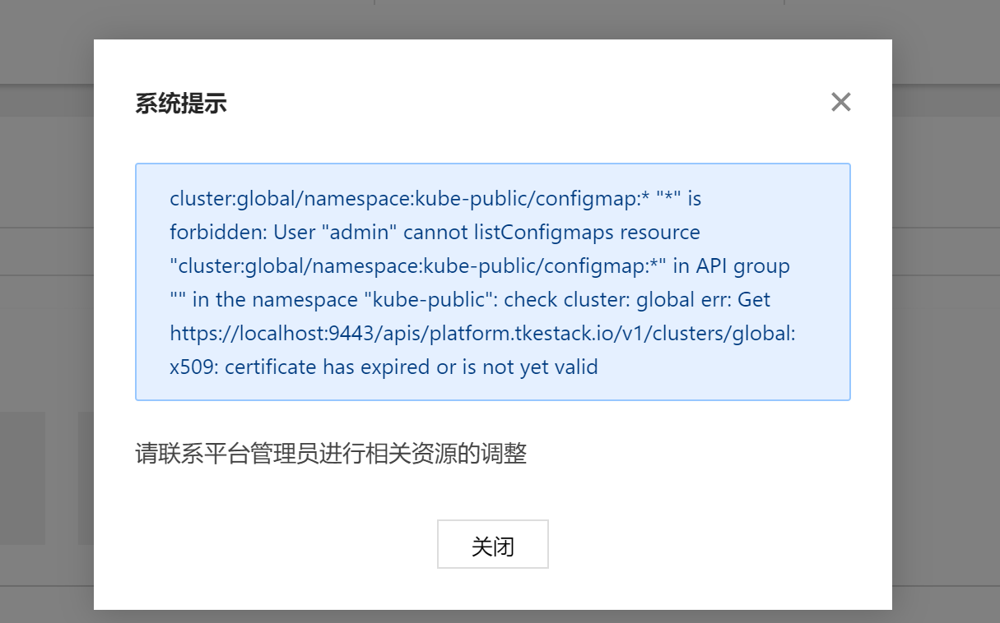

## 背景

为了尽可能与社区原生k8s保持一致与同步，TKEStack使用社区的kubeadm新建独立集群。使用kubeadm创建的集群存在一个比较烦人的问题就是证书的有效期只有一年。kubeadm这么做有着其充分的理由：安全，但是这也就意味着每年至少要更新一次k8s的证书。好在kubeadm提供了方便更新证书的功能，本文将以TKEStack的global集群及创建的独立集群为例，介绍如何使用kubeadm更新证书。

## 限制条件

1. 本文只针对1.2.5+版本TKEStack的global集群及创建的独立集群，对导入集群并不适用；
2. kubeadm的版本要与k8s版本保持一致，例如1.16.x版本的k8s，请使用1.16.x的kubeadm进行证书更新操作，否则可能导致读取配置失败而使用kubeadm默认配置覆盖集群配置;
3. 证书更新后需要重启kube-apiserver、kube-controller、kube-scheduler和etcd，如是生产环境需要评估这些组件重启造成的影响。

## 波及节点

需要操作更新证书的节点包括global集群的master节点，以及通过TKEStack创建的独立集群的master节点。如果安装时配置了HA，需要对每个master节点上都执行更新证书操作。尽管kubelet也有一个client端证书需要更新维护，但是不需要我们进行手动维护，因为自1.8版本以后kubeadm已经将kubelet配置为自动更新证书，所以无论是master节点还是worker节点上的kubelet客户端证书都不需要使用kubeadm进行手动更新。

## 更新流程

### 下载kubeadm

一般情况下，TKEStcak创建的集群节点上的`/usr/bin/`文件夹下会存在kubeadm二进制文件，如果发现master节点上没有kubeadm，可以从官方下载。以amd64架构1.16.9版本的kubeadm为例子，可以通过`curl -L --remote-name-all https://storage.googleapis.com/kubernetes-release/release/v1.16.9/bin/linux/amd64/kubeadm`下载到本地，如果需要其他版本请将URL中的版本号修改为其他版本号即可。使用`chmod +x kubeadm`命令为二进制加权限后，将kubeadm发送到集群master节点。

### 备份文件

可以通过`cp -r /etc/kubernetes /etc/kubernetes.bak`和`cp -r /var/lib/etcd /var/lib/etcd.bak`将k8s和tecd相关文件做备份。

### 执行证书更新

执行`kubeadm alpha certs renew all`即可出发证书更新操作，如果使用的1.16.x版本，其打印内容如下：

```sh
certificate embedded in the kubeconfig file for the admin to use and for kubeadm itself renewed
certificate for serving the Kubernetes API renewed
certificate the apiserver uses to access etcd renewed
certificate for the API server to connect to kubelet renewed
certificate embedded in the kubeconfig file for the controller manager to use renewed
certificate for liveness probes to healthcheck etcd renewed
certificate for etcd nodes to communicate with each other renewed
certificate for serving etcd renewed
certificate for the front proxy client renewed
certificate embedded in the kubeconfig file for the scheduler manager to use renewed
```

如果是1.18.x版本，打印内容会多一些提示：

```sh
[renew] Reading configuration from the cluster...
[renew] FYI: You can look at this config file with 'kubectl -n kube-system get cm kubeadm-config -oyaml'

certificate embedded in the kubeconfig file for the admin to use and for kubeadm itself renewed
certificate for serving the Kubernetes API renewed
certificate the apiserver uses to access etcd renewed
certificate for the API server to connect to kubelet renewed
certificate embedded in the kubeconfig file for the controller manager to use renewed
certificate for liveness probes to healthcheck etcd renewed
certificate for etcd nodes to communicate with each other renewed
certificate for serving etcd renewed
certificate for the front proxy client renewed
certificate embedded in the kubeconfig file for the scheduler manager to use renewed
```

### 更新kubeconfig

执行`kubeadm init phase kubeconfig all`可使用新证书生成新的kubeconfig文件。执行`cp -r /root/.kube /root/.kube.bak`备份后，可以执行`cp -f /etc/kubernetes/admin.conf /root/.kube/config`覆盖掉原本的kubeconfig文件。

### 验证与组件重启

执行完上述更新证书操作后可以通过`echo | openssl s_client -showcerts -connect 127.0.0.1:6443 -servername api 2>/dev/null | openssl x509 -noout -enddate`验证apiserver证书有效期是否更新，会发现证书有效期没有更新。此原因是k8s组件如果没有重启就不会使用新证书导致的。

执行

```sh
docker rm -f $(docker ps -q -f label=io.kubernetes.container.name=kube-apiserver) && \
docker rm -f $(docker ps -q -f label=io.kubernetes.container.name=kube-controller-manager) && \
docker rm -f $(docker ps -q -f label=io.kubernetes.container.name=kube-scheduler) && \
docker rm -f $(docker ps -q -f label=io.kubernetes.container.name=etcd)
```

以重启k8s及etcd相关组件后，再次执行`echo | openssl s_client -showcerts -connect 127.0.0.1:6443 -servername api 2>/dev/null | openssl x509 -noout -enddate`，可以观察到证书有效期已经发生变化。

## 执行命令小结

下面把升级过程中在master节点执行命令的总结在下面：

```sh
cp -r /etc/kubernetes /etc/kubernetes.bak
cp -r /var/lib/etcd /var/lib/etcd.bak

kubeadm alpha certs renew all

kubeadm init phase kubeconfig all
cp -r /root/.kube /root/.kube.bak
cp -f /etc/kubernetes/admin.conf /root/.kube/config

docker rm -f $(docker ps -q -f label=io.kubernetes.container.name=kube-apiserver) && \
docker rm -f $(docker ps -q -f label=io.kubernetes.container.name=kube-controller-manager) && \
docker rm -f $(docker ps -q -f label=io.kubernetes.container.name=kube-scheduler) && \
docker rm -f $(docker ps -q -f label=io.kubernetes.container.name=etcd)

echo | openssl s_client -showcerts -connect 127.0.0.1:6443 -servername api 2>/dev/null | openssl x509 -noout -enddate
```

如果你更新的集群是TKEStack的global集群，为了保证TKEStack系统组件正常工作还需要更新`tke namespace`下的`certs configmap`里的`etcd.crt`和`etcd.key`:

```sh
# 执行更新操作前请先做备份
kubectl get -n tke cm certs -o yaml > certs.bak.yaml
# 使用/etc/kubernetes/pki/apiserver-etcd-client.crt /etc/kubernetes/pki/apiserver-etcd-client.key的内容
# 替换configmap data中的etcd.crt和etcd.key下的内容
kubectl edit -n tke cm certs -o yaml
```

## 其他注意事项

### Pod 证书问题

如果发现任何 pod 执行了将近 1 年时间，报错证书相关问题，有可能是 https://github.com/kubernetes/kubernetes/issues/86552 导致的，通过重启 pod 可解决问题。

### kubelet 无法启动

更新操作完成后，如果通过 `tali -f /var/log/messages` 发现类似下面找不到 `bootstrap-kubelet.conf` 的报错:

```sh
Jul 22 12:13:33 VM-252-117-centos kubelet: F0722 12:13:33.864099   10350 server.go:265] failed to run Kubelet: unable to load bootstrap kubeconfig: stat /etc/kubernetes/bootstrap-kubelet.conf: no such file or directory
Jul 22 12:13:33 VM-252-117-centos kubelet: goroutine 1 [running]:
```

可以在各个节点上通过执行 `cp /etc/kubernetes/kubelet.conf /etc/kubernetes/bootstrap-kubelet.conf` 解决。

### tkestack web 端报证书过期错误

报错如下：


原因是组件 platform 的 pod 内证书未更新，可通过重启 tke-platform-api 的 pod 解决。以此类推，如果报的是其他组件（如 business、registry 等）的证书过期，可通过重启对应组件的 api pod 解决。
