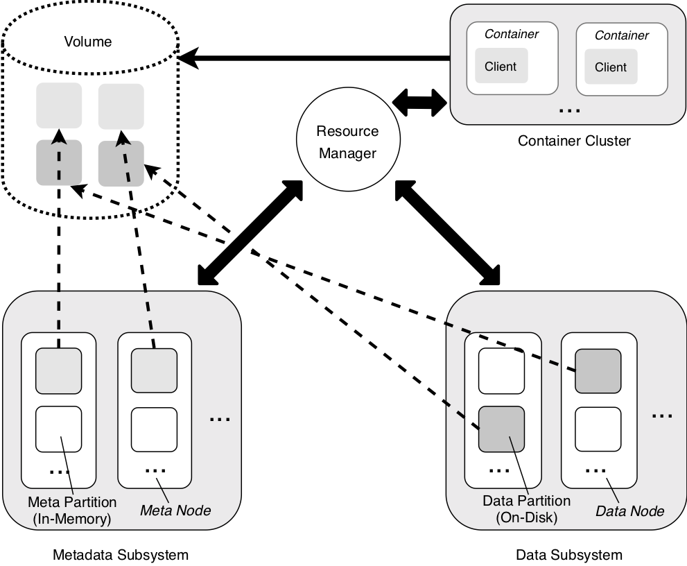
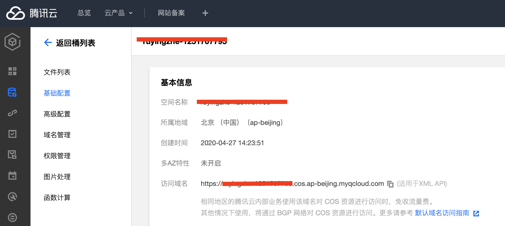

# TKEStack 使用存储的实践

> 本文以介绍如何在不同场景下选用合适的存储类型，并以实际的例子演示如何通过 TKEStack 部署和管理一个分布式存储服务，并以云原生的方式为容器化的应用提供高可用、高性能的存储服务。

## 简介

TKEStack 是腾讯开源的一款集易用性和扩展性于一身的企业级容器服务平台，帮助用户在私有云环境中敏捷、高效地构建和发布应用服务。TKEStack 本身不提供存储功能，但是可以通过集成云原生的存储应用，或者通过存储扩展组件的方式，对接用户的存储设施，扩展 TKEStack 平台的存储能力。

在本文中，通过 TKEStack 集成不同类型存储的介绍，帮助用户掌握云原生环境下存储的使用与管理，助力用户构建面向不同业务场景的容器云解决方案。

**本文所介绍的实践方案基于社区开源的存储方案，以及部分云提供商的存储服务方案**，TKEStack 不提供对存储服务的质量保证。用户请根据自身实际情况，选择合适的存储方案，或者联系 TKEStack 官方社区、论坛寻求帮助。

TKEStack 支持通过 CSI 存储插件的方式对接外部存储系统，详情请参考 [TKEStack CSI Operator](../../../../hack/addon/readme/CSIOperator.md)。

## 存储类型的选择

存储类型大致有三种：块存储、文件存储及对象存储

1. **块存储**：是以块为单位，块存储实际上是管理到数据块一级，相当于直接管理硬盘的数据块。高性能、低时延，满足随机读写，使用时需要格式化为指定的文件系统后才能访问。
2. **文件存储**：文件系统存储，文件系统是操作系统概念的一部份，支持 POSIX 的文件访问接口。优势是易管理、易共享，但由于采用上层协议, 因此开销大, 延时比块存储高。
3. **对象存储**：提供 Key-Value（简称 K/V）方式的 RESTful 数据读写接口，并且常以网络服务的形式提供数据的访问。优点是高可用性、全托管、易扩展。

上述几种存储类型各具特色，分别对应不同场景下的需求，例如：

1. 块存储具备高性能的读写，提供原始块设备操作能力，非常适合作为一些数据库系统的底层存储。
2. 文件系统有着与操作系统一致的 POSIX 文件访问接口，能够方便的在特定范围内共享文件空间，典型的场景是 AI 学习、模型训练场景下对训练数据，模型和结果的存储。
3. 对象存储是近年来兴起的一种新的存储方式，适用于分布式云计算场景下的应用业务的海量，高并发的互联网产品场景。

更多存储系统的信息，请参考：[wiki](https://en.wikipedia.org/wiki/Cloud_storage)

## 块存储参考实践

本节将介绍如何通过 TKEStack 部署一套块存储系统，并演示如何在集群中使用该存储，在集群中部署 ElasticSearch 对外提供服务。

块存储系统有着较长的历史，基于传统 SAN 存储系统的方案已经非常成熟，但是 SAN 系统的价格较高，且可扩展性较差，难以满足大规模云计算系统下的使用需求。

但块存储本身具有的高带宽、低延迟，高吞吐率等优势，使它在云计算领域仍具有一席之地，典型的产品有 Ceph RBD，AWS EBS，腾讯云 CBS 等。

本节将以 Ceph RBD 为例，通过 [Rook](https://rook.io/) 在 TKEStack 容器平台中部署 Ceph RBD 块存储集群，对业务提供块存储服务。

Rook 是一个自管理的分布式存储编排系统，可以为 Kubernetes 提供便利的存储解决方案。


Rook 支持在 K8S 中部署，主要由 Operator 和 Cluster 两部分组成：

1. **Operator**：Rook 的核心组件，自动启动存储集群，并监控存储守护进程，来确保存储集群的健康。
2. **Cluster**：负责创建 CRD 对象，指定相关参数，包括 Ceph 镜像、元数据持久化位置、磁盘位置、dashboard 等等。

### 部署块存储系统

Rook 支持通过 helm 或 yaml 文件的方式进行部署，本文直接使用官方的 yaml 文件部署 Rook Ceph 存储集群。

1. 登录 TKEStack 管理页面，进入集群管理页下，**新建一个至少包括三台节点的集群**

2. 登录至该集群的任意节点下，下载 Rook 项目，通过[官方例子](https://rook.io/docs/rook/v1.3/ceph-examples.html)部署 Rook 集群

   ```shell
   git clone --single-branch --branch release-1.3 https://github.com/rook/rook.git
   cd rook/cluster/examples/kubernetes/ceph
   kubectl create -f common.yaml
   kubectl create -f operator.yaml
   kubectl create -f cluster.yaml
   ```

文件中有几个地方要注意：

- **dataDirHostPath**: 这个路径是会在宿主机上生成的，默认为 /var/lib/rook，保存的是 ceph 的相关的配置文件，再重新生成集群的时候要确保这个目录为空，否则 Ceph 监视器守护进程 [MON](https://docs.ceph.com/projects/ceph-deploy/en/latest/mon.html?highlight=ceph-mon) 会无法启动
- **useAllDevices**: 使用节点上所有的设备，默认为 true，使用宿主机所有可用的磁盘
- **useAllNodes**：使用所有的 node 节点，默认为 true，使用用 k8s 集群内的所有 node 来搭建 Ceph 
- **network.hostNetwork**: 使用宿主机的网络进行通讯，默认为 false，如果需要集群外挂载的场景可以开启这个选项

部署完毕后，检查 Rook 组件工作状态：

```shell
# kubectl get pod -n rook-ceph
NAME                                         READY   STATUS      RESTARTS   AGE
csi-rbdplugin-b52jx                          3/3     Running     3          9d
csi-rbdplugin-jpmgv                          3/3     Running     1          2d9h
csi-rbdplugin-provisioner-54cc7d5848-5fn8c   5/5     Running     0          2d8h
csi-rbdplugin-provisioner-54cc7d5848-w8dvk   5/5     Running     3          4d22h
csi-rbdplugin-z8dlc                          3/3     Running     1          2d9h
rook-ceph-mgr-a-6775645c-7qg5t               1/1     Running     1          4d7h
rook-ceph-mon-a-98664df75-jm72n              1/1     Running     0          2d9h
rook-ceph-operator-676bcb686f-2kwmz          1/1     Running     0          9d
rook-ceph-osd-0-6949755785-gjpxw             1/1     Running     0          2d9h
rook-ceph-osd-1-647fdc4d84-6lvw2             1/1     Running     0          11d
rook-ceph-osd-2-c6c6db577-gtcpz              1/1     Running     0          2d8h
rook-ceph-osd-prepare-172.21.64.15-xngl7     0/1     Completed   0          2d8h
rook-ceph-osd-prepare-172.21.64.36-gv2kw     0/1     Completed   0          28d
rook-ceph-osd-prepare-172.21.64.8-bhffr      0/1     Completed   0          2d8h
rook-ceph-tools-864695994d-b7nb8             1/1     Running     0          2d7h
rook-discover-28fqr                          1/1     Running     0          2d9h
rook-discover-m529m                          1/1     Running     0          9d
rook-discover-t2jzc                          1/1     Running     0          2d9h
```

至此一个完整的 Ceph RBD 集群就建立完毕，每台节点上都部署有 Ceph 对象存储守护进程 [OSD](https://docs.ceph.com/en/latest/man/8/ceph-osd/)，默认使用节点下的 /var/lib/rook 目录存储数据。

### 使用块存储部署 ElasticSearch

1. 创建 Ceph pool，创建 StorageClass

   ```yaml
   # cat storageclass.yaml
   ---                                                                                                                                                                                                                                
   apiVersion: ceph.rook.io/v1                                                                                           
   kind: CephBlockPool                                                                                                   
   metadata:                                                                                                             
     name: replicapool                                                                                                  
     namespace: rook-ceph                                                                                                
   spec:                                                                                                                 
     failureDomain: host                                                                                                 
     replicated:                                                                                                        
       size: 1        # 池中数据的副本数                                                                                     
   ---                                                                                                                   
   apiVersion: storage.k8s.io/v1                                                                                         
   kind: StorageClass                                                                                                    
   metadata:                                                                                                             
     name: global-storageclass                                                                                           
   provisioner: rook-ceph.rbd.csi.ceph.com                                                                               
   parameters:                                                                                                           
     # clusterID is the namespace where the rook cluster is running                                                      
     # If you change this namespace, also change the namespace below where the secret namespaces are defined             
     clusterID: rook-ceph                                                                                               
                                                                                                                         
     # Ceph pool into which the RBD image shall be created                                                               
     pool: replicapool                                                                                                   
                                                                                                                         
     # RBD image format. Defaults to "2".                                                                                
     imageFormat: \"2\"                                                                                                  
                                                                                                                         
     # RBD image features. Available for imageFormat: "2". CSI RBD currently supports only layering feature.             
     imageFeatures: layering                                                                                             
                                                                                                                         
     # The secrets contain Ceph admin credentials. These are generated automatically by the operator                     
     # in the same namespace as the cluster.                                                                             
     csi.storage.k8s.io/provisioner-secret-name: rook-csi-rbd-provisioner                                                
     csi.storage.k8s.io/provisioner-secret-namespace: rook-ceph                                                          
     csi.storage.k8s.io/node-stage-secret-name: rook-csi-rbd-node                                                        
     csi.storage.k8s.io/node-stage-secret-namespace: rook-ceph                                                          
     # Specify the filesystem type of the volume. If not specified, csi-provisioner                                      
     # will set default as ext4.                                                                                         
     csi.storage.k8s.io/fstype: ext4                                                                                    
   # uncomment the following to use rbd-nbd as mounter on supported nodes                                                
   #mounter: rbd-nbd                                                                                                     
   reclaimPolicy: Delete                                              
   ```

   

2. 通过 StorageClass 动态创建 PVC，检查 PVC 能够正确的创建并绑定

   ```shell
   # cat pvc.yaml
   apiVersion: v1
   kind: PersistentVolumeClaim
   metadata:
     name: rbd-pvc
   spec:
     accessModes:
     - ReadWriteOnce
     resources:
       requests:
         storage: 1Gi
     storageClassName: global-storageclass
   # kubectl get pvc
   NAME      STATUS   VOLUME                                     CAPACITY   ACCESS MODES   STORAGECLASS          AGE
   rbd-pvc   Bound    pvc-f9703e0d-9887-4bf2-8e31-1c3103a6ce2f   1Gi        RWO            global-storageclass   2s
   ```

   

3. 创建 ElasticSearch 应用，通过 StorageClass 动态申请块存储，使用 Ceph RBD 集群作为 ElasticSearch 的后端存储设备

   ```shell
   # cat es.yaml
   apiVersion: v1
   kind: Namespace
   metadata:
     name: efk   
   
   ---
   apiVersion: apps/v1
   kind: StatefulSet
   metadata:
     name: elasticsearch-master
     namespace: efk
     labels:
       app: elasticsearch-master
   spec:
     podManagementPolicy: Parallel
     serviceName: elasticsearch-master
     replicas: 3
     selector:
       matchLabels:
         app: elasticsearch-master
     template:
       metadata:
         labels:
           app: elasticsearch-master
       spec:
         affinity:
           podAntiAffinity:
             preferredDuringSchedulingIgnoredDuringExecution:
             - weight: 1
               podAffinityTerm:
                 topologyKey: kubernetes.io/hostname
                 labelSelector:
                   matchLabels:
                     app: "elasticsearch-master"
         initContainers:
         # see https://www.elastic.co/guide/en/elasticsearch/reference/current/vm-max-map-count.html
         # and https://www.elastic.co/guide/en/elasticsearch/reference/current/setup-configuration-memory.html#mlockall
         - name: "sysctl"
           image: "busybox"
           imagePullPolicy: "Always"
           command: ["sysctl", "-w", "vm.max_map_count=262144"]
           securityContext:
             allowPrivilegeEscalation: true
             privileged: true
         containers:
         - name: elasticsearch
           env:
           - name: cluster.name
             value: elasticsearch-cluster
           - name: discovery.zen.ping.unicast.hosts
             value: elasticsearch-master
           - name: discovery.zen.minimum_master_nodes
             value: "2"
           - name: KUBERNETES_NAMESPACE
             valueFrom:
               fieldRef:
                 fieldPath: metadata.namespace
           # node roles, default to all true
           # - name: NODE_MASTER
           #   value: "true"
           # - name: NODE_DATA
           #   value: "true"
           # - name: NODE_INGEST
           #   value: "true"
           - name: PROCESSORS
             valueFrom:
               resourceFieldRef:
                 resource: limits.cpu
           - name: ES_JAVA_OPTS
             value: "-Djava.net.preferIPv4Stack=true -Xmx1g -Xms1g"
           resources:
           readinessProbe:
             httpGet:
               path: /_cluster/health?local=true
               port: 9200
             initialDelaySeconds: 5
           image: docker.elastic.co/elasticsearch/elasticsearch-oss:6.2.4
           imagePullPolicy: IfNotPresent
           ports:
           - containerPort: 9300
             name: transport
           - containerPort: 9200
             name: http
           volumeMounts:
           - mountPath: /usr/share/elasticsearch/data
             name: elasticsearch-master
         volumes:
         terminationGracePeriodSeconds: 120
     volumeClaimTemplates:
     - metadata:
         name: elasticsearch-master
       spec:
         accessModes:
         - ReadWriteOnce
         resources:
           requests:
             storage: 20Gi
         storageClassName: global-storageclass
         volumeMode: Filesystem
   
   ---
   
   apiVersion: v1
   kind: Service
   metadata:
     name: elasticsearch-master
     namespace: efk
     labels:
       app: elasticsearch-master
   spec:
     type: ClusterIP
     ports:
       - name: http
         port: 9200
         protocol: TCP
         targetPort: 9200
       - name: transport
         port: 9300
         protocol: TCP
         targetPort: 9300
     selector:
       app: elasticsearch-master
   ```

4. 等待 ElasticSearch 实例建立完成，磁盘被正确的挂载

   ```shell
   # kubectl get pod -n efk
   NAME                          READY   STATUS    RESTARTS   AGE
   elasticsearch-master-0        1/1     Running   0          2d19h
   elasticsearch-master-1        1/1     Running   0          2d19h
   elasticsearch-master-2        1/1     Running   0          2d19h
   # kubectl get pvc -n efk
   NAME                                          STATUS   VOLUME                                     CAPACITY   ACCESS MODES   STORAGECLASS          AGE
   elasticsearch-master-elasticsearch-master-0   Bound    pvc-405fc7b2-82eb-4eda-a6b7-e54d1713cbeb   20Gi       RWO            global-storageclass   41d
   elasticsearch-master-elasticsearch-master-1   Bound    pvc-6e89f8d5-4702-4b2f-81c2-f9f89a249b0a   20Gi       RWO            global-storageclass   41d
   elasticsearch-master-elasticsearch-master-2   Bound    pvc-16c9c1ab-4c77-463f-b5f0-fc643ced2fce   20Gi       RWO            global-storageclass   41d
   ```

### 块存储小结

按照本节指引，用户可以在 TKEStack 平台下创建出一个 Ceph RBD 块存储集群，并通过 StorageClass 方式动态的申请和使用块存储资源，并能够搭建出 ElasticSearch 应用对外提供服务。

由于块存储的特性，在 K8S 场景下仅支持 ReadWriteOnce 和 ReadOnlyMany 访问方式，并且这里的访问方式是节点级别的，例如 ReadOnlyMany, 只能被同一节点的多个 Pod 挂载，如果从多个节点挂载，系统会报 Multi-Attach 错误。

因此在 K8S 使用块存储场景上，基本上一个 Pod 挂载一个 PVC，典型的应用场景是 Redis，ElasticSearch，Mysql数据库等。

如果用户已存在块存储设备，TKEStack 支持通过 CSI 插件对接已有的存储设备，详情请参考 [TKEStack CSI Operator](../../../../hack/addon/readme/CSIOperator.md)。


## 文件存储参考实践

本节将介绍如何在 TKEStack 中部署一套文件存储系统，并演示如何在平台中使用该存储。

本节以 ChubaoFS (储宝文件系统)为例，通过在集群中部署和集成 ChubaoFS，向用户展示如何在 TKEStack 中使能文件存储功能。

ChubaoFS (储宝文件系统)是为大规模容器平台设计的分布式文件系统，详情请参考[ChubaoFS 官方文档](https://chubaofs.readthedocs.io/zh_CN/latest/overview.html#)。



ChubaoFS 支持在 k8s 集群中部署，通过 Helm 的方式在集群中安装元数据子系统，数据子系统和资源管理节点等，对外提供文件存储服务。

### 部署文件存储系统

1. 登录 TKEStack 管理页面，进入集群管理页下，新建**一个至少包括五台节点的集群**，并为该集群使能"Helm 应用管理"扩展组件

2. 设置节点标签，ChubaoFS 将根据标签分配不同的组件到节点上运行

   ```shell
   kubectl label node <nodename> chuabaofs-master=enabled
   kubectl label node <nodename> chuabaofs-metanode=enabled
   kubectl label node <nodename> chuabaofs-datanode=enabled
   ```
   > 注：至少保证有3台 [Master](https://chubaofs.readthedocs.io/zh_CN/latest/user-guide/master.html)，3台 [Metanode](https://chubaofs.readthedocs.io/zh_CN/latest/user-guide/metanode.html)，5台 [Datanode](https://chubaofs.readthedocs.io/zh_CN/latest/user-guide/datanode.html)

3. 登录到该集群下的一台节点上，下载 ChubaoFS 应用的 [chart 包](https://github.com/chubaofs/chubaofs-helm)，根据环境修改 values.yaml 文件中的参数（本文使用默认值）

    ```shell
    # ls chubaofs
    Chart.yaml  config  README.md  templates  values.yaml
    ```

4. 本地安装 Helm 客户端, 更多可查看 [安装 Helm](https://helm.sh/docs/intro/quickstart/)，使用 Helm 客户端安装 ChubaoFS ，等待安装完成

    ```shell
    # helm install --name chubao ./chubaofs
    # ./helm status chubao
    ```

5. 安装完成后，检查所有组件工作正常

    ```shell
    # kubectl get pod -n chubaofs
    NAME                          READY   STATUS    RESTARTS   AGE
    client-c5c5b99f6-qqf7h        1/1     Running   0          17h
    consul-6d67d5c55-jgw9z        1/1     Running   0          18h
    datanode-9vqvm                1/1     Running   0          18h
    datanode-bgffs                1/1     Running   0          18h
    datanode-dtckp                1/1     Running   0          18h
    datanode-jtrzj                1/1     Running   0          18h
    datanode-p5nmc                1/1     Running   0          18h
    grafana-7cc9db7489-st27v      1/1     Running   0          18h
    master-0                      1/1     Running   0          18h
    master-1                      1/1     Running   0          18h
    master-2                      1/1     Running   0          17h
    metanode-ghrpm                1/1     Running   0          18h
    metanode-gn5kl                1/1     Running   0          18h
    metanode-wqzwp                1/1     Running   0          18h
    prometheus-77d5d6cb7f-xs748   1/1     Running   0          18h
    kubectl get svc -n chubaofs
    NAME                 TYPE        CLUSTER-IP        EXTERNAL-IP   PORT(S)          AGE
    consul-service       NodePort    192.168.255.116   <none>        8500:30831/TCP   20h
    grafana-service      ClusterIP   192.168.255.16    <none>        3000/TCP         20h
    master-service       NodePort    192.168.255.104   <none>        8080:32102/TCP   20h
    prometheus-service   ClusterIP   192.168.255.4     <none>        9090/TCP         20h
    ```

### 使用文件存储系统

1. 参考 [ChubaoFS CSI 文档](https://chubaofs.readthedocs.io/zh_CN/latest/user-guide/csi-driver.html#kubernetes-v1-15)，在想要使用文件存储的集群上部署 ChubaoFS CSI Driver 插件

    ```shell
    # git clone https://github.com/chubaofs/chubaofs-csi.git
    # cd chubaofs-csi
    # kubectl apply -f deploy/csi-controller-deployment.yaml
    # kubectl apply -f deploy/csi-node-daemonset.yaml
    ```

2. 创建 StorageClass，指定 master 和 consul 的访问地址

    ```yaml
    kind: StorageClass
    apiVersion: storage.k8s.io/v1
    metadata:
      name: chubaofs-sc
    provisioner: csi.chubaofs.com
    reclaimPolicy: Delete
    parameters:
      masterAddr: "172.21.64.14:32102"	# Master地址
      owner: "csiuser"
      # cannot set profPort and exporterPort value, reason: a node may be run many cfs-client
      #  profPort: "10094"
      #  exporterPort: "9513"
      consulAddr: "172.21.64.14:30831"	# 监控系统的地址
      logLevel: "debug"
    ```

3. 通过 StorageClass 创建 PVC，创建使用 PVC 的应用

    ```shell
    # cat pvc.yaml
    apiVersion: v1
    kind: PersistentVolumeClaim
    metadata:
      name: chubaofs-pvc
    spec:
      accessModes:
        - ReadWriteOnce
      resources:
        requests:
          storage: 1Gi
      storageClassName: chubaofs-sc
    # cat deployment.yaml 
    apiVersion: apps/v1
    kind: Deployment
    metadata:
      name: cfs-csi-demo
      namespace: default
    spec:
      replicas: 1
      selector:
        matchLabels:
          app: cfs-csi-demo-pod
      template:
        metadata:
          labels:
            app: cfs-csi-demo-pod
        spec:
          containers:
            - name: chubaofs-csi-demo
              image: nginx:1.17.9
              imagePullPolicy: "IfNotPresent"
              ports:
                - containerPort: 80
                  name: "http-server"
              volumeMounts:
                - mountPath: "/usr/share/nginx/html"
                  name: mypvc
          volumes:
            - name: mypvc
              persistentVolumeClaim:
                claimName: chubaofs-pvc
    ```

### 文件存储小结

通过上面的例子，用户可以创建一个 ChubaoFS 的文件系统集群，并通过 ChubaoFS CSI Driver 插件，将文件存储映射为 K8S 的资源（PVC，StorageClass）。

由于文件存储的支持多读多写的特性，使得用户在有共享存储需求的场景下，如 AI 计算、模型训练等，通过 TKEStack + ChubaoFS 的方案，快速构建出容器产品和解决方案。

如果用户已存在文件存储设备，TKEStack支持通过 CSI 插件对接已有的存储设备，详情请参考 [TKEStack CSI Operator](../../../../hack/addon/readme/CSIOperator.md)。


## 对象存储参考实践

本节介绍最后一个存储类型——对象存储， 对象存储的访问接口基本都是 RESTful API，用户可通过网络存储和查看数据，具备高扩展性、低成本、可靠和安全特性。

常见的对象存储有 Ceph 的 RADOS、OpenStack 的 Swift、AWS S3 等，并且各大主流的云提供商的都有提供对象存储服务，方便互联网用户快速地接入，实现了海量数据访问和管理。

本节将在一个公有云的环境下，申请云提供商提供的对象存储，通过标准的 S3 接口对接 TKEStack 的镜像仓库的服务，这样就可以将 TKEStack 平台下的镜像存储在对象存储中，方便扩展和管理。

### 申请对象存储

以腾讯云为例，登录控制台后进入对象存储产品中心，在存储桶列表页面下创建一个新的存储桶，创建成功后记录下访问域名，所属地域，访问 ID 和密钥等。



注：访问 ID 和密钥信息请参考[腾讯云对象存储文档](https://cloud.tencent.com/document/product/436/31315)，更多关于对象存储的信息访问[官网](https://cloud.tencent.com/document/product/436/6222)。

### 配置镜像仓库

TKEStack 提供镜像仓库功能，为用户提供容器镜像的上传，下载和管理功能，并且镜像仓库中保存平台所需的所有镜像，满足各种离线环境的需求。

如果按照默认方式安装配置，TKEStack 的镜像仓库默认使用 Global 集群下 Master 主机上的存储资源，该种方式占用了有限的主机资源，且不方便进行扩展和迁移，有必要对镜像仓库模块重新配置，使其对接对象存储，方便扩展。

1. 登录 TKEStack 管理界面，进入 Global 集群[配置管理](../products/business-control-pannel/application/configurations/ConfigMap.md)，找到 tke 命名空间下的 tke-registry-api 配置（configmap），修改 `storage` 字段如下

    ```shell
      tke-registry-config.yaml: |
        apiVersion: registry.config.tkestack.io/v1
        kind: RegistryConfiguration
        storage:
    #      fileSystem:
    #        rootDirectory: /storage
          s3:
            bucket: xxxxxxxxxxxxx
            region: ap-beijing
            accessKey: xxxxxxxxxxxxxxxxxxxxxxxxxxxxxxxxxxxx
            secretKey: xxxxxxxxxxxxxxxxxxxxxxxxxxxxxxx
            secure: false
            regionEndpoint: https://xxxxxxxxxxxxxx.cos.ap-beijing.myqcloud.com
    ```

2. 修改完成后，重启 tke 命名空间下的 tke-registry-api 的 pod，使配置生效，等待重启后 pod 恢复
3. 此时镜像仓库已使用基于 S3 接口的对象存储，用户可以向该仓库推送或下载镜像，验证功能

> 注意：
>
> * 由于更换了底层存储，重启后的镜像仓库中没有镜像，需要用户提前将原仓库中的所有镜像备份后，重新恢复至新的镜像仓库中
> * 也可以在安装 TKEStack 平台时，为镜像仓库，以及监控存储配置对象存储服务，免去后期转移镜像和存储的操作，关于如何在安装时指定存储服务，详见[高可用部署相关文章](../../../user/cluster/ha.md)


### 对象存储小结

本节展示如果通过云提供商提供的对象存储服务，增强 TKEStack 的镜像仓库服务。在实际场景中，用户根据自身情况，选择合适的公有云上服务。

本文前面介绍的 Rook Ceph，ChubaoFS 等都支持对象存储服务，用户也可自行搭建本地的对象存储集群，详细指引参考对应产品的官网。

## 总结

综上所述，TKEStack 平台能够通过各种云原生及扩展组件的方式，对接和集成不同种类的存储服务，满足各类应用场景的需求。后续 TKEStack 还会继续增强在存储方面的功能，不断完善操作体验，使得容器平台存储功能具备易于上手，种类丰富，灵活扩展的能力。


## 参考链接

1. https://github.com/tkestack/tke
2. https://www.zhihu.com/question/21536660
3. https://rook.io/
4. https://github.com/chubaofs/chubaofs
5. https://cloud.tencent.com/document/product/436/6222