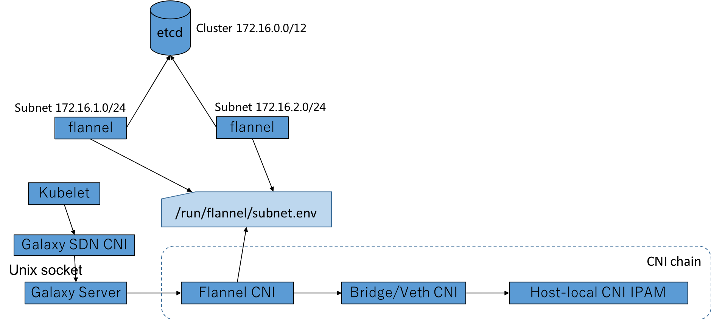
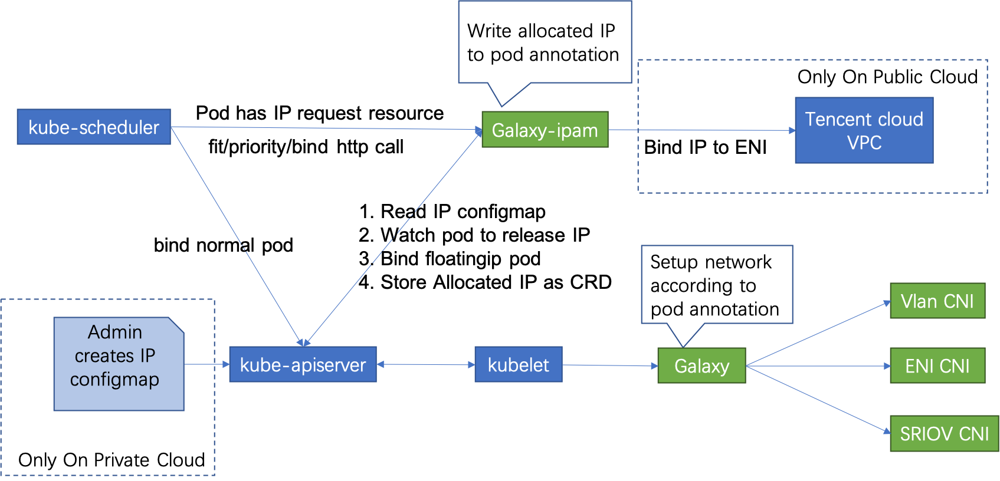

# Galaxy

Kubernetes没有提供默认可用的容器网络，但kubernetes网络的设计文档要求容器网络的实现能做到下面的三点：

1. all containers can communicate with all other containers without NAT
1. all nodes can communicate with all containers (and vice-versa) without NAT
1. the IP that a container sees itself as is the same IP that others see it as

即集群包含的每一个容器都拥有一个与其他集群中的容器和节点可直接路由的独立IP地址。但是Kubernetes并没有具体实现这样一个网络模型，而是实现了一个开放的容器网络标准CNI，可以自由选择使用开源的网络方案或者实现一套遵循CNI标准的网络，为用户提供两种网络类型：

1. Overlay Network，即通用的虚拟化网络模型，不依赖于宿主机底层网络架构，可以适应任何的应用场景，方便快速体验。但是性能较差，因为在原有网络的基础上叠加了一层Overlay网络，封包解包或者NAT对网络性能都是有一定损耗的。
1. Underlay Network，即基于宿主机物理网络环境的模型，容器与现有网络可以直接互通，不需要经过封包解包或是NAT，其性能最好。但是其普适性较差，且受宿主机网络架构的制约，比如MAC地址可能不够用。

为满足复杂应用容器化的特殊需求，大幅拓展了容器应用的场景，TKEStack利用Galaxy网络组件提供多种解决方案，支持overlay和underlay网络类型，支持高转发性能和高隔离性等场景应用。

[Galaxy](https://github.com/tkestack/galaxy)是一个Kubernetes网络项目，旨在为POD提供通用Overlay和高性能的Underlay网络。

TKEStack使用Galaxy网络组件，支持四种网络模式，并且可以为工作负载单独配置指定的网络模式，拓展了容器应用场景，满足复杂应用容器化的特殊需求。

1. Overlay网络

   TKEStack的默认网络模式，基于IPIP和host gateway的flannel方案，同节点容器通信不走网桥，报文直接利用主机路由转发；跨节点容器通信利用IPIP协议封装, etcd记录节点间路由。该方案控制层简单稳定，网络转发性能优异，并且可以通过network policy实现多种网络策略。
1. Floating IP

   容器IP由宿主机网络提供，打通了容器网络与underlay网络，容器与物理机可以直接路由，性能更好。容器与宿主机的二层连通, 支持了Linux bridge/MacVlan/IPVlan和SRIOV, 根据业务场景和硬件环境，具体选择使用哪种网桥
1. NAT

   基于k8s中的hostPort配置，并且如果用户没有指定Port地址，galaxy会给实例配置容器到主机的随机端口映射
1. Host

   利用k8s中的hostNetwork配置，直接使用宿主机的网络环境，最大的好处是其性能优势，但是需要处理端口冲突问题，并且也有安全隐患。

## Galaxy架构

Galaxy在架构上由三部分组成：

1. Galaxy:  以DaemonSet方式运行在每个节点上，通过调用各种CNI插件来配置k8s容器网络
1. CNI plugins: 符合CNI标准的二进制文件，用于网络资源的配置和管理, 支持CNI插件[Supported CNI plugins](https://github.com/tkestack/galaxy/blob/master/doc/supported-cnis.md)
1. Galaxy IPAM: 通过tkestack中的IPAM扩展组件安装，K8S调度插件，kube-scheduler通过HTTP调用Galaxy-ipam的filter/priority/bind方法实现Float IP的配置和管理

### Galaxy Overlay 网络



[tke-installer](https://github.com/tkestack/tke/blob/master/docs/user/tke-installer/README.md)安装tkestack并自动配置galaxy为overlay网络模式，在该模式下：

1. Flannel在每个Kubelet上分配一个子网，并将其保存在etcd和本地磁盘上(/run/ Flannel /subnet.env)
1. Kubelet根据CNI配置启动SDN CNI进程
1.SDN CNI进程通过unix socket调用Galaxy，所有的args都来自Kubelet
1. Galaxy调用FlannelCNI来解析来自/run/flannel/subnet.env的子网信息
1. Flannel CNI调用Bridge CNI或Veth CNI来为POD配置网络

### Galaxy Underlay 网络



如需配置underlay网络，需要启用Galaxy-ipam组件，Galaxy-ipam根据配置为POD分配或释放IP：

1. 规划容器网络使用的Underlay IP，配置floatingip-config ConfigMap
1. Kubernetes调度器在filter/priority/bind方法上调用Galaxy-ipam
1. Galaxy-ipam检查POD是否配置了reserved IP，如果是，则Galaxy-ipam仅将此IP所在的可用子网的节点标记为有效节点，否则所有都将被标记为有效节点。在POD绑定IP期间，Galaxy-ipam分配一个IP并将其写入到POD annotations中
1. Galaxy从POD annotations获得IP，并将其作为参数传递给CNI，通过CNI配置POD IP

## Galaxy配置

- [Galaxy configuration](https://github.com/tkestack/galaxy/blob/master/doc/galaxy-config.md)
- [Galaxy-ipam configuration](https://github.com/tkestack/galaxy/blob/master/doc/galaxy-ipam-config.md)
- [Float IP usage](https://github.com/tkestack/galaxy/blob/master/doc/float-ip.md)


## 常见问题

1. 为pod配置float ip网络模式失败
    1. 检查ipam扩展组件是否已正确安装
    1. 检查kube-scheduler是否正确配置scheduler-policy
    1. 检查floatingip-config ConfigMap是否配置正确
    1. 检查创建的Deployment工作负载：
        1. 容器限额中配置 tke.cloud.tencent.com/eni-ip:1
        1. 容器annotation中配置 k8s.v1.cni.cncf.io/networks=galaxy-k8s-vlan
    
    如果上述配置都正确，pod会被成功创建并运行，galaxy-ipam会自动为pod分配指定的Float IP

1. 为pod配置float ip网络模式后，如何与其他pod和主机通信

   Galaxy为pod配置float ip网络模式，pod的nic和ip由宿主机网络提供，此pod的就加入了underlay的网络，因此pod间的通信以及pod与主机的通信就需要网络管理员在相应的交换机和路由器上配置对应的路由。

## 参考配置

本节展示了在一个正确配置了float-ip的deployment工作负载。

### 查看kube-scheduler的policy配置文件是否配置正确

```yaml
# cat /etc/kubernetes/scheduler-policy-config.json
{
   "apiVersion" : "v1",
   "extenders" : [
      {
         "apiVersion" : "v1beta1",
         "enableHttps" : false,
         "filterVerb" : "predicates",
         "managedResources" : [
            {
               "ignoredByScheduler" : false,
               "name" : "tencent.com/vcuda-core"
            }
         ],
         "nodeCacheCapable" : false,
         "urlPrefix" : "http://gpu-quota-admission:3456/scheduler"
      },
      {
          "urlPrefix": "http://127.0.0.1:32760/v1",
          "httpTimeout": 10000000000,
          "filterVerb": "filter",
          "prioritizeVerb": "prioritize",
          "BindVerb": "bind",
          "weight": 1,
          "enableHttps": false,
          "managedResources": [
            {
              "name": "tke.cloud.tencent.com/eni-ip",
              "ignoredByScheduler": true
            }
          ]
      }
   ],
   "kind" : "Policy"
}

```

### 查看floatingip-config配置

```yaml
# kubectl get cm -n kube-system floatingip-config -o yaml
apiVersion: v1
data:
  floatingips: '[{"routableSubnet":"172.21.64.0/20","ips":["192.168.64.200~192.168.64.251"],"subnet":"192.168.64.0/24","gateway":"192.168.64.1"}]'
kind: ConfigMap
metadata:
  creationTimestamp: "2020-03-04T07:09:14Z"
  name: floatingip-config
  namespace: kube-system
  resourceVersion: "2711974"
  selfLink: /api/v1/namespaces/kube-system/configmaps/floatingip-config
  uid: 62524e92-f37b-4db2-8ec0-b01d7a90d1a1
```

### 查看deployment配置float-ip

```yaml
# kubectl get deploy nnn -o yaml
apiVersion: apps/v1
kind: Deployment
...
spec:
  ...
  template:
    metadata:
      annotations:
        k8s.v1.cni.cncf.io/networks: galaxy-k8s-vlan
        k8s.v1.cni.galaxy.io/release-policy: immutable
      creationTimestamp: null
      labels:
        k8s-app: nnn
        qcloud-app: nnn
    spec:
      containers:
      - image: nginx
        imagePullPolicy: Always
        name: nnn
        resources:
          limits:
            cpu: 500m
            memory: 1Gi
            tke.cloud.tencent.com/eni-ip: "1"
          requests:
            cpu: 250m
            memory: 256Mi
            tke.cloud.tencent.com/eni-ip: "1"
```

### 查看生成的pod带有float-ip的annotations

```yaml
# kubectl get pod nnn-7df5984746-58hjm -o yaml
apiVersion: v1
kind: Pod
metadata:
  annotations:
    k8s.v1.cni.cncf.io/networks: galaxy-k8s-vlan
    k8s.v1.cni.galaxy.io/args: '{"common":{"ipinfos":[{"ip":"192.168.64.202/24","vlan":0,"gateway":"192.168.64.1","routable_subnet":"172.21.64.0/20"}]}}'
    k8s.v1.cni.galaxy.io/release-policy: immutable
...
spec:
...
status:
...
  hostIP: 172.21.64.15
  phase: Running
  podIP: 192.168.64.202
  podIPs:
  - ip: 192.168.64.202

```

### 查看crd中保存的floatingips绑定信息

```yaml
# kubectl get  floatingips.galaxy.k8s.io 192.168.64.202 -o yaml
apiVersion: galaxy.k8s.io/v1alpha1
kind: FloatingIP
metadata:
  creationTimestamp: "2020-03-04T08:28:15Z"
  generation: 1
  labels:
    ipType: internalIP
  name: 192.168.64.202
  resourceVersion: "2744910"
  selfLink: /apis/galaxy.k8s.io/v1alpha1/floatingips/192.168.64.202
  uid: b5d55f27-4548-44c7-b8ad-570814b55026
spec:
  attribute: '{"NodeName":"172.21.64.15"}'
  key: dp_default_nnn_nnn-7df5984746-58hjm
  policy: 1
  subnet: 172.21.64.0/20
  updateTime: "2020-03-04T08:28:15Z"
```

### 查看所在主机上生成了对应的nic和ip

```shell script
# ip route
default via 172.21.64.1 dev eth0
169.254.0.0/16 dev eth0 scope link metric 1002
172.17.0.0/16 dev docker0 proto kernel scope link src 172.17.0.1
172.21.64.0/20 dev eth0 proto kernel scope link src 172.21.64.15
...
192.168.64.202 dev v-hb21e7165d 
```

