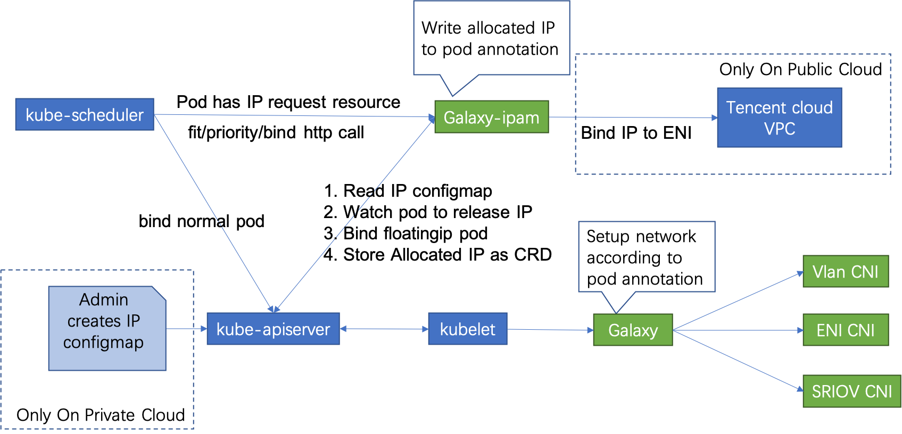

# Galaxy

Kubernetes 没有提供默认可用的容器网络，但 kubernetes 网络的设计文档要求容器网络的实现能做到下面的三点：

1. All containers can communicate with all other containers without NAT
1. All nodes can communicate with all containers (and vice-versa) without NAT
1. The IP that a container sees itself as is the same IP that others see it as

即集群包含的每一个容器都拥有一个与其他集群中的容器和节点可直接路由的独立IP 地址。但是 Kubernetes 并没有具体实现这样一个网络模型，而是实现了一个开放的容器网络标准CNI，可以自由选择使用开源的网络方案或者实现一套遵循 CNI 标准的网络，为用户提供两种网络类型：

1. **Overlay Network**：即通用的虚拟化网络模型，不依赖于宿主机底层网络架构，可以适应任何的应用场景，方便快速体验。但是性能较差，因为在原有网络的基础上叠加了一层 Overlay 网络，封包解包或者 NAT ，对网络性能都是有一定损耗的。
1. **Underlay Network**：即基于宿主机物理网络环境的模型，容器与现有网络可以直接互通，不需要经过封包解包或是 NAT，其性能最好。但是其普适性较差，且受宿主机网络架构的制约，比如 MAC 地址可能不够用。

为满足复杂应用容器化的特殊需求，大幅拓展了容器应用的场景，TKEStack 利用 Galaxy 网络组件提供多种解决方案，支持 overlay 和 underlay 网络类型，支持高转发性能和高隔离性等场景应用。

[Galaxy ](https://github.com/tkestack/galaxy)是一个Kubernetes网络项目，旨在为 POD 提供通用 Overlay 和高性能的 Underlay 网络。

TKEStack 使用 Galaxy网络组件，支持四种网络模式，并且可以为工作负载单独配置指定的网络模式，拓展了容器应用场景，满足复杂应用容器化的特殊需求。

1. Overlay 网络

   TKEStack 的默认网络模式，基于 IPIP 和 Host Gateway 的 Flannel 方案，同节点容器通信不走网桥，报文直接利用主机路由转发；跨节点容器通信利用 IPIP 协议封装,  ETCD 记录节点间路由。该方案控制层简单稳定，网络转发性能优异，并且**可以通过 Network Policy 实现多种网络策略**
   
1. Floating IP

   容器 IP 由宿主机网络提供，打通了容器网络与 Underlay 网络，容器与物理机可以直接路由，性能更好。容器与宿主机的二层连通, 支持了 Linux bridge/MacVlan/IPVlan 和 SRIOV，根据业务场景和硬件环境，具体选择使用哪种网桥
   
1. NAT

   基于 Kubernetes 中 Container 的 hostPort 配置，并且如果用户没有指定 Port 地址，Galaxy 会给实例配置容器到主机的随机端口映射
   
1. Host

   利用 Kubernetes 中 Pod 的 hostNetwork 配置，直接使用宿主机的网络环境，最大的好处是其性能优势，但是需要处理端口冲突问题，并且也有安全隐患

## Galaxy 架构

Galaxy 在架构上由三部分组成：

1. Galaxy:  以 DaemonSet 方式运行在每个节点上，通过调用各种 CNI 插件来配置 k8s 容器网络
1. CNI plugins: 符合 CNI 标准的二进制文件，用于网络资源的配置和管理, 支持 CNI 插件 [Supported CNI plugins](https://github.com/tkestack/galaxy/blob/master/doc/supported-cnis.md)
1. Galaxy IPAM: 通过 TKStack 中的 IPAM 扩展组件安装，K8S 调度插件，kube-scheduler 通过 HTTP 调用 Galaxy-ipam 的 filter/priority/bind 方法实现 Float IP 的配置和管理

### Galaxy Overlay 网络


[tke-installer](https://github.com/tkestack/tke/blob/master/docs/user/tke-installer/README.md) 安装 TKStack 并自动配置 Galaxy 为 Overlay 网络模式，在该模式下：

1. Flannel 在每个 Kubelet 上分配一个子网，并将其保存在 etcd 和本地磁盘上(/run/ Flannel /subnet.env)
1. Kubelet 根据 CNI 配置启动 SDN CNI 进程
1.SDN CNI 进程通过 unix socket 调用 Galaxy，所有的 args 都来自 Kubelet
1. Galaxy 调用 Flannel CNI 来解析来自 /run/flannel/subnet.env 的子网信息
1. Flannel CNI 调用 Bridge CNI 或 Veth CNI 来为 POD 配置网络

### Galaxy Underlay 网络



如需配置 Underlay 网络，需要启用 Galaxy-ipam 组件，Galaxy-ipam 根据配置为 POD 分配或释放 IP：

1. 规划容器网络使用的 Underlay IP，配置 floatingip-config ConfigMap
1. Kubernetes 调度器在 filter/priority/bind 方法上调用 Galaxy-ipam
1. Galaxy-ipam 检查 POD是否配置了 reserved IP，如果是，则 Galaxy-ipam 仅将此 IP 所在的可用子网的节点标记为有效节点，否则所有都将被标记为有效节点。在 POD 绑定 IP 期间，Galaxy-ipam 分配一个 IP 并将其写入到 POD annotations 中
1. Galaxy 从 POD annotations 获得 IP，并将其作为参数传递给 CNI，通过 CNI 配置 POD IP

## Galaxy配置

- [Galaxy configuration](https://github.com/tkestack/galaxy/blob/master/doc/galaxy-config.md)
- [Galaxy-ipam configuration](https://github.com/tkestack/galaxy/blob/master/doc/galaxy-ipam-config.md)
- [Float IP usage](https://github.com/tkestack/galaxy/blob/master/doc/float-ip.md)


## 常见问题

1. 为 pod 配置 float ip 网络模式失败
    1. 检查 ipam 扩展组件是否已正确安装
    1. 检查 kube-scheduler 是否正确配置 scheduler-policy
    1. 检查 floatingip-config ConfigMap 是否配置正确
    1. 检查创建的 Deployment 工作负载：
        1. 容器限额中配置 tke.cloud.tencent.com/eni-ip:1
        1. 容器 annotation 中配置 k8s.v1.cni.cncf.io/networks=galaxy-k8s-vlan
    
    如果上述配置都正确，pod 会被成功创建并运行，galaxy-ipam 会自动为 pod 分配指定的 Float IP

1. 为 pod 配置 float ip 网络模式后，如何与其他 pod 和主机通信

   Galaxy 为 pod 配置 float ip 网络模式，pod 的 nic 和 ip 由宿主机网络提供，此 pod 的就加入了 underlay的 网络，因此 pod 间的通信以及 pod 与主机的通信就需要网络管理员在相应的交换机和路由器上配置对应的路由。

## 参考配置

本节展示了在一个正确配置了 float-ip 的 deployment 工作负载。

### 查看 kube-scheduler 的 policy 配置文件是否配置正确

```yaml
# cat /etc/kubernetes/scheduler-policy-config.json
{
   "apiVersion" : "v1",
   "extenders" : [
      {
         "apiVersion" : "v1beta1",
         "enableHttps" : false,
         "filterVerb" : "predicates",
         "managedResources" : [
            {
               "ignoredByScheduler" : false,
               "name" : "tencent.com/vcuda-core"
            }
         ],
         "nodeCacheCapable" : false,
         "urlPrefix" : "http://gpu-quota-admission:3456/scheduler"
      },
      {
          "urlPrefix": "http://127.0.0.1:32760/v1",
          "httpTimeout": 10000000000,
          "filterVerb": "filter",
          "prioritizeVerb": "prioritize",
          "BindVerb": "bind",
          "weight": 1,
          "enableHttps": false,
          "managedResources": [
            {
              "name": "tke.cloud.tencent.com/eni-ip",
              "ignoredByScheduler": true
            }
          ]
      }
   ],
   "kind" : "Policy"
}

```

### 查看 floatingip-config 配置

```yaml
# kubectl get cm -n kube-system floatingip-config -o yaml
apiVersion: v1
data:
  floatingips: '[{"routableSubnet":"172.21.64.0/20","ips":["192.168.64.200~192.168.64.251"],"subnet":"192.168.64.0/24","gateway":"192.168.64.1"}]'
kind: ConfigMap
metadata:
  creationTimestamp: "2020-03-04T07:09:14Z"
  name: floatingip-config
  namespace: kube-system
  resourceVersion: "2711974"
  selfLink: /api/v1/namespaces/kube-system/configmaps/floatingip-config
  uid: 62524e92-f37b-4db2-8ec0-b01d7a90d1a1
```

### 查看 deployment 配置 float-ip

```yaml
# kubectl get deploy nnn -o yaml
apiVersion: apps/v1
kind: Deployment
...
spec:
  ...
  template:
    metadata:
      annotations:
        k8s.v1.cni.cncf.io/networks: galaxy-k8s-vlan
        k8s.v1.cni.galaxy.io/release-policy: immutable
      creationTimestamp: null
      labels:
        k8s-app: nnn
        qcloud-app: nnn
    spec:
      containers:
      - image: nginx
        imagePullPolicy: Always
        name: nnn
        resources:
          limits:
            cpu: 500m
            memory: 1Gi
            tke.cloud.tencent.com/eni-ip: "1"
          requests:
            cpu: 250m
            memory: 256Mi
            tke.cloud.tencent.com/eni-ip: "1"
```

### 查看生成的 pod 带有 float-ip 的 annotations

```yaml
# kubectl get pod nnn-7df5984746-58hjm -o yaml
apiVersion: v1
kind: Pod
metadata:
  annotations:
    k8s.v1.cni.cncf.io/networks: galaxy-k8s-vlan
    k8s.v1.cni.galaxy.io/args: '{"common":{"ipinfos":[{"ip":"192.168.64.202/24","vlan":0,"gateway":"192.168.64.1","routable_subnet":"172.21.64.0/20"}]}}'
    k8s.v1.cni.galaxy.io/release-policy: immutable
...
spec:
...
status:
...
  hostIP: 172.21.64.15
  phase: Running
  podIP: 192.168.64.202
  podIPs:
  - ip: 192.168.64.202

```

### 查看 crd 中保存的 floatingips 绑定信息

```yaml
# kubectl get  floatingips.galaxy.k8s.io 192.168.64.202 -o yaml
apiVersion: galaxy.k8s.io/v1alpha1
kind: FloatingIP
metadata:
  creationTimestamp: "2020-03-04T08:28:15Z"
  generation: 1
  labels:
    ipType: internalIP
  name: 192.168.64.202
  resourceVersion: "2744910"
  selfLink: /apis/galaxy.k8s.io/v1alpha1/floatingips/192.168.64.202
  uid: b5d55f27-4548-44c7-b8ad-570814b55026
spec:
  attribute: '{"NodeName":"172.21.64.15"}'
  key: dp_default_nnn_nnn-7df5984746-58hjm
  policy: 1
  subnet: 172.21.64.0/20
  updateTime: "2020-03-04T08:28:15Z"
```

### 查看所在主机上生成了对应的 nic 和 ip

```shell
# ip route
default via 172.21.64.1 dev eth0
169.254.0.0/16 dev eth0 scope link metric 1002
172.17.0.0/16 dev docker0 proto kernel scope link src 172.17.0.1
172.21.64.0/20 dev eth0 proto kernel scope link src 172.21.64.15
...
192.168.64.202 dev v-hb21e7165d 
```

Galaxy 项目请参考：[Galaxy Repository](https://github.com/tkestack/galaxy)