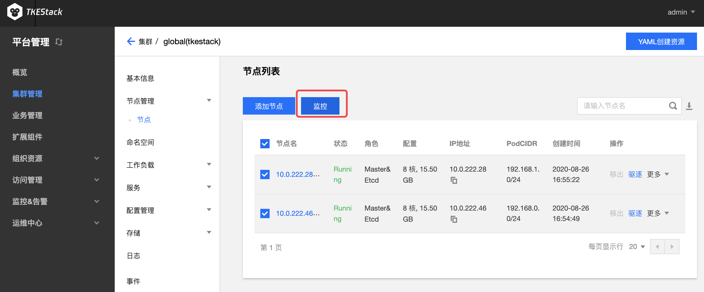

# Prometheus

良好的监控环境为 TKEStack 高可靠性、高可用性和高性能提供重要保证。您可以方便为不同资源收集不同维度的监控数据，能方便掌握资源的使用状况，轻松定位故障。

TKEStack 使用开源的 Prometheus 作为监控组件，免去您部署和配置 Prometheus 的复杂操作，TKEStack 提供高可用性和可扩展性的细粒度监控系统，实时监控 CPU，GPU，内存，显存，网络带宽，磁盘 IO 等多种指标并自动绘制趋势曲线，帮助运维人员全维度的掌握平台运行状态。

TKEStack 使用 Prometheus 的架构和原理可以参考 [Prometheus 组件](../../../../hack/addon/readme/Prometheus.md)

> 指标具体含义可参考：[监控 & 告警指标列表](../FAQ/Platform/alert&monitor-metrics.md)

TKEStack 通过 Prometheus 组件监控集群状态，Prometheus 组件通过 addon 扩展组件自动完成安装和配置，使用 InfluxDB，ElasticSearch 等存储监控数据。监控数据和指标融入到平台界面中以风格统一图表的风格展示，支持以不同时间，粒度等条件，查询集群，节点，业务，Workload 以及容器等多个层级的监控数据，全维度的掌握平台运行状态。

同时针对在可用性和可扩展性方面，支持使用 Thanos 架构提供可靠的细粒度监控和警报服务，构建具有高可用性和可扩展性的细粒度监控能力。

## 安装 Prometheus

Prometheus 为 TKEStack 扩展组件，需要在集群的 [【基本信息】](../products/platform/cluster.md#基本信息) 页下面开启 “监控告警”。

## 集群监控

1. 登录 TKEStack

2. 切换至【平台管理】控制台，选择【集群管理】

3. 点击【监控】图标，如下图所示： 

   

4. 监控数据展示
   1. 通过下图中的1可以选择监控数据时间段
   
   2. 通过下图中的2可以选择统计粒度，以下图中“APIServer时延”为例，下图中的每个数据表示前1分钟“APIServer时延”平均数
   
      
   
   3. 上下滑动曲线图可以获得更多监控指标
   
   4. 点击曲线图，会弹出具体时间点的具体监控数据
      
      
      > 指标具体含义可参考：[监控 & 告警指标列表](../FAQ/Platform/alert&monitor-metrics.md)
   

## 节点监控

1. 登录 TKEStack

2. 切换至【平台管理】控制台，选择【集群管理】

3. 点击【集群 ID】 -> 【节点管理】->【节点】->【监控】图标，如下图所示： 
   

4. 具体查看方式和[集群监控](#集群监控)完全一致
   
   > 指标具体含义可参考：[监控 & 告警指标列表](../FAQ/Platform/alert&monitor-metrics.md)
5. 此处还可以查看节点下的 Pod 监控
   1. 如下图所示，对比维度可选择 节点 或 Pod
   
   2. 选择 Pod ，需要在其右侧选择 Pod 所属节点
   
      

### 节点下的 Pod & Container 监控

有两种方式

1. [节点监控](#节点监控) 下选择 Pod 进行监控

2. 在节点列表里，点击节点名，进入节点的 Pod 管理页，如下图所示，点击上方的【监控】按钮，实现对节点下的 Pod 监控

   

   > 注意：此处还可以查看节点下的 Container 监控
   >
   > 1. 如下图所示，对比维度可选择 Pod 或 Container
   > 2. 选择 Container ，需要在其右侧选择 Container 所属 Pod
	 
   > 指标具体含义可参考：[监控 & 告警指标列表](../FAQ/Platform/alert&monitor-metrics.md)

## 负载监控

1. 登录 TKEStack
2. 切换至【平台管理】控制台，选择【集群管理】
3. 点击【集群 ID】 -> 【工作负载】->【选择一种负载，例如 Deployment】->【监控】图标，如下图所示： 
   

4. 具体查看方式和[集群监控](#集群监控)完全一致
   
   > 指标具体含义可参考：[监控 & 告警指标列表](../FAQ/Platform/alert&monitor-metrics.md)

### 负载下 Pod & Container 监控

1. 登录 TKEStack
2. 切换至【平台管理】控制台，选择【集群管理】
3. 点击【集群 ID】 -> 【工作负载】->【选择一种负载】，例如 Deployment】->【点击一个负载名】->【监控】图标，如下图所示：
   

> 注意：此处还可以查看负载下的 Container 监控
>
> 1. 如下图所示，对比维度可选择  Pod 或 Container
> 2. 选择 Container ，需要在其右侧选择 Container 所属 Pod
> 
> 指标具体含义可参考：[监控 & 告警指标列表](../FAQ/Platform/alert&monitor-metrics.md)

TKEStack 使用 Prometheus 的架构和原理可以参考 [Prometheus 组件](../../../../hack/addon/readme/Prometheus.md)