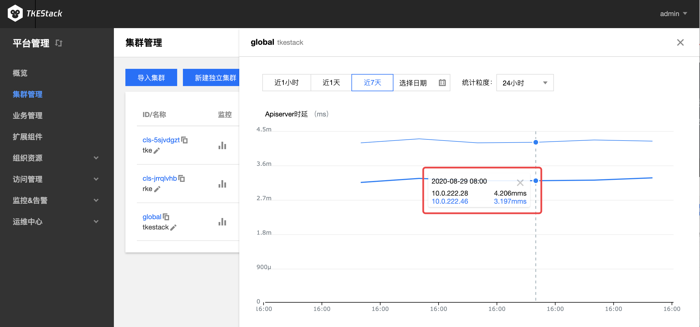

# Prometheus

免去部署和配置 prometheus 的复杂操作，TKEStack 提供高可用性和可扩展性的细粒度监控系统，实时监控 CPU，GPU，内存，显存，网络带宽，磁盘io等多种指标并自动绘制趋势曲线，帮助运维人员全维度的掌握平台运行状态。

TKEStack通过prometheus组件监控集群状态，prometheus 组件通过 addon 扩展组件自动完成安装和配置，使用 influxdb，elasticsearch 等存储监控数据。监控数据和指标融入到平台界面中以风格统一图表的风格展示，支持以不同时间，粒度等条件，查询集群，节点，业务，workload以及容器等多个层级的监控数据，全维度的掌握平台运行状态。

同时针对在可用性和可扩展性方面，支持使用 thanos 架构提供可靠的细粒度监控和警报服务，构建具有高可用性和可扩展性的细粒度监控能力。

## 安装Prometheus

Prometheus为TKEStack扩展组件，需要在【平台管理】-> 【扩展组件】里安装该组件。

## 集群监控

1. 登录TKEStack。
2. 切换至【平台管理】控制台，选择【集群管理】。
3. 点击【监控】图标。如下图所示： 

4. 监控数据展示
   1. 通过下图中的1可以选择监控数据时间段
   2. 通过下图中的2可以选择统计粒度，以下图中“APIServer时延”为例，下图中的每个数据表示前1分钟“APIServer时延”平均数。

5. 上下滑动曲线图可以获得更多监控指标

6. 点击曲线图，会弹出具体时间点的具体监控数据

   

## 节点监控

1. 登录TKEStack。
2. 切换至【平台管理】控制台，选择【集群管理】。
3. 点击【集群id】 -> 【节点管理】->【节点】->【监控】图标。如下图所示： 

4. 具体查看方式和[集群监控](#集群监控)完全一致
5. 此处还可以查看节点下的Pod监控
   1. 如下图所示，对比维度可选择 节点 或 Pod
   2. 选择 Pod ，需要在其右侧选择 Pod 所属节点

### 节点下的 Pod & Container 监控

有两种方式

1. [节点监控](#节点监控)下选择Pod进行监控
2. 在节点列表里，点击节点名，进入节点的Pod管理页，如下图所示，点击上方的【监控】按钮，实现对节点下的Pod监控

> 注意：此处还可以查看节点下的Container监控
>
> 1. 如下图所示，对比维度可选择 Pod 或 Container
> 2. 选择 Container ，需要在其右侧选择 Container 所属 Pod

## 负载监控

1. 登录TKEStack。
2. 切换至【平台管理】控制台，选择【集群管理】。
3. 点击【集群id】 -> 【工作负载】->【选择一种负载，例如Deployment】->【监控】图标。如下图所示： 

4. 具体查看方式和[集群监控](#集群监控)完全一致

### 负载下 Pod & Container 监控

1. 登录TKEStack。
2. 切换至【平台管理】控制台，选择【集群管理】。
3. 点击【集群id】 -> 【工作负载】->【选择一种负载，例如Deployment】->【点击一个负载】->【监控】图标。如下图所示：

> 注意：此处还可以查看负载下的Container监控
>
> 1. 如下图所示，对比维度可选择 Pod 或 Container
> 2. 选择 Container ，需要在其右侧选择 Container 所属 Pod

