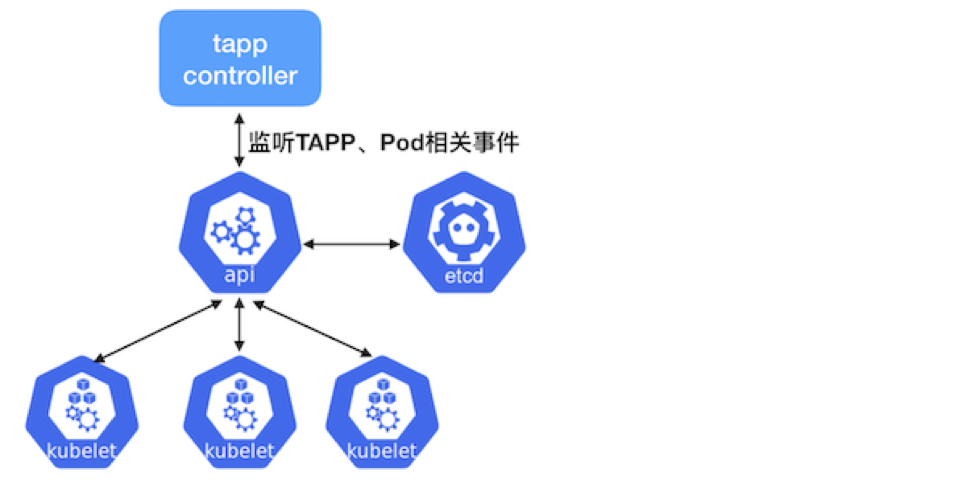

# TAPP
Kubernetes现有应用类型（如：Deployment、StatefulSet等）无法满足很多非微服务应用的需求，比如：操作（升级、停止等）应用中的指定pod、应用支持多版本的pod。如果要将这些应用改造为适合于这些workload的应用，需要花费很大精力，这将使大多数用户望而却步。
为解决上述复杂应用管理场景，基于Kubernetes CRD开发了一种新的应用类型TAPP，它是一种通用类型的workload，同时支持service和batch类型作业，满足绝大部分应用场景，它能让用户更好的将应用迁移到Kubernetes集群。




## TAPP 特点

功能点 | Deployment | StatefulSet | TAPP
---------------|-------|--------|--------
Pod唯一性 | 无 | 每个Pod有唯一标识 | 每个Pod有唯一标识
Pod存储独占 | 仅支持单容器 | 支持 | 支持
存储随Pod迁移 | 不支持 | 支持 | 支持
自动扩缩容 | 支持 | 不支持 | 支持
批量升级 | 支持 | 不支持 | 支持
严格顺序更新 | 不支持 | 支持 | 不支持
自动迁移问题节点 | 支持 | 不支持 | 支持
多版本管理 | 同时只有1个版本 | 可保持2个版本 | 可保持多个版本
Pod原地升级 | 不支持 | 不支持 | 支持

如果用Kubernetes的应用类型类比，TAPP ≈ Deployment + StatefulSet + Job ，它包含了Deployment、StatefulSet、Job的绝大部分功能，同时也有自己的特性，并且和原生Kubernetes相同的使用方式完全一致。


1. 实例具有可以标识的id

   实例有了id，业务就可以将很多状态或者配置逻辑和该id做关联，当容器迁移时，通过TAPP的容器实例标识，可以识别该容器原来对应的数据，实现带云硬盘或者数据目录迁移 

1. 每个实例可以绑定自己的存储

   通过TAPP的容器实例标识，能很好地支持有状态的作业。在实例发生跨机迁移时，云硬盘能跟随实例一起迁移

1. 实现真正的灰度升级/回退

   Kubernetes中的灰度升级概念应为滚动升级，kubernetes将pod”逐个”的更新，但现实中多业务需要的是稳定的灰度，即同一个app，需要有多个版本同时稳定长时间的存在，TAPP解决了此类问题

1. 可以指定实例id做删除、停止、重启等操作

   对于微服务app来说，由于没有固定id，因此无法对某个实例做操作，而是全部交给了系统去维持足够的实例数

1. 对每个实例都有生命周期的跟踪

   对于一个实例，由于机器故障发生了迁移、重启等操作，很难跟踪和监控其生命周期。通过TAPP的容器实例标识，获得了实例真正的生命周期的跟踪，对于判断业务和系统是否正常服务具有特别重要的意义。TAPP还可以记录事件，以及各个实例的运行时间，状态，高可用设置等。


## TAPP 资源结构

TApp定义了一种用户自定义资源（CRD），TAPP controller是TAPP对应的controller/operator，它通过kube-apiserver监听TApp、Pod相关的事件，根据TApp spec和status进行相应的操作：创建、删除pod等。

```go
// TApp represents a set of pods with consistent identities.
type TApp struct {
	metav1.TypeMeta   `json:",inline"`
	metav1.ObjectMeta `json:"metadata,omitempty"`

	// Spec defines the desired identities of pods in this tapp.
	Spec TAppSpec `json:"spec,omitempty"`

	// Status is the current status of pods in this TApp. This data
	// may be out of date by some window of time.
	Status TAppStatus `json:"status,omitempty"`
}
// A TAppSpec is the specification of a TApp.
type TAppSpec struct {
	// Replicas 指定Template的副本数，尽管共享同一个Template定义，但是每个副本仍有唯一的标识
	Replicas int32 `json:"replicas,omitempty"`

	// 同Deployment的定义，标签选择器，默认为Pod Template上的标签
	Selector *metav1.LabelSelector `json:"selector,omitempty"`

	// Template 默认模板，描述将要被初始创建/默认缩放的pod的对象，在TApp中可以被添加到TemplatePool中
	Template corev1.PodTemplateSpec `json:"template"`

	// TemplatePool 描述不同版本的pod template， template name --> pod Template
	TemplatePool map[string]corev1.PodTemplateSpec `json:"templatePool,omitempty"`

	// Statuses 用来指定对应pod实例的目标状态，instanceID --> desiredStatus ["Running","Killed"]
	Statuses map[string]InstanceStatus `json:"statuses,omitempty"`

	// Templates 用来指定运行pod实例所使用的Template，instanceID --> template name
	Templates map[string]string `json:"templates,omitempty"`

	// UpdateStrategy 定义滚动更新策略
	UpdateStrategy TAppUpdateStrategy `json:"updateStrategy,omitempty"`

	// ForceDeletePod 定义是否强制删除pod，默认为false
	ForceDeletePod bool `json:"forceDeletePod,omitempty"`

	// 同Statefulset的定义
	VolumeClaimTemplates []corev1.PersistentVolumeClaim `json:"volumeClaimTemplates,omitempty"`
}

// 滚动更新策略
type TAppUpdateStrategy struct {
	// 滚动更新的template name
	Template string `json:"template,omitempty"`
	// 滚动更新时的最大不可用数, 如果不指定此配置，滚动更新时不限制最大不可用数
	MaxUnavailable *int32 `json:"maxUnavailable,omitempty"`
}

// 定义TApp的状态
type TAppStatus struct {
	// most recent generation observed by controller.
	ObservedGeneration int64 `json:"observedGeneration,omitempty"`

	// Replicas 描述副本数
	Replicas int32 `json:"replicas"`

	// ReadyReplicas 描述Ready副本数
	ReadyReplicas int32 `json:"readyReplicas"`

	// ScaleSelector 是用于对pod进行查询的标签，它与HPA使用的副本计数匹配
	ScaleLabelSelector string `json:"scaleLabelSelector,omitempty"`

	// AppStatus 描述当前Tapp运行状态, 包含"Pending","Running","Failed","Succ","Killed"
	AppStatus AppStatus `json:"appStatus,omitempty"`

	// Statues 描述实例的运行状态 instanceID --> InstanceStatus ["NotCreated","Pending","Running","Updating","PodFailed","PodSucc","Killing","Killed","Failed","Succ","Unknown"]
	Statuses map[string]InstanceStatus `json:"statuses,omitempty"`
}
```

## 使用示例

本节以一个TApp应用部署，配置，升级，扩容以及杀死删除的操作步骤来说明TApp的使用。

### 创建TApp应用

创建TApp应用，副本数为3，TApp-controller将根据默认模板创建出的pod

```yaml
$ cat tapp.yaml
apiVersion: apps.tkestack.io/v1
kind: TApp
metadata:
  name: example-tapp
spec:
  replicas: 3
  template:
    metadata:
      labels:
        app: example-tapp
    spec:
      containers:
      - name: nginx
        image: nginx:1.7.9
$ kubect apply -f tapp.yaml  
```

### 查看TApp应用

```shell script
$ kubectl get tapp XXX
NAME           AGE
example-tapp   20m

$ kubectl descirbe tapp example-tapp
Name:         example-tapp
Namespace:    default
Labels:       app=example-tapp
Annotations:  <none>
API Version:  apps.tkestack.io/v1
Kind:         TApp
...
Spec:
...
Status:
  App Status:            Running
  Observed Generation:   2
  Ready Replicas:        3
  Replicas:              3
  Scale Label Selector:  app=example-tapp
  Statuses:
    0:  Running
    1:  Running
    2:  Running
Events:
  Type    Reason            Age   From             Message
  ----    ------            ----  ----             -------
  Normal  SuccessfulCreate  12m   tapp-controller  Instance: example-tapp-1
  Normal  SuccessfulCreate  12m   tapp-controller  Instance: example-tapp-0
  Normal  SuccessfulCreate  12m   tapp-controller  Instance: example-tapp-2
```

### 升级TApp应用

当前3个pod实例运行的镜像版本为nginx:1.7.9，现在要升级其中的一个pod实例的镜像版本为nginx:latest，在spec.templatPools中创建模板，然后在spec.templates中指定模板pod, 指定“1”:“test”表示使用模板test创建pod 1。

如果只更新镜像，Tapp controller将对pod进行原地升级，即仅更新重启对应的容器，否则将按k8s原生方式删除pod并重新创建它们。

```yaml
apiVersion: apps.tkestack.io/v1
kind: TApp
metadata:
  name: example-tapp
spec:
  replicas: 3
  template:
    metadata:
      labels:
        app: example-tapp
    spec:
      containers:
      - name: nginx
        image: nginx:1.7.9
  templatePool:
    "test":
      metadata:
        labels:
          app: example-tapp
      spec:
        containers:
        - name: nginx
          image: nginx:latest
  templates:
    "1": "test"
```

操作成功后，查看instanceID为'1'的pod已升级，镜像版本为nginx:latest
```shell script
# kubectl describe tapp example-tapp
Name:         example-tapp
Namespace:    default
Labels:       app=example-tapp
Annotations:  kubectl.kubernetes.io/last-applied-configuration:
                {"apiVersion":"apps.tkestack.io/v1","kind":"TApp","metadata":{"annotations":{},"name":"example-tapp","namespace":"default"},"spec":{"repli...
API Version:  apps.tkestack.io/v1
Kind:         TApp
...
Spec:
...
  Templates:
    1:  test
  Update Strategy:
Status:
  App Status:            Running
  Observed Generation:   4
  Ready Replicas:        3
  Replicas:              3
  Scale Label Selector:  app=example-tapp
  Statuses:
    0:  Running
    1:  Running
    2:  Running
Events:
  Type    Reason            Age   From             Message
  ----    ------            ----  ----             -------
  Normal  SuccessfulCreate  25m   tapp-controller  Instance: example-tapp-1
  Normal  SuccessfulCreate  25m   tapp-controller  Instance: example-tapp-0
  Normal  SuccessfulCreate  25m   tapp-controller  Instance: example-tapp-2
  Normal  SuccessfulUpdate  10m   tapp-controller  Instance: example-tapp-1

# kubectl get pod | grep example-tapp
example-tapp-0         1/1     Running   0          27m
example-tapp-1         1/1     Running   1          27m
example-tapp-2         1/1     Running   0          27m

# kubectl get pod example-tapp-1 -o template --template='{{range .spec.containers}}{{.image}}{{end}}'
nginx:latest

```

上述升级过程可根据实际需求灵活操作，可以指定多个pod的版本，帮助用户实现灵活的应用升级策略
同时可以指定updateStrategy升级策略，保证升级是最大不可用数为1，即保证滚动升级时每次仅更新和重启一个容器或pod

```yaml
# cat tapp.yaml
apiVersion: apps.tkestack.io/v1
kind: TApp
metadata:
  name: example-tapp
spec:
  replicas: 3
  template:
    metadata:
      labels:
        app: example-tapp
    spec:
      containers:
      - name: nginx
        image: nginx:1.7.9
  templatePool:
    "test":
      metadata:
        labels:
          app: example-tapp
      spec:
        containers:
        - name: nginx
          image: nginx:latest
  templates:
    "1": "test"
    "2": "test"
    "0": "test"
  updateStrategy:
    template: test
    maxUnavailable: 1
# kubectl apply -f tapp.yaml
```

### 杀死指定pod

在spec.statuses中指定pod的状态，tapp-controller根据用户指定的状态控制pod实例，例如，如果spec.statuses为“1”:“killed”，tapp控制器会杀死pod 1。

```yaml
# cat tapp.yaml
kind: TApp
metadata:
  name: example-tapp
spec:
  replicas: 3
  template:
    metadata:
      labels:
        app: example-tapp
    spec:
      containers:
      - name: nginx
        image: nginx:1.7.9
  templatePool:
    "test":
      metadata:
        labels:
          app: example-tapp
      spec:
        containers:
        - name: nginx
          image: nginx:latest
  templates:
    "1": "test"
    "2": "test"
    "0": "test"
  updateStrategy:
    template: test
    maxUnavailable: 1
  statuses:
    "1": "Killed"
# kubectl apply -f tapp.yaml
```

查看pod状态变为Terminating

```shell script
# kubectl get pod
NAME                   READY   STATUS        RESTARTS   AGE
example-tapp-0         1/1     Running       1          59m
example-tapp-1         0/1     Terminating   1          59m
example-tapp-2         1/1     Running       1          59m
```

### 扩容TApp应用

如果你想要扩展TApp使用默认的spec.template模板，只需增加spec.replicas的值，否则你需要在spec.templates中指定使用哪个模板。kubectl scale也适用于TApp。

```shell script
kubectl scale --replicas=3 tapp/example-tapp

```

### 删除TApp应用

```shell script
kubectl delete tapp example-tapp
```

### 其它

Tapp还支持其他功能，如HPA、volume templates，它们与k8s中的其它工作负载类型类似。