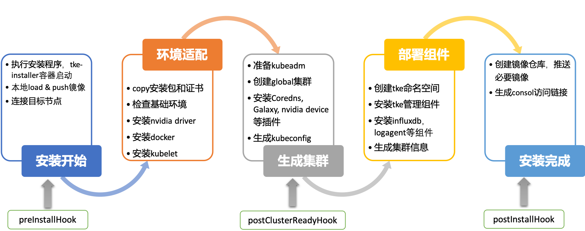
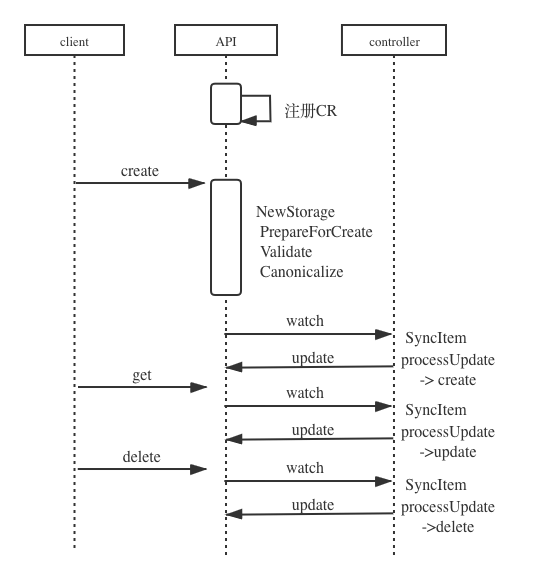
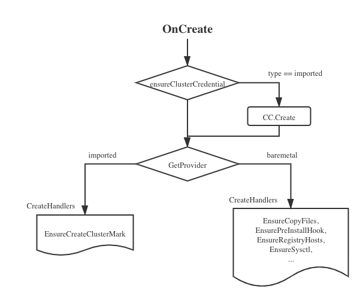
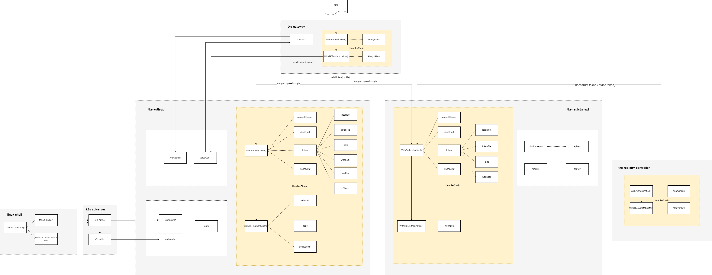
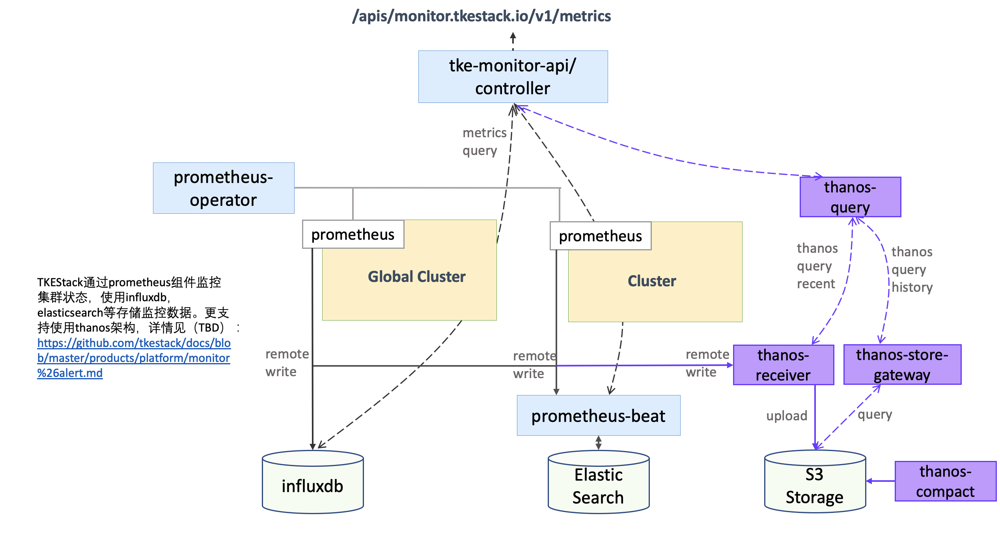
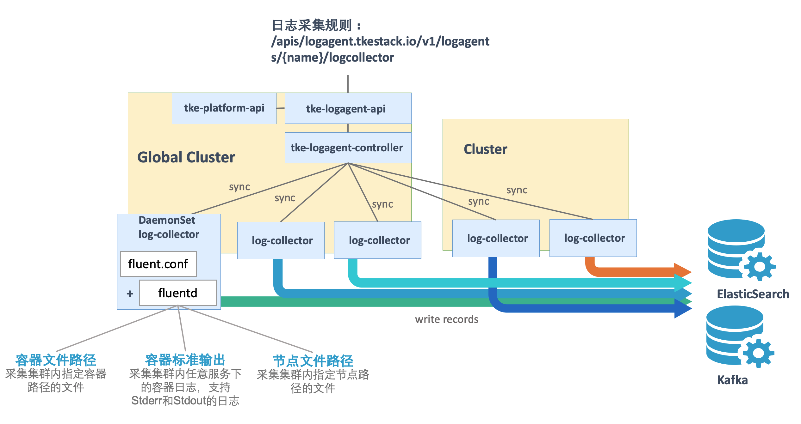

#  产品架构 & 能力说明

## 总体架构

TKEStack 产品架构如下图所示：


## 架构说明

TKEStack 采用了 Kubernetes on Kubernetes 的设计理念。即**节点仅运行 Kubelet 进程，其他组件均采用容器化部署，由 Kubernetes 进行管理**。

架构上分为 Global 集群和业务集群。Global 集群运行整个容器服务开源版平台自身所需要的组件，业务集群运行用户业务。在实际的部署过程中，可根据实际情况进行调整。

## 模块说明

* **Installer**: 运行 tke-installer 安装器的节点，用于提供 Web UI 指导用户在 Global 集群部署 TKEStack 控制台；
* **Global Cluster**: 统管业务集群（Business Cluster），并且是运行的 TKEStack 控制台的 Kubernetes 集群；
* **Business Cluster**: 运行业务的 Kubernetes 集群，如上图中的 Cluster A、Cluster B、Cluster C，可以通过 TKEStack 控制台创建或导入，由 Global Cluster 统一管理。

### Installer

TKEStack 使用 tke-installer 安装工具进行安装，通过界面化的方式引导用户一键部署 TKEStack 容器平台。tke-installer 安装工具能够检查基本的环境信息，自动适配 x86 或 arm 版本安装驱动和镜像。离线的安装方式更免去用户拉取镜像的烦恼，极大的提高了容器平台部署的效率。



tke-installer 自动等待和检查每一步骤安装完成，如果中间过程出错会自动在日志界面提示相应的信息，并支持根据用户需要，选择全新安装或从失败步骤继续安装。支持以 hook 方式自定义安装流程，用户可以在安装开始前、集群 ready 后以及安装结束后三个 hook 点添加自己的脚本或命令，实现平台安装的可定制化。

### Global

其中 Global Cluster 提供容器云平台的支撑环境和运行自身所需的各种组件，包括业务管理组件、平台管理组件、权限认证组件、监控和告警组件、registry 镜像仓库组件以及 gateway 前端页面网关组件等等。各个组件以 Workload 的形式灵活部署在 Global 集群中，**各组件多副本高可用方式部署**，单个组件异常或者主机节点掉线等故障不会影响 Global 集群的正常运行，TKEStack 仍可提供的管理功能，用户正常的业务访问不受影响。

* **Auth**: 权限认证组件，提供用户鉴权、权限对接相关功能；
* **Gateway**: 网关组件，实现集群后台统一入口、统一鉴权相关的功能，并运行控制台的 Web 界面服务；
* **Platform**: 集群管理组件，提供 Global 集群管理多个业务集群相关功能；
* **Business**: 业务管理组件，提供平台业务管理相关功能的后台服务；
* **Galaxy**：网络服务组件，为集群提供多种网络模式服务；
* **Monitor**: 监控服务组件，提供监控采集、上报、告警相关服务；
* **Notify**: 通知功能组件，提供消息通知相关的功能；
* **Registry**: 镜像服务组件，提供平台镜像仓库和 Helm charts 仓库服务；
* **Logagent**: 日志管理组件，为平台提供日志管理相关服务；
* **Audit**: 审计组件，提供审计服务功能。

此外还有诸如 **[Prometheus](../../../../hack/addon/readme/Prometheus.md)** 、**[TApp](../../../../hack/addon/readme/TappController.md)**、**[GPUManager](../../../../hack/addon/readme/GPUManager.md)**、**[CronHPA](../../../../hack/addon/readme/CronHPA.md)**、**[LogAgent](../../../../hack/addon/readme/LogAgent.md)** 等组件都可以安装在平台上的任意集群，以增强集群功能。

## 能力说明

- **原生**：TKEStack 兼容了 Kubernetes 原生服务访问模式。
- **产品特色**：TKEStack 扩展了 [Galaxy](https://github.com/tkestack/galaxy)（网络）、[TApp](https://github.com/tkestack/tapp)（工作负载）、[GPUManage](https://github.com/tkestack/gpu-manager)（GPU）、[CronHPA](https://github.com/tkestack/cron-hpa)（扩缩容）、[LBCF](https://github.com/tkestack/lb-controlling-framework)（负载均衡）等组件，界面化支持，插件化部署。
- **多集群管理**：提供多集群统一管理能力。
- **多租户统一认证**：支持 [OIDC](https://en.wikipedia.org/wiki/OpenID_Connect) 和 [LDAP](https://en.wikipedia.org/wiki/Lightweight_Directory_Access_Protocol) 对接，实现企业租户身份的统一认证。
- **权限管理**：提供多租户统一认证与权限管理能力。不同于 Kubernetes RBAC，TKEStack 权限管理是基于 [Casbin](https://casbin.org/docs/zh-CN/overview) 模型。TKEStack 支持平台用户和业务用户，可为用户/用户组配置不同的角色，并绑定对应的策略，从而实现资源共享和访问隔离。
- **仓库管理**：集成 [docker registry](https://github.com/docker/distribution) 和 [chartmuseum](https://github.com/helm/chartmuseum) 能力，支持创建公/私有仓库。支持创建有效时间范围的访问凭证。
- **运维能力**：提供集群、节点、工作负载、Pod、Container 五个粒度的监控数据收集和展示功能；提供短信、微信、邮件三种告警机制；提供容器文件、容器输出、节点文件三种日志采集方式，支持 [ElasticSearch](https://www.elastic.co/cn/elasticsearch/)、[Kafka](https://kafka.apachecn.org/intro.html) 两种消费端。
- **界面化**：大量 YAML 配置转换成可视化配置，降低使用门槛。
- **安全性**：TKEStack 支持 [WebTTY](https://github.com/maxmcd/webtty)，WebTTY 的鉴权接入了 TKEStack，减少对 kubeconfig 的依赖，降低集群 hack 风险。
- **版本升级**：TKEStack 采取了 Kubernetes 的代码理念，通过迭代可以不断适配新版本 Kubernetes。
- **异构治理**：支持一键部署 x86/arm64 异构容器集群及多型号 GPU 卡异构容器集群。

## 详细设计

Kubernetes 是高度可配置和可扩展的，TKEStack 支持通过配置和扩展实现对集群的定制，配置只涉及更改标志参数、本地配置文件或 API 资源；扩展涉及运行额外的程序或服务。

TKEStack 自身在设计上充分利用 K8S 的扩展特性，利用 K8S [API 访问扩展](https://kubernetes.io/docs/concepts/overview/extending#api-access-extensions) 能力对请求进行身份认证或根据其内容对其进行阻止、编辑内容以及处理删除操作，实现 TKEStack 的认证和授权功能。 利用 [Custom Resources](https://kubernetes.io/docs/concepts/extend-kubernetes/api-extension/custom-resources/) 能力添加 TKEStack 自定义的资源或其他项目已定义的资源，通过 K8S 提供的 [Aggregated API](https://kubernetes.io/zh/docs/concepts/extend-kubernetes/api-extension/apiserver-aggregation/) 和 [CRD](https://kubernetes.io/zh/docs/concepts/extend-kubernetes/api-extension/custom-resources/) 扩展方法，整合 TKEStack 各个组件和资源， 为不同资源提供统一的 CRUD、Watch、Discovery、HTTPS、Authentication 及 Authorization [特性](https://kubernetes.io/docs/concepts/extend-kubernetes/api-extension/custom-resources/#common-features)。

此外，TKEStack 利用 K8S [调度器扩展](https://kubernetes.io/docs/concepts/overview/extending#scheduler-extensions) 功能实现对资源调度的优化。 使用 [网络插件](https://kubernetes.io/docs/concepts/overview/extending#network-plugins) 和 [存储插件](https://kubernetes.io/docs/concepts/overview/extending#storage-plugins) 等实现 TKEStack 对多种 Pod 网络和新存储类型的支持。

### 基础结构

#### Aggregated API

TKEStack 通过 K8S [Aggregated API](https://kubernetes.io/zh/docs/concepts/extend-kubernetes/api-extension/apiserver-aggregation/) 聚合层扩展自身的组件和资源，聚合层允许 Kubernetes 通过额外的 API 进行扩展，而不局限于 Kubernetes 核心 API 提供的功能。

聚合层在 kube-apiserver 进程内运行。在扩展资源注册之前，聚合层不做任何事情。要注册 API，用户必须添加一个 [APIService](https://kubernetes.io/zh/docs/tasks/extend-kubernetes/setup-extension-api-server/) 对象，用它来申领 Kubernetes API 中的 URL 路径。 自此以后，聚合层将会把发给该 API 路径的所有内容（例如 /apis/myextension.mycompany.io/v1/…）代理到已注册的 APIService。

正常情况下，APIService 会实现为运行于集群中某 Pod 内的 extension-apiserver。如果需要对增加的资源进行动态管理，extension-apiserver 经常需要和一个或多个 Controllers 一起使用。

TKEStack 通过聚合层扩展 Kubernetes API，向 K8S 内注册各个组件的 APIService 对象。

```
# kubectl get apiservice | grep tke-
v1.auth.tkestack.io                    tke/tke-auth-api       True        28d
v1.business.tkestack.io                tke/tke-business-api   True        28d
v1.monitor.tkestack.io                 tke/tke-monitor-api    True        28d
v1.notify.tkestack.io                  tke/tke-notify-api     True        28d
v1.platform.tkestack.io                tke/tke-platform-api   True        28d
v1.registry.tkestack.io                tke/tke-registry-api   True        28d
```

同时实现了 extension-apiserver 和 Controllers 提供对资源的管理和控制。

```
# kubectl get deployment -n tke 
NAME                      READY   UP-TO-DATE   AVAILABLE   AGE
tke-auth-api              1/1     1            1           28d
tke-auth-controller       1/1     1            1           28d
tke-business-api          1/1     1            1           28d
tke-business-controller   1/1     1            1           28d
tke-logagent-api          1/1     1            1           28d
tke-logagent-controller   1/1     1            1           28d
tke-monitor-api           1/1     1            1           28d
tke-monitor-controller    1/1     1            1           28d
tke-notify-api            1/1     1            1           28d
tke-notify-controller     1/1     1            1           28d
tke-platform-api          1/1     1            1           28d
tke-platform-controller   1/1     1            1           28d
tke-registry-api          1/1     1            1           28d
```

以 business 组件为例，在代码结构上采用 Aggregated APIServer + Controller 的架构，分别编译出 tke-business-api 和 tke-business-controller, 在 tke-business-api 中注册了 chartgroup，configmap，emigration，imagenamespace，namespace，platform，portal，project 等 CR 资源。 同时在 Controller 中实现对上述资源对象的监视和同步，基于 K8S 的声明式 API 和 Controller 机制，实现对自定义资源对象的编排以及 Controller 的管理。

```
# tree tke/cmd/tke-business-*  -L 1
tke/cmd/tke-business-api
|-- apiserver.go
`-- app
tke/cmd/tke-business-controller
|-- app
`-- controller-manager.go
# tree tke/pkg/business/  -L 2
tke/pkg/business/
|-- apiserver
|   |-- apiserver.go
|   `-- install.go
|-- controller
|   |-- chartgroup
|   |-- emigration
|   |-- imagenamespace
|   |-- namespace
|   |-- platform
|   `-- project
|-- registry
|   |-- chartgroup
|   |-- configmap
|   |-- emigration
|   |-- imagenamespace
|   |-- namespace
|   |-- platform
|   |-- portal
|   |-- project
|   `-- rest
`-- util
    |-- filter.go
    |-- label.go
    `-- resource.go
```

#### Controller 框架

声明式 API 以及 Controller 机制是 Kubernetes 设计理念的基础，Controller 不断从 APIServer 同步资源对象的期望状态并且在资源对象的期望状态和实际运行状态之间进行调谐，从而实现两者的最终一致性。 Kubernetes 在 v1.7 引入了 CRD，允许用户自定义资源对象，同时将 Controller 的执行框架封装了在 client-go 这个包里，支持用户自定义编排对象以及相应的 Controller 进行配置管理。

下图展示了 client-go 库中的各种组件如何工作，以及它们与将要编写的 custom controller 的交互点。


图的上半部分是 client-go 封装的与 API Server 的底层交互逻辑，利用 List 接口从 API Server 中获取资源对象的全量数据并存储在缓存中， 之后再利用 Watch 接口对 API Server 进行监听并且以增量事件的方式持续接收资源对象的变更。

下半部分则是 Custom Controller 的业务代码，主要是针对资源对象增量事件的处理。Controller 可以对这些资源对象的增量变更事件进行即时处理，也可对缓存进行更新，保证缓存与 API Server 中的源数据保持最终的一致性。

更多详情参考：[client-go under the hood](https://github.com/kubernetes/sample-controller/blob/master/docs/controller-client-go.md)， [Building and using Kubernetes APIs](https://github.com/kubernetes-sigs/apiserver-builder-alpha/blob/master/docs/concepts/api_building_overview.md)

### Platform 组件

Platform 平台管理组件，利用 K8S Aggregated APIServer 方法注册和实现了 Cluster、ClusterCredential、machine 及 addon 等 CR 资源， 为平台提供包括集群、节点、扩展组件等基础功能和服务。

#### 集群管理

TKEStack 使用 cluster(cls) 和 clustercredential(cc) 等 CR 资源描述集群，用户通过新建独立集群或导入集群的方式添加集群，platform 组件自动生成对应的 cls 和 cc 资源对象。 其中 Baremetal 表示该集群是通过 TKEStack 平台新建的集群，Imported表示该集群为外部导入的集群，两种类型集群通过 platform 组件查看和管理。

```
# kubectl get cls
NAME           TYPE        VERSION   STATUS    AGE
cls-fd4tvdnb   Baremetal   1.16.6    Running   15d
cls-plhgb255   Imported    1.16.6    Running   19h
global         Baremetal   1.16.6    Running   29d
# kubectl get cc
NAME                         CREATED AT
cc-4dgq7zff                  2020-05-26T02:20:57Z
cc-global                    2020-05-12T02:20:25Z
clustercredential-lb6tvknq   2020-06-09T13:45:14Z
```

cls 存储和描述集群的基本信息，cc 保存和描述集群的凭证信息。前端通过 API 接口向 tke-platform-api 发送 cluster 资源创建，查询和删除请求，tke-platform-api 对请求进行校验并在etcd中创建相应的存储对象。 tke-platform-controller 监视 cluster 资源的状态和事件，根据 cluster 资源的变化来触发相应 provider 的 OnCreate、OnUpdate、OnDelete 的操作。



<<<<<<< HEAD
当触发 OnCreate 创建集群操作后， tke-platform-controller 根据创建集群类型的不同选择对应的 Provider，当前版本支持 baremetal provider 和 importal provider 两种类型，对应新建独立集群和导入集群两种操作。 Provider 内包含创建集群时所定义的动作和检查，根据用户的配置自动完成集群的创建及健康检查操作。
=======
当触发 OnCreate 创建集群操作后， tke-platform-controller 根据创建集群类型的不同选择对应的 provider，当前版本支持 baremetal provider 和 importal provider 两种类型，对应新建独立集群和导入集群两种操作。 provider 内包含创建集群时所定义的动作和检查，根据用户的配置自动完成集群的创建及健康检查操作。
>>>>>>> 42800e42ac6e2b1ded91da38ae533eecbf590894



#### 节点管理

platform 组件负责集群下的节点管理，管理和维护平台下节点，处理节点添加，移出，驱逐及封锁等操作。platform 组件维护 K8S node 资源，真实反应集群下的节点状态。 同时为用户维护节点，新增了 machine 自定义资源类型，辅助管理节点资源。

> 注意：machine 资源只存在于节点变成 Kubernetes 的 node 资源之前，如果 Kubernetes get nodes 已存在刚刚添加的节点，则 kubectl get machine 无法获取该节点信息。

```
# kubectl get machine
NAME          TYPE        IP             STATUS         AGE
mc-gnqmcw2j   Baremetal   172.21.3.224   Initializing   14d
mc-jcvg2h79   Baremetal   172.21.64.45   Initializing   51s

# kubectl get machine mc-jcvg2h79 -o yaml
apiVersion: platform.tkestack.io/v1
kind: Machine
metadata:
  ..
spec:
  clusterName: global
  finalizers:
  - machine
  ip: 1.1.1.1
  password: QmVpamluZzAxMQ==
  port: 22
  tenantID: default
  type: Baremetal
  username: root
status:
  ..
```

后端 machine controller 监视和更新 machine 资源，根据 machine 资源变化来触发对应 Provider 的 OnCreate、OnUpdate、OnDelete的操作。

#### addon 管理

Addon 扩展组件用来定制集群的能力，扩展集群的功能。当前 TKEStack 支持多种扩展组件，典型的扩展组件包括：

<<<<<<< HEAD
- **TApp**：一种全新类型的 Workload，更好的支持传统的有状态应用，实现灰度升级和多版本的发布管理，
=======
- **TAPP**：一种全新类型的 Workload，更好的支持传统的有状态应用，实现灰度升级和多版本的发布管理，
>>>>>>> 42800e42ac6e2b1ded91da38ae533eecbf590894
- **IPAM**：支持用户创建 floating ip，支持 Pod 固定 IP
- **CSI Operator**：负责 CSI 相关组件的部署与维护，帮助用户在集群中使用存储
- **LBCF**：一款通用负载均衡控制面框架，提供强大的扩展能力以满足业务方在使用负载均衡时的个性化需求
- **CronHPA**：使用 CronTab 模式定期自动扩容工作负载，周期性地在给定的调度时间对工作负载进行扩缩容
- **PersistentEvent**：集群事件实时导出到配置的存储端

更多扩展组件详情请见：[TKEStack 特性介绍](../../../../hack/addon/readme)

```
# kubectl get clusteraddontypes
NAME              AGE
logcollector      <unknown>
volumedecorator   <unknown>
helm              <unknown>
persistentevent   <unknown>
csioperator       <unknown>
cronhpa           <unknown>
prometheus        <unknown>
ipam              <unknown>
lbcf              <unknown>
gpumanager        <unknown>
tappcontroller    <unknown>

# kubectl api-resources | grep platform.tkestack.io
clusteraddontypes                 cat          platform.tkestack.io           false        ClusterAddonType
cronhpas                          cronhpa      platform.tkestack.io           false        CronHPA
csioperators                      co           platform.tkestack.io           false        CSIOperator
gpumanagers                       gm           platform.tkestack.io           false        GPUManager
helms                             hm           platform.tkestack.io           false        Helm
ipams                             ipam         platform.tkestack.io           false        IPAM
lbcfs                             lbcf         platform.tkestack.io           false        LBCF
logcollectors                     lc           platform.tkestack.io           false        LogCollector
persistentevents                  pe           platform.tkestack.io           false        PersistentEvent
prometheuses                      prom         platform.tkestack.io           false        Prometheus
tappcontrollers                   tc           platform.tkestack.io           false        TappController
volumedecorators                  vd           platform.tkestack.io           false        VolumeDecorator
```

platfotm 组件为每种 addon 创建了对应的 CR 资源，用以存储和维护扩展组件。

```
#  kubectl get prometheus.platform.tkestack.io
NAME                  CREATED AT
prometheus-9x7f22xk   2020-06-04T12:26:02Z
prometheus-gv9wcrg2   2020-05-12T03:30:58Z

#  kubectl get prometheus.platform.tkestack.io prometheus-9x7f22xk -o yaml
apiVersion: platform.tkestack.io/v1
kind: Prometheus
metadata:
  ..
spec:
  clusterName: cls-fd4tvdnb
  remoteAddress: {}
  resources: {}
  tenantID: default
  version: v1.0.0
status:
  ..
```

每个扩展组件的创建和维护逻辑在 tke-platform-controller 中实现，每个组件有独立的 Controller 用以自身的创建，更新和删除操作。 扩展组件使用常用的 K8S 资源，如 Deployment、StatefulSet、DaemonSet、Service、ClusterRole、ClusterRoleBinding、ConfigMap 等进行部署，Controller 自动更新配置并对组件进行健康检查，周期上报组件运行状态。 如扩展组件内部资源故障或退出，Controller 获取相应的事件并更新至扩展组件的 CR 资源中。

```
# kubectl get ipam ipam-pfsk76kx -o yaml
apiVersion: platform.tkestack.io/v1
kind: IPAM
metadata:
  ..
spec:
  ..
status:
  lastReInitializingTimestamp: "2020-06-04T12:57:25Z"
  phase: Failed
  reason: Install error and retried max(5) times already.
  retryCount: 5
```

### Auth 认证 & 授权 组件

下图展示 TKEStack 的认证鉴权流程，涉及 gateway、auth 及 registry 业务组件，每个组件都包含了自己的 HandlerChain，负责一层层处理请求。



TKEStack web 端的流量入口为 tke-gateway，tke-gateway 的 authn 为 [anonymous](https://kubernetes.io/zh/docs/reference/access-authn-authz/authentication/#anonymous-requests)，authz 为 [AlwaysAllow](https://kubernetes.io/zh/docs/reference/access-authn-authz/authorization/)，这意味着 tke-gateway 本身不做鉴权， 只是负责把请求通过 frontproxy 或 passthrough 方式代理给后端组件。若登录态有效（cookie 中的 token 有效），则 tke-gateway 将请求代理到后端组件， 并根据代理方式设置 token 到 Header；否则，与 tke-auth-api 的 /oidc/auth 部分交互，完成认证流程。

tke-auth-api 负责 TKEStack 认证、鉴权的整体逻辑。认证模块包括 requestHeader（对应frontproxy）、clientCert（x509）、 token（对应passthrough）、websocket 等，其中 token 模块包括了 localtrust、静态tokenFile、oidc、webhook、apiKey、idToken 等。 认证模块的启用是通过 tke-auth-api 配置文件的配置项决定的。token 模块中，localtrust 一般用于内部组件间 base64 编码的 token 解析， apiKey 用于解析 jwt 形式的 token，idToken 用于解析 oidc idToken。鉴权模块包括 webhook、ABAC、local 等，其中 local 使用了 casbin 模型鉴权。

其他 api 组件的认证、鉴权类似于 tke-registry-api。其中，认证模块包括requestHeader（对应frontproxy）、clientCert（x509）、 token（对应 passthrough）、websocket 等，其中token模块包括了localtrust、静态tokenFile、oidc、webhook等。鉴权模块包括 webhook， 指定为 tke-auth-api service，意味着 tke-registry-api 的鉴权阶段，将调用 tke-auth-api的 /auth/authz 接口，通过 SubjectAccessReview 数据进行交互。 /auth/authz 接口最终会调用 casbin 接口进行鉴权。

### gateway 组件

gateway 启动过程中，根据 IssuerURL 请求 /oidc/.well-known/openid-configuration，进而填充 OIDC 的相关配置，该请求由 auth-api 组件进行处理。

gateway 注册以下路由：

- 注册静态资源路由
  - 从 cookie 中获取 token 并解析，如果没有令牌或失效，则重定向到登录页面 /oidc/auth，并根据配置的 clientID、callback 等填写 URL 参数
- OAuth2 的 /callback
  - 根据授权码获取访问令牌，写入 cookie
- 注册各个组件的 proxy 路由，路由前从 cookie 获取 token
  - 若为 passthrough，设置 Authorazation Header，并采用单向认证传输（token 具备时效性，因此只需验证服务端）
  - 若为 frontproxy，设置 X-Remote-User、X-Remote-Groups、X-Remote-Extra-，并采用双向认证传输
  - tke-gateway 只负责认证，认证结果 proxy 给后端组件，后端组件通过 Webhook 访问 tke-auth-api 进行鉴权
- 转发 /oidc 请求 tke-auth-api 组件，使用 CA 证书进行单向认证
- 注册 tokens、sysinfo、logout 等路由
- 注册 webtty 路由

### tke-auth 组件

tke-auth-api 关于认证部分的实现细节如下：

- 注册 hooks 的过程中，dexHookHandler 负责 OAuth 的各个 API 请求处理
  - 具体实现为 github.com/dexidp/dex/server.NewServer
  - dexserver 涉及的 ListConnectors() 即为 TKEStack 的 IdentityProviders，即租户
- tke-gateway 重定向登录页面（/oidc/auth）时，dexserver 通过 handleAuthorization 方法将 req 请求内容存储到 storage 中，并返回租户选择页面（多租户情况下），租户上下文携带当前 req.ID
- 用户选择租户后，带上 req.ID 跳转到 /oidc/auth/{tenantid} 页面， dexserver 使用 handleConnectorLogin 方法处理，通过 req.ID 获取 req 的上下文，验证租户有效性，然后返回登录表单
- 用户填写账号密码登录后，dexserver 使用 handleConnectorLogin 方法处理，调用 localConnector.Login 方法进行密码检验，将用户信息和 connector 存储到 req 上下文中（用户信息存 claim），然后带上 req.ID 重定向到 /oidc/approval
  - 租户的 type 为 tke
  - IdentityProvider 在 init() 方法里填充 dexserver.ConnectorsConfig，将 ConnectorType 为 tke 的配置设置为 identityProvider，该 identityProvider 在 Open() 方法里返回了 localConnector 实例
- dexserver 使用 handleApproval 方法处理 /oidc/approval，通过 req.ID 获取 req 的上下文，生成授权码 code，将 req 上下文存储到 code 上下文中，带上 state 和 code 重定向到 req 上下文标记的 callback 路径，该 callback 由 tke-gateway 处理

tke-gateway 处理 callback请求时，发送 /oidc/token 请求获取访问令牌。dexserver 通过 handleToken 方法处理该请求，根据授权码 code 获取 code 上下文（包括用户信息和租户信息），并将其注入到 token 信息中（租户名和用户 id）并返回。

### reigisty 组件

集成 docker registry 和 chartmuseum 能力，支持创建公/私有仓库。支持创建有效时间范围的访问凭证。

- 注册 docker distribution api，处理 docker 镜像请求
- 注册 chartmuseum api，处理 chart 请求
- 注册 api，处理镜像仓库、镜像、chart 仓库、chart 等请求

### Business 组件

Business 业务管理组件，为 TKEStack 平台提供包括业务视图、业务成员、业务策略以及业务配额管理等功能，支持用户以业务应用使用者的视角，专注于自身高附加值业务应用的开发和管理，避免复杂的平台管理操作影响开发进度。

Business 组件注册和实现了 projects，namespaces，protal 等CR资源。

### Monitor & Notify 组件

免去部署和配置 prometheus 的复杂操作，TKEStack 提供高可用性和可扩展性的细粒度监控系统，实时监控 CPU，GPU，内存，显存，网络带宽，磁盘 IO 等多种指标并自动绘制趋势曲线，帮助运维人员全维度的掌握平台运行状态。

TKEStack 通过 Prometheus 组件监控集群状态，Prometheus 组件通过 Addon 扩展组件自动完成安装和配置，使用 InfluxDB，ElasticSearch 等存储监控数据。监控数据和指标融入到平台界面中以风格统一图表的风格展示，支持以不同时间，粒度等条件，查询集群、节点、业务、Workload 以及容器等多个层级的监控数据，全维度的掌握平台运行状态。

同时针对在可用性和可扩展性方面，支持使用 Thanos 架构提供可靠的细粒度监控和警报服务，构建具有高可用性和可扩展性的细粒度监控能力。

### Logagent 组件

提供的集群内日志采集功能，支持将集群内服务或集群节点特定路径文件的日志发送至 Kafka、Elasticsearch等消费端，支持采集容器标准输出日志，容器内文件日志以及主机内文件日志。更提供事件持久化、审计等功能，实时记录集群事件及操作日志记录，帮助运维人员存储和分析集群内部资源生命周期、资源调度、异常告警等情况。



需要为每个集群手动开启日志采集功能。日志采集功能开启后，log-collector 会在集群内以 DaemonSet 的形式运行，并根据用户通过日志采集规则配置的采集源和消费端，从采集源进行日志采集，将日志内容发送到消费端。

- **采集容器标准输出日志**：采集集群内指定容器的标准输出日志，采集到的日志信息将会以 JSON 格式输出到用户指定的消费端，并会自动附加相关的 Kubernetes metadata， 包括容器所属 Pod 的 label 和 annotation 等信息。
- **采集容器内文件日志**：采集集群内指定容器内文件的日志，用户可以根据自己的需求，灵活的配置所需的容器和路径，采集到的日志信息将会以 JSON 格式输出到用户指定的消费端， 并会附加相关的 Kubernetes metadata，包括容器所属 pod 的 label 和 annotation 等信息。
- **采集主机内文件日志**：采集集群内所有节点的指定主机路径的日志，log-collector 会采集集群内所有节点上满足指定路径规则的文件日志，以 JSON 格式输出到用户指定的输出端， 并会附加用户指定的 metadata，包括日志来源文件的路径和用户自定义的 metadata。

## 参考

- Custom Resources https://kubernetes.io/docs/concepts/extend-kubernetes/api-extension/custom-resources/
- API Access Extensions https://kubernetes.io/docs/reference/access-authn-authz/controlling-access/
- Custom Resources https://kubernetes.io/docs/concepts/api-extension/custom-resources/
- Scheduler Extensions https://kubernetes.io/docs/concepts/overview/extending#scheduler-extensions
- Network Plugins https://kubernetes.io/docs/concepts/overview/extending#network-plugins
- Storage Plugins https://kubernetes.io/docs/concepts/overview/extending#storage-plugins