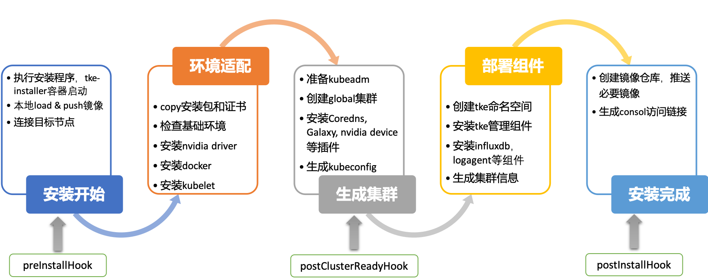

#  安装步骤

TKEStack 使用 [tke-installer](../../../user/tke-installer/introduction.md) 安装工具进行安装，通过界面化的方式引导用户一键部署 TKEStack 容器平台。tke-installer 安装工具能够检查基本的环境信息，**自动适配 AMD 或 ARM 版本安装驱动和镜像**。离线的安装方式更免去用户拉取镜像的烦恼，极大的提高了容器平台部署的效率。



tke-installer 自动等待和检查每一步骤安装完成，如果中间过程出错会自动在日志界面提示相应的信息，并支持根据用户需要，选择[重新安装或从失败步骤继续安装](../FAQ/Installation/如何重新部署.md)。更支持以 hook 方式自定义安装流程，用户可以在安装开始前、集群 ready 后以及安装结束后三个 hook 点添加自己的脚本或命令，实现平台安装的可定制化。

## 一、需求检查

仔细检查每个节点的硬件和软件需求：[部署环境要求](installation-requirement.md)

## 二、Installer安装

为了简化平台安装过程，TKEStack 基于 tke-installer 安装器提供了一个向导式的图形化安装指引界面。

在您 Installer 节点的终端，执行如下脚本：

```shell
# CPU架构为AMD64
arch=amd64 version=v1.4.0 && wget https://tke-release-1251707795.cos.ap-guangzhou.myqcloud.com/tke-installer-linux-$arch-$version.run{,.sha256} && sha256sum --check --status tke-installer-linux-$arch-$version.run.sha256 && chmod +x tke-installer-linux-$arch-$version.run && ./tke-installer-linux-$arch-$version.run

# CPU架构为ARM64
arch=arm64 version=v1.4.0 && wget https://tke-release-1251707795.cos.ap-guangzhou.myqcloud.com/tke-installer-linux-$arch-$version.run{,.sha256} && sha256sum --check --status tke-installer-linux-$arch-$version.run.sha256 && chmod +x tke-installer-linux-$arch-$version.run && ./tke-installer-linux-$arch-$version.run
```

> 您可以查看 TKEStack [Release](https://github.com/tkestack/tke/releases) 按需选择版本进行安装，建议您安装最新版本。
> 
> tke-installer 约为 8GB，包含安装所需的所有资源。

以上脚本执行完之后，终端会提示访问 `http://[tke-installer-IP]:8080/index.html`，使用本地主机的浏览器访问该地址，按照指引开始安装控制台，可参考下一步：

> 注意：这里`tke-installer-IP`地址默认为**内网地址**，如果本地主机不在集群内网，`tke-installer-IP`为内网地址所对应的**外网地址**。

## 三、控制台 和 Global 集群安装

> 注意：控制台是运行在 Global 集群之上，控制台安装的同时在安装 Global 集群。

1. 填写 TKEStack 控制台基本配置信息：

   

   - **用户名**：TKEStack 控制台管理员名称（**例如：admin**）

   - **密码**：TKEStack 控制台管理员密码

   - **高可用设置**（按需使用，可直接选择【**不设置**】）
     
     > 注意：如果使用高可用，至少需要三个 master 节点才可组成高可用集群，否则会出现 ***脑裂*** 现象。
     >
     > 生成环境建议使用高可用设置
     
     - **不设置**：第一台 master 节点的 IP 地址作为 APIServer 地址
     - **TKE 提供**：用户只需提供高可用的 IP 地址即可。TKE 部署 Keepalive，配置该 IP 为 Global 集群所有 Master 节点的 VIP，以实现 Global 集群和控制台的高可用，此时该 VIP 和所有 Master 节点 IP 地址都是 APIServer 地址
     - **使用已有**：对接配置好的外部 LB 实例，较为复杂，容易出错，不推荐。VIP 需要 绑定 Global 集群所有 Master 节点的 80（TKEStack 控制台）、443（TKEStack 控制台）、6443（kube-apiserver 端口）、31138（tke-auth-api 端口）端口，同时确保该 VIP 有至少两个 LB 后端（Master 节点），以避免 LB 单后端不可用风险

2. 填写 TKEStack 控制台集群设置信息：

    

    - **网卡名称**：设置集群节点使用的网卡，Galaxy 插件的 floating IP 功能会使用该网卡做桥接，如无特殊情况，一般为 eth0（**建议使用默认值**）

    - **GPU 类型**：（按需使用，可直接选择【**不设置**】）

      > 注意：使用 GPU 首先确保节点有物理 GPU 卡，选择 GPU 类型后，平台将自动为节点安装相应的 GPU 驱动和运行时工具

      - **不使用**：集群不安装 Nvidia GPU 相关驱动，此时集群不会使用 GPU，如果集群需要使用 GPU，必须安装以下两个 GPU 插件中的一个
      - **Physical**：平台会自动为集群安装 [Nvidia-k8s-device-plugin](https://github.com/NVIDIA/k8s-device-plugin)，此时可以给负载分配任意整数张卡
      - **Virtual**：平台会自动为集群安装 [GPUManager](../features/gpumanager.md)  扩展组件，此时GPU可以被虚拟化，可以给负载分配非整数张 GPU 卡，例如可以给一个负载分配0.3个 GPU

    - **容器网络：** 将为集群内容器分配在容器网络地址范围内的 IP 地址，您可以自定义三大私有网段作为容器网络， 根据您选择的集群内服务数量的上限，自动分配适当大小的 CIDR 段用于 Kubernetes service；根据您选择 Pod 数量上限/节点，自动为集群内每台服务器分配一个适当大小的网段用于该主机分配 Pod 的 IP 地址（**建议使用默认值**）
      
      - **CIDR：** 集群内 Sevice、 Pod 等资源所在网段，注意：CIDR不能与目标机器IP段重叠， 否则会造成初始化失败
      - **Pod数量上限/节点：** 决定分配给每个 Node 的 CIDR 的大小
      - **Service数量上限/集群**：决定分配给 Sevice 的 CIDR 大小
      
    - **master 节点：** 输入目标机器信息后单击保存，**若保存按钮是灰色，单击网页空白处即可变蓝**
      
      > 注意：如果在上一步中使用高可用，至少需要三个 master 节点才可组成高可用集群，否则会出现 ***脑裂*** 现象。
      
      - **访问地址：** Master 节点**内网 IP**，请配置**至少 8 Cores & 16G 内存** 及以上的机型，**否则会部署失败**。注意：如上图所示，如果节点密码一样，这里可以通过英文的分号“;”分隔多个IP地址实现快速添加多个节点
      
      - **SSH 端口**：请确保目标机器安全组开放 SSH 端口和 ICMP 协议，否则无法远程登录和 PING 服务器（建议使用**22**）
      
      - **认证方式**：连接目标机器的方式
      
        +  **密码认证**：
           +  **密码**：目标机器密码
        +  **密钥认证**：
           +  **私钥**：目标机器秘钥
           +  **私钥密码**：目标机器私钥密码，可选填
      
      - **添加机器**：可以通过节点下面的**【添加机器】**蓝色字体增加不同密码的 master 节点（**按需添加**）
      
      - **高级设置**（非必须）：可以自定义 Global 集群的 Docker、kube-apiserver、kube-controller-manager、kube-scheduler、kubelet 运行参数，查看对应的帮助文档链接可获取详细信息
      
        

3. 填写 TKEStack 控制台认证信息（建议使用**TKE提供**）

    

    - **认证方式：**
      - **TKE提供**：使用 TKE 自带的认证方式
      - **OIDC**：使用 OIDC 认证方式，详见 [OIDC](https://kubernetes.io/docs/reference/access-authn-authz/authentication/#openid-connect-tokens)

4. 填写 TKEStack 控制台镜像仓库信息（建议使用 **TKE 提供**）

    

    - **镜像仓库类型（ Installer 里的所有镜像都会上传到该仓库）：**
      - **TKE 提供**：使用 TKE 自带的镜像仓库，用 [docker distribution](https://github.com/docker/distribution) 实现后台镜像存储，可配置仓库权限
      - **第三方仓库**：对接配置好的外部镜像仓库，此时，TKEStack 将不会再安装镜像仓库，而是使用您提供的镜像仓库作为默认镜像仓库服务，不可配置仓库权限

5. 业务设置

   * 确认是否开启 TKEStack 控制台业务模块(**建议开启**)
   * 确认是否开启平台审计功能，审计模块为平台提供了操作记录,用户可以在平台管理进行查询，需用用户提供 Elasticsearch 资源（**按需使用，可不开启**）
     

6. 选择 TKEStack 控制台监控存储类型（建议使用 **TKE 提供**）

   

   - **监控存储类型**：
     - **TKE 提供**：使用 TKE 自带的 Influxdb 作为存储
     - **外部 Influxdb**：对接外部的 Influxdb 作为存储
     - **外部 ES**：对接外部的 Elasticsearch 作为存储
     - **不使用**：不使用监控

7. 确认是否开启 TKEStack 控制台，选择开启则需要填写控制台域名及证书（**建议使用默认值**）

   

   - **监控存储类型**:
     - **自签名证书**：使用 TKE 带有的自签名证书
     - **指定服务器证书**：填写已备案域名的服务器证书

8. 确认 TKEStack 控制台所有配置是否正确：

   

9. 开始安装 TKEStack 控制台，**安装需要1个小时左右，请耐心等待**。安装成功后界面如下，最下面出现【查看指引】的按钮：

   

10. 点击【查看指引】，按照指引，在需要访问 TKEStack 控制台的主机上添加域名解：
    

    

    * **以 Linux/MacOS 为例**: 在`/etc/hosts`文件中加入以下两行域名解析
      
      * 【IP】 console.tke.com
      * 【IP】 registry.tke.com
      
      > 注意：这里域名的【IP】地址默认为**内网地址**，如果本地主机不在集群内网，域名的 IP 地址应该填该内网地址所对应的**外网地址**。

## 四、访问控制台

在本地主机的浏览器地址输入 `http://console.tke.com` ，可访问 TKEStack 的控制台界面，输入控制台安装创建的用户名和密码后即可使用 TKEStack 。

## 安装常见问题

TKEStack 的安装需要一个小时左右，具体时间也依赖使用的硬件能力。目前安装已经非常成熟，如果您安装中遇到任何问题，可以采取如下几种方式：：

1. 请首先检查 [部署环境要求](../installation/installation-requirement.md)
2. 如有更多安装类问题，例如安装失败了如何重新部署等，请参考 [部署类问题](../FAQ/Installation)
3. 可以提出一个 [Issue](https://github.com/tkestack/tke/issues/new/choose)，我们会认真对待每一个 Issue