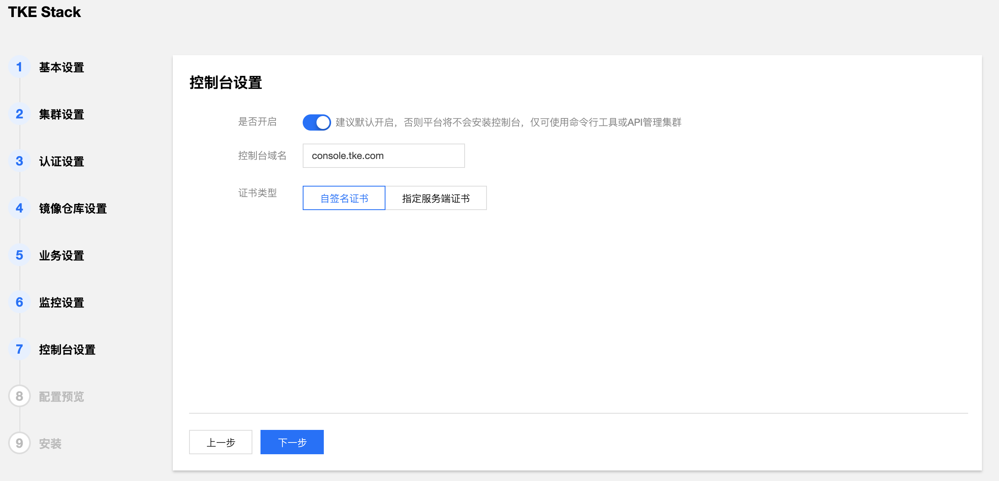
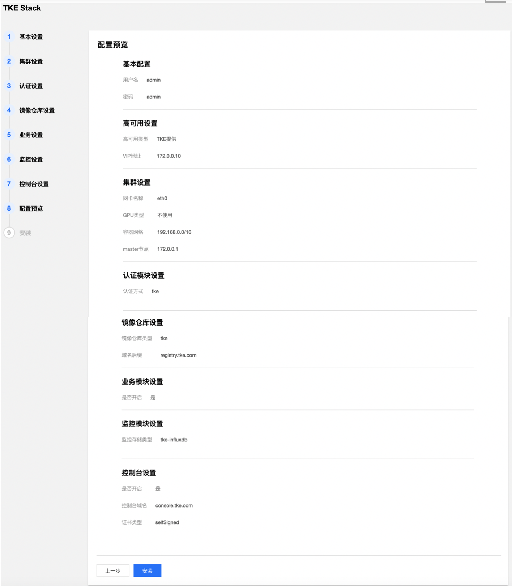

#  安装步骤

## 1. 需求检查

仔细检查每个节点的硬件和软件需求：[installation requirements](../../../../docs/guide/zh-CN/installation/installation-requirement.md)

## 2. Installer安装

为了简化平台安装过程，容器服务开源版基于 tke-installer 安装器提供了一个向导式的图形化安装指引界面。

在您 Installer 节点的终端，执行如下脚本：

```shell
# amd64
arch=amd64 version=v1.3.1 && wget https://tke-release-1251707795.cos.ap-guangzhou.myqcloud.com/tke-installer-linux-$arch-$version.run{,.sha256} && sha256sum --check --status tke-installer-linux-$arch-$version.run.sha256 && chmod +x tke-installer-linux-$arch-$version.run && ./tke-installer-linux-$arch-$version.run

# arm64
arch=arm64 version=v1.3.1 && wget https://tke-release-1251707795.cos.ap-guangzhou.myqcloud.com/tke-installer-linux-$arch-$version.run{,.sha256} && sha256sum --check --status tke-installer-linux-$arch-$version.run.sha256 && chmod +x tke-installer-linux-$arch-$version.run && ./tke-installer-linux-$arch-$version.run
```

> 您可以查看 TKEStack [Release](https://github.com/tkestack/tke/releases) 按需选择版本进行安装，建议您安装最新版本。
> 
> tke-installer 约为 7GB，包含安装所需的所有资源。


以上脚本执行完之后，终端会提示访问 http://[tke-installer-IP]:8080/index.html，使用本地主机的浏览器访问该地址，按照指引开始安装控制台，可参考下面的控制台安装。

> 注意：这里`tke-installer-IP`地址默认为**内网地址**，如果本地主机不在集群内网，`tke-installer-IP`为内网地址所对应的**外网地址**。


## 3. 控制台安装

> 注意：控制台是运行在global集群之上，控制台安装就是在安装global集群。

1. 填写 TKEStack 控制台基本配置信息


- **用户名**：TKEStack 控制台管理员名称（**例如：admin**）
- **密码**：TKEStack 控制台管理员密码
- **高可用设置**（按需使用，可直接选择【**不设置**】）
  - **TKE提供**：在所有 master 节点额外安装 Keepalived 完成 VIP 的配置与连接
  - **使用已有**：对接配置好的外部 LB 实例
  - **不设置**：访问第一台 master 节点 APIServer

2. 填写 TKEStack 控制台集群设置信息


- **网卡名称**：集群节点使用的网卡，根据实际环境填写正确的网卡名称，默认为eth0（**建议使用默认值**）

- **GPU 类型**：（按需使用，可直接选择【**不设置**】）
  - **不使用**：不安装 Nvidia GPU 相关驱动
  - **Virtual**：平台会自动为集群安装 [GPUManager](https://github.com/tkestack/docs/blob/master/features/gpumanager.md)  扩展组件
  - **Physical**：平台会自动为集群安装 [Nvidia-k8s-device-plugin](https://github.com/NVIDIA/k8s-device-plugin)

- **容器网络：** 将为集群内容器分配在容器网络地址范围内的 IP 地址，您可以自定义三大私有网段作为容器网络， 根据您选择的集群内服务数量的上限，自动分配适当大小的 CIDR 段用于 Kubernetes service；根据您选择 Pod 数量上限/节点，自动为集群内每台服务器分配一个适当大小的网段用于该主机分配 Pod 的 IP 地址（**建议使用默认值**）
  - **CIDR：** 集群内 Sevice、 Pod 等资源所在网段
  - **Pod数量上限/节点：** 决定分配给每个 Node 的 CIDR 的大小
  - **Service数量上限/集群**：决定分配给 Sevice 的 CIDR 大小

- **master 节点：** 输入目标机器信息后单击保存，若保存按钮是灰色，单击网页空白处即可变蓝
  - **访问地址：** Master 节点**内网 IP**，请配置**至少 8 Cores & 16G内存** 及以上的机型，**否则会部署失败**
  - **SSH 端口**：请确保目标机器安全组开放 SSH 端口和 ICMP 协议，否则无法远程登录和 PING 服务器（建议使用**22**）
  - **用户名和密码：** 均为添加的节点的用户名和密码
  - 可以通过节点下面的【添加机器】蓝色字体增加master节点（**按需添加**）


* **高级设置**（非必须）：可以自定义 Global 集群的 Docker、kube-apiserver、kube-controller-manager、kube-scheduler、kubelet 运行参数

3. 填写 TKEStack 控制台认证信息。（建议使用**TKE提供**）


- **认证方式：**
  - **TKE提供**：使用 TKE 自带的认证方式
  - **OIDC**：使用 OIDC 认证方式，详见 [OIDC](https://kubernetes.io/docs/reference/access-authn-authz/authentication/#openid-connect-tokens)

4. 填写 TKEStack 控制台镜像仓库信息。（建议使用**TKE提供**）


- **镜像仓库类型：**
  - **TKE提供**：使用 TKE 自带的镜像仓库
  - **第三方仓库**：对接配置好的外部镜像仓库，此时，TKEStack 将不会再安装镜像仓库，而是使用您提供的镜像仓库作为默认镜像仓库服务

5. 业务设置

* 确认是否开启 TKEStack 控制台业务模块。(**建议开启**)
* 确实是否开启平台审计功能，审计模块为平台提供了操作记录,用户可以在平台管理进行查询，需用用户提供ES资源。（**按需使用，可不开启**）


6. 选择 TKEStack 控制台监控存储类型。（建议使用**TKE提供**）


- **监控存储类型**：
  - **TKE提供**：使用 TKE 自带的 Influxdb 作为存储
  - **外部 Influxdb**：对接外部的 Influxdb 作为存储
  - **外部 ES**：对接外部的 Elasticsearch作为存储
  - **不使用**：不使用监控

7. 确认是否开启 TKEStack 控制台，选择开启则需要填写控制台域名及证书。（**建议使用默认值**）



- **监控存储类型**:
  - **自签名证书**：使用 TKE 带有的自签名证书
  - **指定服务器证书**：填写已备案域名的服务器证书

8. 确认 TKEStack 控制台所有配置是否正确。



9. 开始安装 TKEStack 控制台，安装成功后界面如下，最下面出现【查看指引】的按钮。


10. 点击【查看指引】，按照指引，在本地主机上添加域名解析，以访问 TKEStack 控制台。
    


* **以Linux/MacOS为例**: 在`/etc/hosts`文件中加入以下两行域名解析
  * 【IP】 console.tke.com
  * 【IP】 registry.tke.com

  > 注意：这里域名的【IP】地址默认为**内网地址**，如果本地主机不在集群内网，域名的IP地址应该填该内网地址所对应的**外网地址**。

## 4. 访问控制台

在本地主机的浏览器地址输入 http://console.tke.com ，可访问Global集群的控制台界面，输入控制台安装创建的用户名和密码后即可使用TKEStack。

# 安装常见问题

安装失败请首先检查硬件和软件需求：[installation requirements](../../../../docs/guide/zh-CN/installation/installation-requirement.md)

可参考[FAQ installation](../FAQ/installation)获得更多帮助。
