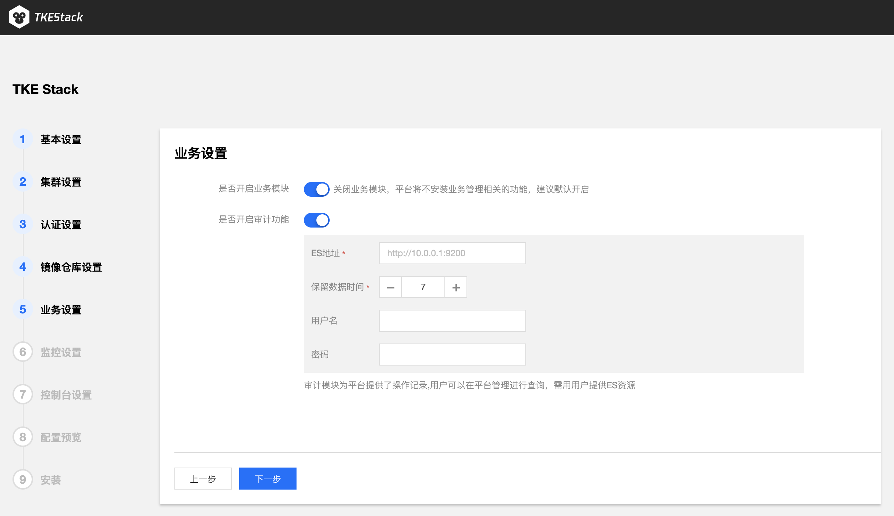

#  安装步骤


## 平台安装

为了简化平台安装过程，容器服务开源版基于 tke-installer 安装器提供了一个向导式的图形化安装指引界面。

1. 登录到您的 Installer 节点，下载 tke-installer 安装器本到 /data 目录下：

```
version=v1.2.3 && wget https://tke-release-1251707795.cos.ap-guangzhou.myqcloud.com/tke-installer-x86_64-$version.run{,.sha256} && sha256sum --check --status tke-installer-x86_64-$version.run.sha256 && chmod +x tke-installer-x86_64-$version.run
```

> 注：您可以查看 TKEStack [Release](https://github.com/tkestack/tke/releases) 按需选择版本进行安装，建议您安装最新版本。
>

> 注：tke-installer 约为 5GB，包含安装所需的所有资源。
>

2. 开始安装：在 Installer 节点上通过以下命令安装 tke-installer ：

```
./tke-installer-x86_64-$version.run
```

3. 访问 http://[tke-installer-IP]:8080/index.html，按照指引开始安装控制台。


### 控制台安装

1. 填写 TKEStack 控制台基本配置信息


- **用户名**：TKEStack 控制台管理员名称
- **密码**：TKEStack 控制台管理员密码
- **高可用设置**
  - **TKE提供**：在所有 master 节点额外安装 Keepalived 完成 VIP 的配置与连接
  - **使用已有**：对接配置好的外部 LB 实例
  - **不设置**：访问第一台 master 节点 APIServer

2. 填写 TKEStack 控制台集群设置信息


- **网卡名称**：集群节点使用的网卡，根据实际环境填写正确的网卡名称，默认为eth0

- **GPU 类型**：
  - **不使用**：不安装 Nvidia GPU 相关驱动
  - **Virtual**：平台会自动为集群安装 [GPUManager](https://github.com/tkestack/docs/blob/master/features/gpumanager.md)  扩展组件
  - **Physical**：平台会自动为集群安装 [Nvidia-k8s-device-plugin](https://github.com/NVIDIA/k8s-device-plugin)

- **容器网络：** 将为集群内容器分配在容器网络地址范围内的 IP 地址，您可以自定义三大私有网段作为容器网络， 根据您选择的集群内服务数量的上限，自动分配适当大小的 CIDR 段用于 Kubernetes service；根据您选择 Pod 数量上限/节点，自动为集群内每台服务器分配一个适当大小的网段用于该主机分配 Pod 的 IP 地址
- **CIDR：** 集群内 Sevice、 Pod 等资源所在网段
  - **Pod数量上限/节点：** 决定分配给每个 Node 的 CIDR 的大小

- **Service数量上限/集群**：决定分配给 Sevice 的 CIDR 大小

- **master 节点：** 输入目标机器信息后单击保存，若保存按钮是灰色，单击边上空白处即可变蓝
- **访问地址：** Master 节点内网 IP，请配置至少 8 Cores & 16G内存 及以上的机型
  - **SSH 端口**：请确保目标机器安全组开放 SSH 端口和 ICMP 协议，否则无法远程登录和 PING 服务器


* **高级设置**：可以自定义 Global 集群的 Docker、kube-apiserver、kube-controller-manager、kube-scheduler、kubelet 运行参数

3. 填写 TKEStack 控制台认证信息。


- **认证方式：**
  - **TKE提供**：使用 TKE 自带的认证方式
  - **OIDC**：使用 OIDC 认证方式，详见 [OIDC](https://kubernetes.io/docs/reference/access-authn-authz/authentication/#openid-connect-tokens)

4. 填写 TKEStack 控制台镜像仓库信息。


- **镜像仓库类型：**
  - **TKE提供**：使用 TKE 自带的镜像仓库
  - **第三方仓库**：对接配置好的外部镜像仓库，此时，TKEStack 将不会再安装镜像仓库，而是使用您提供的镜像仓库作为默认镜像仓库服务

5. 确认是否开启 TKEStack 控制台业务模块，建议开启。



6. 选择 TKEStack 控制台监控存储类型。


- **监控存储类型**：
  - **TKE提供**：使用 TKE 自带的 Influxdb 作为存储
  - **外部 Influxdb**：对接外部的 Influxdb 作为存储
  - **外部 ES**：对接外部的 Elasticsearch作为存储
  - **不使用**：不使用监控

7. 确认是否开启 TKEStack 控制台，选择开启则需要填写控制台域名及证书。


- **监控存储类型**:
  - **自签名证书**：使用 TKE 带有的自签名证书
  - **指定服务器证书**：填写已备案域名的服务器证书

8. 确认 TKEStack 控制台所有配置是否正确。


9. 开始安装 TKEStack 控制台，安装成功后界面如下


10. 按照指引配置域名访问 TKEStack 控制台。


## 安装常见问题

#### 1.密码安装报错

错误情况：使用密码安装Global集群报 ssh:unable to authenticate 错误。

解决方案：将Global集群节点/etc/ssh/sshd_config配置文件中的PasswordAuthentication设为yes，重启sshd服务。

注：建议配置SSH key的方式安装Global集群。


#### 2.安装过程报错

2.1 继续安装

若安装报错后，请先排障，再登录到 Installer 节点执行如下命令在原有基础上继续安装：

```
docker restart tke-installer
```

2.2 重新安装

安装报错后，请先排障，再登录到 Installer 节点执行如下命令开始从头开始安装：

```
rm -rf /opt/tke-installer/data && docker restart tke-installer
```

注：想要彻底清理 installer 节点，请执行下方脚本。


#### 3.清理Global集群

在 Global 集群节点上执行如下命令：

```
curl -s https://tke-release-1251707795.cos.ap-guangzhou.myqcloud.com/tools/clean.sh | sh
```

注：该脚本仅适用于 Global 集群专用节点，如有混合部署其他业务，请基于实际情况评估目录内数据是否可删除。