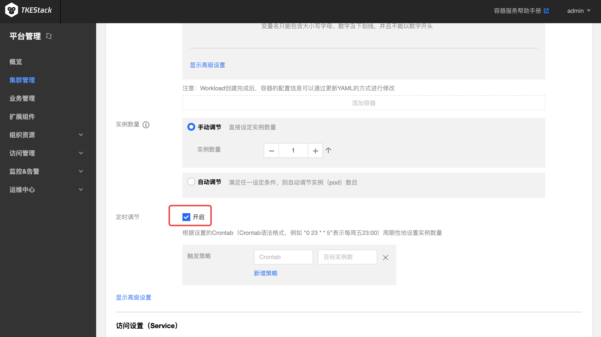

# CronHPA

## CronHPA 介绍

Cron Horizontal Pod Autoscaler(CronHPA)可让用户利用 [crontab](https://en.wikipedia.org/wiki/Cron) 实现对负载（Deployment, Statefulset，TApp这些支持扩缩容的子资源）**定期自动扩缩容**。

## CronHPA 使用场景

以游戏服务为例，从星期五晚上到星期日晚上，游戏玩家数量暴增。如果可以将游戏服务器在星期五晚上扩大规模，并在星期日晚上缩放为原始规模，则可以为玩家提供更好的体验。这就是游戏服务器管理员每周要做的事情。

其他一些服务也会存在类似的情况，这些产品使用情况会定期出现高峰和低谷。CronHPA可以自动化实现提前扩缩 Pod，为用户提供更好的体验。

## 使用 CronHPA

> 前提，在[扩展组件](../../../platform/extender.md)里安装 CronHPA

TKEStack 已经支持在页面多处位置为负载配置 CronHPA

1. 新建负载页（负载包括 Deployment，StatefulSet，TApp）这里新建负载时将会同时新建与负载同名的 CronHPA 对象：

   

   每条触发策略由两条字段组成

   1. **Crontab** ：例如 "0 23 * * 5"表示每周五23:00，详见 [crontab](https://en.wikipedia.org/wiki/Cron)
   2. **目标实例数** ：设置实例数量

2. 自动伸缩的 CronHPA 列表页。此处可以查看/修改/新建 CronHPA：

   

