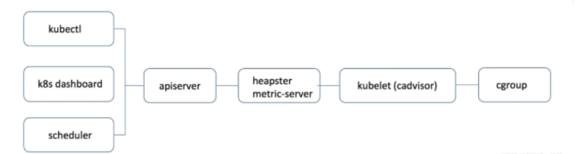
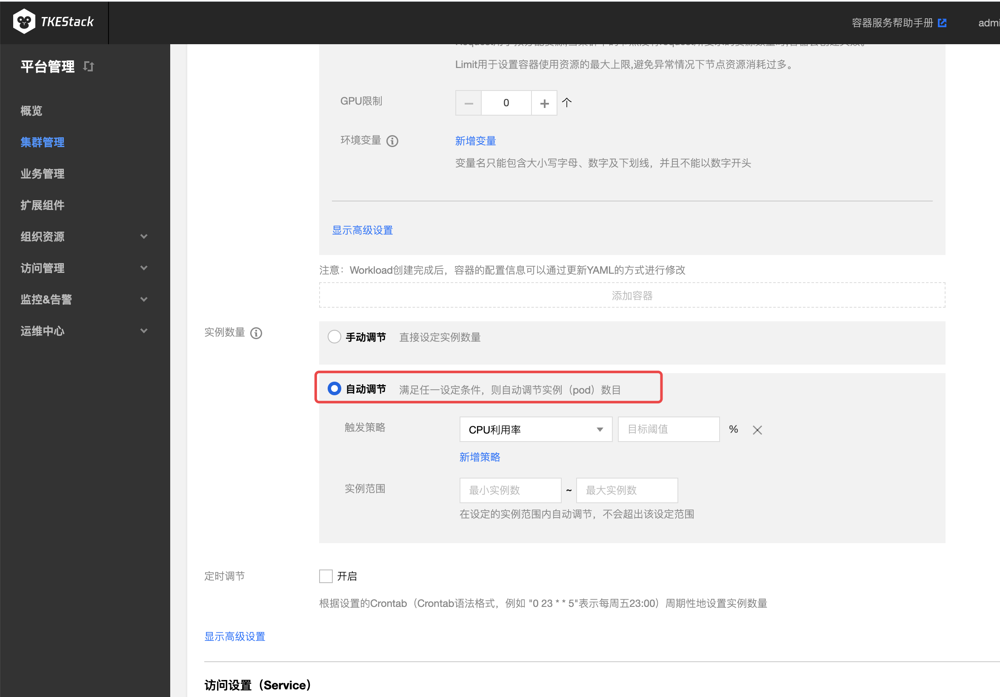
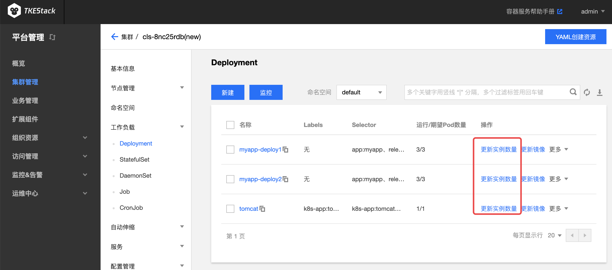
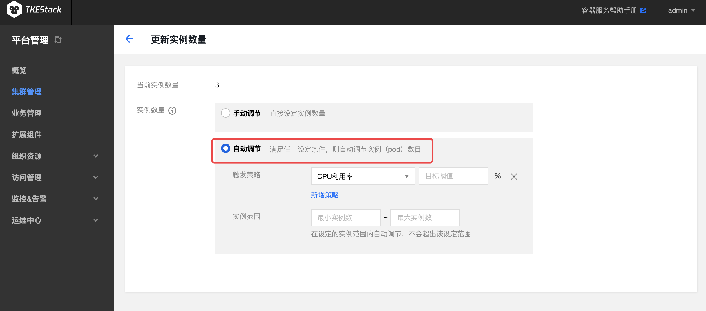
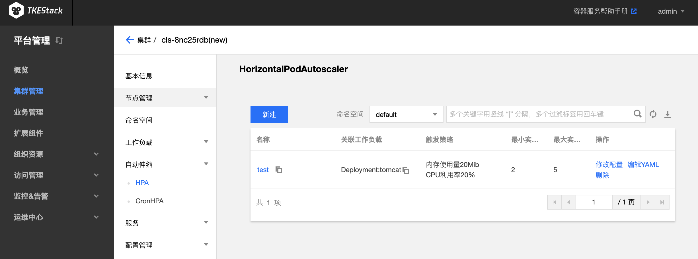
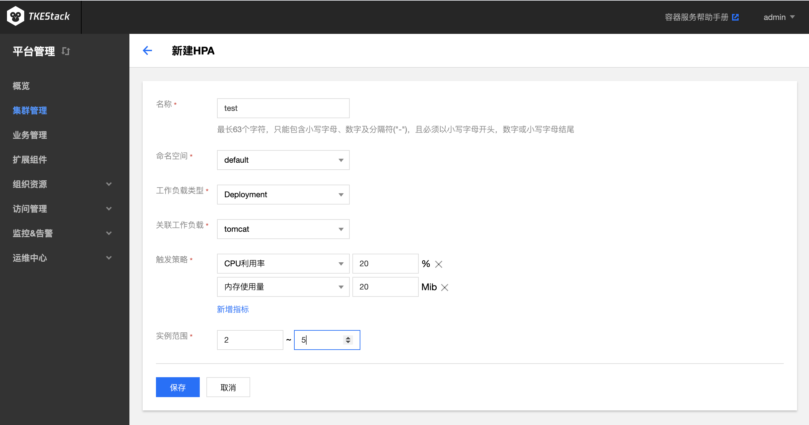

# HPA

[HPA](https://kubernetes.io/zh/docs/tasks/run-application/horizontal-pod-autoscale/) (（Horizontal Pod Autoscaler）)会基于 CPU、内存等指标对负载的 Pod 数量动态调控，达到工作负载稳定的目的。

## 工作原理

HPA 后台组件会定期从 metrics-server 拉取容器和 Pod 的监控指标，然后根据当前指标数据、当前副本数和该指标目标值进行计算，计算所得结果作为服务的期望副本数。当期望副本数与当前副本数不一致时，HPA 会触发 Deployment 进行 Pod 副本数量调整，从而达到自动伸缩的目的。

以 CPU 利用率为例，假设当前有2个实例， 平均 CPU 利用率（当前指标数据）为90%，自动伸缩设置的目标 CPU 为60%， 则自动调整实例数量为：90% × 2 / 60% = 3个。

> 注意：如果用户设置了多个弹性伸缩指标，HPA 会依据各个指标，分别计算出目标副本数，取最大值进行扩缩容操作。

## 注意事项

- 策略指标目标设置合理，例如设置70%给容器和应用，预留30%的余量
- 保持 Pod 和 Node 健康（避免 Pod 频繁重建）
- 保证用户请求的负载均衡稳定运行
- HPA 在计算目标副本数时会有一个10%的波动因子，如果在波动范围内，HPA 并不会调整副本数目
- 如果服务对应的 Deployment.spec.replicas 值为0，HPA 将不起作用
- 如果对单个 Deployment 同时绑定多个 HPA ，则创建的 HPA 会同时生效，会造成的集群反复扩缩容

## 安装依赖

**当前 Global 集群或者用  TKEStack 控制台新建的独立集群都自带 metrics-server，导入集群需要检查其是否安装**

Kubernetes [metrics-server](https://github.com/kubernetes-sigs/metrics-server) 是一个集群范围的资源使用数据聚合器，是 Heapster 的继承者。metrics-server 通过从 kubernet.summary_api 收集数据收集节点和 Pod 的 CPU 和内存使用情况。Summary API 是一个内存有效的 API，用于将数据从 Kubelet/cAdvisor 传递到 metrics-server，下图为 HPA 和 kubectl 等调用 metrics-server 获取相关信息的原理图。

metrics-server yaml 参考 https://github.com/kubernetes-sigs/metrics-server/releases 

具体请安装配置参考 metrics-server git地址 https://github.com/kubernetes-sigs/metrics-server

## 使用 HPA

TKEStack 已经支持在页面多处位置为负载配置 HPA

1. 新建负载页（负载包括 Deployment，StatefulSet，TApp）这里新建负载时将会同时新建与负载同名的 HPA 对象：

   

2. 负载列表页（负载包括 Deployment，StatefulSet，TApp）

   

   * 点击“更新实例数量”，进入配置界面如图所示，这里将会同时新建与负载同名的 HPA 对象：

     

3. 自动伸缩的 HPA 列表页。此处可以查看/修改/新建 HPA：

   

   * 点击上图中的新建，出现新建 HPA 页面，如下图所示：

   