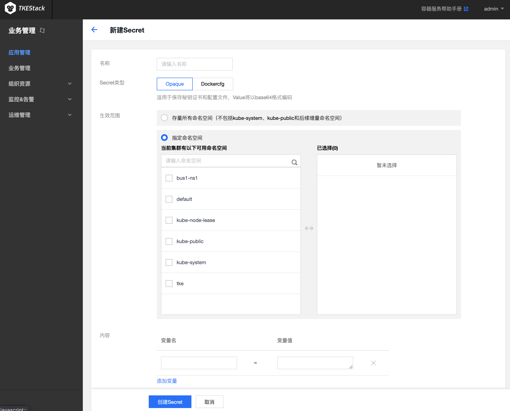

## 简介
Secret 可用于存储密码、令牌、密钥等敏感信息，降低直接对外暴露的风险。Secret 是 key-value 类型的键值对，您可以通过控制台的 Kubectl 工具创建对应的 Secret 对象，也可以通过挂载数据卷、环境变量或在容器的运行命令中使用 Secret。

## Secret 控制台操作指引

### 创建 Secret
1. 登录 TKEStack，切换到【业务管理】控制台，选择左侧导航栏中的【应用管理】。
2. 选择需要创建 Secret 的【业务】下相应的【命名空间】，展开【配置管理】列表，进入 Secret 管理页面。
3. 单击【新建】，进入“新建 Secret ”页面。
4. 在“新建 Secret ”页面，根据实际需求，进行如下参数设置。如下图所示：

 - **名称**：请输入自定义名称。
 - **Secret类型**：提供【Opaque】和【Dockercfg】两种类型，请根据实际需求进行选择。
        - **Opaque**：适用于保存秘钥证书和配置文件，Value 将以 base64 格式编码。
        - **Dockercfg**：适用于保存私有 Docker Registry 的认证信息。
 - **生效范围**：提供以下两种范围，请根据实际需求进行选择。
        - **存量所有命名空间**：不包括 kube-system、kube-public 和后续增量命名空间。
        - **指定命名空间**：支持选择当前集群下一个或多个可用命名空间。 
 - **内容**：根据不同的 Secret 类型，进行配置。
    - 当 Secret 类型为【Opaque】时：根据实际需求，设置变量名和变量值。
    - 当 Secret 类型为【Dockercfg】时：
         - 仓库域名：请根据实际需求输入域名或 IP。
         - 用户名：请根据实际需求输入第三方仓库的用户名。
         - 密码：请根据实际需求设置第三方仓库的登录密码。
> 如果本次为首次登录系统，则会新建用户，相关信息写入 `~/.dockercrg` 文件中。
5. 单击【创建 Secret】，即可完成创建。

### 使用 Secret
> Secret 在 Workload中有三种使用场景：
> 1. 数据卷使用 Secret 类型
> 2. 环境变量中使用 Secret 类型
> 3. 使用第三方镜像仓库时引用

### 更新 Secret
1. 登录 TKEStack，切换到业务管理控制台，选择左侧导航栏中的【应用管理】。
2. 选择需要创建 Secret 的业务下相应的命名空间，展开配置管理列表，进入 Secret 管理页面。
4. 在需要更新 YAML 的 Secret 行中，单击【编辑YAML】，进入更新 Secret 页面。
5. 在“更新Secret”页面，编辑 YAML，并单击【完成】即可更新 YAML。
> 如需修改 key-values，则编辑 YAML 中 data 的参数值，并单击【完成】即可完成更新。

## Kubectl 操作 Secret 指引

### 创建 Secret

#### 方式一：通过指定文件创建 Secret
1. 依次执行以下命令，获取 Pod 的用户名和密码。
```shell
$ echo -n 'username' > ./username.txt
$ echo -n 'password' > ./password.txt
```
2. 执行 Kubectl 命令，创建 Secret。
```shell
$ kubectl create secret generic test-secret --from-file=./username.txt --from-file=./password.txt
secret "testSecret" created
```
3. 执行以下命令，查看 Secret 详情。
```
kubectl describe secrets/ test-secret
```

#### 方式二：YAML 文件手动创建

>? 通过 YAML 手动创建 Secret，需提前将 Secret 的 data 进行  Base64 编码。

```Yaml
apiVersion: v1
kind: Secret
metadata:
  name: test-secret
type: Opaque
data:
  username: dXNlcm5hbWU=  ## 由echo -n 'username' | base64生成
  password: cGFzc3dvcmQ=  ## 由echo -n 'password' | base64生成
```

### 使用 Secret

#### 方式一： 数据卷使用 Secret 类型

YAML 示例如下：
```Yaml
apiVersion: v1
 kind: Pod
 metadata:
   name: nginx
 spec:
   containers:
     - name: nginx
       image: nginx:latest
       volumeMounts:
        name: secret-volume
        mountPath: /etc/config
   volumes:
        name: secret-volume
        secret:
          name:  test-secret ## 设置 secret 来源
          ## items:  ## 设置指定 secret的 Key 挂载
          ##   key: username  ## 选择指定 Key
          ##   path: group/user ## 挂载到指定的子路径
          ##   mode: 256  ## 设置文件权限
   restartPolicy: Never
```

#### 方式二： 环境变量中使用 Secret 类型

YAML 示例如下：
```Yaml
apiVersion: v1
 kind: Pod
 metadata:
   name: nginx
 spec:
   containers:
     - name: nginx
       image: nginx:latest
       env:
         - name: SECRET_USERNAME
           valueFrom:
             secretKeyRef:
               name: test-secret ## 设置来源 Secret 文件名
               key: username  ## 设置该环境变量的 Value 来源项
   restartPolicy: Never
```

#### 方法三：使用第三方镜像仓库时引用

YAML 示例如下：
```Yaml
apiVersion: v1
 kind: Pod
 metadata:
   name: nginx
 spec:
   containers:
     - name: nginx
       image: nginx:latest
   imagePullSecrets:
   - name: test-secret ## 设置来源 Secret 文件名
   restartPolicy: Never
```