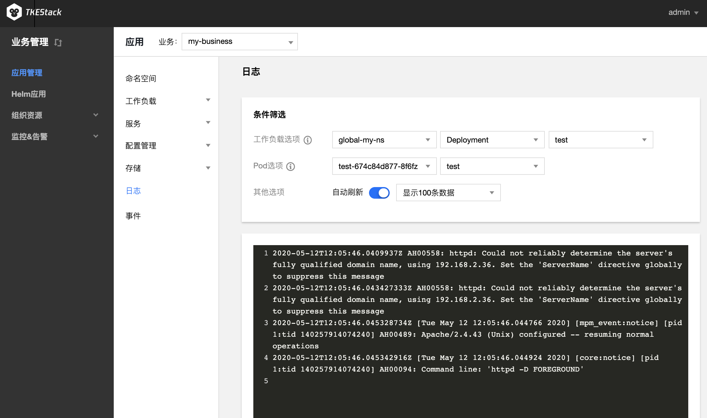

# 日志

日志针对的是容器。包括了 Kuberntes 集群的运行容器的日志情况和各类资源的调度情况，对维护人员日常观察资源的变更以及定位问题均有帮助。

## 日志查看

1. 登录 TKEStack，切换到【业务管理】控制台，点击【应用管理】，选择【日志】
2. 进入“日志”页面
3. 可以按照不用的命名空间和资源类型进行筛选
   

您可以参考 [日志采集](../operation/logcollect.md) 将日志导入外部存储，实现日志的高级管理。