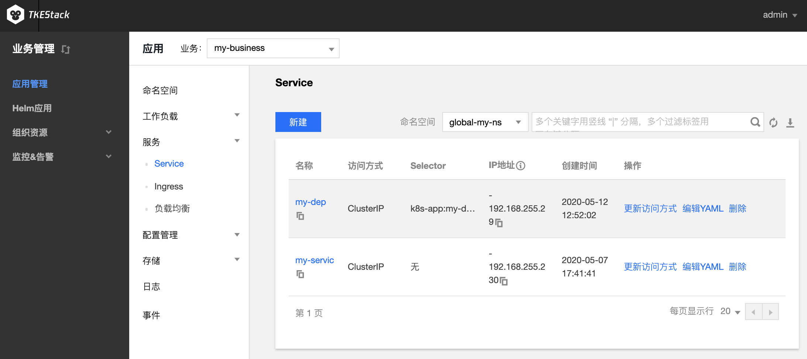

# Service

## Service 概念

Service 定义访问后端 Pod 的访问方式，并提供固定的虚拟访问 IP。您可以在 Service 中通过设置来访问后端的 Pod，不同访问方式的服务可提供不同网络能力。
TKEStack 提供以下两种服务访问方式：

<table>
<tr>
<th width="15%">访问方式</th>
<th>说明</th>
</tr>
<tr>
<td>仅在集群内访问</td>
<td>
<ul class="params">
<li>使用 Service 的 ClusterIP 模式，自动分配 Service 网段中的 IP，用于集群内访问。数据库类等服务如 MySQL 可以选择集群内访问，以保证服务网络隔离。</li>
<li>创建完成后的服务可以通过<b>服务名 + 服务端口</b>访问服务。</li>
</ul>
</td>
</tr>
<tr>
<td>主机端口访问</td>
<td>
<ul class="params">
<li>提供一个主机端口映射到容器的访问方式，支持 TCP、UDP、Ingress。可用于业务定制上层 LB 转发到 Node。</li>
<li>创建完成后的服务可以通过<b>云服务器 IP+主机端口</b>或<b>服务名 + 服务端口</b>访问服务。</li>
</ul>
</td>
</tr>
</table>

>集群内进行 Service 访问时，建议不要通过 负载均衡 IP 进行访问，以避免出现访问不通的情况。

一般情况下，4层负载均衡（LB）会绑定多台 Node 作为 Real Server（RS） ，使用时需要限制 Client 和 Rs 不能存在于同一台云服务器上，否则会有一定概率导致报文回环出不去。
当 Pod 去访问 LB 时，Pod 就是源 IP，当其传输到内网时 LB 也不会做 SNAT 处理将源 IP 转化成 Node IP，那么 LB 收到报文也就不能判断是从哪个 Node 发送的，LB 的避免回环策略也就不会生效，所有的 rs 都可能被转发。当转发到 client 所在的 Node 上时，LB 就无法收到回包，从而导致访问不通。

集群内访问时，支持 Headless Service， 不创建用于集群内访问的 ClusterIP，访问 Service 名称时返回后端 Pods IP：Port，**用于适配自有的服务发现机制**。
两种访问方式均支持 Session Affinity，设置会话保持后，会根据请求 IP把请求转发给这个 IP 之前访问过的 Pod。


## Service 控制台操作指引

### 创建 Service

1. 登录TKEStack，切换到【业务管理】控制台，选择左侧导航栏中的【应用管理】。
2. 选择需要创建 Service 的【业务】下相应的【命名空间】，展开【服务】列表，进入【Service】管理页面
3. 单击【新建】，进入 “新建 Service” 页面，如下图所示：

4. 根据实际需求，设置 Service 参数，关键参数信息如下：
   - **服务名称**：自定义
   - **描述**：自定义
   - **命名空间**：根据实际需求进行选择
   - **访问设置**：根据实际需求进行设置
     - **服务访问方式**：选择是【仅在集群内部访问】该负载还是集群外部通过【主机端口访问】该负载
       - **仅在集群内访问**：使用 Service 的 ClusterIP 模式，自动分配 Service 网段中的 IP，用于集群内访问。数据库类等服务如 MySQL 可以选择集群内访问，以保证服务网络隔离
       - **主机端口访问**：提供一个主机端口映射到容器的访问方式，支持 TCP、UDP、Ingress。可用于业务定制上层 LB 转发到 Node
       - **Headless Service**：不创建用于集群内访问的 ClusterIP，访问 Service 名称时返回后端 `Pods IP:port`，用于适配自有的服务发现机制
      - **端口映射**：输入负载要暴露的端口并指定通信协议类型（**容器和服务端口建议都使用80**）
   
    - **Session Affinity:** 点击【显示高级设置】出现，表示会话保持。Service 有负载均衡的作用，有两种模式：RoundRobin 和 SessionAffinity（默认 None，按需使用）
      - ClientIP：基于客户端 IP 地址进行会话保持的模式， 即第1次将某个客户端发起的请求转发到后端的某个 Pod 上，之后从相同的客户端发起的请求都将被转发到后端相同的 Pod 上。即 Service 启用了 Session Affinity 负载分发策略
      - Node：此时 Service 使用默认的 RoundRobin（轮询模式）进行负载分发，即轮询将请求转发到后端的各个 Pod 上
   - **Workload 绑定：**通过 Selectors 进行绑定，可以添加自己设定的 Selectors，也可以引用已有 Workload 的Selectors
5. 单击【创建服务】，完成创建

### 更新 Service

#### 更新 YAML

1. 登录TKEStack，切换到【业务管理】控制台，选择左侧导航栏中的【应用管理】
2. 选择需要创建Service的业务下相应的命名空间，展开服务列表，进入Service管理页面
3. 在需要更新 YAML 的 Service 行中，单击【编辑YAML】，进入更新 Service 页面
4. 在 “更新Service” 页面，编辑 YAML，单击【完成】，即可更新 YAML

## Kubectl 操作 Service 指引

### YAML 示例
```Yaml
kind: Service
apiVersion: v1
metadata:
  name: my-service
spec:
  selector:
    app: MyApp
  ports:
  - protocol: TCP
    port: 80
    targetPort: 9376
  type: NodePort
```

- kind：标识 Service 资源类型
- metadata：Service 的名称、Label 等基本信息
- spec.type：标识 Service 的被访问形式
  - ClusterIP：在集群内部公开服务，可用于集群内部访问
  - NodePort：使用节点的端口映射到后端 Service，集群外可以通过节点 IP:NodePort 访问

### 创建 Service

1. 参考 [YAML 示例](#YAMLSample)，准备 StatefulSet YAML 文件
2. 安装 Kubectl，并连接集群
3. 执行以下命令，创建 Service YAML 文件：
```shell
kubectl create -f Service YAML 文件名称
```
例如，创建一个文件名为 my-service.yaml 的 Service YAML 文件，则执行以下命令：
 ```shell
kubectl create -f my-service.yaml
 ```
4. 执行以下命令，验证创建是否成功：
```shell
kubectl get services
```
### 更新 Service

#### 方法一
执行以下命令，更新 Service：
```
kubectl edit service/[name]
```

#### 方法二
1. 手动删除旧的 Service
2. 执行以下命令，重新创建 Service：
```
kubectl create/apply
```

### 删除 Service
执行以下命令，删除 Service：
```
kubectl delete service [NAME]
```

<style>
	.params{margin-bottom:0px !important;}
</style>