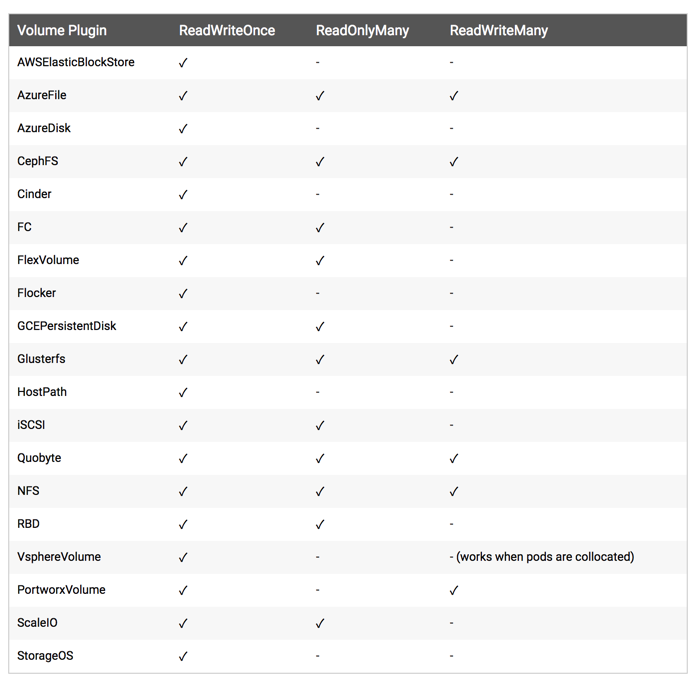
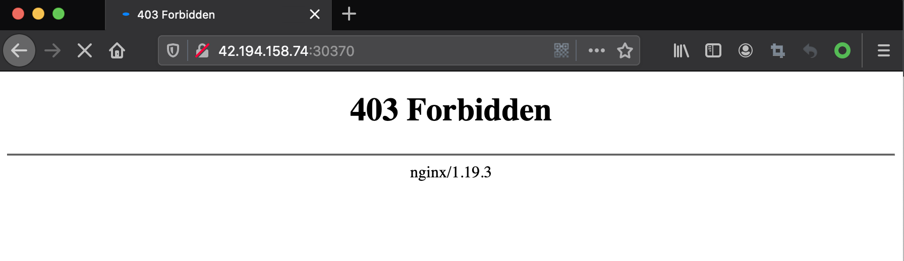
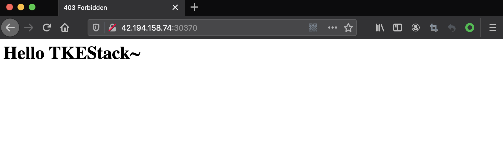

# PV 和 PVC
**PersistentVolume（PV）**：PersistentVolume（持久化卷），是对底层的共享存储的一种抽象，PV 由管理员进行创建和配置，它和具体的底层的共享存储技术的实现方式有关，比如 Ceph、GlusterFS、NFS 等，都是通过插件机制完成与共享存储的对接。PV 是集群内的存储资源。例如，节点是集群的资源。PV 独立于 Pod 的生命周期，根据不同的 StorageClass 类型创建不同类型的 PV。

**PersistentVolumeClaim（PVC）**：PersistentVolumeClaim（持久化卷声明），PVC 是用户存储的一种声明，PVC 和 Pod 比较类似，Pod 消耗的是节点，PVC 消耗的是 PV 资源，Pod 可以请求 CPU 和内存，而 PVC 可以请求特定的存储空间和访问模式。对于真正使用存储的用户不需要关心底层的存储实现细节，只需要直接使用 PVC 即可。PVC 是集群内的存储请求。例如，PV 是 Pod 使用节点资源，PVC 则声明使用 PV 资源。当 PV 资源不足时，PVC 也可以动态创建 PV。

> TKEStack 没有提供存储服务，Global 集群中的镜像仓库、ETCD、InfluxDB 等数据组件，均使用**本地磁盘存储数据**。如果您需要使用存储服务，建议使用 [ROOK](https://rook.io/) 或者 [chubaoFS](https://chubao.io/)，部署一套容器化的分布式存储服务。
>
> 您可阅读 [在 TKEStack 上使用存储的最佳实践](../../../../best-practices/storage.md) 作为参考。

## 以本地单节点为例使用 NFS 作为存储

### 安装 NFS server（服务端）

这里使用相对简单的存储资源—— NFS 为例，首先在节点 Master0（42.194.158.74） 上来安装 NFS 服务，数据目录：/data/k8s/

1. 关闭防火墙

   ```shell
   $ systemctl stop firewalld.service
   $ systemctl disable firewalld.service
   ```

2. 安装 NFS 和 RPC

   ```shell
   $ yum -y install nfs-utils rpcbind
   ```

3. 共享目录设置权限：

    ```shell
    $ chmod 755 /data/k8s/
    ```

4. 配置 NFS，NFS 的默认配置文件在 /etc/exports 文件下，在该文件中添加下面的配置信息：

    ```shell
    $ vi /etc/exports
    /data/k8s  *(rw,sync,no_root_squash)
    ```

   > 配置说明：
   >
   > - /data/k8s：是共享的数据目录
   > - `*`：表示任何人都有权限连接，当然也可以是一个网段，一个 IP，也可以是域名
   > - rw：读写的权限
   > - sync：表示文件同时写入硬盘和内存
   > - no_root_squash：当登录 NFS 主机使用共享目录的使用者是 root 时，其权限将被转换成为匿名使用者，通常它的 UID 与 GID，都会变成 nobody 身份

5. 启动服务 NFS 需要向 RPC 注册， RPC 一旦重启了，注册的文件都会丢失，向他注册的服务都需要重启

   > 注意启动顺序，先启动 rpcbind

   ```shell
   $ systemctl start rpcbind.service
   $ systemctl enable rpcbind
   $ systemctl status rpcbind
   ● rpcbind.service - RPC bind service
      Loaded: loaded (/usr/lib/systemd/system/rpcbind.service; disabled; vendor preset: enabled)
      Active: active (running) since Tue 2018-07-10 20:57:29 CST; 1min 54s ago
   Process: 17696 ExecStart=/sbin/rpcbind -w $RPCBIND_ARGS (code=exited, status=0/SUCCESS)
   Main PID: 17697 (rpcbind)
      Tasks: 1
      Memory: 1.1M
      CGroup: /system.slice/rpcbind.service
            └─17697 /sbin/rpcbind -w

   Jul 10 20:57:29 master systemd[1]: Starting RPC bind service...
   Jul 10 20:57:29 master systemd[1]: Started RPC bind service.
   ```

6. 然后启动 NFS 服务：

   ```shell
   $ service nfs-server start
   $ service nfs-server status
   ● nfs-server.service - NFS server and services
      Loaded: loaded (/usr/lib/systemd/system/nfs-server.service; enabled; vendor preset: disabled)
   Drop-In: /run/systemd/generator/nfs-server.service.d
            └─order-with-mounts.conf
      Active: active (exited) since Tue 2018-07-10 21:35:37 CST; 14s ago
   Main PID: 32067 (code=exited, status=0/SUCCESS)
      CGroup: /system.slice/nfs-server.service

   Jul 10 21:35:37 master systemd[1]: Starting NFS server and services...
   Jul 10 21:35:37 master systemd[1]: Started NFS server and services.
   ```

7. 另外还可以通过下面的命令确认下 NFS 启动成功：

   ```shell
   $ rpcinfo -p|grep nfs
      100003    3   tcp   2049  nfs
      100003    4   tcp   2049  nfs
      100227    3   tcp   2049  nfs_acl
      100003    3   udp   2049  nfs
      100003    4   udp   2049  nfs
      100227    3   udp   2049  nfs_acl
   ```

8. 查看具体目录挂载权限：

   ```shell
   $ cat /var/lib/nfs/etab
   /data/k8s    *(rw,sync,wdelay,hide,nocrossmnt,secure,no_root_squash,no_all_squash,no_subtree_check,secure_locks,acl,no_pnfs,anonuid=65534,anongid=65534,sec=sys,secure,no_root_squash,no_all_squash)
   ```

### 安装 NFS client（客户端）

上面把 NFS server 给安装成功了，接下来在另一个节点 master1（**181.71.17.217**）上来安装 NFS 的客户端来验证下 NFS

1. 安装 NFS 当前也需要先关闭防火墙：

   ```shell
   $ systemctl stop firewalld.service
   $ systemctl disable firewalld.service
   ```

2. 然后安装 NFS：

   ```shell
   $ yum -y install nfs-utils rpcbind
   ```

3. 安装完成后，和上面的方法一样，先启动 RPC、然后启动 NFS：

   ```shell
   $ systemctl start rpcbind.service 
   $ systemctl enable rpcbind.service 
   $ service nfs-server start    
   $ service nfs-server status
   ```

4. 挂载数据目录 
   > 客户端启动完成后，在客户端来挂载下 NFS 测试下：

   1. 首先检查下之前创建的 NFS server 是否有共享目录：

      ```
      $ showmount -e 42.194.158.74
      Export list for 42.194.158.74:
      /data/k8s *
      ```

   2. 然后我们在客户端上新建目录：

      ```shell
      $ mkdir -p /root/nfs/data
      ```

   3. 将 NFS 共享目录挂载到上面的目录：

      ```shell
      $ mount -t nfs 42.194.158.74:/data/k8s /root/nfs/data
      ```

   4. 挂载成功后，在客户端上面的目录中新建一个文件，然后观察下 NFS 服务端的共享目录下面是否也会出现该文件：

      ```shell
      $ touch /root/nfs/data/test.txt
      ```

   5. 在 NFS 服务端查看：

      ```shell
      $ ls -ls /data/k8s/
      total 4
      4 -rw-r--r--. 1 root root 4 Jul 10 21:50 test.txt
      ```

   6. 如果上面出现了 test.txt 的文件，那么证明的 NFS 挂载成功了。

## PV

有了上面的 NFS 共享存储，下面就可以来使用 PV 和 PVC 了。PV 作为存储资源，主要包括存储能力、访问模式、存储类型、回收策略等关键信息，下面新建一个 PV 对象，使用 NFS 类型的后端存储，1G 的存储空间，访问模式为 ReadWriteOnce，回收策略为 Recyle，对应的 YAML 文件如下：

```yaml
apiVersion: v1
kind: PersistentVolume
metadata:
  name:  pv-tkestack
spec:
  capacity: 
    storage: 1Gi
  accessModes:
  - ReadWriteOnce
  persistentVolumeReclaimPolicy: Recycle
  nfs:
    path: /data/k8s
    server: 42.194.158.74
```

Kubernetes 支持的 PV 类型有很多，比如常见的 Ceph、GlusterFs、NFS，甚至 HostPath也可以，不过 HostPath 仅仅可以用于单机测试，更多的支持类型可以前往 [Kubernetes PV 官方文档](https://kubernetes.io/docs/concepts/storage/persistent-volumes/)进行查看，因为每种存储类型都有各自的特点，所以在使用的时候可以去查看相应的文档来设置对应的参数。

然后同样的，直接使用 kubectl 创建即可：

```shell
$ kubectl create -f 【上述文件】
persistentvolume "pv-tkestack" created
$ kubectl get pv
NAME      CAPACITY   ACCESS MODES   RECLAIM POLICY   STATUS      CLAIM               STORAGECLASS   REASON    AGE
pv-tkestack       1Gi        RWO            Recycle          Available                                                12s
```

我们可以看到 pv-tkestack 已经创建成功了，状态是 Available，表示 pv-tkestack 就绪，可以被 PVC 申请。上面的属性概念如下：

#### Capacity（存储能力）

一般来说，一个 PV 对象都要指定一个存储能力，通过 PV 的 **capacity ** 属性来设置的，目前只支持存储空间的设置，就是我们这里的 storage=1Gi，不过未来可能会加入 IOPS、吞吐量等指标的配置。

#### AccessModes（访问模式）

AccessModes 是用来对 PV 进行访问模式的设置，用于描述用户应用对存储资源的访问权限，访问权限包括下面几种方式：

- ReadWriteOnce（RWO）：读写权限，但是只能被单个节点挂载
- ReadOnlyMany（ROX）：只读权限，可以被多个节点挂载
- ReadWriteMany（RWX）：读写权限，可以被多个节点挂载

> 注意：一些 PV 可能支持多种访问模式，但是在挂载的时候只能使用一种访问模式，多种访问模式是不会生效的。

下图是一些常用的 Volume 插件支持的访问模式： 

#### persistentVolumeReclaimPolicy（回收策略）

我这里指定的 PV 的回收策略为 Recycle，目前 PV 支持的策略有三种：

- Retain（保留）- 保留数据，需要管理员手工清理数据
- Recycle（回收）- 清除 PV 中的数据，效果相当于执行 rm -rf /thevoluem/*
- Delete（删除）- 与 PV 相连的后端存储完成 volume 的删除操作，当然这常见于云服务商的存储服务，比如 ASW EBS。

不过需要注意的是，目前只有 NFS 和 HostPath 两种类型支持回收策略。当然一般来说还是设置为 Retain 这种策略保险一点。

#### 状态

一个 PV 的生命周期中，可能会处于4中不同的阶段：

- Available（可用）：表示可用状态，还未被任何 PVC 绑定
- Bound（已绑定）：表示 PVC 已经被 PVC 绑定
- Released（已释放）：PVC 被删除，但是资源还未被集群重新声明
- Failed（失败）： 表示该 PV 的自动回收失败

## PVC

上面创建了 PV ，但是在真正使用的时候是使用的 PVC，就类似于服务是通过 Pod 来运行的，而不是 Node，只是 Pod 跑在 Node 上而已。

### 使用前提

>  在使用 PVC 之前，必须在集群的每个节点上都安装 NFS 客户端，否则可能会导致 PV 挂载不上的问题。安装可参考 [安装 NFS client](#安装 NFS client（客户端）)

### 新建 PVC

新建一个数据卷声明，请求 1Gi 的存储容量，访问模式也是 ReadWriteOnce，YAML 文件如下：

```yaml
kind: PersistentVolumeClaim
apiVersion: v1
metadata:
  name: pvc-tkestack
spec:
  accessModes:
    - ReadWriteOnce
  resources:
    requests:
      storage: 1Gi
```

可以看到：这里的声明方法几乎和新建 PV 是一样的，在新建 PVC 之前，可以看下之前创建的 PV 的状态：

```shell
kubectl get pv
NAME      CAPACITY   ACCESS MODES   RECLAIM POLICY   STATUS      CLAIM               STORAGECLASS   REASON    AGE
pv-tkestack    1Gi        RWO            Recycle          Available                                                19m
```

可以看到当前 pv-tkestack 是在 Available 的一个状态，所以这个时候的 PVC 可以和这个 PV 进行绑定：

```shell
$ kubectl create -f 【上述文件】
persistentvolumeclaim "pvc-tkestack" created
$ kubectl get pvc
NAME        STATUS    VOLUME    CAPACITY   ACCESS MODES   STORAGECLASS   AGE
pvc-tkestack     Bound     pv-tkestack    1Gi        RWO                           12s
```

可以看到 pvc-tkestack 创建成功了，状态是 Bound 状态了，这个时候再看下 PV 的状态：

```shell
$ kubectl get pv
NAME      CAPACITY   ACCESS MODES   RECLAIM POLICY   STATUS    CLAIM               STORAGECLASS   REASON    AGE
pv-tkestack    1Gi        RWO            Recycle          Bound     default/pvc-tkestack                             23m
```

可以看到 PV 也是 Bound 状态了，对应的声明是 default/pvc-tkestack，就是 default 命名空间下面的 pvc-tkestack，证明刚刚新建的 pvc-tkestack 和 pv-tkestack 绑定成功了。

这里用户可能会觉得很奇怪，我们并没有在 pvc-tkestack 中指定关于 pv 的什么标志，它们之间是怎么就关联起来了的呢？其实这是系统自动帮我们去匹配的，他会根据我们的声明要求去查找处于 Available 状态的 PV，如果没有找到的话那么我们的 PVC 就会一直处于 Pending 状态，找到了的话当然就会把当前的 PVC 和目标 PV 进行绑定，这个时候状态就会变成 Bound 状态了。比如新建一个 PVC，如下：

```yaml
kind: PersistentVolumeClaim
apiVersion: v1
metadata:
  name: pvc2-tkestack
spec:
  accessModes:
    - ReadWriteOnce
  resources:
    requests:
      storage: 2Gi
  selector:
    matchLabels:
      app: nfs
```

这里声明一个 PV 资源的请求，邀请访问模式是 ReadWriteOnce，存储容量是 2Gi，最后还要求匹配具有标签 app=nfs 的 PV，这样要求的 PV 有吗？先查看下当前系统的所有 PV：

```shell
$ kubectl get pv
NAME      CAPACITY   ACCESS MODES   RECLAIM POLICY   STATUS    CLAIM               STORAGECLASS   REASON    AGE
pv-tkestack    1Gi        RWO            Recycle          Bound     default/pvc-tkestack                              43m
```

当前所有的 PV 都是 Bound 状态，并没有 Available 状态的 PV，所以可以想象到上面新建的 PVC 是没办法选择到合适的 PV 的：

```shell
$ kubectl create -f 【上述文件】
persistentvolumeclaim "pvc2-tkestack" created
$ kubectl get pvc
NAME        STATUS    VOLUME    CAPACITY   ACCESS MODES   STORAGECLASS   AGE
pvc-tkestack     Bound     pv-tkestack    1Gi        RWO                           23m
pvc2-tkestack    Pending                                                      14s
```

很显然当前 PVC 是 Pending 状态，因为并没有合适的 PV 使用。现在新建一个 PV，让上面的 PVC 有合适的 PV 使用：

```yaml
apiVersion: v1
kind: PersistentVolume
metadata:
  name: pv2-tkestack
  labels:
    app: nfs
spec:
  capacity:
    storage: 2Gi
  accessModes:
  - ReadWriteOnce
  persistentVolumeReclaimPolicy: Recycle
  nfs:
    server: 42.194.158.74
    path: /data/k8s
```

这里新建一个名为 pv2-tkestack 的 PV，具有标签 app=nfs，容量也是 2Gi，访问模式是 ReadWraiteOnce，看上去这一切都很适合上面的 PVC：

```shell
$ kubectl create -f 【上述文件】
persistentvolume "pv2-tkestack" created
$ kubectl get pv
NAME      CAPACITY   ACCESS MODES   RECLAIM POLICY   STATUS    CLAIM               STORAGECLASS   REASON    AGE
pv-tkestack    1Gi        RWO            Recycle          Bound     default/pvc-tkestack                              51m
pv2-tkestack   2Gi        RWO            Recycle          Bound     default/pvc2-tkestack                             12s
```

创建完 pv2-tkestack 后，是不是很快就发现该 PV 是 Bound 状态了，对应的 PVC 是 default/pvc2-tkestack，证明上面的 pvc2-tkestack 终于找到合适的 PV 进行绑定上了：

```shell
$ kubectl get pvc
kubectl get pvc
NAME        STATUS    VOLUME    CAPACITY   ACCESS MODES   STORAGECLASS   AGE
pvc-tkestack     Bound     pv-tkestack    1Gi        RWO                           30m
pvc2-tkestack    Bound     pv2-tkestack   2Gi        RWO                           7m
```

成功了！但这里引发了另外的问题：pv2-tkestack 声明的容量是 2Gi，如果 pvc2-tkestack 这里声明的容量是 1Gi 的话呢？还能正常绑定吗？如果可以正常绑定的话，那剩下的 1Gi 容量还能使用吗？实际测试下就知道了，先删除上面的 pvc2-tkestack，然后把该 PVC 里面的容量改成 1Gi，再新建：

```shell
$ kubectl delete pvc pvc2-tkestack
persistentvolumeclaim "pvc2-tkestack" deleted
$ cat pvc2-tkestack.yaml
...
  resources:
    requests:
      storage: 1Gi
...
$ kubectl create -f pvc2-tkestack.yaml
persistentvolumeclaim "pvc2-tkestack" created
$ kubectl get pvc
NAME        STATUS    VOLUME    CAPACITY   ACCESS MODES   STORAGECLASS   AGE
pvc2-tkestack    Bound     pv2-tkestack   2Gi        RWO                           7s
```

可以看到上面的 PVC 依然可以正常的绑定，仔细看 CAPACITY 这一列的数据：2Gi，也就是说**PVC声明的 1Gi 是无效的， PV 是 2Gi，PVC 绑定该 PV 后就会获得该 PV的 所有 capacity。**

> 如果这里容量声明是 3Gi 呢？还可以正常绑定吗？
>
> 结论：如果声明的容量大于了 PV 里面的容量的话，是没办法进行绑定的。

### 使用 PVC

这里使用 nginx 镜像，将容器的 /usr/share/nginx/html 目录通过 volume 挂载到名为 pvc2-tkestack 的 PVC 上面，然后创建一个 NodePort 类型的 Service 来暴露服务：

```yaml
apiVersion: apps/v1
kind: Deployment
metadata:
  name: nfs-pvc
spec:
  replicas: 3
  selector:
    matchLabels:
      app: nfs-pvc
  template:
    metadata:
      labels:
        app: nfs-pvc
    spec:
      containers:
      - name: nginx
        image: nginx
        imagePullPolicy: IfNotPresent
        ports:
        - containerPort: 80
          name: web
        volumeMounts:
        - name: www
          mountPath: /usr/share/nginx/html
      volumes:
      - name: www
        persistentVolumeClaim:
          claimName: pvc2-tkestack

---

apiVersion: v1
kind: Service
metadata:
  name: nfs-pvc
  labels:
    app: nfs-pvc
spec:
  type: NodePort
  ports:
  - port: 80
    targetPort: web
  selector:
    app: nfs-pvc
```

```shell
$ kubectl create -f 【上述文件】
deployment.extensions "nfs-pvc" created
service "nfs-pvc" created
$ kubectl get svc
kubectl get svc
NAME         TYPE        CLUSTER-IP      EXTERNAL-IP   PORT(S)        AGE
...
nfs-pvc      NodePort    192.168.255.61   <none>        80:30370/TCP   2m32s
...
```

然后可以通过任意节点的 IP:30370 端口来访问 Nginx 服务了，但是这个时候访问会出现 **403**：



是因为容器目录 **/user/share/nginx/html** 挂载到了 **pvc2-tkestack** 这个 PVC 上面，这个 PVC 就是对应着 NFS 的共享数据目录  /data/k8s，该目录下面还没有网页相关数据，所以访问就出现了403，这里在 **/data/k8s** 目录下面新建一个名为 index.html 的文件：

```shell
$ echo "<h1>Hello TKEStack~</h1>" >> /data/k8s/index.html
```

由于挂载了 pvc2-tkestack 到上面的 nginx 容器中去，是不是这个时候容器目录 **/user/share/nginx/html** 下面也有 **index.html** 这个文件。所以这个时候再来访问下服务，任一节点 IP:30370：



但是可以看到容器中的数据是直接放到共享数据目录根目录下面的，如果以后又有一个新的 nginx 容器也做了数据目录的挂载，就会有冲突了，这个时候可以在 Pod 中使用一个新的属性：subPath，该属性可以来解决这个问题，我们只需要更改上面的 Pod 的 YAML 文件即可：

```yaml
...
volumeMounts:
- name: www
  subPath: nginxpvc-test
  mountPath: /usr/share/nginx/html
...
```

更改完 YAML 文件后，重新更新即可。更新完后，再去看看 NFS 的数据共享目录：

```shell
$ ls /data/k8s/
index.html  nginxpvc-test
$ ls /data/k8s/nginxpvc-test/
```

可以预想到现在访问上面的服务，又会得到**403**的结果，因为 **nginxpvc-test** 目录下面还没有任何文件。把根目录下面的 index.html 文件移动到 nginxpvc-test 目录下面去就可以访问了：

```shell
$ mv /data/k8s/index.html /data/k8s/nginxpvc-test/
```

现在再来验证下数据是否会丢失。首先把上面的 Deployment 删除掉，Deployment 被删除掉了，但是 NFS 的数据共享目录下面的数据依旧存在：

```shell
$ ls /data/k8s/nginxpvc-test/
index.html
```

再来重新创建上面的 Deployment，通过同样的方式依然可以在页面上看到 **Hello TKEStack~** ，这证明数据被持久化存储了。
