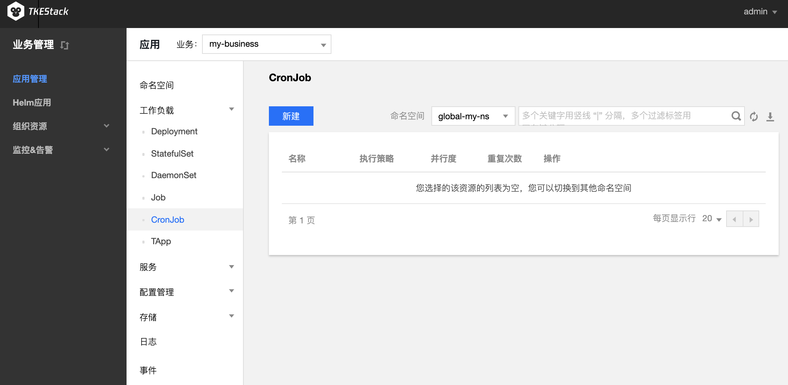

# CronJob

一个 CronJob 对象类似于 Crontab文件中的一行。它根据指定的预定计划周期性地运行一个 Job，格式可以参考 [crontab](https://en.wikipedia.org/wiki/Cron) 。
Crontab 格式说明如下：

```
# 文件格式说明
#  ——分钟（0 - 59）
# |  ——小时（0 - 23）
# | |  ——日（1 - 31）
# | | |  ——月（1 - 12）
# | | | |  ——星期（0 - 6）
# | | | | |
# * * * * *
```

## CronJob 控制台操作指引

### 创建 CronJob
1. 登录 TKEStack，切换到【业务管理】控制台，选择左侧导航栏中的【应用管理】
2. 选择需要创建 CronJob 的业务下相应的【命名空间】，展开【工作负载】下拉项，进入【CronJob】管理页面，如下图所示：
   
3. 单击【创建】按钮，进入 “新建Workload页面”
4. 根据实际需求，设置 CronJob 参数，关键参数信息如下，其中必填项为**工作负载名**、**执行策略**、**实例内容器的名称和镜像**：
   - **工作负载名**：输入自定义名称
   
- **描述**：给工作负载添加描述
   
- **标签**：给工作负载添加标签
   
- **命名空间**：根据实际需求进行选择
   
- **类型**：选择【CronJob（按照Cron的计划定时运行）】
   
- **执行策略**：根据 Cron 格式设置任务的定期执行策略
   
   - **Job设置**
      - **重复执行次数**：Job 管理的 Pod 需要重复执行的次数
      - **并行度**：Job 并行执行的 Pod 数量
      - **失败重启策略**：Pod下容器异常推出后的重启策略
          - **Never**：不重启容器，直至 Pod 下所有容器退出
       - **OnFailure**：Pod 继续运行，容器将重新启动
   
- **数据卷（选填）**：为容器提供存储，目前支持临时路径、主机路径、云硬盘数据卷、文件存储 NFS、配置文件、PVC，还需挂载到容器的指定路径中。如需指定容器挂载至指定路径时，单击【添加数据卷】
   
     * **数据卷的名称**：给数据卷一个名称，以方便容器使用数据卷
     * **临时目录**：主机上的一个临时目录，生命周期和 Pod 一致
     * **主机路径**：主机上的真实路径，可以重复使用，不会随 Pod 一起销毁
     * **NFS盘**：挂载外部 NFS 到 Pod，用户需要指定相应 NFS 地址，格式：127.0.0.1:/data。请确保节点当中已经安装 nfs-utils 包，才可正常使用 NFS 数据盘
     * **ConfigMap**：用户选择在业务 Namespace 下的 [ConfigMap](../products/business-control-pannel/application/configurations/ConfigMap.md)
     * **Secret**：用户选择在业务 Namespace 下的 [Secret](../products/business-control-pannel/application/configurations/secret.md)
  * **PVC**：用户选择在业务 Namespace 下的 [PVC](../products/business-control-pannel/application/storage/persistent-volume-claim.md)
   
   - **实例内容器**：根据实际需求，为 CronJob 的 Pod 设置一个或多个不同的容器，如下图所示：
     
        
      
        * **名称**：自定义，这里以`my-container`为例
        
        * **镜像**：根据实际需求进行选择，这里以`nginx`为例
        
        * **镜像版本（Tag）**：根据实际需求进行填写，不填默认为`latest`
        
        * **CPU/内存限制**：可根据 [Kubernetes 资源限制](https://kubernetes.io/docs/concepts/configuration/manage-compute-resources-container/) 进行设置 CPU 和内存的限制范围，提高业务的健壮性（**建议使用默认值**）
        
           * Request用于预分配资源,当集群中的节点没有request所要求的资源数量时,容器会创建失败。
           * Limit用于设置容器使用资源的最大上限,避免异常情况下节点资源消耗过多。
        
        * **GPU 限制**：如容器内需要使用 GPU，此处填 GPU 需求
        
        > 前提：节点有 GPU，并安装了 GPU 组件
   
        * **环境变量**：用于设置容器内的变量，变量名只能包含大小写字母、数字及下划线，并且不能以数字开头
           * **自定义**：自己设定变量键值对
           * **引用 ConfigMap/Secret**：引用已有键值对
           * **Field**：自己设定变量名，变量值从负载的 YAML 文件中获取 metadata、spec、status数值
           * **ResourceFiled**：自己设定变量名，变量值从负载的 YAML 文件中获取 limit 和 request 数值
        
        * **高级设置**：可设置 “**工作目录**”、“**运行命令**”、“**运行参数**”、“**镜像更新策略**”、“**容器健康检查**”和“**特权级**”等参数。（按需使用）
          * **工作目录**：指定容器运行后的工作目录
        
          * **日志目录**：指定容器运行后的[日志目录](../../../../products/business-control-pannel/operation/logcollect.md/#指定容器运行后的日志目录)
        
            > 1. 需要首先启用集群的 日志采集 功能
         > 2. 需要在创建爱你应用时挂载数据盘
   
          * **运行命令**：控制容器运行的输入命令，这里可以输入多条命令，注意每个命令单独一行
        
          * **运行参数**：传递给容器运行命令的输入参数，这里可以输入多条参数，注意每个参数单独一行
        
          * **镜像更新策略**：提供以下3种策略，请按需选择，若不设置镜像拉取策略，当镜像版本为空或 `latest` 时，使用 Always 策略，否则使用 IfNotPresent 策略
            
            * **Always**：总是从远程拉取该镜像
            * **IfNotPresent**：默认使用本地镜像，若本地无该镜像则远程拉取该镜像
            * **Never**：只使用本地镜像，若本地没有该镜像将报异常
            
           * **容器健康检查**
        
             * **存活检查**：检查容器是否正常，不正常则重启实例。对于多活无状态的应用采用了存活探针 TCP 探测方式。存活探针组件包括 Gate、Keystone、Webshell、Nginx、Memcache 当连续探测容器端口不通，探针失败时，杀掉容器并重启。
             * **就绪检查**：检查容器是否就绪，不就绪则停止转发流量到当前实例。对于一主多备的服务采用就绪探针 TCP 探测方式，当探针失败时，将实例从 Service Endpoints 中移除。业务各个组件内部通过Kube-DNS访问CVM-Agent，就绪探针可以保证处于备机状态的 CVM 实例不存在于 Service Endpoints 中，并且将流量转发至主 CVM-Agent 上，从而保证服务的高可用。
        
          * **特权级容器**：容器开启特权级，将拥有宿主机的root权限
            
          * **权限集-增加**：增加权限集
            
          * **权限集-删除**：减少权限集
        
 * **显示高级设置**
   
 * **imagePullSecrets**：镜像拉取密钥，用于拉取用户的私有镜像，使用私有镜像首先需要新建 Secret。如果是公有镜像，即支持匿名拉取，则可以忽略此步骤。
   
    - **节点调度策略**：根据配置的调度规则，将 Pod 调度到预期的节点。
      - **不使用调度策略**：Kubernetes 自动调度
      - **指定节点调度**：Pod 只调度到指定节点
      - **自定义调度规则**：通过节点的 Label 来实现
         - **强制满足条件**：调度期间如果满足亲和性条件则调度到对应 Node，如果没有节点满足条件则调度失败
         - **尽量满足条件**：调度期间如果满足亲和性条件则调度到对应 Node，如果没有节点满足条件则随机调度到任意节点
    * **注释（Annotations）**：给 CronJob 添加相应 Annotation，如用户信息等
      
    * **网络模式**：选择 Pod 网络模式
       * **OverLay（虚拟网络）**：基于 IPIP 和 Host Gateway 的 Overlay 网络方案，每个实例拥有一个虚拟IP，集群外无法直接访问该IP
       * **FloatingIP（浮动 IP）**：为每个实例分配物理 IP，外部可直接访问。支持容器、物理机和虚拟机在同一个扁平面中直接通过IP进行通信的 Underlay 网络方案。提供了 IP 漂移能力，**支持 Pod 重启或迁移时 IP 不变**，跨机器迁移，实例ip也不会发生变化
       * **NAT（端口映射）**：Kubernetes 原生 NAT 网络方案，实例的端口映射到物理机的某个端口，但 IP 还是虚拟 IP ，可通过宿主机 IP 和映射端口访问，即 Pod 的容器中指定了 [hostPorts](https://kubernetes.io/zh/docs/concepts/policy/pod-security-policy/#host-namespaces)
       * **Host（主机网络）**：Kubernetes 原生 Host 网络方案，可以直接采用宿主机 IP 和端口，即 Pod 的 [hostNetwork=true](https://kubernetes.io/zh/docs/concepts/policy/pod-security-policy/#host-namespaces)
5. 单击【创建Workload】，完成创建

### 查看 CronJob 状态

1. 登录 TKEStack，切换到【业务管理】控制台，选择左侧导航栏中的【应用管理】
2. 选择需要创建 CronJob 的【业务】下相应的【命名空间】，展开【工作负载】下拉项，进入【CronJob】管理页面
3. 单击需要查看状态的 CronJob 名称，即可查看 CronJob 详情

## Kubectl 操作 CronJob 指引

### YAML 示例

```Yaml
apiVersion: batch/v1beta1
kind: CronJob
metadata:
  name: hello
spec:
  schedule: "*/1 * * * *"
  jobTemplate:
    spec:
      template:
        spec:
          containers:
          - name: hello
            image: busybox
            args:
            - /bin/sh
            - -c
            - date; echo Hello from the Kubernetes cluster
          restartPolicy: OnFailure
```
- kind：标识 CronJob 资源类型
- metadata：CronJob 的名称、Label 等基本信息
- metadata.annotations：对 CronJob 的额外说明，可通过该参数设置额外增强能力
- spec.schedule：CronJob 执行的 Cron 的策略
- spec.jobTemplate：Cron 执行的 Job 模板

### 创建 CronJob

#### 方法一
1. 参考 [YAML 示例](#YAMLSample)，准备 CronJob YAML 文件
2. 安装 Kubectl，并连接集群
3. 执行以下命令，创建 CronJob YAML 文件：
```shell
kubectl create -f CronJob YAML 文件名称
```
例如，创建一个文件名为 cronjob.yaml 的 CronJob YAML 文件，则执行以下命令：
```shell
kubectl create -f cronjob.yaml
```

#### 方法二
1. 通过执行`kubectl run`命令，快速创建一个 CronJob
例如，快速创建一个不需要写完整配置信息的 CronJob，则执行以下命令：
```shell
kubectl run hello --schedule="*/1 * * * *" --restart=OnFailure --image=busybox -- /bin/sh -c "date; echo Hello"
```
2. 执行以下命令，验证创建是否成功：
```shell+-
kubectl get cronjob [NAME]
```
返回类似以下信息，即表示创建成功：
```
NAME      SCHEDULE    SUSPEND   ACTIVE    LAST SCHEDULE   AGE
cronjob   * * * * *   False     0         <none>          15s
```

### 删除 CronJob
>- 执行此删除命令前，请确认是否存在正在创建的 Job，否则执行该命令将终止正在创建的 Job
> - 执行此删除命令时，已创建的 Job 和已完成的 Job 均不会被终止或删除
> -  如需删除 CronJob 创建的 Job，请手动删除
> 
```
kubectl delete cronjob [NAME]
```
