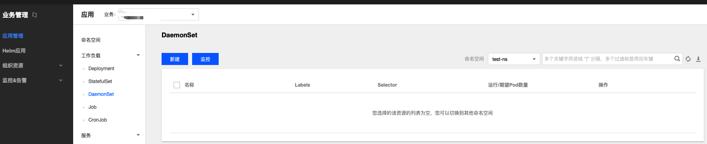

## 简介

DaemonSet 主要用于部署常驻集群内的后台程序，例如节点的日志采集。DaemonSet 保证在所有或部分节点上均运行指定的 Pod。 新节点添加到集群内时，也会有自动部署 Pod；节点被移除集群后，Pod 将自动回收。

## 调度说明

若配置了 Pod 的 nodeSelector 或 affinity 参数，DaemonSet 管理的 Pod 将按照指定的调度规则调度。若未配置 Pod 的 nodeSelector 或 affinity 参数，则将在所有的节点上部署 Pod。

## DaemonSet 控制台操作指引

### 创建 DaemonSet
1. 登录TKEStack，切换到【业务管理】控制台，选择左侧导航栏中的【应用管理】。
2. 选择需要创建DaemonSet的【业务】下相应的【命名空间】，展开【工作负载】下拉项，进入【DaemonSet】管理页面。如下图所示：
   
3. 单击【新建】，进入 “新建Workload” 页面。
根据实际需求，设置 DaemonSet 参数。关键参数信息如下：
 - **工作负载名**：输入自定义名称。
 - **标签**：给工作负载添加标签
 - **命名空间**：根据实际需求进行选择。
 - **类型**：选择【DaemonSet】。
 - **数据卷**：根据需求，为负载添加数据卷为容器提供存，目前支持临时路径、主机路径、云硬盘数据卷、文件存储NFS、配置文件、PVC，还需挂载到容器的指定路径中
   - **临时目录**：主机上的一个临时目录，生命周期和Pod一致
   - **主机路径**：主机上的真实路径，可以重复使用，不会随Pod一起销毁
   - **NFS盘**：挂载外部NFS到Pod，用户需要指定相应NFS地址，格式：127.0.0.1:/data
   - **ConfigMap**：用户在业务Namespace下创建的[ConfigMap](../configurations/ConfigMap.md)
   - **Secret**：用户在业务namespace下创建的[Secret](../configurations/Secret.md)
   - **PVC**：用户在业务namespace下创建的[PVC](../storage/persistent-volume-claim.md)
 - **实例内容器**：根据实际需求，为 DaemonSet 的一个 Pod 设置一个或多个不同的容器。
    - **名称**：自定义。
    - **镜像**：根据实际需求进行选择。
    - **镜像版本（Tag）**：根据实际需求进行填写。
    - **CPU/内存限制**：可根据 [Kubernetes 资源限制](https://kubernetes.io/docs/concepts/configuration/manage-compute-resources-container/) 进行设置 CPU 和内存的限制范围，提高业务的健壮性。
    - **GPU限制**：如容器内需要使用GPU，此处填GPU需求
    - **环境变量**：用于设置容器内的变量，变量名只能包含大小写字母、数字及下划线，并且不能以数字开头
       * **新增变量**：自己设定变量键值对
       * **引用ConfigMap/Secret**：引用已有键值对
      - **高级设置**：可设置 “**工作目录**”、“**运行命令**”、“**运行参数**”、“**镜像更新策略**”、“**容器健康检查**”和“**特权级**”等参数。这里介绍一下镜像更新策略。
       * **镜像更新策略**：提供以下3种策略，请按需选择
         若不设置镜像拉取策略，当镜像版本为空或 `latest` 时，使用 Always 策略，否则使用 IfNotPresent 策略
         * **Always**：总是从远程拉取该镜像
         * **IfNotPresent**：默认使用本地镜像，若本地无该镜像则远程拉取该镜像
         * **Never**：只使用本地镜像，若本地没有该镜像将报异常
 - **imagePullSecrets**：镜像拉取密钥，用于拉取用户的私有镜像
 - **节点调度策略**：根据配置的调度规则，将Pod调度到预期的节点。支持指定节点调度和条件选择调度
 - **注释（Annotations）**：给DaemonSet添加相应Annotation，如用户信息等
 - **网络模式**：选择Pod网络模式
    * **OverLay（虚拟网络）**：基于 IPIP 和 Host Gateway 的 Overlay 网络方案
    * **FloatingIP（浮动 IP）**：支持容器、物理机和虚拟机在同一个扁平面中直接通过IP进行通信的 Underlay 网络方案。提供了 IP 漂移能力，支持 Pod 重启或迁移时 IP 不变
    * **NAT（端口映射）**：Kubernetes 原生 NAT 网络方案
    * **Host（主机网络）**：Kubernetes 原生 Host 网络方案
4. 单击【创建Workload】，完成创建。

### 更新 DaemonSet

#### 更新 YAML
1. 登录TKEStack，切换到【业务管理】控制台，选择左侧导航栏中的【应用管理】。
2. 选择需要更新的【业务】下相应的命名空间，展开【工作负载】列表，进入【DaemonSet】管理页面。
3. 在需要更新 YAML 的 DaemonSet 行中，选择【更多】>【编辑YAML】，进入更新 DaemonSet 页面。
4. 在 “更新DaemonSet” 页面编辑 YAML，并单击【完成】即可更新 YAML。

## Kubectl 操作 DaemonSet 指引


### YAML 示例<span id="YAMLSample"></span>
```Yaml
apiVersion: apps/v1
kind: DaemonSet
metadata:
  name: fluentd-elasticsearch
  namespace: kube-system
  labels:
    k8s-app: fluentd-logging
spec:
  selector:
    matchLabels:
      name: fluentd-elasticsearch
  template:
    metadata:
      labels:
        name: fluentd-elasticsearch
    spec:
      tolerations:
      - key: node-role.kubernetes.io/master
        effect: NoSchedule
      containers:
      - name: fluentd-elasticsearch
        image: k8s.gcr.io/fluentd-elasticsearch:1.20
        resources:
          limits:
            memory: 200Mi
          requests:
            cpu: 100m
            memory: 200Mi
        volumeMounts:
        - name: varlog
          mountPath: /var/log
        - name: varlibdockercontainers
          mountPath: /var/lib/docker/containers
          readOnly: true
      terminationGracePeriodSeconds: 30
      volumes:
      - name: varlog
        hostPath:
          path: /var/log
      - name: varlibdockercontainers
        hostPath:
          path: /var/lib/docker/containers
```
>!以上 YAML 示例引用于 `https://kubernetes.io/docs/concepts/workloads/controllers/daemonset`， 创建时可能存在容器镜像拉取不成功的情况，仅用于本文介绍 DaemonSet 的组成。

- **kind**：标识 DaemonSet 资源类型。
- **metadata**：DaemonSet 的名称、Label等基本信息。
- **metadata.annotations**：DaemonSet 的额外说明，可通过该参数设置腾讯云 TKE 的额外增强能力。
- **spec.template**：DaemonSet 管理的 Pod 的详细模板配置。

更多可查看 [Kubernetes DaemonSet 官方文档](https://kubernetes.io/docs/concepts/workloads/controllers/daemonset/)。

### Kubectl 创建 DaemonSet

1. 参考 [YAML 示例](#YAMLSample)，准备 DaemonSet YAML 文件。
2. 安装 Kubectl，并连接集群。操作详情请参考 [通过 Kubectl 连接集群](https://cloud.tencent.com/document/product/457/8438)。
3. 执行以下命令，创建 DaemonSet YAML 文件。
```shell
kubectl create -f DaemonSet YAML 文件名称
```
例如，创建一个文件名为 fluentd-elasticsearch.yaml 的 DaemonSet YAML 文件，则执行以下命令：
```shell
kubectl create -f fluentd-elasticsearch.yaml
```
4. 执行以下命令，验证创建是否成功。
```shell
kubectl get DaemonSet
```
返回类似以下信息，即表示创建成功。
```
NAME       DESIRED   CURRENT   READY     UP-TO-DATE   AVAILABLE   NODE SELECTOR       AGE
frontend   0         0         0         0            0           app=frontend-node   16d
```

### Kubectl 更新 DaemonSet

执行以下命令，查看 DaemonSet 的更新策略类型。
```
kubectl get ds/<daemonset-name> -o go-template='{{.spec.updateStrategy.type}}{{"\n"}}'
```
DaemonSet 有以下两种更新策略类型：
- OnDelete：默认更新策略。该更新策略在更新 DaemonSet 后，需手动删除旧的 DaemonSet Pod 才会创建新的DaemonSet Pod。
- RollingUpdate：支持 Kubernetes 1.6或更高版本。该更新策略在更新 DaemonSet 模板后，旧的 DaemonSet Pod 将被终止，并且以滚动更新方式创建新的 DaemonSet Pod。

#### 方法一

执行以下命令，更新 DaemonSet。
```
kubectl edit DaemonSet/[name]
```
此方法适用于简单的调试验证，不建议在生产环境中直接使用。您可以通过此方法更新任意的 DaemonSet 参数。

#### 方法二

执行以下命令，更新指定容器的镜像。
```
kubectl set image ds/[daemonset-name][container-name]=[container-new-image]
```
建议保持 DaemonSet 的其他参数不变，业务更新时，仅更新容器镜像。

### Kubectl 回滚 DaemonSet

1. 执行以下命令，查看 DaemonSet 的更新历史。
```
kubectl rollout history daemonset /[name]
```
2. 执行以下命令，查看指定版本详情。
```
kubectl rollout history daemonset /[name] --revision=[REVISION]
```
3. 执行以下命令，回滚到前一个版本。
```
kubectl rollout undo daemonset /[name]
```
如需指定回滚版本号，可执行以下命令。
```
kubectl rollout undo daemonset /[name] --to-revision=[REVISION]
```

### Kubectl 删除 DaemonSet
执行以下命令，删除 DaemonSet。
```
kubectl delete  DaemonSet [NAME]
```