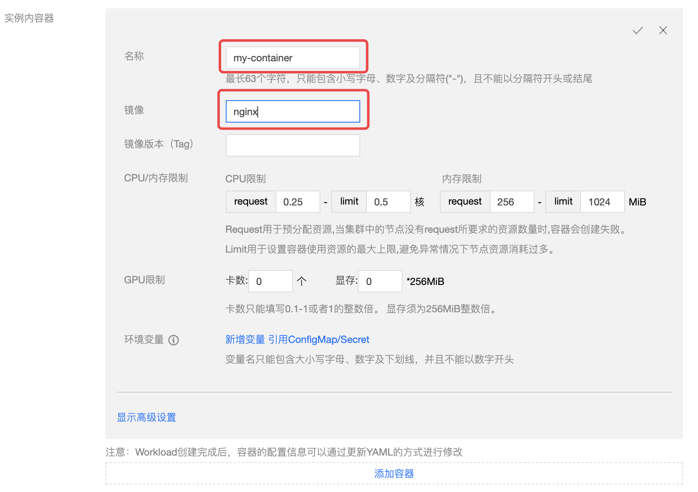

# DaemonSet 

DaemonSet 主要用于部署常驻集群内的后台程序，例如节点的日志采集。DaemonSet 保证在所有或部分节点上均运行指定的 Pod。 新节点添加到集群内时，也会有自动部署 Pod；节点被移除集群后，Pod 将自动回收。

## 调度说明

若配置了 Pod 的 NodeSelector 或 Affinity 参数，DaemonSet 管理的 Pod 将按照指定的调度规则调度。若未配置 Pod 的 NodeSelector 或 Affinity 参数，则将在所有的节点上部署 Pod。

## DaemonSet 控制台操作指引

### 创建 DaemonSet
1. 登录TKEStack，切换到【业务管理】控制台，选择左侧导航栏中的【应用管理】
2. 选择需要创建DaemonSet的【业务】下相应的【命名空间】，展开【工作负载】下拉项，进入【DaemonSet】管理页面，如下图所示：
   
   > 
3. 单击【新建】，进入 “新建Workload” 页面，根据实际需求，设置 DaemonSet 参数，关键参数信息如下，其中必填项为**工作负载名**、**实例内容器的名称和镜像**：
   - **工作负载名**：输入自定义名称
   - **描述**：给工作负载添加描述
   - **标签**：给工作负载添加标签
   - **命名空间**：根据实际需求进行选择
   - **类型**：选择【DaemonSet（在每个主机上运行Pod）】
   - **数据卷（选填）**：为容器提供存储，目前支持临时路径、主机路径、云硬盘数据卷、文件存储 NFS、配置文件、PVC，还需挂载到容器的指定路径中。如需指定容器挂载至指定路径时，单击【添加数据卷】
      > **数据卷的名称**：给数据卷一个名称，以方便容器使用数据卷
      * **临时目录**：主机上的一个临时目录，生命周期和 Pod 一致
      * **主机路径**：主机上的真实路径，可以重复使用，不会随 Pod 一起销毁
      * **NFS盘**：挂载外部 NFS 到 Pod，用户需要指定相应 NFS 地址，格式：127.0.0.1:/data。请确保节点当中已经安装 nfs-utils 包，才可正常使用 NFS 数据盘
      * **ConfigMap**：用户选择在业务 Namespace 下的 [ConfigMap](../products/business-control-pannel/application/configurations/ConfigMap.md)
      * **Secret**：用户选择在业务 Namespace 下的 [Secret](../products/business-control-pannel/application/configurations/secret.md)
      * **PVC**：用户选择在业务 Namespace 下的 [PVC](../products/business-control-pannel/application/storage/persistent-volume-claim.md)
   
   - **实例内容器**：根据实际需求，为 DaemonSet 的 Pod 设置一个或多个不同的容器，如下图所示：
      
      * **名称**：自定义，这里以`my-container`为例
      * **镜像**：根据实际需求进行选择，这里以`nginx`为例
      * **镜像版本（Tag）**：根据实际需求进行填写，不填默认为`latest`
      * **CPU/内存限制**：可根据 [Kubernetes 资源限制](https://kubernetes.io/docs/concepts/configuration/manage-compute-resources-container/) 进行设置 CPU 和内存的限制范围，提高业务的健壮性（**建议使用默认值**）
         * Request 用于预分配资源,当集群中的节点没有request所要求的资源数量时,容器会创建失败。
         * Limit 用于设置容器使用资源的最大上限,避免异常情况下节点资源消耗过多。
      * **GPU 限制**：如容器内需要使用 GPU，此处填 GPU 需求
         
         > 前提：节点有 GPU，并安装了 GPU 组件
      * **环境变量**：用于设置容器内的变量，变量名只能包含大小写字母、数字及下划线，并且不能以数字开头
         * **自定义**：自己设定变量键值对
         * **引用 ConfigMap/Secret**：引用已有键值对
         * **Field**：自己设定变量名，变量值从负载的 YAML 文件中获取 metadata、spec、status数值
         * **ResourceFiled**：自己设定变量名，变量值从负载的 YAML 文件中获取 limit 和 request 数值
      
      * **高级设置**：可设置 “**工作目录**”、“**运行命令**”、“**运行参数**”、“**镜像更新策略**”、“**容器健康检查**”和“**特权级**”等参数。（按需使用）
         * **工作目录**：指定容器运行后的工作目录
         * **日志目录**：指定容器运行后的[日志目录](../../../../products/business-control-pannel/operation/logcollect.md/#指定容器运行后的日志目录)
            > 1. 需要首先启用集群的 [日志采集](../../../platform/cluster.md#基本信息) 功能
            > 2. 需要在创建应用时挂载数据盘
         * **运行命令**：控制容器运行的输入命令，这里可以输入多条命令，注意每个命令单独一行
          * **运行参数**：传递给容器运行命令的输入参数，这里可以输入多条参数，注意每个参数单独一行
         * **镜像更新策略**：提供以下3种策略，请按需选择，若不设置镜像拉取策略，当镜像版本为空或 `latest` 时，使用 Always 策略，否则使用 IfNotPresent 策略
            * **Always**：总是从远程拉取该镜像
            * **IfNotPresent**：默认使用本地镜像，若本地无该镜像则远程拉取该镜像
            * **Never**：只使用本地镜像，若本地没有该镜像将报异常
         * **容器健康检查**
            * **存活检查**：检查容器是否正常，不正常则重启实例。对于多活无状态的应用采用了存活探针 TCP 探测方式。存活探针组件包括 Gate、Keystone、Webshell、Nginx、Memcache 当连续探测容器端口不通，探针失败时，杀掉容器并重启。
            * **就绪检查**：检查容器是否就绪，不就绪则停止转发流量到当前实例。对于一主多备的服务采用就绪探针 TCP 探测方式，当探针失败时，将实例从 Service Endpoints 中移除。业务各个组件内部通过Kube-DNS访问CVM-Agent，就绪探针可以保证处于备机状态的 CVM 实例不存在于 Service Endpoints 中，并且将流量转发至主 CVM-Agent 上，从而保证服务的高可用。
         * **特权级容器**：容器开启特权级，将拥有宿主机的 root 权限
         * **权限集-增加**：增加权限集
         * **权限集-删除**：减少权限集
      
   * **显示高级设置**
   * **imagePullSecrets**：镜像拉取密钥，用于拉取用户的私有镜像，使用私有镜像首先需要新建 Secret。如果是公有镜像，即支持匿名拉取，则可以忽略此步骤
   - **节点调度策略**：根据配置的调度规则，将 Pod 调度到预期的节点
      - **不使用调度策略**：Kubernetes 自动调度
      - **指定节点调度**：Pod 只调度到指定节点
      - **自定义调度规则**：通过节点的 Label 来实现
         - **强制满足条件**：调度期间如果满足亲和性条件则调度到对应 Node，如果没有节点满足条件则调度失败
         - **尽量满足条件**：调度期间如果满足亲和性条件则调度到对应 Node，如果没有节点满足条件则随机调度到任意节点
   * **注释（Annotations）**：给 DaemonSet 添加相应 Annotation，如用户信息等
     
   * **网络模式**：选择 Pod 网络模式
      * **Overlay（虚拟网络）**：基于 IPIP 和 Host Gateway 的 Overlay 网络方案，每个实例拥有一个虚拟IP，集群外无法直接访问该IP
      * **FloatingIP（浮动 IP）**：为每个实例分配物理 IP，外部可直接访问。支持容器、物理机和虚拟机在同一个扁平面中直接通过IP进行通信的 Underlay 网络方案。提供了 IP 漂移能力，**支持 Pod 重启或迁移时 IP 不变**，跨机器迁移，实例ip也不会发生变化
      * **NAT（端口映射）**：Kubernetes 原生 NAT 网络方案，实例的端口映射到物理机的某个端口，但 IP 还是虚拟 IP ，可通过宿主机 IP 和映射端口访问，即 Pod 的 Container 中指定了 [hostPorts](https://kubernetes.io/zh/docs/concepts/policy/pod-security-policy/#host-namespaces)
      * **Host（主机网络）**：Kubernetes 原生 Host 网络方案，可以直接采用宿主机 IP 和端口，即 Pod 指定了 [hostNetwork=true](https://kubernetes.io/zh/docs/concepts/policy/pod-security-policy/#host-namespaces)
   
4. 单击【创建Workload】，完成创建

### 更新 DaemonSet

1. 登录 TKEStack，切换到【业务管理】控制台，选择左侧导航栏中的【应用管理】
2. 选择需要更新的【业务】下相应的命名空间，展开【工作负载】列表，进入【DaemonSet】管理页面
3. 在需要更新 YAML 的 DaemonSet 行中，选择【更多】>【编辑YAML】，进入更新 DaemonSet 页面
4. 在 “更新DaemonSet” 页面编辑 YAML，并单击【完成】即可更新 YAML

## Kubectl 操作 DaemonSet 指引


### YAML 示例
```Yaml
apiVersion: apps/v1
kind: DaemonSet
metadata:
  name: fluentd-elasticsearch
  namespace: kube-system
  labels:
    k8s-app: fluentd-logging
spec:
  selector:
    matchLabels:
      name: fluentd-elasticsearch
  template:
    metadata:
      labels:
        name: fluentd-elasticsearch
    spec:
      tolerations:
      - key: node-role.kubernetes.io/master
        effect: NoSchedule
      containers:
      - name: fluentd-elasticsearch
        image: k8s.gcr.io/fluentd-elasticsearch:1.20
        resources:
          limits:
            memory: 200Mi
          requests:
            cpu: 100m
            memory: 200Mi
        volumeMounts:
        - name: varlog
          mountPath: /var/log
        - name: varlibdockercontainers
          mountPath: /var/lib/docker/containers
          readOnly: true
      terminationGracePeriodSeconds: 30
      volumes:
      - name: varlog
        hostPath:
          path: /var/log
      - name: varlibdockercontainers
        hostPath:
          path: /var/lib/docker/containers
```
>以上 YAML 示例引用于 `https://kubernetes.io/docs/concepts/workloads/controllers/daemonset`， 创建时可能存在容器镜像拉取不成功的情况，仅用于本文介绍 DaemonSet 的组成。

- **kind**：标识 DaemonSet 资源类型
- **metadata**：DaemonSet 的名称、Label 等基本信息
- **metadata.annotations**：DaemonSet 的额外说明，可通过该参数额外增强能力
- **spec.template**：DaemonSet 管理的 Pod 的详细模板配置

更多可查看 [Kubernetes DaemonSet 官方文档](https://kubernetes.io/docs/concepts/workloads/controllers/daemonset/)

### Kubectl 创建 DaemonSet

1. 参考 [YAML 示例](#YAMLSample)，准备 DaemonSet YAML 文件
2. 安装 Kubectl，并连接集群
3. 执行以下命令，创建 DaemonSet YAML 文件：
```shell
kubectl create -f DaemonSet YAML 文件名称
```
  例如，创建一个文件名为 fluentd-elasticsearch.yaml 的 DaemonSet YAML 文件，则执行以下命令：
```shell
kubectl create -f fluentd-elasticsearch.yaml
```
4. 执行以下命令，验证创建是否成功：
```shell
kubectl get DaemonSet
```
  返回类似以下信息，即表示创建成功：
```
NAME       DESIRED   CURRENT   READY     UP-TO-DATE   AVAILABLE   NODE SELECTOR       AGE
frontend   0         0         0         0            0           app=frontend-node   16d
```

### Kubectl 更新 DaemonSet

执行以下命令，查看 DaemonSet 的更新策略类型：
```
kubectl get ds/<daemonset-name> -o go-template='{{.spec.updateStrategy.type}}{{"\n"}}'
```
DaemonSet 有以下两种更新策略类型：
- **OnDelete**：默认更新策略。该更新策略在更新 DaemonSet 后，需手动删除旧的 DaemonSet Pod 才会创建新的DaemonSet Pod。
- RollingUpdate：支持 Kubernetes 1.6或更高版本。该更新策略在更新 DaemonSet 模板后，旧的 DaemonSet Pod 将被终止，并且以滚动更新方式创建新的 DaemonSet Pod。

#### 方法一

执行以下命令，更新 DaemonSet：
```
kubectl edit DaemonSet/[name]
```
此方法适用于简单的调试验证，不建议在生产环境中直接使用。您可以通过此方法更新任意的 DaemonSet 参数。

#### 方法二

执行以下命令，更新指定容器的镜像：
```
kubectl set image ds/[daemonset-name][container-name]=[container-new-image]
```
建议保持 DaemonSet 的其他参数不变，业务更新时，仅更新容器镜像。

### Kubectl 回滚 DaemonSet

1. 执行以下命令，查看 DaemonSet 的更新历史：
```
kubectl rollout history daemonset /[name]
```
2. 执行以下命令，查看指定版本详情：
```
kubectl rollout history daemonset /[name] --revision=[REVISION]
```
3. 执行以下命令，回滚到前一个版本：
```
kubectl rollout undo daemonset /[name]
```
  如需指定回滚版本号，可执行以下命令：
```
kubectl rollout undo daemonset /[name] --to-revision=[REVISION]
```

### Kubectl 删除 DaemonSet
执行以下命令，删除 DaemonSet：
```
kubectl delete  DaemonSet [NAME]
```